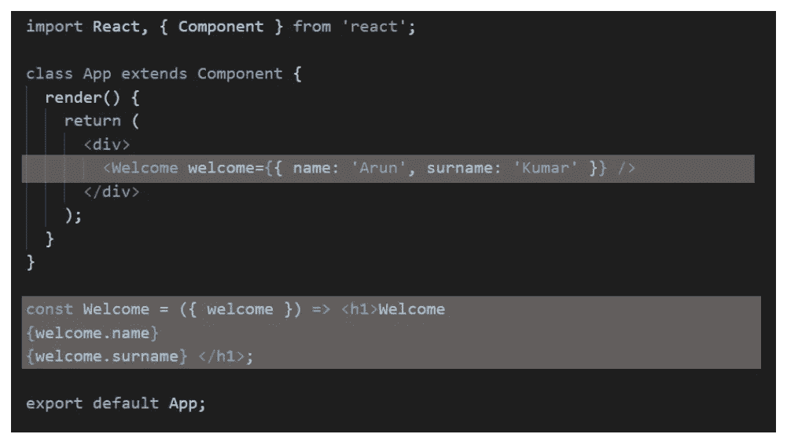
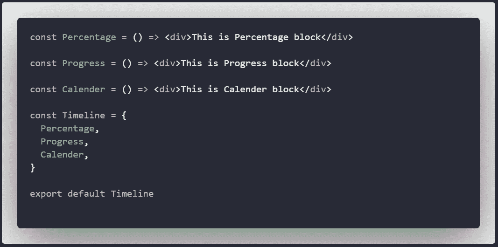

# 如何创建 React 组件的对象

> 原文：<https://javascript.plainenglish.io/object-as-react-component-cceba4a01308?source=collection_archive---------1----------------------->


Photo by [Ferenc Almasi](https://unsplash.com/@flowforfrank?utm_source=medium&utm_medium=referral) on [Unsplash](https://unsplash.com?utm_source=medium&utm_medium=referral)

今天，我将写一篇短文，这篇短文可能对你有所帮助。我们将讨论如何将组件导出为对象，并在 React 组件中使用它。

典型的 React 组件可能如下所示:



只有两种方法可以从文件中导出组件:用`export default`或`export`。

两个都可以。

但是如果你想在同一个罩下有一个简单的组件库呢？如果我告诉你可以使用创建一组这样的组件:

```
<Timeline.Percentage  />
<Timeline.Progress  />
<Timeline.Calender />
```

可能很棒，是吧！

## 这个怎么做

这就像在一个文件中有一组组件一样简单(它们可以全部创建并写入一个文件，也可以从其他地方导入到一个文件中)，然后将它们作为一个对象全部导出该文件。

下面是一个你可以使用的例子:



就是这样！这里有一篇小文章，可以向你的同事展示一些更酷的东西。

感谢您的阅读！

## 进一步阅读

[](https://bit.cloud/blog/design-tokens-in-components-with-react-and-bit-l28qlxq6) [## 用 React 和 Bit 设计组件中的令牌

### 现场演示更好。在我们深入细节之前，让我们看一下使用 Bit 设计令牌如何帮助我们构建…

比特云](https://bit.cloud/blog/design-tokens-in-components-with-react-and-bit-l28qlxq6) 

*更多内容看* [***说白了。报名参加我们的***](https://plainenglish.io/) **[***免费周报***](http://newsletter.plainenglish.io/) *。关注我们关于*[***Twitter***](https://twitter.com/inPlainEngHQ)[***LinkedIn***](https://www.linkedin.com/company/inplainenglish/)*[***YouTube***](https://www.youtube.com/channel/UCtipWUghju290NWcn8jhyAw)***，以及****[***不和***](https://discord.gg/GtDtUAvyhW)**** ***对成长黑客感兴趣？检查出* [***电路***](https://circuit.ooo/) ***。*****