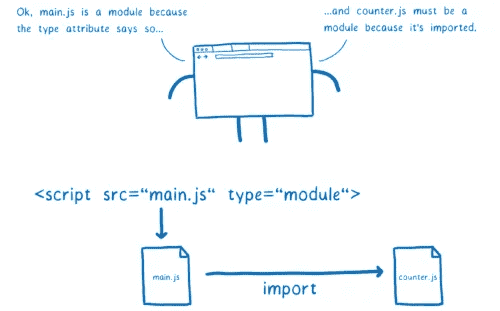

# JavaScript 中对象的析构和与模块的集成

> 原文：<https://javascript.plainenglish.io/object-destructuring-and-integration-with-modules-in-javascript-391ca0434ea9?source=collection_archive---------8----------------------->

Image From:[**hacks.mozilla.org**](https://hacks.mozilla.org/)**.**

在使用模块时，你能做的最好的事情之一就是把析构放到等式中。有时，你可能已经读完了一本关于 JavaScript 的完整的书或教程，却没有听到 d *estructuring* 这个词，尽管它是面向对象编程中的一个重要概念。

我相信你第一次接触对象时听到的第一件事就是构造，正如你所看到的，析构与构造正好相反，所以在 JavaScript 的世界中，构造只是将数据放入对象，而析构只是从对象中提取数据。

## 让我们举一个简单的例子来看看析构是如何工作的

在下面的程序中，我们有汽车对象，它包含 4 个属性，我们可以使用 d *构造* *a* 赋值直接从这个对象中赋值一个变量甚至倍数。

1st example.

正如您在上面的程序中所看到的，我们提取了品牌属性的值，而没有使用对象属性或数组符号的传统方式，但是，如果您要这样做，变量名应该与您想要的属性名匹配，如上所示。

如果我使用了一个不存在的属性名，该怎么办？好吧，你会得到一个漂亮的未定义值，虽然你可以提供一个默认值，以防对象中不存在该属性。

2nd example

如果我们从中提取数据的对象包含一个数组，而不是一个单独的属性，该怎么办？在这种析构赋值的情况下，它不需要我们提供任何相同的名字，因为数组没有键。

因此，在这种情况下，如果要将第二项赋给变量，必须先赋第一项。

3rd example

您可以在析构赋值中更改变量名，以防属性名不合适，或者您遇到了属性名被作用域中的另一个变量使用的情况，尽管您仍然必须提供想要从对象中获得的属性名。

4th example

析构的缺点是它要求你知道属性的名字，这样你就可以在变量声明中使用它们。现在让我们转到模块以及它们如何使用析构。

要查看更多关于析构赋值的内容，请访问:[**MDN 网站。**](https://developer.mozilla.org/en-US/docs/Web/JavaScript/Reference/Operators/Destructuring_assignment)

# 模块

我想让你把一个模块想象成一个把它的代码导出到另一个文件中使用的文件，当你写第一个模块时，你可能会遇到的第一个语法如下

**在模块中导出:**

5th example.

如你所见，它只是一个名为 Junior 的类，有两个属性，现在关注最后一行，一个以 export 单词开始的语句，它是一个保留的关键字，用于从模块中导出特定的数据。

**在模块**中导入:

6th example.

我们导入如上所示的代码。我们在这里做的事情是导出初级类，然后通过创建高级类来扩展它，因此高级类将从我们导入的类继承属性。

第五个例子中的“default”关键字意味着您可以用任何名称从您想要的模块中导入代码，这是因为该模块可以有一个默认的导出，所以在导入时使用哪个名称并不重要。

相比之下，在导入包含命名导出的模块的情况下，您应该指定要导入的数据的名称，就像您在对象析构中看到的那样。

毫不奇怪，用 JavaScript 编写代码的方法不止一种，可以用多种方法导出代码，同样的事情也适用于导入代码:

7th example.

但是，在使用模块时，您应该注意导入和导出数据的方式，也就是编写语句的方式。

假设您将第五个示例中的第七条指令从:

收件人:

这是行不通的，而且会导致错误。如果你不想导出默认值，你应该在花括号{}内写出函数名或任何你想要的数据。

如果这是您第一次使用模块，您可以阅读本文以避免我在使用模块时犯的错误。

 [## 我在 JavaScript 导入语句中犯的愚蠢错误

### 都是为了休息一下

medium.com](https://medium.com/javascript-in-plain-english/the-stupid-mistake-i-made-with-the-javascript-import-statement-75c4d111d70b) 

关于模块有很多要说的，但是要获得您需要的大部分内容，我强烈推荐访问 MDN 网站。

对于导入语句: [**导入语法**](https://developer.mozilla.org/en-US/docs/Web/JavaScript/Reference/Statements/import) **。**

对于导出语句: [**导出语法**。](https://developer.mozilla.org/en-US/docs/Web/JavaScript/Reference/Statements/export)

# **把东西放在一起**

现在，在我们谈了一点关于模块的内容之后，让我们看看对象析构是如何适应的。当从一个模块导入命名导出或多个导出时，有时必须使用对象析构语法。

如果您一起导出多个项目，或者如果您试图在不使用默认关键字的情况下导出一些代码，如模块部分中第*第 7*个示例的第*第三、第四*和第*第六*行所示，这也是强制性的。

然而，使用相同的语法或概念并不意味着它一定反对析构，即使它看起来是这样。让我们举个例子来看看我在说什么:

假设我们有一个名为 F *ile1* 的模块，它有两种导出语句:

File1

您试图使用对象析构将**的名字**和**的姓氏**从该模块的默认导出中取出，这是通过编写如下内容实现的:

8th example

结果不是字面上的你想要什么为什么？我们在上面的 import 语句中使用的语法不是对象析构，而是从模块中导入命名导出。

如果你想析构默认对象，你必须导入它，然后你必须使用对象析构来获得你想要的属性

9th example

# **结论**

对象析构和模块是 JavaScript 中的重要特性，掌握它们会让你在处理一些著名的框架和库(如 React、Angular 和 Vue)中的组件时更加流畅。