# JavaScript 中的对象析构——初学者综合指南

> 原文：<https://javascript.plainenglish.io/object-destructuring-in-javascript-a-comprehensive-beginners-guide-b4a873d47ef1?source=collection_archive---------6----------------------->

## 如何析构对象、嵌套对象、函数参数、重命名变量、设置默认值——以一步一步初学者友好的方式用例子解释。

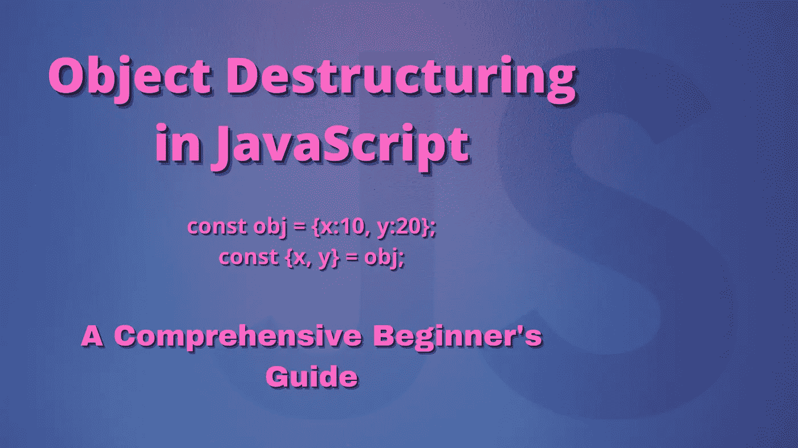

在我的上一篇文章中，我们研究了在 JavaScript 中析构如何处理数组。你可以在这里查看:

[](/array-destructuring-in-javascript-a-comprehensive-beginners-guide-77a710166ca9) [## JavaScript 中的数组析构:初学者综合指南

### 一步一步全面指导初学者用 JavaScript 解构数组。

javascript.plainenglish.io](/array-destructuring-in-javascript-a-comprehensive-beginners-guide-77a710166ca9) 

再次重申几个重要的概念，根据官方 MDN [文档](https://developer.mozilla.org/en-US/docs/Web/JavaScript/Reference/Operators/Destructuring_assignment)，析构赋值语法*“是一个 JavaScript 表达式，可以将数组中的值或对象中的属性解包到不同的变量中。”*

这一次，我们将讨论如何使用对象在 JavaScript 中执行**析构。**

> **注意:**这将是一篇很长的文章，因为它既是对新手的对象析构的介绍，也是对那些已经熟悉这个概念的人的一些关键析构特性的提醒。
> 
> 对于后者，如果你不想复习基础知识，你可以根据副标题跳到任何与你相关的部分。

对于对象，析构的基本概念是相同的。就像数组一样，我们析构一个对象来将一个复杂的数据结构(在这个特殊的例子中是一个对象)分解成一个更小更简单的数据结构，比如一个变量。

在处理 API 调用时，对象析构确实是一个救命稻草，因为它让我们用更少的代码处理 API 获取的数据。至此，让我们深入了解对象析构在 JavaScript 中是如何工作的。

## **使用属性名**检索属性

假设我们有以下对象。

```
const myInfo = {name: “Soumadri”, job: “Editor”, hobby: “Reading”};
```

我们检索属性的传统技术如下所示:

```
const myName = myInfo.name;const myJob = myInfo.job;const myHobby = myInfo.hobby;console.log(myName, myJob, myHobby);
```

这将为我们提供以下输出:

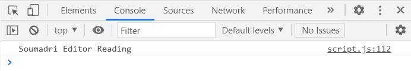

现在让我们看看如何使用析构来做同样的事情。

为了析构对象，我们使用花括号`{}`。我们所要做的就是提供与我们希望从对象中提取的属性名称完全匹配的变量名。让我们来看看如何为我上面提到的对象实现这一点。

```
const {name, job, hobby} = myInfo;
```

我们把花括号放在赋值操作符的左边。与数组一样，当 JavaScript 看到这一点时，它会知道必须执行一个析构赋值。

在右边，我们放置物体的名称。注意，左边的变量名(姓名、工作、爱好)与`myInfo`对象中的属性名完全匹配。现在，我们可以检查结果。

```
console.log(name, job, hobby);
```

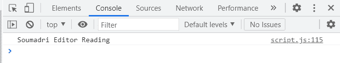

事实上，我们用少得多的代码就能得到同样的结果。

请记住，与数组不同，对象中项目(或属性)的顺序并不重要。因此，我们不需要手动跳过元素。例如，我们可以这样做:

```
const {name, hobby, job} = myInfo;
```

我们将得到以下结果(变量检索与变量名相同的相应属性。因此，虽然“爱好”和“工作”在结果中的位置互换了，但它们的值保持不变):

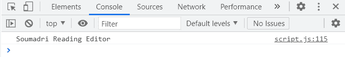

如果我们想跳过一个属性(比如说‘job’)，我们只需这样做:

```
const {name, hobby} = myInfo;console.log(name, hobby);
```

现在我们有了:

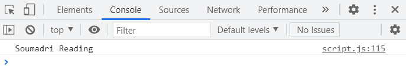

同样，所有这些只是为了证明属性的检索依赖于变量名及其对应的键，而不依赖于属性在对象中的位置。

## 重命名变量时检索属性

在前面的场景中，我们使用与对象中的属性同名的变量来检索属性。但是，如果我们想将对象数据存储在不同的变量名中呢？让我们看看我们能做些什么。

为了引用对象中的属性，我们仍然必须使用它的原始名称。但是，我们可以修改存储获得的数据的变量的名称。这可以如下所示完成。

```
const {name: myName, job:myJob, hobby: myHobby} = myInfo;
```

我们仍然在左侧使用原来的变量名，但是我们在它们旁边添加了一个冒号，然后提供了我们想要存储数据的新变量的名称。

例如，`myInfo.name`是通过‘name’引用的，但是它的相应值(‘Soumadri’)存储在`myName`变量中。其他两个属性和变量也是一样的。让我们检查输出:

```
console.log(myName, myJob, myHobby);
```

事实上，我们得到了同样的结果:

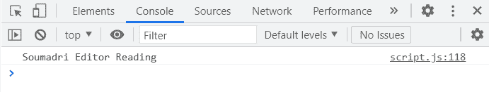

## **检索没有变量声明的属性**

我们还可以在声明变量的同时检索属性，我们将检索到的值分别存储在这些变量中。让我们看看如何做到这一点。

```
let name, job, hobby;({ name, job, hobby } = myInfo);console.log(name, job, hobby);
```

事实上，我们得到了以下输出:

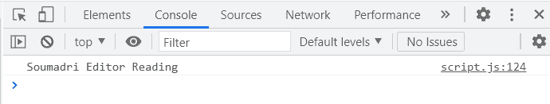

因为变量' name '，' job '和' hobby '已经在析构执行之前声明了，所以我们在赋值语句周围使用括号`()`来确保操作完成。

如果没有括号，该语句将不再有效。例如，这可能不是有效的语法:

`{ name, job, hobby } = myInfo;`

并且会导致一个错误:

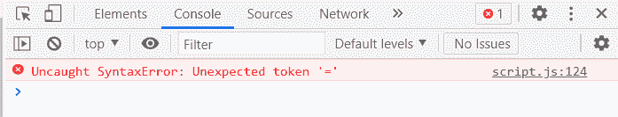

在下面的下一个例子中，我们将看到 JavaScript 为什么认为这是无效的语法。

## **析构对象时变异变量**

假设我们有两个值如下的变量。

```
let x = 10;let y = 20;
```

我们有一个具有以下属性的对象。

```
let obj = {x: 100, y: 200, z: 300};
```

现在，我们想用对象 obj 中属性 x 和 y 的值替换前面声明的变量(x 和 y)的值。

我们不能做这样的事情:

```
const {x, y} = obj;
```

或者这个:

```
let {x, y} = obj;
```

这是因为我们之前已经声明了变量 a 和 b，我们不希望新的变量有相同的名字；我们想替换那些变量中的值。

如果我们这样做呢？在这种情况下，我们不再创建新的变量 x 和 y。

```
{x, y} = obj;
```

如果我们保存它，我们会得到一个语法错误:

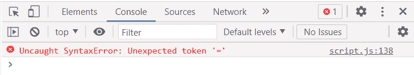

如果您没记错的话，这与我们在上一节末尾看到的错误是一样的。JavaScript 为什么会抛出这个错误？

这是因为当我们像上面那样用花括号开始一行代码时(没有变量声明)，JavaScript 需要一个代码块。由于我们不能像上面尝试的那样给代码块赋值，JavaScript 抛出错误“意外的标记' = '”。

那么解决方法是什么呢？为了解决这个问题，这是我们做出的改变。

```
({x, y} = obj);
```

没错，再一次，就像前面的部分一样，我们将整行代码放在括号中。

现在，如果我们尝试将 x 和 y 的值打印到控制台:

```
console.log(x,y);
```

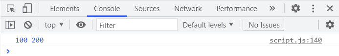

现在我们有了。我们已经成功地覆盖了 x 和 y 的值(改变它们)。

## **默认值**

当处理从 API 调用接收的第三方数据时，如果我们最终试图读取对象上不存在的属性，拥有默认值会非常有用。在深入研究这个问题之前，让我先回顾一下我上一篇文章中的库对象。我们将对库对象执行剩余的操作。

```
const library = {name: “Soumadri’s Fiction Book Shelf”,location: ‘1234 Fiction Palace, Calcutta, India’,genres: [‘Mystery’, ‘Horror’, ‘Fantasy’, ‘Sci-Fi’, ‘Literary Fiction’, ‘Historical Fiction’],titles: [‘The Inugami Clan’, ‘The Three Coffins’, ‘In Search of Lost Time’, ‘Sandman’, ‘The Left Hand of Darkness’, ‘The Complete Works of H.P. Lovecraft’, ‘Do Androids Dream of Electric Sheep?’, ‘In the Woods’, ‘In a Glass Darkly’, ‘Fingersmith’],authors: [‘Neil Gaiman’, ‘Ursula Le Guin’, ‘Sheridan Le Fanu’, ‘H.P. Lovecraft’, ‘Marcel Proust’, ‘Tana French’, ‘John Dickson Carr’, ‘Seishi Yokomizo’, ‘Philip K. Dick’, ‘Sarah Waters’],};
```

如果你是一个初学者，并且这个对象看起来让你害怕，让我简单介绍一下每个属性。

*   **名称:**我的个人书架/图书馆的名称。
*   **地址:**图书馆的地址。
*   **流派:**存储图书馆中所有书籍流派的数组。
*   **titles:** 存储图书馆中所有书籍名称的数组。
*   **authors:** 一个数组，存储图书馆中所有作者的名字。

现在假设这个对象是我们从一个 API 调用中收到的数据，而我们实际上不知道该对象的现有属性是什么(为了这节课，让我们假设一下)。

我们现在将看到默认值在现实世界的应用程序中可以派上用场。

现在，由于我不知道对象上存在什么属性，如果我尝试检索一个属性，比如说`library.openingHours`:

```
console.log(library.openingHours);
```

结果我会变得不明确。

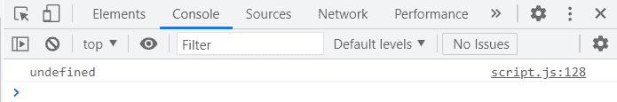

默认值可以作为一种变通方法。如果我们不确定对象上是否存在某个属性，我们可以给它一个默认值，如果在对象上找不到该属性，将使用该默认值。如果对象上存在该属性，默认值将被该属性的实际现有值覆盖。

让我们来看看实际情况。

```
const { openingHours = “Unknown”, titles = [] } = library;
```

我们已经将 openingHours 设置为默认的字符串值`“Unknown”`。默认情况下，我们将标题设置为空数组`[]`。现在让我们看看当我们试图打印结果时会发生什么。

```
console.log(openingHours);console.log(titles);
```

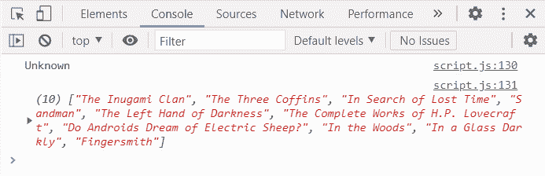

事实上，我们得到了我们所期待的。因为属性`openingHours`在库对象上不存在，所以它保持我们赋予它的默认值(字符串`“Unknown”`)。由于`title`确实作为库对象上的一个属性存在，它的默认值(一个空数组`[]`)被库对象上属性的实际值覆盖。

再次重申这里的要点，当我们没有像这里这样的硬编码数据时，默认值特别有用。当硬编码数据不存在时，我们不知道对象上存在什么属性。在这种情况下，默认值就派上了用场。

## **嵌套对象析构**

首先，我们将通过添加另一个属性来稍微修改我们的库对象。下面是我们的新库对象的外观:

```
const library = {name: “Soumadri’s Fiction Book Shelf”,location: ‘1234 Fiction Palace, Calcutta, India’,genres: [‘Mystery’, ‘Horror’, ‘Fantasy’, ‘Sci-Fi’, ‘Literary Fiction’, ‘Historical Fiction’],titles: [‘The Inugami Clan’, ‘The Three Coffins’, ‘In Search of Lost Time’, ‘Sandman’, ‘The Left Hand of Darkness’, ‘The Complete Works of H.P. Lovecraft’, ‘Do Androids Dream of Electric Sheep?’, ‘In the Woods’, ‘In a Glass Darkly’, ‘Fingersmith’],authors: [‘Neil Gaiman’, ‘Ursula Le Guin’, ‘Sheridan Le Fanu’, ‘H.P. Lovecraft’, ‘Marcel Proust’, ‘Tana French’, ‘John Dickson Carr’, ‘Seishi Yokomizo’, ‘Philip K. Dick’, ‘Sarah Waters’],timings: { mon: { open: 10, close: 21, }, tue: { open: 10, close: 21, }, sat: { open: 10, close: 16, }, },};
```

让我们看看我们在这里做了什么。在我们现有的库对象中，我添加了另一个名为“timings”的属性，它的值是 objects ('mon '，' tue '，' sat ')，objects 本身是保存其他键值对的对象(例如，`open: 10, close: 21`)。

首先，让我们检索属性“timings”的值。这就是我们要做的。

```
const {timings} = library;
```

让我们来看看结果:

```
console.log(timings);
```

我们开始吧。

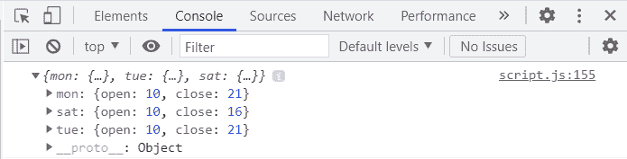

好了，现在我们已经有了“计时”，让我们试着从中检索“sat”。

```
const {sat} = timings;
```

现在来看看结果。

```
console.log(sat);
```

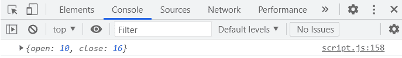

事实上，这是预期的结果。

但是在这里，我们得到的是一个对象，而我们想要的是两个变量的值——一个叫做‘open ’,另一个叫做‘close’——在两个独立的变量中。当然，我们可以进一步析构“sat”来检索属性，但这需要太多行代码。有没有更容易、更快、更短的解决方案？嗯，是的。这是我们能做的，多亏了解构。

```
const {sat: {open, close}} = timings;
```

这是一个嵌套对象析构的例子。首先，我们析构计时以检索“sat”，然后，如果我们在“sat”旁边放置一个冒号(`:`)，并再次开始花括号(`{}`)，我们可以检索“sat”中存在的属性。

让我们看看结果。

```
console.log(open, close);
```

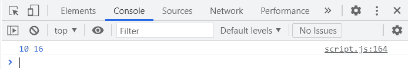

事实上，我们在控制台中分别存储和打印了“打开”和“关闭”的值。

## **从作为函数参数传递的对象中检索属性(实际应用)**

现在让我们来看一个析构的实际应用。首先，我们将再次修改库对象。

```
const library = {name: “Soumadri’s Fiction Book Shelf”,location: ‘1234 Fiction Palace, Calcutta, India’,genres: [‘Mystery’, ‘Horror’, ‘Fantasy’, ‘Sci-Fi’, ‘Literary Fiction’, ‘Historical Fiction’],titles: [‘The Inugami Clan’, ‘The Three Coffins’, ‘In Search of Lost Time’, ‘Sandman’, ‘The Left Hand of Darkness’, ‘The Complete Works of H.P. Lovecraft’, ‘Do Androids Dream of Electric Sheep?’, ‘In the Woods’, ‘In a Glass Darkly’, ‘Fingersmith’],authors: [‘Neil Gaiman’, ‘Ursula Le Guin’, ‘Sheridan Le Fanu’, ‘H.P. Lovecraft’, ‘Marcel Proust’, ‘Tana French’, ‘John Dickson Carr’, ‘Seishi Yokomizo’, ‘Philip K. Dick’, ‘Sarah Waters’],timings: {mon: {open: 10,close: 21,},tue: {open: 10,close: 21,},sat: {open: 10,close: 16,},},lendBook: function (obj) { console.log(obj);},};
```

如您所见，我添加了一个函数`lendBook()`，它接受一个对象(`obj`)作为参数。目前，我们只是将整个对象打印到控制台。

现在，这背后的基本原理。

在 JavaScript 中，一个函数可以有很多参数，尤其是在现实世界的应用程序中。如果你尝试使用这个函数，很难知道参数的顺序。因此，我们可以选择不手动定义参数；相反，我们只是将一个对象作为参数传递给函数。然后，这个函数会立即析构这个对象。

让我们尝试通过调用函数来实现这一点。

```
library.lendBook({memberName: ‘Soumadri Banerjee’,authorIndex: 2,titleIndex: 4,date: ‘8th July, 2021’,});
```

下面是对我们传递给函数调用的对象的每个属性的简短解释。

*   **memberName** :借书的图书馆成员的名字。
*   **authorIndex:** 对应于图书作者在 library.authors 数组中的名字的索引位置。
*   **titleIndex:** 在 library.titles 数组中对应书名的索引位置。
*   **日期:**图书被借阅的日期。

现在，如果我们查看浏览器的结果:

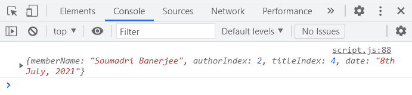

虽然这很好，但我前面提到过，我们希望函数立即将对象作为参数进行析构——也就是说，我们希望在函数参数中立即执行析构(检索属性值)。

我们可以这样做。

```
lendBook: function ({ authorIndex, titleIndex, date, memberName }) {console.log(`The book ${this.titles[titleIndex]} by ${this.authors[authorIndex]} was borrowed by ${memberName} on ${date}.`);},};
```

我们通过在花括号(`{}`)内的函数参数中使用完全相同的四个属性名(authorIndex、titleIndex、date、memberName)来析构函数调用中发送的对象——这些属性名与我们之前在函数调用期间传递的 obj 对象中的属性名相同。

现在，我们把这些值存储在不同的变量中。

为了打印到控制台，我简单地使用了一个模板文本(如果您不熟悉模板文本，可以随意使用常规字符串)来打印一个语句，该语句使用了参数中提供给我们的所有数据。结果看起来像这样:

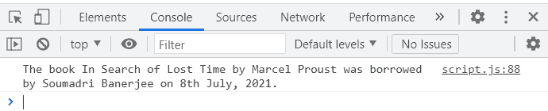

在这里强调这样一个事实是很重要的:在函数调用过程中，我们只向函数传递了一个对象。**我们没有通过四个论证。** **我们通过析构在函数参数中将属性作为单独的变量进行检索。**

另一个需要注意的要点是，在函数参数中进行析构时，我们不必遵循任何特定的顺序。例如， `memberName`在最后被析构，这与我们传递给函数的 obj 对象中的属性顺序不同。我们只需要确保使用与属性名完全相同的名称来析构和检索变量。

我们可以通过实现我们之前所学的来进一步改进这一点:**默认值**。

让我们将函数更改如下:

```
lendBook: function ({authorIndex = 0,titleIndex = 3,date,memberName,returnDate = ‘1 month’,}) {console.log(`The book ${this.titles[titleIndex]} by ${this.authors[authorIndex]} was borrowed by ${memberName} on ${date}. Please return it within ${returnDate}.`);}
```

我们在这里所做的是，如果属性`authorIndex`和`titleIndex`在对象上不存在，那么它们被分别设置为 0 和 3。并且在`returnDate`不作为属性存在的情况下，它被设置为字符串“1 个月”。

对于我们之前进行的函数调用，我们已经分别为`authorIndex`和`titleIndex` (4 和 2)提供了索引值。而且没有叫`returnDate`的属性。那么，如果我们现在调用`library.lendBook()`函数，你能猜到结果会是什么吗？试试看。

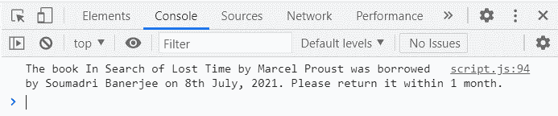

没错；正如我前面提到的，我们为`authorIndex`和`titleIndex` (0 和 3)设置的默认值在函数调用期间分别被 4(‘马赛尔·普鲁斯特’)和 2(‘搜索丢失的时间’)覆盖。而且由于没有`returnDate`这样的属性，所以它的值被设置为默认值“1 个月”。

当然，这是一个非常基本的例子，有相当多的逻辑缺陷(一个明显的缺陷是没有验证来确保所选的书确实是我们所选的作者写的)，但这意味着向您展示析构是如何工作的，并提供了一个实际的例子，说明它可能会派上用场。

请随意修改这些概念，尝试我们在本文中学到的一切，甚至可以改进和微调我提供的示例。

## 结论

就这样，祝贺你这篇非常长的文章结束了。正如我在上一篇文章中所做的那样，我想感谢乔纳斯·施梅德曼和他的精彩 Udemy [课程](https://www.udemy.com/course/the-complete-javascript-course/)让我对这些主题有了清晰的理解。

我希望你喜欢阅读这篇文章，并证明它是有益的。如果您有任何疑问或意见，请随时留言。

享受你的一天，祝你愉快，再见。

*更多内容看*[***plain English . io***](http://plainenglish.io/)