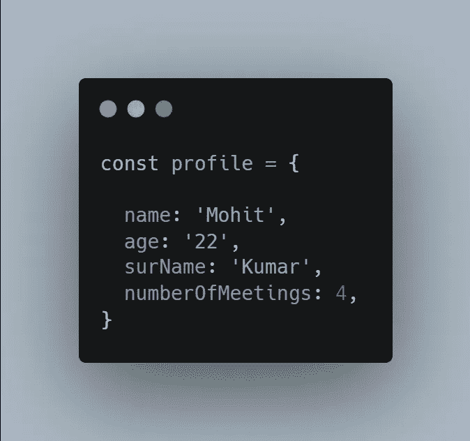

# JavaScript 中的 Object.freeze()与 Object.seal()

> 原文：<https://javascript.plainenglish.io/object-freeze-vs-object-seal-in-javascript-4f66f7d24754?source=collection_archive---------4----------------------->

## 理解 JavaScript 中的不变性

使用 JavaScript 时，开发人员有时需要用 ***对象*** 、 ***值*** *、* ***状态对象、*** 或***全局定义的常量*** 来限制动作。当开发人员在将源代码传递给另一个团队的团队中工作时，遇到错误的机会更大，因为有权访问这些数据的函数会直接修改它们，即使它们不应该这样做。此外，团队中的开发人员可以在不知道的情况下做出这样的更改。

为了避免在 ***JavaScript*** 应用程序中出现这样的问题，我们有了**不变性**的概念，在这里我们可以控制我们的数据在整个时间内是如何被修改的。在 *JavaScript 中，*提供了一些方法来处理这种情况，比如 ***seal()*** 和 ***freeze()*** 对象方法来控制不变性。

## JavaScript 中的不变性

换句话说，不可变对象只是一个不可能应用进一步更改的对象。**状态**是只读的，这正是我们在**常量**关键字中拥有的。

> 在我们学习更多关于不变性的知识之前，您应该知道对象在 JavaScript 中是如何工作的。

***例如:***

*   假设我们有两个变量，分别是**、**、&、**、【waterBottle】、**，在这种情况下，它们都只包含*字符串*，我们可以独立地更改其中的任何一个。

*   但是 ***对象*** 的行为完全不同，当一个对象被声明时*变量*不包含该对象，而是对它的引用。*例如，*变量 **profile** 在我们的例子中不包含对象本身(*而是对它的引用*)。

*   这类似于我们如何向一个位置写入地址&使用与复制字符串相同的赋值方法复制一个对象将导致复制对该对象的引用。
*   如果对**用户**进行任何更改，那么它也会修改**新用户**。另外，请注意，在这种情况下，我们没有两个对象，我们只是传递引用。

## 使用 Object.freeze()

这个方法冻结了一个对象，导致不再修改该对象，我们也不能添加新的属性或删除旧的属性。这可以简单地通过将所有属性的所有标志设置为**假**来实现。

***例如:***

*   假设我们有两个不同的对象，分别是 **user1** & **user2** ，这两个对象都是使用 **let** 关键字分配的，该关键字允许我们更改这些对象的属性。
*   在这种状态下，如果我们尝试给我们的对象的属性重新分配一个新的**值**，那么它将没有任何问题地工作。

*   但是当我们使用 **Object.freeze()** 方法来冻结我们的对象 **(user1)** 时，我们无法获得与之前相同的结果。

*   关于 **Object.freeze()** 方法还有更多需要了解的，如果我们尝试使用一个**嵌套的**对象，你会注意到嵌套的对象仍然会发生变化。

*   这是因为该方法只冻结顶级元素。

> ***注意:*** *如果你在浏览器的控制台中测试你的代码，不会抛出错误。但是如果你在一个严格模式打开的****JavaScript****环境中测试你的代码，就会抛出一个* ***未捕获类型错误*** *。在我们的* ***用户 1*** *和* ***用户 2*** *的例子中，如果我们试图对嵌套对象进行更改，在严格模式打开的情况下，将会抛出错误&我们也不能进行任何更改。*

## 使用 Object.seal()

使用这种方法，您可以更灵活地控制您的对象，因为 **seal()** 方法允许修改现有属性，这意味着您不能添加新属性或删除旧属性，但您可以对当前属性进行某些更改。

> ***注:*** *在此方法中，将* ***可配置*** *标志设置为* ***假*** *同* ***可写*** *设置为* ***真***

****例如:****

*   *在将 *Object.seal()* 方法应用到对象 **user1** 之后，可以对属性进行更改(第一种情况)，但是我们不能在当前属性中添加或删除任何内容(第二种情况)。*

*** [## 4 分钟解释大 O 符号

### 用更好的代码构建可伸缩的应用程序

javascript.plainenglish.io](/big-o-notation-explained-in-8-minutes-ded09f8f0f0a)  [## OAuth 在 4 分钟内解释

### 使用 OAuth 进行快速简单的授权

javascript.plainenglish.io](/oauth-explained-in-4-minutes-84081720a4f7)  [## 你不知道 CSS 能做的 4 件事

### 鲜为人知的 CSS 特性及示例

javascript.plainenglish.io](/4-things-you-didnt-know-css-can-do-13b364296570) 

*更多内容尽在*[***plain English . io***](http://plainenglish.io/)*