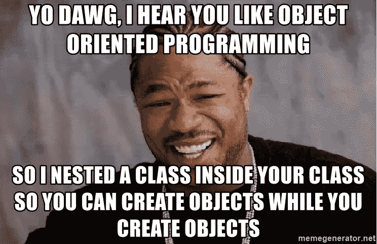
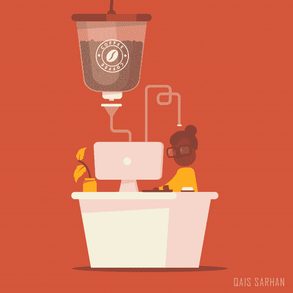
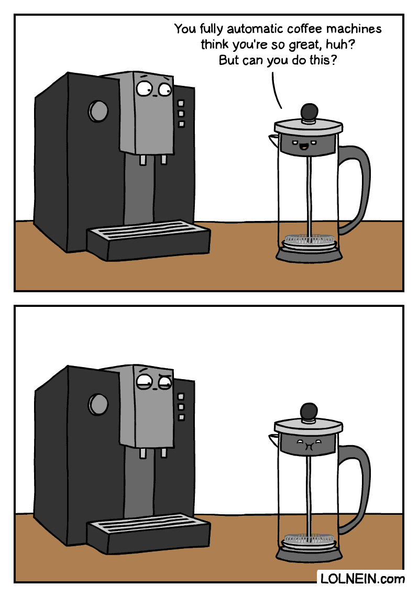
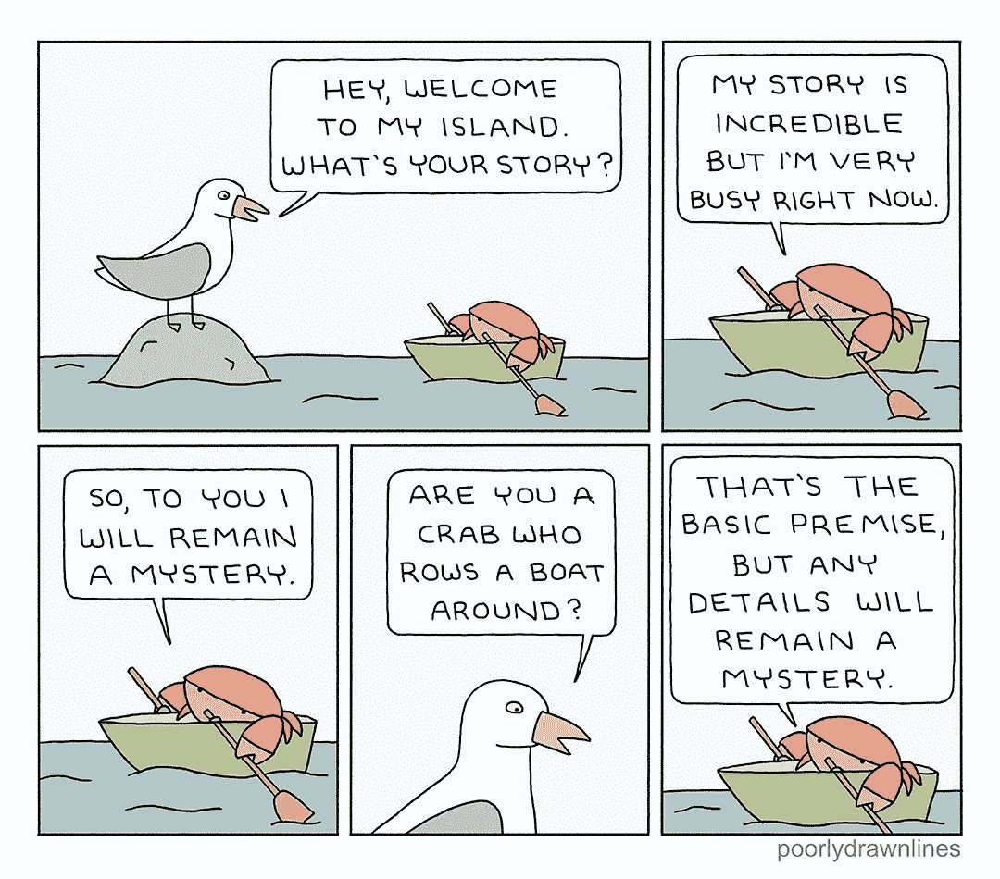
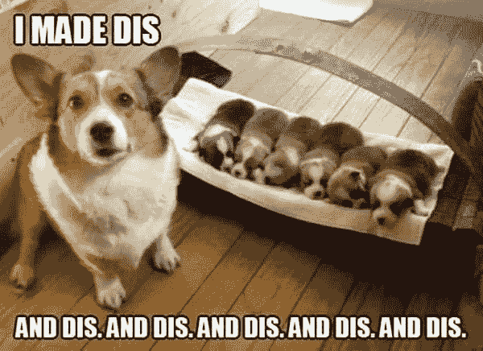
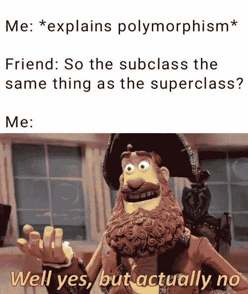

# 用模因解释面向对象程序设计

> 原文：<https://javascript.plainenglish.io/object-oriented-programming-in-memes-e6964570e81a?source=collection_archive---------8----------------------->

面向对象编程(OOP)语言，如 Python 和某种 JavaScript，围绕数据组织软件设计，以对象格式化，而不是函数或逻辑。

首先，我将介绍一些基础知识:[对象](#fddb)、[类](#3d5a)、[实例](#69fa)和[方法](#1ad9)。然后，我简单解释一下 OOP 设计的四大支柱:[封装](#982c)、[抽象](#52dc)、[继承](#a98e)、[多态](#1bc1)。

# 目标

对象是被格式化以表示具有状态和行为的真实世界对象的数据。

皮卡德的状态可能是“想要设定航向”，他的行为可能是告诉一名少尉想要的航向，并“使其如此”

# 班级

不同的编程语言有不同的方式，但本质上类是创建对象的蓝图。

# 情况

任何时候一个对象被创建，它就会被[实例化](https://www.crondose.com/2016/07/what-does-instantiation-mean/)。

这里显示的每个`deskSponge`都是一个对象的实例，因为它们是用`Spongebob`类制作的，所以是`Spongebob`的实例。

# 方法

对象中的函数。

[https://www.behance.net/qaisicle](https://www.behance.net/qaisicle)

换句话说，我们对象的行为。上面的咖啡机会有制作咖啡的方法，按钮会调用它。办公室工作人员将有一种按按钮、喝咖啡和含咖啡因打字的方法。

# 包装

你不需要知道咖啡机是怎么工作的，按下按钮就能得到咖啡。

[https://lolnein.com/2019/10/29/coffeemachinevsfrenchpress/](https://lolnein.com/2019/10/29/coffeemachinevsfrenchpress/)

[https://lolnein.com/2019/10/29/coffeemachinevsfrenchpress/](https://lolnein.com/2019/10/29/coffeemachinevsfrenchpress/)

换句话说，正在讨论的对象的行为和状态应该是私有的，并且只受对象内私有方法的影响。(按下按钮的人没有看到水被加热并被推过咖啡渣。)对象应该有公共方法，其他对象可以使用这些方法与它进行交互(比如按钮)。

# 抽象

在对象之外唯一可用的关于对象的信息是其他对象使用它所绝对需要的信息。

[http://www.poorlydrawnlines.com/comic/your-story/](http://www.poorlydrawnlines.com/comic/your-story/)

这也被称为[信息隐藏](https://en.wikipedia.org/wiki/Encapsulation_(computer_programming)#An_information-hiding_mechanism)，其他对象可用的公共方法是“getters”和“setters”

# 遗产

就像遗传学一样——如果一个类是一只狗，从 dog 类继承的每个对象都是一只小狗。

用类创建的对象(JavaScript 使用关键字`extends`)继承超类(或父类)的信息和方法(在 JavaScript 对象的`constructor`中调用`super()`)。

# 多态性

`Fred`和`ghostFred`都有一个叫`getDressed().`的方法当`getDressed()`被召唤时，`Fred`会穿上他的领结，`ghostFred`会穿上他的鬼服。

在这种情况下，`Fred`是类，`ghostFred`是`extends` `Fred`的对象。`ghostFred`从`Fred`继承方法`getDressed()`，但是当`ghostFred`被实例化时，程序员将不同的参数传递给`getDressed()`和/或改变方法的代码。OOP 语言根据调用时引用的对象来评估使用哪个`getDressed()`(`[this](https://www.w3schools.com/js/js_this.asp)`[关键字](https://www.w3schools.com/js/js_this.asp)将引用的对象)。如果使用正确，这可以显著减少重复代码。

# 结论

如果你是一个有经验的开发人员，希望你能对此一笑置之。如果你是初学者，我希望它能帮助你更自信地使用 OOP 语言！

如果你喜欢《迷因》中 OOP 的高层次概述，或者它给你留下了更多的问题，请留下评论！