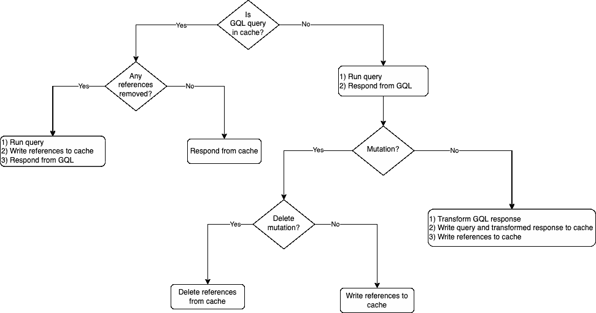
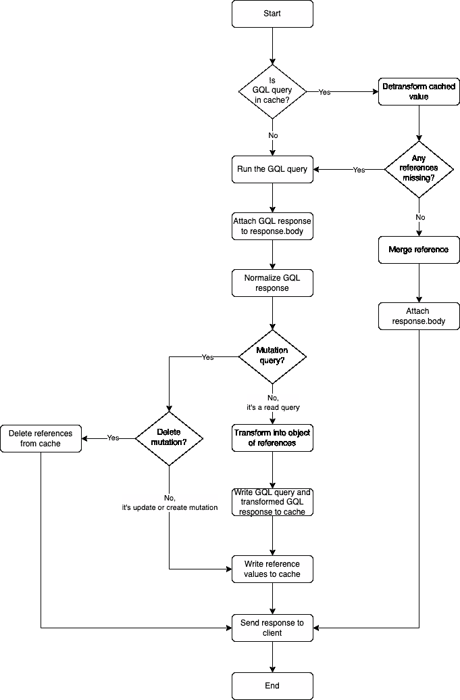
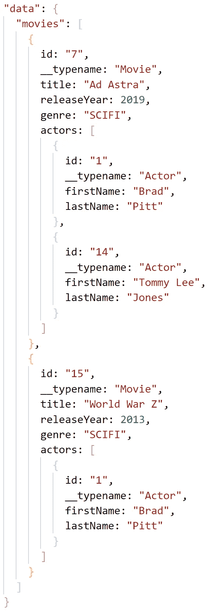
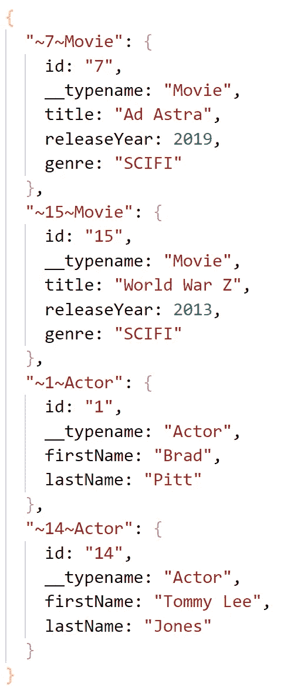
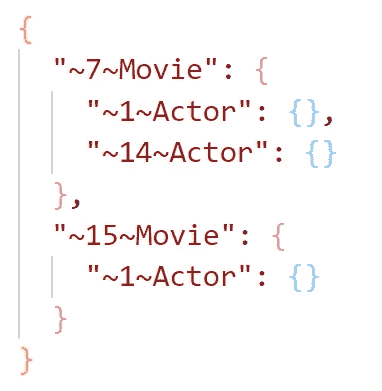

# 黑曜石 4.0.0 技术简介

> 原文：<https://javascript.plainenglish.io/obsidian-4-0-0-technical-brief-7dbcdf46d9ce?source=collection_archive---------12----------------------->

## Deno 的首个 GraphQL 缓存解决方案中增加了服务器端缓存失效功能

# 介绍

Obsidian 是 Deno 的第一个 GraphQL 缓存解决方案，使用浏览器缓存为 React 组件提供客户端缓存，使用 Redis 缓存为 Oak 路由器提供服务器端缓存。

## 脑海中的高性能缓存

因为 GraphQL 响应可以是任意大的和嵌套的，所以这些 API 调用有可能是昂贵的。在系统架构中引入 GraphQL 缓存策略提供了一种比调用 GraphQL 更便宜的替代方法:缓存检查。

> 请求时间=缓存检查(命中率)+服务调用时间(1-命中率)+缓存写入(1-命中率)

当缓存命中时，请求时间相当于缓存检查时间。

当存在缓存未命中时，请求时间相当于 GraphQL 调用时间和缓存写入时间。

为了拥有一个高性能的缓存，Obsidian 的首要任务是:
1)最小化昂贵的 GraphQL 服务调用
2)最大化缓存命中率

# 缓存权衡

管理缓存空间和缓存一致性是缓存最具挑战性的方面，因为优先考虑其中一个会有所取舍。Obsidian 4.0.0 为服务器端缓存引入了一个强大的缓存失效策略和一个免费的缓存回收策略。

## 缓存失效

假设对数据库中的所有科幻电影进行查询，不在缓存中，并且添加到缓存中。对这些科幻电影之一的后续改变(即创建、更新或删除)会使整个缓存响应失效。

突变带来了一个挑战:如果缓存是静态的，不仅不可能知道什么是陈旧的，而且如果发生正确的突变，缓存中的所有内容都完全可能变得陈旧。

## 缓存回收

当缓存内存不足时，必须决定收回哪些空间来腾出空间。探讨的两个策略是最近最少使用和最少使用的策略。虽然两者的实现对于内置的 Redis 函数来说都是微不足道的，并且在用户选择哪种策略时，Obsidian 路由器是不受影响的，但还是决定默认使用其中一种。

# 黑曜石 4.0.0:实现和原理

> 计算机科学中只有两个难题:缓存失效和事物命名

缓存失效和回收的优先级首先是最小化昂贵的服务调用，其次是最大化命中率。工程决策是通过这些优先级的透镜做出的。

## 缓存失效

它们不是存储静态的 GraphQL 响应，而是在缓存之前被转换成引用。读取时，高速缓存块被反转换，然后被返回。如果缓存写入和缓存读取变得更加昂贵，会有什么样的补偿性权衡？

这允许用户在发生突变时避免进行昂贵的 GraphQL 调用。如果存储的响应中只有一个元素发生了突变，就没有必要使整个响应无效。相反，只有一个元素是无效的。因为响应被转换成引用，所以反转换过程返回准确的响应。

为了使 GraphQL 响应缓存动态，实现了一个规范化的缓存。GraphQL 响应被规范化，每个组件都用引用名添加到缓存中。这些引用在缓存之前替换 GraphQL 响应中的相应值。

变异查询及其响应永远不会被缓存。然而，它们正在运行。查询的 GraphQL 抽象语法树被检查以识别它是否是一个变异。此外，如果在缓存中发现了突变的响应，Obsidian 会推断这是一个删除突变，并从缓存中删除该引用。在所有其他情况下，添加或更新突变，引用被写入缓存。

## 缓存回收

LFU 是大多数驱逐策略的绝佳候选。它确保保留命中可能性较高的缓存片段，并驱逐未命中可能性较高的片段。因为 LFU 在 Redis 中优化了命中率和易于实现性，所以 LFU 是基本案例。黑曜石 4.0.0 决定默认使用 LRU 的原因是它更好地补充了新的缓存失效策略。

因为引用将比 GraphQL 响应本身更频繁地被读取，所以 LRU 是防止它们被驱逐的缺省值，因为它们比它们的引用组件更少被使用。虽然用户可以更改此默认设置，但强烈建议保持设置为 LRU。

## 重构的服务器端缓存逻辑

Figure 1: Overall server-side cache logic flow diagram

有五种情况:
1)查询被缓存，并且没有引用被驱逐或删除
2)查询被缓存，并且至少有一个引用被驱逐或删除
3)查询没有被缓存，并且是读查询
4)查询没有被缓存，并且是删除变异
5)查询没有被缓存，并且是创建或更新变异

最好的情况是查询被缓存，没有引用被收回。这使得用户不必调用 GraphQL，而是用廉价的缓存读取来代替该操作。所有其他场景都需要 GraphQL 调用。

Figure 2: Redesigned function flow of server-side caching logic which incorporates cache invalidation

服务器端缓存逻辑经过重新设计，加入了缓存失效功能。最初，设计涉及两条独立的路径:一条用于缓存命中，一条用于缓存未命中。经过进一步的考虑，很明显，被驱逐或删除的引用需要运行查询。因为另一种选择是返回不完整的响应，所以 GraphQL 调用的这种折衷是值得的。

在缓存命中并且在缓存中找到所有引用的情况下，detrasformation 进程从缓存的引用中动态地重建预期的 GraphQL 响应。

在缓存命中的情况下，如果在缓存中没有找到至少一个引用(即，它被逐出或删除了)，则进行 GraphQL 服务调用，其响应被附加到 Obsidian 的响应体，引用值被重新写入缓存。

在缓存未命中的情况下，会进行 GraphQL 服务调用，其响应会附加到 Obsidian 的响应体。为缓存执行后续操作。GraphQL 响应是规范化的，对读取查询、删除变异和所有其他操作执行单独的操作。

在 read 查询的情况下，GraphQL 响应被转换成一个引用对象，并使用它的查询字符串作为 Redis 散列进行缓存。此外，每个引用对象都以其引用字符串作为 Redis 散列进行缓存。

在删除突变的情况下，引用从 GraphQL 响应中提取，并通过删除从缓存中失效。

在所有其他情况下——不管是创建变异还是更新变异——每个引用对象都用其引用字符串作为 Redis 散列进行缓存。如果引用已经存在，它将被更新的值覆盖。

## 规范化、转换和去转换

举例来说，下面的 GraphQL 响应将通过核心功能为缓存做准备。

Figure 3: GraphQL response to be processed

新的服务器端缓存逻辑的支柱是递归规范化算法。任意嵌套的 GraphQL 响应在线性时间内被展平为唯一引用字符串键的对象及其对应的对象。

这些引用字符串由默认为“id”和“__typename”数组的唯一标识符创建。如果一个对象包含所有的唯一标识符作为属性，那么它就被认为是可散列的。这将被剪切并添加到规范化对象中，直到任何嵌套点。嵌套是通过递归调用函数来遍历的。

Figure 4: Normalized GraphQL response with references and corresponding values

在转换过程中，对象被替换为引用。嵌套是通过递归调用来遍历的。检查每个对象是否可散列的方式与在规范化算法中确定的方式相同。如果可散列，则用其引用替换。去转化撤销了这个过程。

Figure 5: Transformed dynamic GraphQL response object

## 条件高速缓存无效技术

GraphQL 查询字符串被转换成抽象语法树，以检查操作是否属于突变类型。如果是这样，就调用变异，并对 GraphQL 响应进行规范化。突变的种类是通过阅读 Redis 的参考文献推断出来的。

如果 Redis 返回空值，则推断出创建的变异。新引用被写入缓存。

如果 Redis 值和 GraphQL 响应彼此非常相等，则推断出删除突变。该引用将从缓存中删除。

如果相等为假，则推断出更新突变。引用将被更新后的值覆盖。

## 测试驱动开发

为了确保可靠性，采用了测试驱动的开发方法。上述功能的每个主要部分(规范化、转换、反转换和缓存无效)都必须通过预定义的测试，才能被合并和发布。

# 未来功能和改进的注意事项

## 通过分片水平扩展缓存

选择 LRU 驱逐策略的理由是防止有价值的 GraphQL 响应被驱逐。拥有一个分片缓存，其中一个分片保存 GraphQL 响应，一个分片保存引用，这将是一个主要的缓存回收改进。这将不仅允许每个相应的高速缓存具有其自己的驱逐策略，而且将防止这两类高速缓存相互干扰。事实上，LFU 缓存将优化各个碎片的命中率，同时能够在更具可比性的信息片段之间进行比较。

## 使缓存中的 GraphQL 响应无效:*避免添加突变后响应不足*

目前没有办法使 GraphQL 响应无效。只有引用是无效的。如果有一个要从数据库中读取的查询，后面跟着一个添加的突变，那么要读取的同一个查询可能会从缓存中响应不完整的数据。要读取的原始查询不会将这个最近添加的引用包含在转换后的缓存值中。尽管避免了 GraphQL 调用，但 Obsidian 将会响应不足。

## 使缓存中的 GraphQL 响应无效:避免过度响应

尽管过度响应不像响应不足那样有问题，但还是值得注意的。如果缓存了一个查询，并且后续查询从第一个查询请求了较少的字段，那么转换过程会欺骗曜石认为两个响应应该是相同的。这是因为黑曜石没有办法区分包含“发行年份”属性的“~ 7 ~电影”引用和不包含它的“~ 7 ~电影”引用。它总是缓存有更多字段的那个。

虽然使响应无效可以解决这个问题，但是在使来自缓存的昂贵的 GraphQL 响应无效之前，应该首先探索其他方法。对于用户来说，简单地意识到这种细微差别可能更好。

## 并行处理 Obsidian 的响应和写入缓存

GraphQL 的响应附在黑曜石收到时的响应中。缓存是在之后执行的。因为它们互不依赖，所以这些路径可以并行化。这样做会带来性能优势。

## 选择性地查询逐出或删除的引用

如果 Redis 中由于驱逐或删除而丢失了任何引用，则会进行整个 GraphQL 调用。相反，对缺失的引用进行成本较低的调用也会带来性能优势。

如果 redis 中有不止一个键没有找到，那么最好将返回我们正在寻找的响应的查询分组，并作为一个查询发送，以减少我们向 GraphQL 发出的网络请求的数量。

## *自动化端到端测试*

在执行端到端测试的同时，自动化这些测试将会改善 Obsidian 的内部开发体验。至少，对五个场景中的每一个进行一次测试是有益的，因为这些测试需要在开发团队中进行，以确保 Obsidian 的行为符合预期。

进行查询和突变的不同组合的额外测试也将改善未来的交付周期。

# 入门指南

用我们的[简单易用的演示](https://github.com/oslabs-beta/obsidian-demo-3.2)来尝试黑曜石令人兴奋的新功能。阅读我们的[文档](https://github.com/open-source-labs/obsidian)，开始将黑曜石整合到你自己的应用中。这是我们免费赠送的[发布文章](https://discord.com/channels/909826935780151327/909826935780151332/920878212047851550)。

黑曜石是在技术加速器[开源实验室](https://opensourcelabs.io/)下生产的开源产品。我们欢迎通过 [GitHub](https://github.com/open-source-labs/obsidian) 的贡献和反馈。

***其他关于黑曜石的文章:***

[黑曜石 1.0](https://medium.com/@travisfrank/introducing-obsidian-graphql-built-for-deno-6f97a31f4af3)
[黑曜石 2.0](https://obsidian-deno-gql.medium.com/obsidian-2-0-launch-f66515d4f1b)
[黑曜石 3.0](https://christygomez-49559.medium.com/obsidian-3-0-launch-1742af1b1fe9)
[黑曜石 3.1](https://justinwmckay.medium.com/launch-obsidian-3-1-30429f3026c2)
[黑曜石 3.2](/obsidian-the-caching-solution-for-graphql-in-deno-runtime-130254b4233b)
[黑曜石 4.0](https://medium.com/@mikechin37/obsidian-4-0-0-launch-deno-graphql-caching-solution-3588558e2d2a)[黑曜石 4.0](https://yogi-paturu.medium.com/obsidian-4-0-0-technical-brief-7dbcdf46d9ce?source=friends_link&sk=9b3ee33f0ec5186e3023e029af848e43)

***黑曜石团队合著:*** 萨尔多·阿赫梅多夫| [GitHub](https://github.com/sarkamedo)
迈克尔·钦|[GitHub](https://github.com/mikechin37)|[LinkedIn](https://www.linkedin.com/in/michael-chin-00432485/)|
达纳·弗瑞| [GitHub](https://github.com/dmflury)
约吉·帕图鲁|[GitHub](https://github.com/YogiPaturu)|[LinkedIn](https://www.linkedin.com/in/yogi-paturu/)

*更多内容看* [*说白了就是*](http://plainenglish.io/) *。报名参加我们的* [*免费每周简讯*](http://newsletter.plainenglish.io/) *。在我们的* [*社区不和谐*](https://discord.gg/GtDtUAvyhW) *获得独家获取写作机会和建议。*