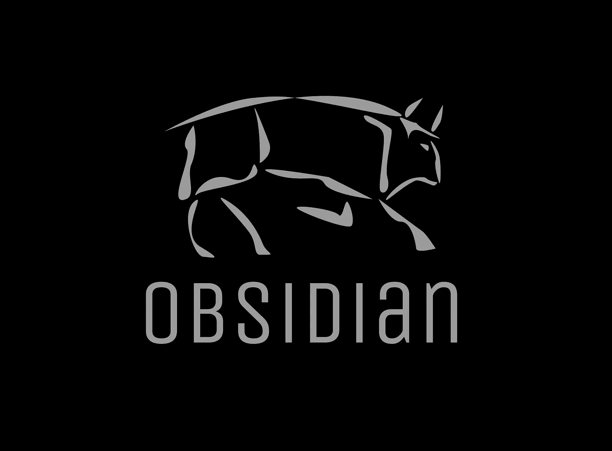

# obsidian:Deno 运行时中 GraphQL 的缓存解决方案

> 原文：<https://javascript.plainenglish.io/obsidian-the-caching-solution-for-graphql-in-deno-runtime-130254b4233b?source=collection_archive---------13----------------------->

## *Deno 运行时缓存 GraphQL 查询的工具*

[黑曜石](http://obsidian.land/)团队和[开源实验室](https://opensourcelabs.io/)很高兴发布黑曜石 3.2。这个最新版本包括强大的查询处理和快速缓存功能。

## **黑曜石是什么？**

Obsidian 是 Deno 的第一个原生 GraphQL 缓存解决方案。 [Obsidian](http://obsidian.land/) 是一款易于使用的轻量级服务器端缓存解决方案。

## 更新的功能

对 Obsidian 的最新更新是对服务器端缓存引擎的一次彻底检查。通过将查询解析为 ast，我们真正释放了 graphQL 的力量，并支持整个规范的完整、复杂的荣耀。除此之外，我们还允许订阅隧道，并为畅通无阻的连接升级留出空间，以确保随着 GraphQL 的完整功能集在 Deno 中可用，黑曜石是面向未来的，并将继续是一个有效的解决方案。

3 . 2 . 0 版本亮点:

1.  **缓存任何复杂程度的查询**，包括:

*   联合
*   接口
*   自定义指令
*   任何嵌套级别的任意数量的片段、变量或指令

2.**订阅隧道**

3.**突变时选择性缓存失效，以确保数据源和缓存之间始终保持奇偶校验**

Obsidian reduces complex query response from 200ms to 1 ms

## 开始

看看我们的[演示](https://github.com/oslabs-beta/obsidian-demo-docker)吧。你可以访问[曜国](http://obsidian.land/)上的文档。

黑曜石是在科技加速器[开源实验室](https://opensourcelabs.io/)下生产的开源产品。我们欢迎通过 [GitHub](https://github.com/open-source-labs/obsidian) 的贡献和反馈。

如果你用过黑曜石或者在 Deno 遇到过缓存问题。我们欣赏来自 GitHub 的明星。

[下载](https://deno.land/x/obsidian@v3.2.0)黑曜石

Designed by Nikolay Todorov

**由黑曜石团队合著:**

*   迈克尔梅尔维尔|[GitHub](https://github.com/meekle)|[Linkedin](https://www.linkedin.com/in/michael-j-melville/)
*   克里斯托弗·贝瑞|[GitHub](https://github.com/cjamesb)|[Linkedin](https://www.linkedin.com/in/christopher-j-berry/)
*   奥利维亚·叶吉亚扎瑞恩|[GitHub](https://github.com/Olivia-code)|[Linkedin](https://www.linkedin.com/in/olivia-yegazarian/)
*   John Wong |[GitHub](https://github.com/johnwongfc)|[Linkedin](https://www.linkedin.com/in/john-wong-fongching/)

*更多内容请看*[***plain English . io***](http://plainenglish.io)