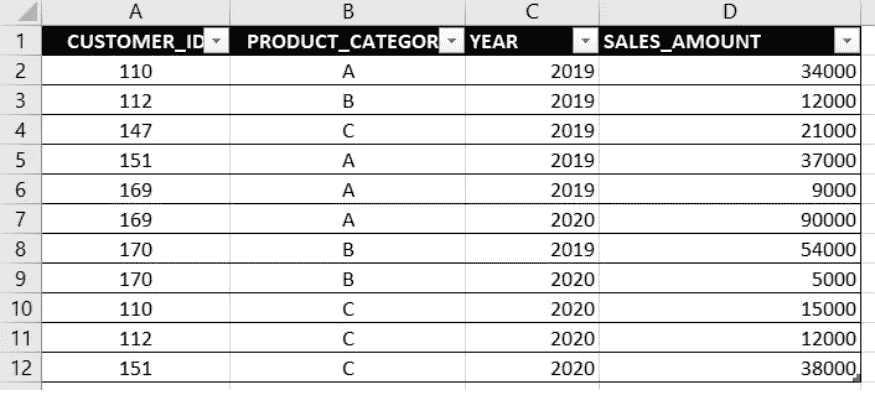
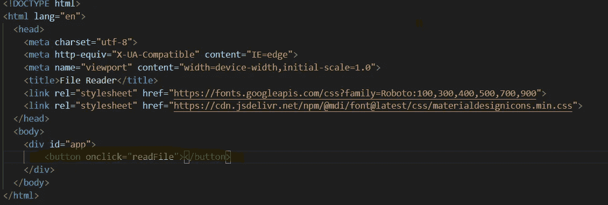
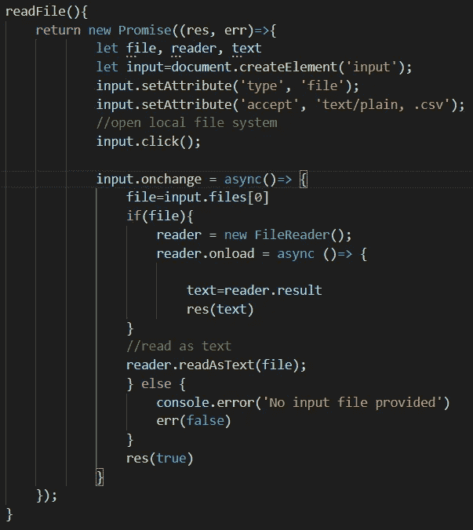
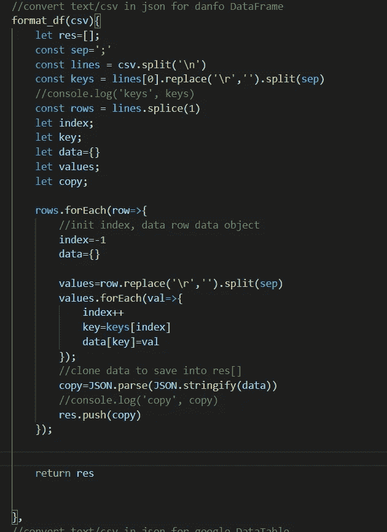

# 用 JavaScript 实现数据可视化和分析

> 原文：<https://javascript.plainenglish.io/off-line-data-visualizations-and-analysis-with-javascript-8e0a891493b1?source=collection_archive---------8----------------------->

Photo by [Luke Chesser](https://unsplash.com/@lukechesser?utm_source=unsplash&utm_medium=referral&utm_content=creditCopyText) on [Unsplash](https://unsplash.com/s/photos/data?utm_source=unsplash&utm_medium=referral&utm_content=creditCopyText)

在过去的几个月里，我一直致力于开发一个离线数据分析和可视化项目。场景是这样的:

*   ERP 系统查询产生的一组 csv 文件；
*   最终用户自己制作的一组图表。

## [danfo . js](https://danfo.jsdata.org/)

Danfo.js 是一个开源的 JavaScript 库，提供了高性能、直观且易于使用的数据结构来操作和处理结构化数据。Danfo.js 深受 Pandas 库的启发，并提供了类似的接口和 API。

> 基本上，danfo.js 允许您创建客户端数据框架。数据帧是表格形式的结构化数据对象(矩阵或二维数组)。

# 将本地 CSV 文件转换为数据帧

## **第一步。读取本地 CSV 文件**

第一步是从查询导出结果的本地共享磁盘读取最终用户选择的 csv 文件。例如，我想将下面的 csv 文件转换成数据帧。导出的 csv 文件表示具有指定年份、客户、产品类别(特性)的销售数据集。

annual_sales.csv

## **文件 Web API**

文件浏览器 API 允许读取终端用户选择的文件。

*我们需要什么？*

*   一个按钮和单击事件，用于加载文件类型的输入标记，允许最终用户选择文件
*   加载所选文件，并将其作为文本阅读

## **HTML 按钮**

The HTML button and the readFile onclick event

## readFile 函数

这个函数的结果是 CSV 文本字符串。

Local csv file reader

## 第二步。将 CSV 文本字符串转换为数据帧

DataFrame 可以由一组 JavaScript 文字对象构成。所以下一步是将 CSV 文本字符串转换成对象数组。下一个函数`csv_to_dataframe(strCSV)`将会这样做。

Convert csv string into array of literal objects

## 第三步。构建 danfo 数据框架

这是最简单的一步。只需根据前面函数的结果构造一个 DataFrame 对象:`df=new **dfd**.DataFrame(format_csv(strCSV))`

**其中 dfd 是对全局 danfo.js 库的引用**你可以作为 cdn 导入，本地下载，或者作为 NPM 包安装(关于如何将 Dando.js 集成到你的客户端应用的详细信息，请参见[https://danfo.jsdata.org/getting-started](https://danfo.jsdata.org/getting-started)，如果你使用 React、Angular o Vue 等框架，请参见[https://danfo.jsdata.org/examples/using-danfojs-in-react](https://danfo.jsdata.org/examples/using-danfojs-in-react))。

一如既往地在评论中让我知道你的想法。如果你感兴趣，我将发表这篇文章的第二部分来讨论:

*   使用 DataFrame 进行强大的数据转换和分析
*   使用 3 个免费的令人惊叹的 JavaScript 库来可视化不同类型的交互和响应图形读取数据帧: [pyplot](https://plotly.com/javascript/) 、 [Apexchart](https://apexcharts.com/) 、 [Google visualization API](https://developers.google.com/chart/interactive/docs/reference)