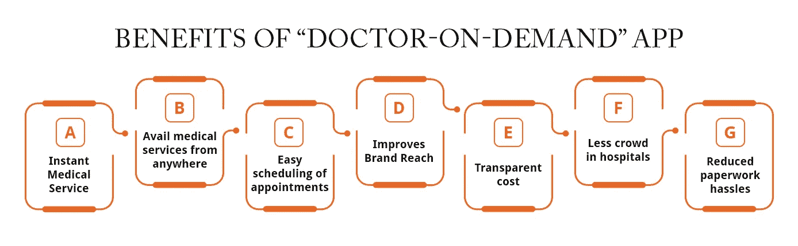
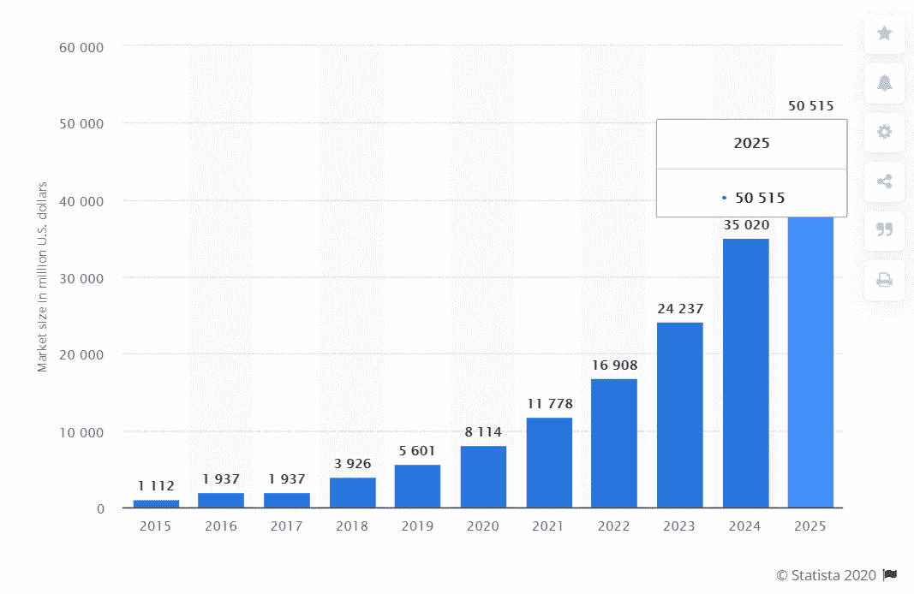
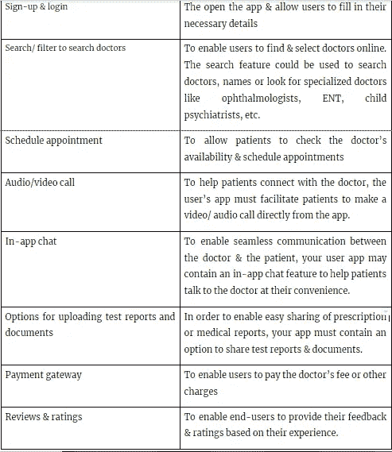
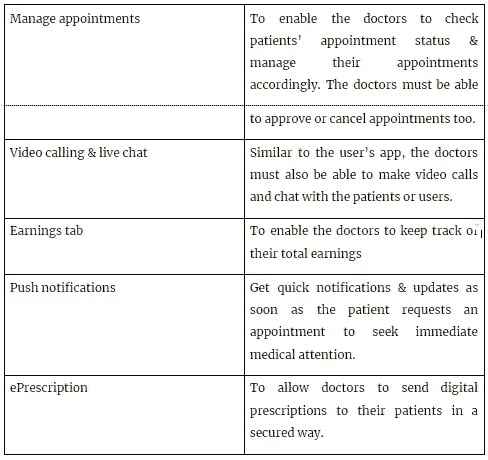
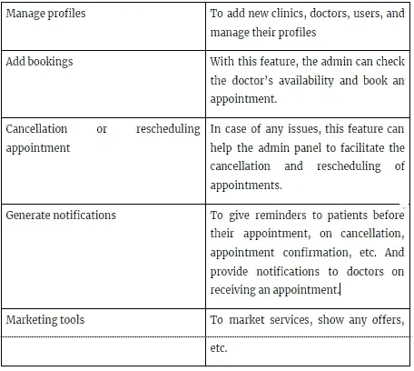
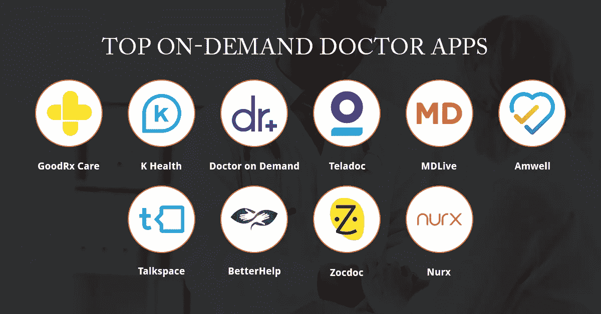

# 按需医生应用程序开发:优势、功能、成本等等

> 原文：<https://javascript.plainenglish.io/on-demand-doctor-app-development-benefits-features-cost-and-a-lot-more-a3d6c42a77f9?source=collection_archive---------13----------------------->

## 打算开发一款按需医生 app？你绝对不想错过这个指南

检查医生是否有空，预约，排着长队等着看医生，所有这些麻烦都可以通过一个有前途的“按需医生”应用程序来结束。只需 [**雇佣一家可靠的移动应用开发公司**](https://www.suntecindia.com/mobile-app-development-services.html) ，你现在就可以开发出一款强大的应用，方便患者通过移动应用毫不费力地预约医生&连接。

# “按需医生”应用的优势

记住今天人们忙碌的时间表和他们的生活方式，拥有一个按需医生应用程序可以大大缓解压力。如今，人们在指尖寻找一切，通过智能手机联系医生是最简单的就医方式之一。它不仅解决了延误治疗的问题，而且节省了时间、金钱和额外的减刑。

*   **即时医疗服务-** 随着远程医疗应用程序的开发，患者可以直接使用移动应用程序并联系医生以获得即时治疗。这消除了不必要的延误&为应用程序用户提供即时医疗服务。
*   **从任何地方获得医疗服务** -用户可以随时随地使用这款应用，获得即时帮助和更好的治疗。这意味着附近没有医疗机构的患者可以简单地使用应用程序&联系医生。
*   **轻松预约:**医生点播 app 让用户可以随时轻松预约医生。根据医生的空闲时间，患者可以预定指定的时段&在预定的时间与医生联系。在特殊情况下，如果病人或医生有任何问题，他们可以取消预约，并提出新的日期。
*   **提升品牌影响力** -对于医疗保健机构来说，拥有远程医疗应用程序是一大福音。首先，它提高了品牌价值，其次，它让他们接触到更多的人。这也使他们能够快速联系越来越多的消费者&向用户提供您的联系信息，如用户名、电子邮件地址、联系方式等。
*   **透明成本-** 有时，当你去看医生时，费用可能很高，但是，有了应用程序，用户可以直接从应用程序查看医生的费用和折扣。因此，这些应用程序是以公平甚至免费的方式获得医疗保健服务的好方法。
*   **减少医院中的拥挤:**应用程序开发解决方案允许人们在舒适的家中与医生互动。远程医疗为病人提供了一个很好的选择，让他们可以立即得到医疗救助，避免医院的急诊高峰。这导致住院病人数量减少&服务质量提高。
*   **减少文书工作的麻烦-** 带着医疗化验单、处方、&其他文书工作去见医生。远程医疗应用程序的开发使患者和医生都能在一个地方找到所有的报告&让他们从麻烦中解脱出来。

# 为什么现在是投资“医生点播”app 的最佳时机？

根据统计数据**，2021 年全球移动健康市场将接近**1000 亿美元。Statista 的另一份报告称，移动医疗保健应用在数字医疗保健市场的收入中发挥着至关重要的作用，预计到 2025 年底将达到 588 亿美元。****

****

**看一下上面的统计数据，很明显医疗保健移动应用在行业中的前景是光明的。这意味着，如果你正计划建立一个医生点播应用程序，它正在迅速增长，无论是在受欢迎程度还是需求方面。无论是投资者、医生组织还是诊所，他们都看到了开发这些应用程序的潜力&彻底改变行业。**

> **投资按需医生应用程序使其成为有利可图的交易的其他原因是:**

****疫情:**在正在进行的疫情期间，远程医疗应用大幅增长。由于严格的封锁和健康风险，人们越来越难走出家门去看医生。 [**麦肯锡的**](https://www.mckinsey.com/industries/healthcare-systems-and-services/our-insights/telehealth-a-quarter-trillion-dollar-post-covid-19-reality#) **报告**强调，由于疫情的 COVID，远程医疗用户的数量，几乎增加了 100 倍。在新冠肺炎时代，76%的消费者使用远程医疗，而不是医疗访问，而在前 COVID 时代，这一比例仅为 11%。**

****根据** [**统计**](https://www.statista.com/statistics/869268/telemedicine-comfort-certain-issues-in-the-us-by-type/) ，60%到 75%的美国成年人愿意在日常生活中使用远程医疗应用。此外，几乎 70%的用户对所提供的服务感到满意，并打算在可预见的未来使用它们。这表明，这些应用程序的使用将会持续，对这些应用程序的依赖只会随着时间的推移而增加。**

****更大的需求:**医生预约应用程序彻底改变了医生预约的流程。这些应用程序不仅能让用户在家舒适地获得医疗服务，还能帮助医疗机构的医生扩展他们的服务，接触更多的人。[**74%的千禧一代**](https://www.modalitysystems.com/hub/blog/telemedicine-statistics) 更喜欢远程医疗就诊，而不是亲临医生检查。另一方面，93%的临床医生认为远程医疗是一种可以接受的治疗方法。**

# **按需医生应用程序的核心功能**

**app 开发成本很大程度上取决于 app 特性。你整合的应用功能和特性越多，它的成本就越高。**

> **然而，按需医生应用程序的一些核心功能包括:**

> ****用户/患者应用:****

****

> ****医生 app:****

****

> ****管理面板****

****

# **高级医生点播应用功能**

**除了上面提到的核心功能，你还可以给你的应用添加一些更有趣的特性和功能，使它更加用户友好和方便。然而，添加这些附加功能可能会增加您的按需医生应用程序开发的总成本。**

*   **约会提醒**
*   **应用内诊所导航**
*   **成本计算器**
*   **推送通知**
*   **用药提醒**
*   **实时分析**
*   **多种付款方式**
*   **文档共享**
*   **健康保险索赔**
*   **营销和促销工具**
*   **多种货币支付**
*   **多语言用户界面**

# **美国十大按需医生应用**

**在开发您自己的远程医疗应用程序之前，您还可以从这些美国最受欢迎的远程医疗应用程序中获得灵感，并了解它们的特性和功能:**

****

# **按需医生移动应用开发所需的团队**

**为了开发一个成功的医生预约应用程序，从一个可靠的公司雇佣移动应用程序开发人员并建立一个强大的团队是非常重要的。对于您的项目，您需要:**

*   **聘请项目经理**
*   **[**雇佣安卓应用开发者**](https://www.suntecindia.com/hire-android-app-developers.html)**
*   **[**雇佣 iOS 应用开发者**](https://www.suntecindia.com/hire-iphone-app-developers.html)**
*   **雇用后端应用程序开发人员**
*   **雇佣图形设计师**
*   **雇佣 UX/用户界面设计师**
*   **雇佣质量保证测试员**

# **医生点播移动应用程序的成本**

**构建一个应用程序的总成本取决于许多因素。这些因素包括:**

*   **技术栈**
*   **特征数量**
*   **功能**
*   **开发人员的专业知识/经验**
*   **开发平台(Android、iOS 等)，**
*   **地理位置**
*   **第三方应用集成**
*   **支付网关集成**
*   **应用维护和监控**
*   **UI/UX 设计的复杂性**

**应用程序开发的成本也因国家而异。例如，在美国，移动应用程序开发人员的成本约为每小时 150 至 250 美元。东欧的情况不同，大约在 120 美元到 180 美元之间。如果你决定外包或者 [**从印度**](https://www.suntecindia.com/hire-dedicated-developers.html) 雇佣专门的软件开发人员，这个价格可能会进一步降低，因为每小时的开发费用是 40 到 80 美元。因此，如果你期待开发一个价格合理的远程医疗应用程序，而又不影响应用程序的质量，那么从印度雇佣一家移动应用程序开发公司是最好的选择！**

**如果你决定利用 [**MVP 开发服务**](https://www.suntecindia.com/mvp-development-company.html) ，一个 MVP 版本的按需医生应用的费用可能从 30，000 美元开始。然而，如果你想为多个平台开发你的应用程序，并添加丰富的功能，那么成本可能会高达 80，000 美元。**

**总而言之，一个基本的按需医生应用程序的总成本可能在 25，000 美元到 40，000 美元左右，最高可达 40，000 美元到 80，000 美元，这取决于您决定为其构建应用程序的功能和平台的数量。**

# ****包装****

**对按需应用程序日益增长的依赖和医疗保健领域的重大改进为您带来了构建应用程序和获得最大投资回报的新机会。2022 年的新常态肯定会看到更多远程医疗的使用，以及从在家的便利中获得更好的健康服务。现在你已经有了构建应用程序的所有必要信息和成本估算，是时候开始应用程序了。**

# ****回答的热门问题****

****什么是医生点播 app？****

**医生点播应用程序方便患者通过移动应用程序预约医生，几乎可以随时随地看病，并在家中舒适地获得在线咨询。**

****医生点播 app 有什么好处？****

**按需医生应用程序帮助患者通过移动应用程序与医生联系，节省大量时间和金钱，减少医院的麻烦，并提供从世界任何角落获得医疗服务的机会。对于医生来说，该应用程序有助于接触更多的人，管理预约和通过应用程序提供无缝咨询。**

**构建/开发一个按需医生应用程序需要多少成本？**

**按需医生应用程序开发的成本取决于几个因素，如应用程序功能、平台数量、技术堆栈、第三方集成等。然而，一个基本的按需医生应用程序的总成本约为 25，000 美元至 40，000 美元，最高可达 40，000 美元至 80，000 美元。**

****按需医生应用程序开发的时薪是多少？****

**应用程序开发的成本因国家而异。在美国，移动应用开发者的成本是每小时 150 到 250 美元。在东欧，这一比率约为 120 至 180 美元。如果你决定外包或者 [**从印度雇佣专门的移动应用开发者**](https://www.suntecindia.com/hire-mobile-app-developers.html) ，这个价格可能会进一步降低，因为每小时的开发费用是 40 到 80 美元。**

> **因此，如果您有任何想法，您想要实现技术、特性和功能的正确组合，那么您可以 [**联系我们**](https://www.suntecindia.com/contactus.htm) 或在下面提出疑问。**

**现在你知道了。感谢您的阅读。！**

# **另请参阅:**

> **[***如何创建交友 App？(特性、成本、时间等等)***](https://www.suntecindia.com/blog/how-to-create-a-dating-app/)**
> 
> **[***2021 年打造自己的优步 App:综合指南***](https://www.suntecindia.com/blog/how-to-make-an-app-like-uber/)**
> 
> **[***如何将 iOS 应用转换为 Android 应用？(步骤、成本和挑战)***](https://medium.com/dev-genius/how-to-convert-ios-app-to-android-app-steps-cost-and-challenges-a064ebc0e636)**
> 
> **[***外包手机 App 开发服务的技巧和策略***](https://medium.com/mobile-app-development-publication/tips-and-strategies-to-outsource-mobile-app-development-services-a5a7f9c6ac85)**
> 
> **[***开发一个送餐应用程序(它的特性、成本和功能)***](https://medium.com/flutter-community/develop-a-food-delivery-application-its-features-cost-and-functionality-454b228b8111)**
> 
> **[***Shopify vs woo commerce vs Magento—您应该为您的企业选择哪种电子商务解决方案？***](/shopify-vs-woocommerce-vs-magento-which-ecommerce-solution-should-you-choose-for-your-business-d744a828a71b)**
> 
> **[**如何搭建一个能吸引 ROI 的 fin tech App**](/how-to-build-a-fintech-app-that-can-attract-roi-a3d416a9a289)**

***更多内容看* [*说白了. io*](http://plainenglish.io/) *。报名参加我们的* [*免费每周简讯*](http://newsletter.plainenglish.io/) *。在我们的* [*社区不和谐*](https://discord.gg/GtDtUAvyhW) *获得独家获得写作机会和建议。***