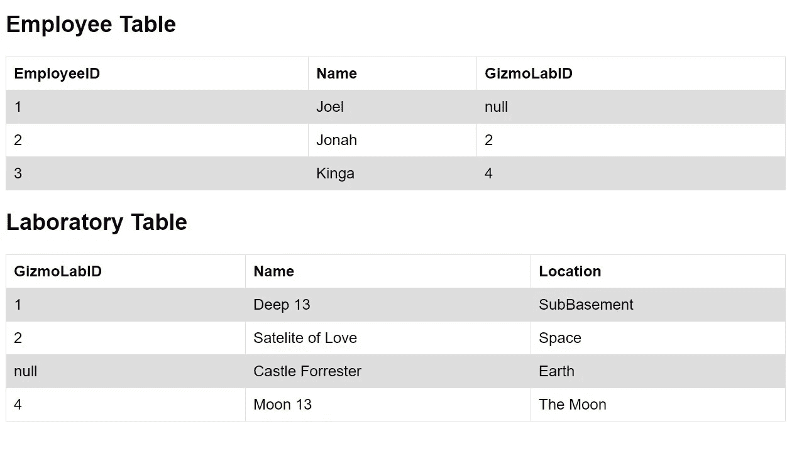
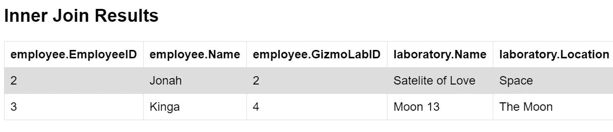
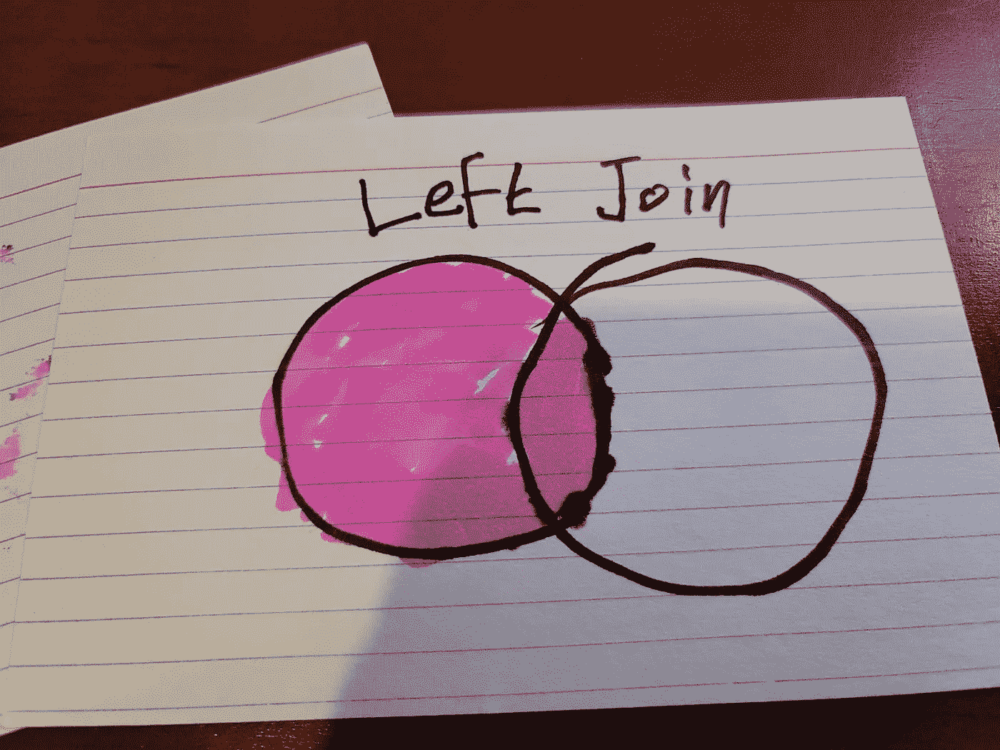
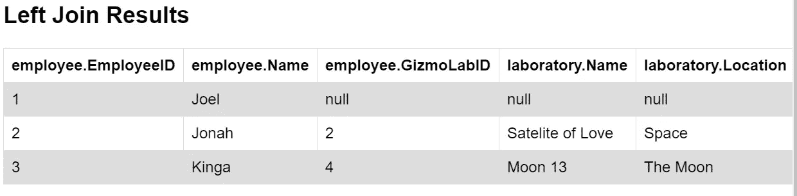
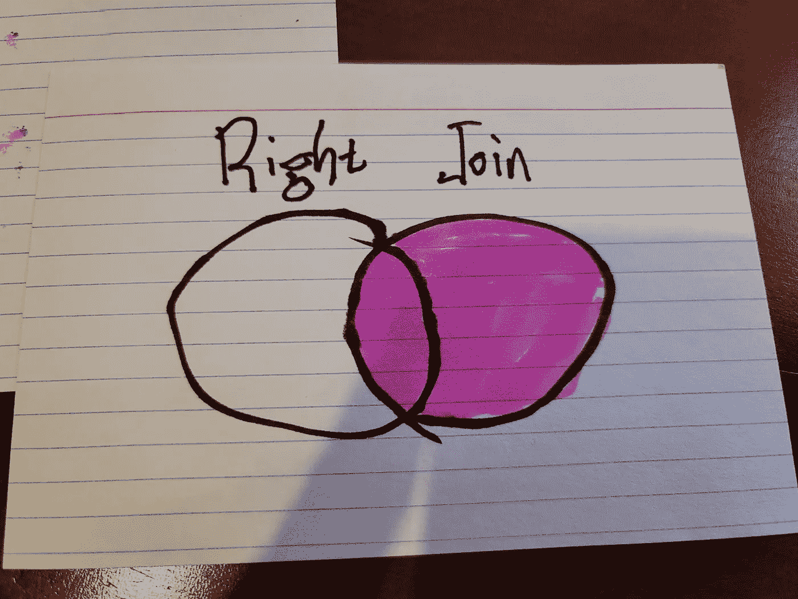
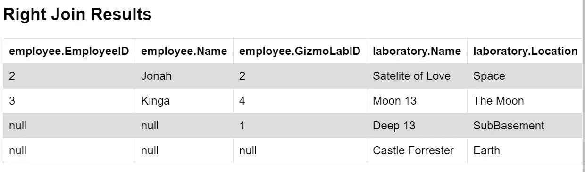
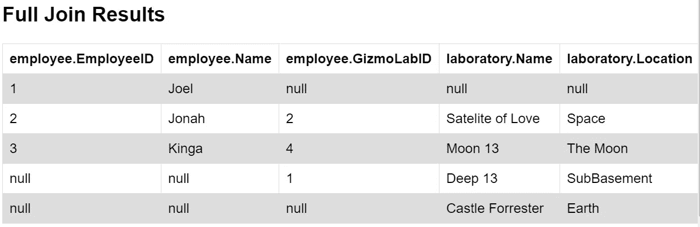

# SQL 连接指南

> 原文：<https://javascript.plainenglish.io/on-sql-joins-777dc47f034d?source=collection_archive---------17----------------------->


上周有人问我关于 SQL 连接的问题，我完全说不出话来。这让我觉得我可以用一点练习来简洁地解释这一点。和我一起花几分钟时间，掌握这个普通的面试垒球。

# 设置

关系数据库无处不在。我们制作的许多 web 应用程序都是这些关系数据库的接口，作为一名软件开发人员，我们提供这些数据接口的最常见方式之一是用*结构化查询语言*即 SQL 编写代码。`JOIN`子句是组合来自两个或多个表的信息的一种非常强大的方法。

对于这些示例，让我们考虑 gizmonic 实验室员工数据库中的这两个表:



在*雇员表*中，我们有雇员的姓名、他们的 id 号以及他们工作的实验室的 id。在*实验室表中，*我们有实验室的名称和位置以及实验室的 id。注意，在这两个表中，我们都有以`null`作为`GizmoLabID`的条目。员工 Joel 已经离开 Gizmonic Labs，Castle Forrester 已经不再使用，因此另一个勤奋的软件开发人员已经在两种情况下将 GizmoLabID 设置为`null`。

# 四个简单的连接

出于今天博客的目的，我们将涵盖使用`JOIN`的四种常见方式。

# 内部联接


当您只需要两个表中满足搜索条件的记录时，您可能希望使用内部联接。我喜欢把它想象成上面的维恩图。对于我们的数据，让我们使用一个内部连接来查找当前分配到实验室的雇员的姓名，以及他们各自实验室的名称和位置。此 SQL:

```
SELECT employee.name, employee.employeeID, employee.GizmoLabID, 
   laboratory.name,laboratory.location
FROM employee
INNER JOIN laboratory
ON employee.gizmoLabID  = laboratory.gizmoLabID;
```

应该返回以下数据:



# 左连接



左连接将返回两个表的交集以及左*表*中的数据。在我们的数据中，employee 表是左边的表，我们将最终看到 Joel 的数据，尽管他今天不在任何实验室工作。所以这条 SQL:

```
SELECT employee.name, employee.employeeID, employee.GizmoLabID, 
   laboratory.name,laboratory.location
FROM employee
LEFT JOIN laboratory
ON employee.gizmoLabID  = laboratory.gizmoLabID;
```

应该返回以下数据:



# 右连接



类似地，右连接返回两个表的相交数据以及右*表的剩余数据，右*表是实验室表的剩余数据。所以这个:

```
SELECT employee.name, employee.employeeID, employee.GizmoLabID, 
   laboratory.name,laboratory.location
FROM employee
RIGHT JOIN laboratory
ON employee.gizmoLabID  = laboratory.gizmoLabID;
```

应该返回:



# 完全外部连接


完全连接返回所有数据，即相交数据，其余数据在左*表中，其余数据在右*表中。我们实现一个完全连接，如下所示:**

```
SELECT employee.name, employee.employeeID, employee.GizmoLabID, 
   laboratory.name,laboratory.location
FROM employee
FULL JOIN laboratory
ON employee.gizmoLabID  = laboratory.gizmoLabID;
```

…我们返回的数据集将如下所示:



# 最后

`JOIN`子句的实现是一种使用相关列组合两个或多个表中的行的强大方法。我们可以使用返回的结果数据为用户提供他们所拥有的信息。我希望这个关于`JOIN`条款的快速总结能帮助你编写下一个应用程序！

*更多内容尽在*[plain English . io](http://plainenglish.io/)