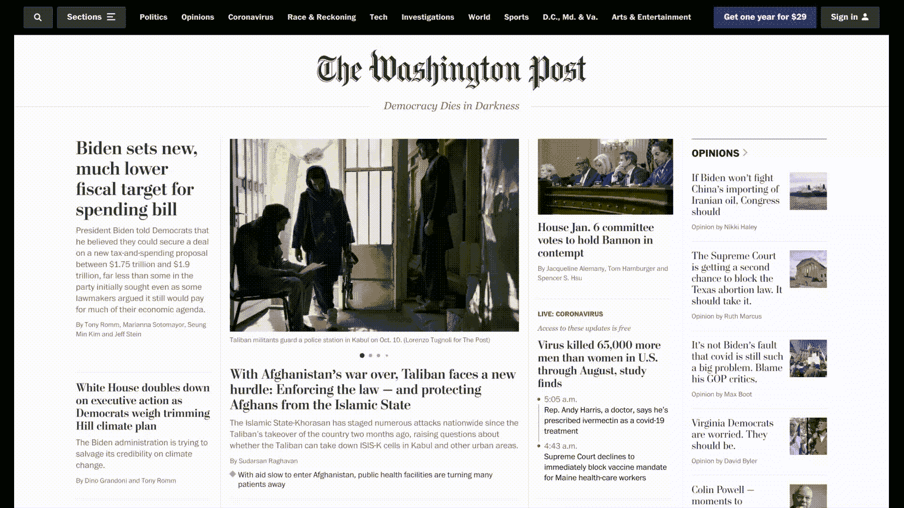
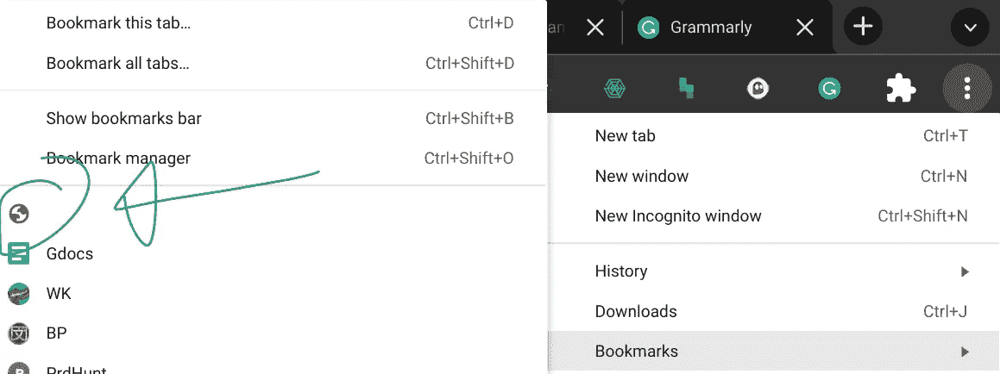

# 一键自由编辑任何网站

> 原文：<https://javascript.plainenglish.io/one-button-to-edit-any-site-freely-b436c61fccc8?source=collection_archive---------13----------------------->

伟大的编辑，超级容易使用(1 行 JavaScript！)



Even easier than getting your screen recorder to not take shots at the matrix!

这将是短暂而甜蜜的。对于这个伟大的编辑工具，你需要做的就是给书签添加一行程序！您的新工具将如下所示:



# 这是一句台词:

```
**javascript:document.body.contentEditable = ‘true’; document.designMode=’on’; void 0**
```

你所要做的就是突出显示它，并把它拖到你的书签栏。然后，当你点击你的小地球符号，完成！编辑掉

虽然它看起来不怎么样，但它可以让你点击后自由编辑任何页面。

当然，您实际上并没有编辑页面本身，而是编辑了呈现在屏幕上的内容。这对于截图和快速编辑非常有用！

(这得是我有史以来最短的教程了，无疑会长期保持这个称号)

关注我这里的更多无代码/低代码小工具和简单的技术文章:
[https://medium.com/@valeriasbangert](https://medium.com/@valeriasbangert)

*更多内容尽在*[***plain English . io***](http://plainenglish.io/)