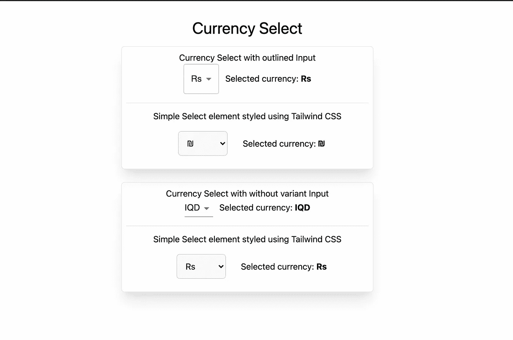

# 一个用于开发完整货币选择的 JSON 对象

> 原文：<https://javascript.plainenglish.io/one-json-object-for-developing-the-complete-currency-select-b6da93dacc4e?source=collection_archive---------5----------------------->

从单个 JSON 对象在 React 应用程序中创建货币选择下拉列表


[Currency select design creative](http://ihatereading.in/creativity)

# 在后台

我正在为产品 [**创建实时发票编辑器，见证发票**](http://witnessinvoice.com) **。**我们需要添加货币选择下拉菜单，让用户选择他们更喜欢用哪种货币进行交易。当时，我们在开发时遇到了一个问题，我们最终映射了世界上所有的货币来创建一个简单的货币下拉选择器。

抱歉，打断一下，但这是给那些还没有关注我的人和新读者的。停止在前端安装第三方库的重复过程，并从下面的链接下载预安装的库。

```
[https://ihatereading.in/repos](https://ihatereading.in/repos)
```

目前，我们只提供关于 Next.js 的存储库，但是在将来，我们也会覆盖 CRA 和 Gatsby 框架。

# 入门指南

这个想法是创建一个简单的下拉列表的货币及其相应的符号。这通过防止用户添加错误的货币符号而使一切对用户来说变得简单。

我们将使用 select HTML 元素，并通过映射来查看货币列表。

# 方法

*   我们将使用货币列表作为 JSON 对象。
*   在组件中导入货币 JSON 对象
*   映射每种货币以创建 select 元素的选项
*   一旦使用改变货币更新相应的用户界面

# JSON 对象

货币 JSON 对象可以在下面的链接中找到

```
[https://gist.github.com/Fluidbyte/2973986](https://gist.github.com/Fluidbyte/2973986)
```

从上面的链接下载 JSON 文件。这将是我们创建整个货币选择下拉列表的单一 JSON 对象。

# 编写代码

一旦下载了上面的 JSON 对象，我们只需要导入它并映射 JSON 对象的每一项来创建我们的下拉列表。

每个 JSON 对象都会喜欢—

```
"USD": {  
   "symbol": "$",  
   "name": "US Dollar",  
   "symbol_native": "$",  
   "decimal_digits": 2,  
   "rounding": 0,  
   "code": "USD",  
    "name_plural": "US dollars" 
}
```

我们将向用户显示代码，符号将是 select 元素选项的值。

我将使用 Tailwind CSS 和 Next JS 来创建我们的货币选择组件。

你可以从这里下载这个库`[**https://ihatereading.in/repos**](https://ihatereading.in/repos)`

我们将映射到 currencies JSON 对象的每一个对象，并简单地呈现菜单项，将**符号**作为值，将**代码**作为键。

```
<MenuItem 
  *value*={currencies[item].symbol}
> 
  {currencies[item].symbol}
</MenuItem>
```

为了映射货币对象，我们使用 Javascript `**Object.keys**`方法。

这就是我们整个选择元素的样子——

Select element for currencies

我正在使用材质界面，所以我使用了其他类型的选择元素，如概述，我的最终产品看起来像这样



Currency select screenshot of the localhost in the browser

**最终代码**

My Currency Select reusable component

# 结论

我们刚刚使用了 gist 中的一个 JSON 对象，并映射到货币上来创建货币下拉选择。这让一切变得如此简单。如果您不想在前端导入 JSON 对象，那么我们可以简单地将该文件上传到数据库中，并在前端创建一个端点来获取货币，这也是一种简单的方法。我将尝试介绍关于创建端点以创建货币下拉列表的文章。

```
Code - [https://github.com/shreyvijayvargiya/iHateReadingLogs/tree/main/TechLogs/CurrencySelect](https://github.com/shreyvijayvargiya/iHateReadingLogs/tree/main/TechLogs/CurrencySelect)Docs - [https://ihatereading.in/projects/search-currency?type=%22introduction](https://ihatereading.in/projects/search-currency?type=%22introduction)
```

直到下一次。祝大家愉快。

*更多内容尽在*[*plain English . io*](http://plainenglish.io/)