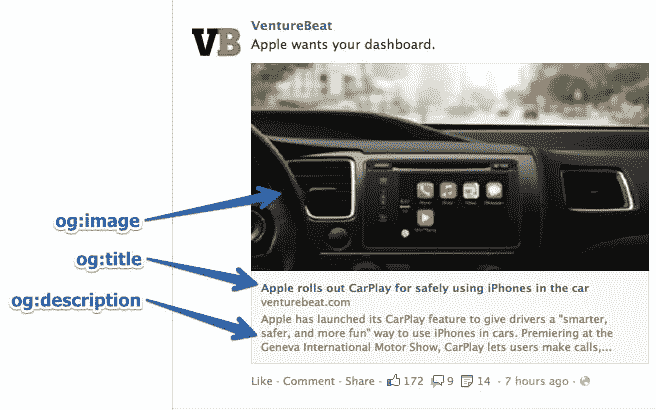

# 如何使用开放图协议

> 原文：<https://javascript.plainenglish.io/open-graph-protocol-ee155175329c?source=collection_archive---------16----------------------->



Open Graph 是一种互联网协议，最初由脸书在 2010 年创建，但现在由开放网络基金会持有。你可能会对自己说，什么是 Open Graph，为什么它是我作为一个 web 开发人员应该关心的事情？嗯，简短的回答是，它会给你的网站带来更多的流量。

几周前我第一次看到 Open Graph。我在社交媒体上发布了一个自己创建的网站的链接。一旦它发布，我注意到它没有显示任何缩略图或我的网站预览。我很困惑，因为我以前发布过链接，总是看到链接引用的网站的预览/缩略图。当你给某人发送链接时，我开始研究使用什么技术来呈现这些图像。在谷歌上搜索(类似于查找，但使用谷歌)后，我遇到了开放图协议。我看得越多，就越意识到这正是用来创建这些网站预览的东西。所以在我把这些 meta 标签添加到我的 HTML 之后，我就可以在社交媒体和短信上预览我的网站了！

我提到过在你的网站上使用开放图形元标签会增加你网站的流量。这是因为作为开发人员，您可以选择要在预览中显示的内容。这一点很重要，因为人们最终会根据预览来决定是否点击这个链接。显然这也取决于你发布链接的平台。该平台的开发人员可以选择他们想要使用的元标签，但是通过使用 Open Graph 元标签，您可以控制他们将显示的大部分数据。

所以让我们开始吧！将 meta 标签添加到您的站点非常简单。当你发送一个链接时，有 4 个必需的 meta 标签需要添加到你的 HTML 文档中以呈现预览。下面是一个例子，当你把它添加到你的页面时，所有需要的标签应该是什么样子。

```
<meta property="og:title" content="whatever is the title of site" />
<meta property="og:type" content="website" />
<meta property="og:image" content="https://www.imageToShow.com" />
<meta property="og:url" content="https://www.websiteLink.com" />
```

上面的代码片段通常会放在你的 index.html 文件中，它会放在标签中。根据属性名称的不同，每个属性的内容会有所不同，但这是您应该拥有的确切设置(除非您的类型属性不是“网站”，否则您可能需要额外的必需属性)。我将在下一节详细解释这些属性。

**og:title** —这是你希望作为链接标题出现的标题。
**og:type** —这是你对象的类型。你可以从这个[列表](https://ogp.me/#types)中选择多种类型。
**og:image** —这是您希望在预览中显示的图像。
**og:url** —这是指向您的对象的 url，将用作永久 ID。

## 结论

这只是真正使用开放图协议的开始步骤。遵循这几个步骤，你可以在社交媒体和短信平台上丰富地展示你的网页。

如果您有兴趣了解如何使用您网站上 Open Graph 的数据来创建其他网站的丰富预览，请稍后查看我的下一篇博客，我将讨论并带您了解这一点！

[**plain English . io**](https://plainenglish.io)