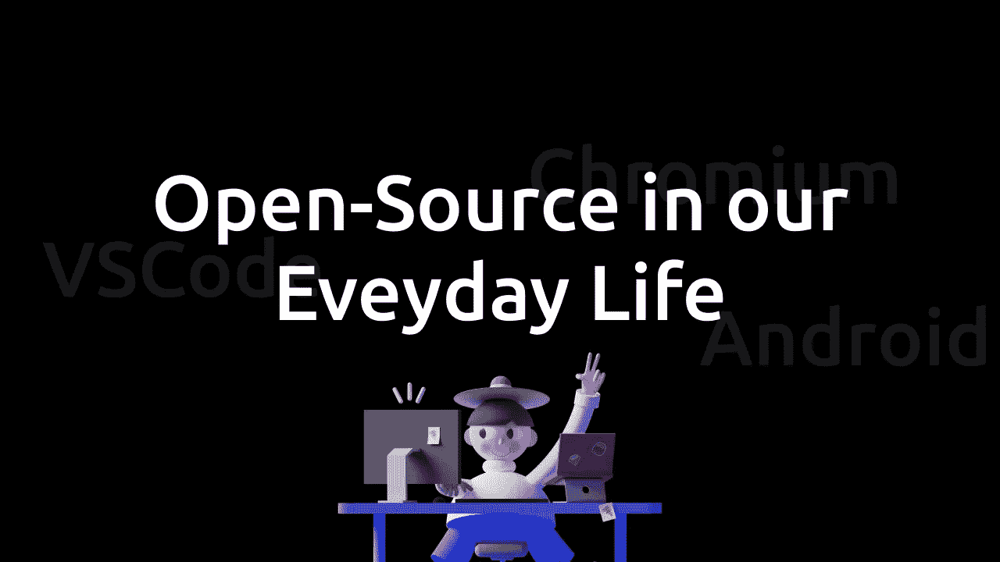

# 日常生活中的开源

> 原文：<https://javascript.plainenglish.io/open-source-in-everyday-life-b5371f743965?source=collection_archive---------12----------------------->

我们经常没有意识到，但是开源项目在我们的生活中扮演着巨大的角色。今天，在这篇文章中，我将谈论我们如何在日常生活中使用开源技术，以及如果它们不存在会发生什么😱。

# 一些例子

让我们从一些我们日常生活中使用的开源技术开始-

## 机器人

我们很多人都有运行安卓操作系统的手机。Android 本身是一个由谷歌维护的开源项目。android 的基础版本通常被称为 Android 开源项目(AOSP)。现在，我说的 android 基础版是什么意思？我们大多数人都没有在手机上运行纯 AOSP，因为公司在 AOSP 的基础上添加了他们的专有代码。事实上， [Google Play 服务](https://developers.google.com/android/guides/overview)是闭源的。你可以在没有 Google Play 服务的情况下使用 AOSP，但是你将会错过 Google 服务，如果你这样做，将会面临奇怪的问题。许多第三方应用程序也将难以运行，因为它们中的许多依赖于谷歌 API，如谷歌地图 API。

## 铬

大多数人使用一些基于 chromium 的浏览器，无论是谷歌 Chrome，微软 Edge，Vivaldi，Brave，甚至 Opera。Chromium 本身就是一个[开源项目](https://www.chromium.org/Home)。现在，公平地说，前面提到的浏览器都不是开源的(除了 Brave)。这样做通常是为了打包更多的专有特性。例如，谷歌 Chrome 附带了一套谷歌功能，比如跨不同设备同步。这些浏览器是一个 chromium fork，有更多的功能，不同的主题，与操作系统更好的集成，以及更多的优化。这很像 Android 的工作方式。

## Visual Studio 代码

Visual Studio Code 是一个非常流行的代码编辑器，并且是开源的。可以看看 GitHub 上的[源代码。有一个小警告，微软发布的 Visual Studio 代码版本有遥测功能，而开源版本没有。你可以下载](https://github.com/microsoft/vscode) [VSCodium](https://vscodium.com/) ，它有从 GitHub 上的源代码构建的二进制文件，但是你可能会遇到问题。

大多数应用程序依赖于一些开源项目，无论是像 [React](https://reactjs.org/) 这样的 web 框架还是其他一些包。其实所有的编程语言都是开源的(至少我没听说过有闭源的编程语言)。

# 开源的优势

## 伟大的社区

你将有一个围绕你的项目建立的伟大的社区，这个社区将会信任你的项目。很多人都是开源爱好者，会尽量使用开源软件。如果应用程序满足了这些人的需求，他们就会成为你的用户！！！

## 贡献者

当一个应用程序是开源的，开源贡献者就有机会为你的项目做贡献。任何贡献都是非常有价值的，因为它通常能解决问题。会有垃圾邮件，但这只是游戏的一部分。

## 学问

为开源做贡献不仅能给初学者，也能给高级开发人员提供工作和学习的机会。作为项目的开发者，你也会从发现你的项目有问题的开发者社区中学到很多。

## 修理

我们都会犯错，你的代码中会有漏洞或错误。其他贡献者不仅会让您了解问题，还会帮助您解决问题，甚至自己解决问题。

## 更好的理解

如果在开源项目中遇到问题，可以查看源代码，更好地理解问题的原因。这将有助于更快地解决 bug，使您作为开发人员和用户获得双赢。

## 投资组合

在你的投资组合中，为开源做贡献是非常重要的。这是一个很好的起点，以后会对你有所帮助。

# 如果开源不存在会发生什么

既然我们已经在日常生活中看到了开源的例子，也看到了它的优势，那么让我们来讨论一下如果一切都是专有的，会发生什么。

## 这对开发者没有好处

开发人员在开发应用程序时通常依赖编程语言、库和框架。如果这些不是开源的，开发人员会担心他们可能会发布带有追踪器的应用程序，而他们并不打算添加追踪器。这也意味着灵活性会降低。当某个东西是开源的时候，会有一个很棒的社区制作教程，了解一个框架是如何工作的，致力于使它变得更好，并为它制作插件。

## 对初学者来说不太好

初学者从对开源软件的贡献中学到了很多。如果这个机会从他们的学习道路上被夺走，他们会失去很多。从我个人的经历来说，我可以说，通过在 GitHub 上为别人的项目做贡献，我学到了很多。即使是看到和理解一个应用程序的源代码以及它是如何工作的，也会教会你很多。

## 修补匠不会高兴的

许多人不想让一家公司来决定什么对他们最有利。他们想尽可能地定制他们的东西，以适应他们的需求和喜好。这让人感觉更舒服，也给了人们更多的选择。

## 费用

随着事情变得封闭，公司会通过给产品定价来尽量利用它。由于许多东西是开源的，社区开发了许多可能更适合一个人的开源替代方案。开源项目不仅通常免费或便宜，而且在隐私方面也更好。

## 隐私

这就把我们带到了隐私处。众所周知，闭源应用程序有追踪器，这是对隐私的直接侵犯。开源应用程序通常没有这样的跟踪器。如果有人担心他们的隐私，他们甚至可以自己托管一个他们想要使用的应用程序。

除此之外，闭源应用程序会带走开源应用程序的优势(如上所述)。

# 结论

我希望这篇文章有助于理解开源在我们日常生活中的重要性。如果你有任何疑问，请在下面留下你的评论，也可以通过 Twitter 联系我。这个月我还会写很多关于开源的东西，所以请关注我的博客或者关注我，这样每当我发布新的帖子时，你都会得到通知。

*原载于*[*https://blog . anishde . dev*](https://blog.anishde.dev/open-source-in-everyday-life)*。*

*更多内容请看*[***plain English . io***](http://plainenglish.io/)