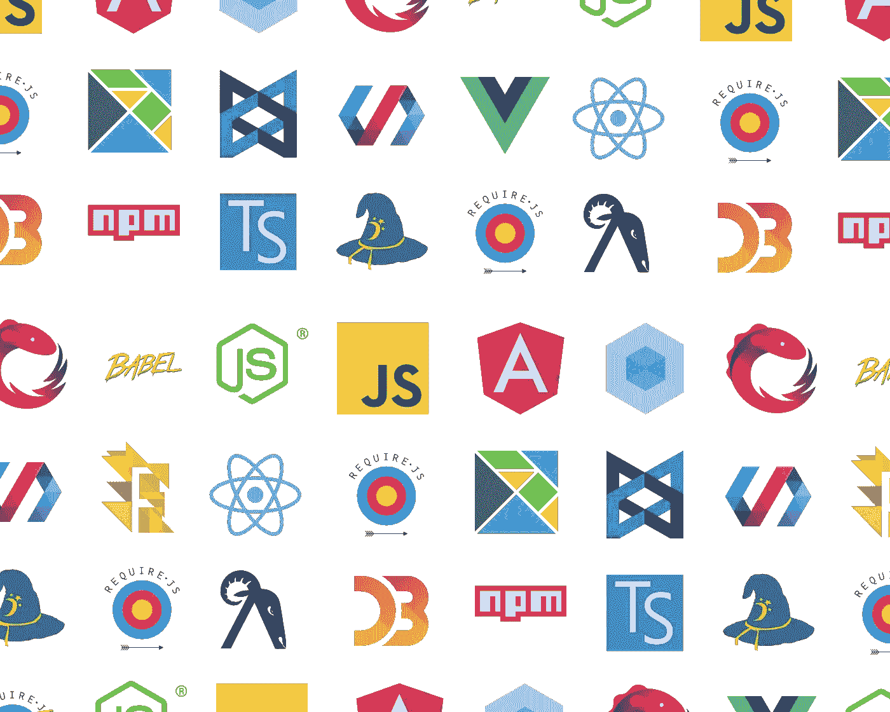

# 开源需要你

> 原文：<https://javascript.plainenglish.io/open-source-needs-you-56015c4a07ac?source=collection_archive---------1----------------------->

## 为什么你应该为开源做贡献，以及你如何从今天开始

Various JavaScript libraries that are all open sourced in at least some capacity.

# 您知道吗，您使用的几乎所有 JavaScript 工具都是开源的？

事实上，JavaScript 规范(也称为 ECMA 脚本)及其实现(例如 v8 引擎)也是开源的。

任何人(包括你)都可以访问你最喜欢的工具的源代码，查看它的历史——或者更确切地说，它的提交——看看它是如何发展的。你不仅可以看到代码的历史，还可以帮助塑造它的未来。

这意味着您可以通过修改代码、提出改进建议等方式参与开发，这是非常令人兴奋的，同时也可能有点令人生畏。

您可能想知道，对最著名的开源项目的贡献是否只保留给那些可能被认为是该领域的“专家”或“领导者”的人。虽然在某种程度上这可能是真的，但在开源领域，所有技能水平的人都有足够的空间来发挥有意义的作用。

就像生活中任何值得做的事情一样，让自己熟悉开源场景需要一些努力和时间，但是成为这个重要社区的一部分可能是你作为工程师经历的最有价值和最具变革性的经历。

下面你可以看到 JavaScript 开源项目的不同之处，以及如何开始成为一名贡献者的一些提示。

# 潜规则

从历史上看，现代 web 技术的发展没有一个单一的中央实体可以忽略整个 JavaScript 开发场景。所以你需要一些时间来理解所有不同的方面(目前我最喜欢的[资源](/ultimate-web-developer-roadmap-for-2021-6758edd0bd3f))。

它的去中心化性质允许单个项目通过被组织成更小的社区快速移动，例如 React、GraphQL、WebPack、Babel。

在每一个生态系统的背后，都有一群维护它的人，他们对接受项目贡献有自己的期望和原则。

其中一些非常清晰，通常可以在`CODE_OF_CONDUCT.md`和`CONTRIBUTING.md`等文件中找到。这些原则可能是诸如*、*或*、*之类的东西——所有与人共事的重要基础。

但有些是更微妙的、不言而喻的期望，例如*“你是否在提出拉动式请求(PR)之前制造了一个问题？”*

了解如何与新团队合作的唯一方法是观察和关注。这是一个好主意，跟随一些发展中的和封闭的 PRs 去感受你想要参与的特定项目的文化。

# 不同的成熟度—不同的速度

根据库的成熟程度和变化的影响程度，开源过程会有很大的不同。例如，自 2015 年以来，每年都会发布新的 ECMAscript 规范。每个提案在被委员会接受之前都要经过 4 个阶段的精心修改过程。

另一方面，有些库遵循“连续发布”的方法。如果一个变更是合理的，通过了测试，并且得到了维护人员的赞许，那么这个变更一旦到达主分支，就可以在新的版本中使用。

# 真正的开源

不同开源项目之间的另一个重要区别是项目是由开源社区管理还是作为更大的商业实体的一部分。

在这两种情况下，项目的代码都是公开的，但是在一个真正的开源环境中，所有的讨论、问题、发布协调、提议都发生在一个开放的平台上。

这对于一个人是否能在不被母公司雇佣的情况下对项目做出有成效的贡献有着巨大的影响。

例如， [v8](https://github.com/v8/v8) 是 Chromium(以及 Node.js)中使用的 JavaScript 引擎，由谷歌创建，由谷歌团队维护，并在 GitHub 上有一个 repo，但它是从谷歌资源托管镜像的。所以我认为，并不是所有围绕它的过程都对公众透明。

需要说明的是，v8 是一个了不起的项目，JavaScript 社区将永远感谢 Google 创建了一个可靠而快速的 JavaScript 引擎，尽管我认为成为这个项目的高效贡献者可能比成为更多开源优先的库要稍微困难一些。

# 从小处着手

你不必重构 React 来开始。贡献的方式有很多，从小处着手可能是最好的策略。一些项目为初学者友好的问题维护标签。向文档或自述文件投稿是另一种很好的参与方式。

对于任何大型项目，我最喜欢的一条建议是仔细检查未解决的问题，并修改与问题一起报告的代码示例。很多时候，人们提供了太多的代码，而不是重现问题的最小片段。获得最小化的工作示例对实际解决问题大有帮助，而且它本身也提供了价值。

总的来说，帮助整理 GitHub 问题(关闭已修复的问题，指出解决方法，如果已经报告了问题，杜平)对维护人员来说是一个巨大的帮助，也是参与社区的一个很好的方式。

# 我是你最大的粉丝

另一个要点是，社区的注意力分布不均匀。一些非常流行的框架吸引了开发者不成比例的贡献。

但是许多较小但仍然重要的图书馆得到的关注要少得多，可以成为参与的好地方。但是你如何找到这些开发者宝石呢？你能做的最好的事情就是花时间熟悉更广泛的 web 开发生态系统。看看像 React 和 Webpack 这样的超级明星库，看看它们的依赖项和插件——那里有很多机会。

# 社交化

当开发人员做一些很酷的事情时，他们希望其他人知道。或者当他们遇到困难时，他们向其他开发者寻求帮助。人类是群居动物。作为所有新技术的早期采用者，他们可以在各种社交平台上找到。

我不太想推荐任何特定的账户，但出于说明的目的，twitter 上的丹·阿布拉莫夫(T0)、Discord 上的反应相关服务器(T2)以及 Discord 上 Web-Guild 的 graph QL(T4)

所以去 Twitter、Discord、GitHub、StackOverflow、HackerNews 等网站上找到它们的自然栖息地。

# 未来是社区

令人难以置信的是，管理和发展开发人员社区成为了许多公司的主要关注点，而不是拥有一个流行的开源库的副作用。

在最近的历史中，我最喜欢的例子是 Apollo GraphQL React 客户端的兴起。

对我来说，Apollo 是一个有趣的例子，因为他们遵循后端世界的旧模型，但相对于拥有开源产品并在其上提供盈利咨询服务的 JavaScript 模型来说是新的。因此，他们实际上有一个开源产品，但仍然产生收入。

我不会撒谎，我确实有过这样的想法，“你怎么能从像 JavaScript 开源社区信任这样纯粹和无辜的事情中获利呢？”

但我确实认为阿波罗做得很好，这是一个双赢的局面，企业和社区似乎都从中受益。因此，我很高兴看到他们的成功和许多其他人效仿这一模式。

就特性、缓存管理和其他一些通常困扰开发者选择新框架的技术问题而言，Apollo 一开始是一个客观上不如 Relay 的替代方案。

但是 Apollo 专注于使他们的库更容易使用，并且他们在与开发人员的交流方面做得更好。他们的文档写得很好，他们对 GitHub 问题/PRs 有合理的响应时间，并且有多个渠道让用户联系和寻求帮助。因此，它在采用方面变得更大，然后他们只是从 Relay 复制功能，这被证明是一个更好的技术解决方案。

# 结论

如果有任何收获的话——开源需要你！开源软件的唯一目的和目标是将代码构建成一个社区。

当一群人能够聚在一起解决问题时，最美好的事情就会发生。当我们一起工作时，我们比单独行动更有可能找到解决方案。协作有助于推动技术和整个社区向前发展。

成为这一运动的一部分是开源软件的本质为我们提供的一个难以置信的机会，这是一个参与其中的最佳时机。