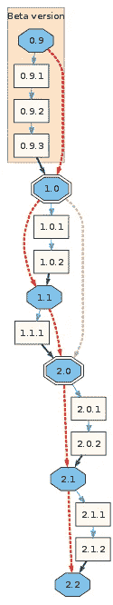
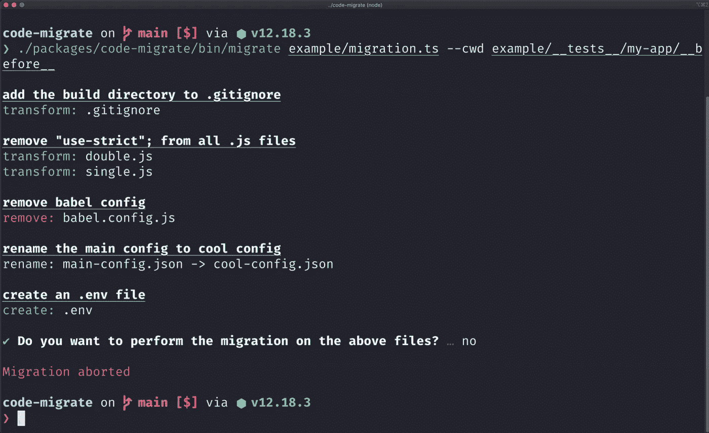

# 开源系列:版本管理

> 原文：<https://javascript.plainenglish.io/open-source-series-version-management-dc91424aa63d?source=collection_archive---------7----------------------->

## 关于突破性变化和支持

在我的 [*个人博客*](https://www.justjeb.com/blog) *上可以免费获得这篇文章和其他文章。请务必注册以获得最新最棒的！*

嘿，这几个月过得很艰难，但是我们又在这里谈论开源了。在这一章(也是本系列的总结部分)我们将讨论版本管理。您将了解版本符号、重大变更、后向端口等等。

在阅读本章之前，我强烈建议您熟悉我们之前讨论过的主题，尤其是最后一个，关于自动化:

# 目录

*   [简介](https://medium.com/@justjeb/owning-an-open-source-part-1-b63abc60236)
*   [开始一个项目](https://medium.com/@justjeb/owning-an-open-source-project-part-2-2b55810aeb8)
*   [文档](https://medium.com/@justjeb/open-source-series-documentation-96ed1420ce81)
*   [宣传](https://medium.com/@justjeb/open-source-series-publicity-8b3be7d65c17)
*   [问题和 PRs](https://medium.com/@justjeb/open-source-series-issues-and-prs-8cb1de880fd4)
*   [自动化](https://medium.com/@justjeb/open-source-series-automation-fe826e365b54)
*   **版本管理**

## 软件版本控制

让我们看看维基百科对软件版本有什么说法。

> **软件升级版本化**是给[计算机软件](https://en.wikipedia.org/wiki/Computer_software)的唯一状态分配唯一*版本名*或唯一*版本号*的过程。
> 
> 现代计算机软件通常使用两种不同的软件版本控制方案来跟踪，一种是可能在一天内增加多次的[内部版本号](https://en.wikipedia.org/wiki/Software_versioning#Internal_version_numbers)，如修订控制号；另一种是通常很少改变的*发布版本*，如语义版本控制、或[项目代码名称](https://en.wikipedia.org/wiki/Code_name#Project_code_name)。

事实上，有多种方法可以唯一地识别您的软件产品版本。

最广为人知的方法是给它一个名字。

地球上的绝大多数人，甚至那些间接与技术相关的人，可能都听说过 Android 冰淇淋三明治和棉花糖或 Mac OS Leopard，它的冷冻表亲雪豹和大苏尔。

程序员们可能听说过月食及其天体月球、火星和光子。

所有这些都是软件产品的主要版本。

虽然名字对营销很有帮助，但有时也会让人困惑。
事实上，谷歌已经不再在安卓版本名称中使用糖果，因为他们:

> 多年来，我从用户那里听到的反馈是，这些名称并不总是能被全球社区中的每个人直观地理解

这是理所当然的，但也许我们还没有进化到足以从动物物种中推断出版本号，尽管雪豹比美洲豹酷多了。

天体和糖果是更容易理解的概念，但前提是你要按字母顺序命名它们(就像 Android 和 Eclipse 那样)。但有一点是肯定的——没有比数字更好的确定接班人的方法了。

因此，如果你把你的软件产品的第一个版本命名为“产品 1 ”,第二个版本命名为“产品 2 ”,很直观的说第二个版本是更新的，不是吗？

然而，与不公开 API 的独立软件产品不同，被其他软件消费的软件(像大多数 OSS 产品一样)需要更好的版本控制，而不仅仅是一系列数字。

例如，如果我们使用一个简单的数字序列来进行版本控制，用户如何区分一个 bug 修复和一个破坏现有 API 的变更？

答案是…

## 语义版本控制

语义版本(也称为 SemVer)是一种广泛采用的版本方案，它使用以下格式的 3 位数序列:`MAJOR.MINOR.PATCH`。
规则很简单——给定一个版本号`MAJOR.MINOR.PATCH`，递增:

*   `MAJOR`版本时做出不兼容的 API 修改
*   `MINOR`以向后兼容的方式添加功能时的版本
*   `PATCH`版本的时候你做了向后兼容的 bug 修正。

预发布和构建元数据的附加标签可作为`MAJOR.MINOR.PATCH`格式的扩展。

它提供了一种清晰而简洁的方式来将软件产品中的变更传达给用户。

但最重要的是，它被各种包管理器和构建工具广泛采用(像 [NPM](https://docs.npmjs.com/about-semantic-versioning#using-semantic-versioning-to-specify-update-types-your-package-can-accept) 和 [Maven](https://docs.oracle.com/middleware/1212/core/MAVEN/maven_version.htm#MAVEN8903) ，它允许用户依赖于特定的**版本范围**而不是特定的版本。

例如，指定版本范围`^2.2.1`而不是明确的版本`2.2.1`将让用户接受任何向后兼容的错误修复或在版本`2.2.1`之上发布的新功能。

也就是说，构建工具和包管理器依赖于用户和包所有者之间的契约——一个由 SemVer 定义的契约。
这意味着责任是*你的*——你是定义什么是重大改变，什么是微小改变的人。
您可能会意外地发布一个重大变更作为 bug 修复(补丁版本),它*将*破坏依赖于某个范围的构建。

破坏构建是一件可怕的事情，所以我建议您使用带有预定义消息格式的`semantic-release`和提交格式强制工具。
我们[确实在](https://medium.com/@justjeb/open-source-series-automation-fe826e365b54/#d927)[自动化](https://medium.com/@justjeb/open-source-series-automation-fe826e365b54)章节中涉及到了，所以如果你还没看，现在是时候了。

你可以在 semver.org 的官方网站[找到更多关于语义版本的信息。](https://semver.org/)

现在，我们已经了解了*识别*突破性变化，让我们谈谈*介绍*它们。

## 重大变化

突破性变更是对您的公共 API 的变更，以不兼容的方式删除、重命名或更改您与用户的合同。

理想情况下，您应该在代码中保持向后兼容性，并且永远不会引入任何突破性的变化。但是当你醒来时，你会发现一个残酷的现实。

软件在发展，你的代码也在发展。用户的需求在变化，你的 API 也在变化。你作为开发者成长，你的产品也是如此。因此，尤其是作为一个不拿工资的开源开发者，你不能允许自己维护项目中所有的遗留代码。有时候，你需要摆脱它。

问题是怎么做？

一如既往，这是一种权衡。您会更好地了解这种或那种变化对用户的影响。
你不需要*有*来不惜一切代价保持向后兼容，也不需要在每一个老版本中实现所有的新功能。但是这肯定是你应该考虑的事情。

如果迁移成本对用户来说相对较低，那么做一个突破性的改变是很好的，在旧版本中不支持这个特性是很合理的。然而，如果迁移成本很高，并且绝大多数用户无法承担这一工作，那么您可能应该考虑首先使这一更改向后兼容，并发布反对警告。

弃用警告通常与新 API 一起发布，而旧 API 仍然受支持。这样，用户就有时间进行迁移，一旦迁移完成，在下一个主要版本中，就可以安全地删除弃用警告和旧的 API。

在任何情况下，无论何时引入突破性的变更，都要确保您有一份迁移指南，其中有一步一步的迁移说明。

此外，出于礼貌，如果你能给用户时间来准备一个突破性的改变，尤其是在没有宽限期的情况下(新旧 API 都支持)。解释突破性变化、其背后的原因和预期时间框架的一点提示。
它可以是一条推文、一篇博客文章，甚至是带有弃用警告的产品的一个新的次要版本。

请记住，突破性的变化本质上是一种负面体验，而突然的*突破性的变化是一种极其*负面的体验。

## 自动迁移

我们可以将重大变更分为两类——非确定性和确定性。
不确定性是指您无法预测迁移工作的结果，例如当您完全删除某个 API 的某个部分时。
在这种情况下，由用户决定是用其他第三方库替换它，自己实现它，还是将其贬值。

确定性变更是那些给定代码`X`和用户输入`I`允许你将其转换成代码`Y`的变更。例如，更改函数名或导入语句。

如果你引入了决定性的突破性改变，你可以编写一个自动化程序来改变用户的代码库并调整它以适应新的 API。有了这种自动化，您将不必关心向后兼容性和详细的迁移指南。你为用户提供了一种升级他们代码的方法，而他们一点也不费力，这在软件更新中是至关重要的。

然而，这里也有一个内在的权衡。编写代码需要时间，就像编写迁移指南一样。当然，编写将复杂代码流迁移到新 API 的代码比编写用新函数名替换函数名的代码要花费更多的时间。
有时候你就是承受不起这种努力。

如果你决定去做，有一些工具可以帮助你实现你想要的。

最广为人知和语言不可知的是脸书的[代码模式](https://github.com/facebook/codemod)。

> codemod 是一个工具/库，帮助您进行大规模的代码库重构，这些重构可以部分自动化，但仍然需要人工监督和偶尔的干预。

还有使用 [AST](https://en.wikipedia.org/wiki/Abstract_syntax_tree) 的更复杂的工具，可以用于更复杂的任务，而不仅仅是寻找&替换。
例如，另一个名为 [JSCodeShift](https://github.com/facebook/jscodeshift) 的脸书库(特定于 JS/TS)。
或[code-migrate](https://github.com/ranyitz/code-migrate)——一个工具(也是 JS/TS 专用的),它允许您相对容易地编写一个引导式迁移，并为用户提供基于 CLI 的漂亮提示。

一些大型 OSS 项目甚至有他们自己的解决方案。
这种解决方案的一个例子是[Angular schematics](https://angular.io/guide/schematics)——一个支持复杂逻辑的基于模板的代码生成器。

自动代码迁移可以作为一个单独的包发布(像`my-cool-oss-migrate-v4-v5`)，并在迁移指南中作为一个步骤提及。或者，迁移可以是包含重大变更的主版本的一部分，并在用户代码库中安装该版本时执行。选择权在你。

## 反向移植

另一种常见的做法是将重要的更改移植到以前的版本。例如，在一个主要版本(有突破性的改变)之后发现了一个严重的错误，但是它也适用于以前的版本。

在这种情况下，您不能期望您的用户因为一个 bug 而执行冗长乏味的迁移。另一方面，签出旧版本，在其上实现修复，并将其作为旧版本的小改动发布可能会很麻烦。

> *解决方案:每个主要版本都有一个受保护的分支。*

每当你计划发布一个主版本时，你从主分支中创建一个名为`c.x.x`的分支，其中`c`是当前的主版本号。
你把所有这样的树枝都保护起来(就像主枝一样)，这样你就不会不小心折断它们。然后，任何时候你必须从一个新的主要版本中支持一个特性或者一个 bug 修复，你要么在这个分支上重新实现它，要么(如果可能的话)从主分支中挑选提交。

此外，一个值得一提的策略是为下一个主要版本*建立一个单独的分支(而不是只为以前的主要版本建立分支)。
这通常与大规模项目(如 Webpack 或 Babel)相关，这些项目在每个新的主要版本中都有很多变化。为即将到来的主要版本建立一个单独的分支允许对其进行处理并发布以供测试，同时仍然在主分支中保留最相关的版本(并对其进行处理)。一旦发布了新的主要版本，它的分支就变成了主分支，并且为下一个主要版本创建了一个新的分支。*

# 最后的想法

这一章是关于版本管理的，但也是本系列的总结部分。所以我想和你分享一件事，当你拥有一个开源项目时，你应该永远记住。

## **倾听你的用户**

这听起来可能违背直觉，但这是事实——你不是唯一定义路线图的人，用户也定义它。事实上，大部分是用户定义的。如果你拥有一个开源项目，那么你这样做是为了帮助别人，而不是你自己。

拥有多个反馈渠道。有些用户只有一个简短的问题，你可以在一秒钟内给出答案。有一些潜在的贡献者想讨论路线图，但不想公开讨论。给他们一个联系你的方式。提供懈怠或不和谐的链接，分享你的 Twitter 账户等。渠道越多越好。

如果你喜欢我的文章，学到了新的或有见地的东西，或者如果你不想错过我的下一篇文章，请确保你在 Twitter 或 Medium 上关注我。干杯！