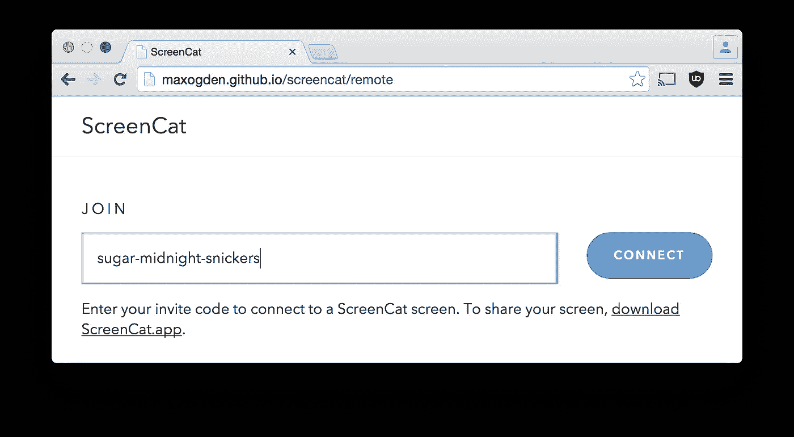

# 开源工具让开发人员的生活更轻松

> 原文：<https://javascript.plainenglish.io/open-source-tools-to-make-the-lives-of-developers-easier-eef0f029d5b7?source=collection_archive---------11----------------------->

## 我将展示一些有趣的工具，它们会助你一臂之力。

Source: Screencat

开发人员应该随时了解哪些流行的工具使他们的工作变得更容易，甚至可能改进工作。

开源工具的优势在于它们可以免费使用，并在相同的许可下进一步开发。他们不断受到社区的监督，并在短周期内进一步发展。因此，检查是否有一个新的开源工具适用于这个或那个领域总是值得的。

## 1. [Screencat](http://maxogden.github.io/screencat/remote)

Screencat 是一个屏幕共享工具。这允许在所有重要的平台上快速方便地共享屏幕，例如在团队中召开会议或一起开发应用程序。这个工具特别有趣，因为它是免费开源的，可以在 Windows、Linux 和 macOS 中使用。

## 2. [Node.js — JavaScript 运行时](https://nodejs.org/en/)

Node.js 是一个 JavaScript 运行时环境。这是基于 Chrome 的 VB JavaScript 引擎。使用运行时，可以编写事件驱动的服务器端脚本和程序，并且可以非常灵活地使用。Node.js 被很多大公司使用，包括 IBM、微软、LinkedIn、网飞、PayPal 等。

Node.js 和 JS-Foundation 联合起来形成了一个共同的基础，OpenJS Foundation。今后还将开展联合项目。开发人员自己认为 Node.js 生态系统是最大的开源库生态系统。例如，使用 Node.js，应用程序也可以在最流行的 web 服务器上提供，包括 Apache 或 IIS。例如，运行时也可以与其他环境一起用于 Visual Studio 2019 社区版。

## 3.[Apache Cordova——智能手机和其他平台的应用](https://cordova.apache.org/)

Apache Cordova 使开发人员能够向移动设备交付应用程序。iOS、Android、Windows 和其他平台的应用程序可以提供代码库。该平台支持 HTML、CSS 和 JavaScript 等 web 开发技术。Apache Cordova CLI 基于 Node.Js。当开发人员为智能手机和 PC 开发应用程序时，Cordova 特别有用，即除了 Android 和 iOS 之外还使用 Windows。

## 4.[GNU Emacs——不仅仅是开发者的灵活编辑器](https://www.gnu.org/software/emacs/)

在 GNU 中，Emacs 是一个非常可扩展、可定制的文本编辑器。GNU Emacs 基于 Emacs Lisp 的解释器。这是 Lisp 编程语言的一个修改，带有支持文本编辑的扩展。编辑器还可以用颜色显示语法。

## 5. [Bootstrap —前端 web 框架](https://getbootstrap.com/docs/3.4/)

Bootstrap 是 Twitter 开发的一个免费、开源的前端 web 框架，用于构建和定制网站和 web 应用程序。该框架包括基于 HTML 和 CSS 的设计模板。这包括版式、表单、按钮、导航和界面组件。还可以集成 JavaScript 扩展——插件基于 jQuery 的引导程序。

## 6.[曼塔—计费申请](https://getmanta.app/)

Manta 是一个为开发者简化发票的应用程序。它带有可定制的模板，使发送和管理客户发票变得容易。当然，该工具的目标是开发人员和自由职业者，以及寻找免费计费软件的小企业。

## 7.[测试 Apache JMeter web 应用](https://jmeter.apache.org/)

Apache JMeter 帮助测试 web 应用程序。在这种情况下，该工具还可以在负载下测试服务器、对象和网络。Apache JMeter 特别适合测试系统负载，因为该工具可以使用静态和动态资源。例如，使用 JMeter，可以测试 FTP、REST、Web、LDAP 和其他服务器服务。该工具不是简单的浏览器，因为它不呈现 HTML 页面；更确切地说，JMeter 是在协议层面上进行测试的。

## 8. [KompoZer —所见即所得 HTML 编辑器](https://sourceforge.net/projects/kompozer/)

KompoZer 是一个所见即所得的 HTML 编辑器，适用于 Windows、Linux 和 macOS。该项目目前不再更新，但任何寻找 HTML 编辑器的人都可以查看当前可用的功能并测试该工具。重点是 HTML 页面的易用性和编辑，即使对于经验不足的用户/开发人员也是如此。

## 9.[铅笔-原型制作执行](https://pencil.evolus.vn/)

铅笔是一种工具，可用于执行应用程序的表面原型。该解决方案适用于 Windows、Linux 和 Mac。该工具可用于创建 GUI 原型。它集成了表单集合并支持图表的绘制。页面和剪贴画之间的链接也是可用的。

## 10.[测试 Cypress Web 应用程序](https://www.cypress.io/)

Cypress 是一个 web 测试工具，可以测试 web 应用程序，比如浏览器。该工具还有助于创建详细的测试。Cypress 可用于 Windows、Linux 和 macOS。

这些工具的使用通常并不复杂，并且通过您自己的测试，您可以很快看到相应的工具将来是否应该在您自己的计算机或网络中更频繁地使用。

*更内容于* [*通俗易懂*](http://plainenglish.io/)