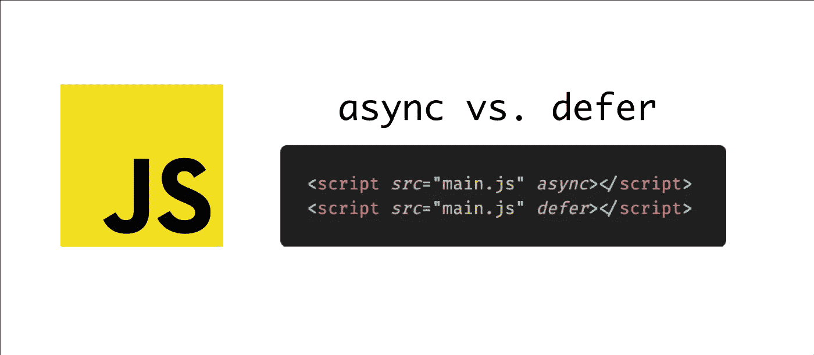
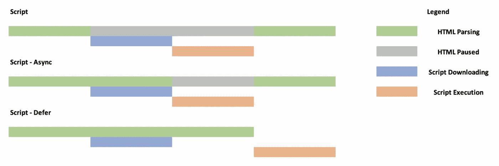

# 使用“defer”和“async”属性优化 JavaScript 加载

> 原文：<https://javascript.plainenglish.io/optimize-javascript-loading-with-defer-and-async-attributes-9069514bf952?source=collection_archive---------8----------------------->

我们都习惯于在 HTML 中使用 script 标签来加载外部 JavaScript 文件。传统上，在 HTML 加载后加载脚本的唯一解决方法是将脚本标签移向正文的末尾。但是自那以后，JavaScript 已经走过了漫长的道路。ES2015 的规范中添加了 defer 和 async 等属性，允许对 JavaScript 的加载方式进行更细粒度的控制。

让我们看看什么是 defer 和 async 属性，以及它们如何帮助优化 JavaScript 加载。

# 为什么我们需要这些标签？

如果一个脚本标签被放在一个 HTML 页面的头中，那么 HTML 的解析会被暂停，直到脚本被获取并执行。只有在脚本执行完成后，HTML 解析才会恢复。这可能会导致糟糕的用户体验。延迟和异步都有助于避免这种情况。它们允许在解析 HTML 时并行下载脚本标签。

# 延迟和异步

这两个属性都是布尔属性，语法相似:

值得注意的是，只有当脚本位于 HTML 的 head 部分时，标签才有用。如果脚本放在 body 标签中，它们就没有用了。

如果两者都指定了，则异步优先。

# 异步ˌ非同步(asynchronous)

当浏览器遇到带有 async 属性的脚本标记时，它会并行下载脚本，同时继续解析 HTML。脚本完全下载后，浏览器暂停 HTML 解析并执行脚本文件。这有助于改善页面的整体加载时间。

# 推迟

defer 标记类似于 async 标记，它允许并行下载 JavaScript 文件，而无需暂停 HTML 解析。它更进一步，在执行脚本之前等待 HTML 解析完成。

# 我应该使用哪一个？

下图有助于直观显示不同的流程:

大多数情况下，defer 是首选选项，因为它最大程度地减少了页面加载时间。它在 DOM 准备好之前不会执行，并且遵循脚本顺序。因此，您也可以对脚本的执行进行更多的控制。

Async 听起来更性感，但它只在脚本不需要 DOM 或任何其他脚本时有用。

这就是关于脚本标签上的 defer 和 async 属性以及如何使用它们来优化页面加载时间所需要知道的全部内容。如果你有任何问题，欢迎在下面留言。

*原载于 2021 年 8 月 15 日*[*【https://www.wisdomgeek.com】*](https://www.wisdomgeek.com/development/web-development/javascript/optimizing-javascript-loading-with-defer-and-async-attributes/)*。*

*更多内容请看*[***plain English . io***](http://plainenglish.io/)*。报名参加我们的* [***免费周报***](http://newsletter.plainenglish.io/) *。在我们的* [***社区***](https://discord.gg/GtDtUAvyhW) *获得独家获得写作机会和建议。*