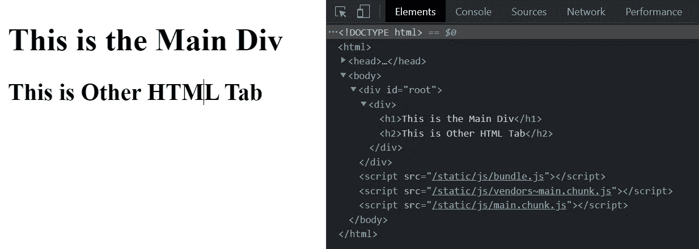
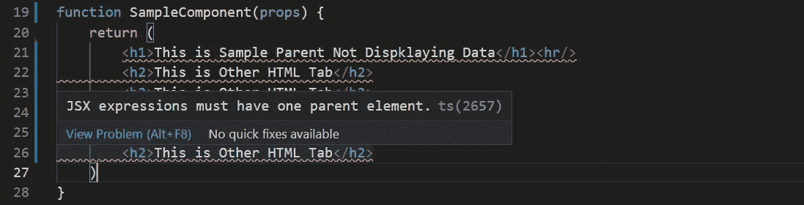

# 使用片段优化 React 应用程序

> 原文：<https://javascript.plainenglish.io/optimizing-react-application-with-fragments-ce6db9b3a9a5?source=collection_archive---------14----------------------->

## 使用 React 片段来避免额外的标签和优化

Working with React Fragments

TechnoFunnel 展示了另一篇使用片段增强 React 应用程序的文章。我们习惯于在 JSX 中放置额外的“div”标签和其他类似的标签，以便在每个组件的顶部有一个封闭容器。

[https://gist.github.com/Mayankgupta688/198dd3ad201397d5d116ee0514a906fb](https://gist.github.com/Mayankgupta688/198dd3ad201397d5d116ee0514a906fb)

在上面指定的组件中，我们需要一个额外的标记来为要呈现的组件提供一个公共父级。这个额外的“div”除了充当组件的父标签之外，没有任何其他用途。添加它只是因为组件不能有两个父标记。

Working with Fragments in React

在上面的代码中，我们可以看到呈现的组件，在 HTML 结构中，我们可以看到在 id 为“root”的 div 元素中有一个额外的“div”。添加的“div”是 HTML 解析器的额外开销，当我们有多个像这样的额外标签时，它增加了 HTML 的复杂性。一种方法是删除额外添加的“div”标签，让我们看看如果删除组件中的父元素会发生什么。

下面给出的是一个在父级有多个标签但没有公共父标签的组件。在这种情况下，我们会遇到一个错误。

Error without common Parent Element on the top

正如我们在上面的例子中看到的。在用户创建新组件的情况下，每个组件应该有一个父标签。两个标签不能位于父级，所以我们需要在顶层有一个公共标签。为了迎合这个需求，我们经常在组件的顶部添加一个额外的标签。我们放置的额外标签通常是一个类似“div”或“section”的容器。

# 使用片段降低 HTML 的复杂性

我们可以使用“片段”来降低代码的复杂性。我们希望简化在创建组件时创建的 HTML 代码。使用片段减少了包含的额外标签的数量，只是为了满足 React 组件中有一个公共父元素的要求。

该片段没有向组件引入任何额外的标签，但是它仍然向两个相邻的标签提供父标签，从而满足了在组件的顶层具有单个父标签的条件。

在上面的代码中，没有额外的标签来包含标签，因此节省了渲染器在页面上渲染额外元素的工作量。

一旦我们升级到 Fragment，我们在 HTML 中将会有一个相对扁平的结构，这将会更有性能。下面是我们开始使用片段时的 HTML 代码。

在上面的代码中，没有额外的 div，因此简化了 HTML

**有关更多优化技术，请参考以下内容:**

 [## 22 反应性能优化技术

### React 编程的最佳优化技术。

medium.com](https://medium.com/technofunnel/https-medium-com-mayank-gupta-6-88-21-performance-optimizations-techniques-for-react-d15fa52c2349) 

*更多内容尽在*[***plain English . io***](http://plainenglish.io/)