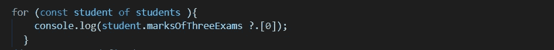

# JavaScript (ES2020/ES11)中可选的链接和无效合并运算符

> 原文：<https://javascript.plainenglish.io/optional-chaining-and-nullish-coalescing-operators-in-javascript-es2020-es11-587863891710?source=collection_archive---------11----------------------->

在 ES2015/ES6 之后，JavaScript 每年都在发布新功能，让我们作为开发人员的生活更加轻松。去年，在 ES2020/ES11 中，他们发布了一些功能，如 ***BigInt，import.meta，import()，**string . prototype . matchall，Promise.allSettled，globalThis，for-in mechanics，可选链接*和 *Nullish 合并运算符。***

在本文中，我将通过例子详细解释**可选链接**和**无效合并**操作符。

# W **帽子是可选的链接运算符？**

****可选链接*** *运算符(* `***?.***` *)取值时不检查父对象是否存在。它不会返回错误，而是返回空值或未定义的"**

*我们用一个例子来理解。这里，我们有两个对象 studentA 和 studentB，它们被包装在学生数组中。*

**

*在上面两个物体上，我们可以注意到物体的形状是不一样的。在依赖外部 API 的真实项目中，这种情况随时都会发生。我们无法控制通过 API 得到的响应的形状。在这里，我创建了 for 循环和控制台，以获得一个枯燥的主题名称。但是这里我们得到了下面的错误，我们的代码被破坏了。*

*`*Uncaught TypeError: Cannot read property ‘subjectName’ of undefined*`*

*那么，这里发生了什么，如果我们检查学生 a*

*`*student.boaringSubject => undefined*`*

*现在有了这个未定义的值，我们试图得到`boaringSubject`，*

*`*undefined.subjectName => error*`*

*这破坏了代码，因为 undefined 不是一个对象。*

*为了解决这个错误，在 **ES2020/ES11** 之前，我们使用了**短路**。*

**

****输出:****

*`*undefined*`*

*`*History*`*

*那么，如果短路的第一部分有真值，那么它进入下一部分，如果第一部分是假值(未定义，null，0，NaN，false)，那么它不会运行第二部分。*

*但是我们可以在上面的代码中看到，在短路的情况下，我们的项目中可能会出现更大嵌套的问题。如果我们必须从一个大对象中获取属性，我们的代码会变得很长。所以，这就是为什么**可选链接**进入画面。*

**

****输出:****

*`*undefined*`*

*`*History*`*

*这里，什么**可选链接(？。)**符呢？它检查了**父对象**的属性，如果它是一个**真值**那么它将给出下一个属性值，否则它将给出**未定义的**或**空值**而不是一个**错误。***

# ***带函数调用的可选链接运算符***

*首先，我们在我们的对象 studentA 中添加一个名为 speak()的方法，然后在 for 循环中调用它。*

**

****输出*** *:**

*`*Maths is my favourite subject*`*

*`*Uncaught TypeError: student.speak is not a function*`*

*我们的代码中断是因为在第二个对象 studentB 中没有 speak 方法。那么，在 **ES2020/ES11 之前我们是如何解决这类错误的呢？**用短路来解决吧。*

**

****输出:****

*`*Maths is my favourite subject*`*

*在这里，这一次我们没有遇到类型错误，也没有任何问题。现在，让我们使用**可选链接**操作符。*

**

****输出:****

*`*Maths is my favourite subject*`*

*因此，通过这种方式，我们可以用这个操作符编写非常简洁的代码，而不是进行嵌套链接。*

# ***与数组的可选链接***

*让我们在 object studentB 中添加一个数组，并尝试从数组中读取值。*

**

*在这里，我们将得到下面的错误。*

*`*Uncaught TypeError: Cannot read property ‘0’ of undefined*`*

*因为 studentA 没有标记，所以它破坏了我们的代码。为了解决这个问题，我们使用短路。*

**

***输出:***

*`*undefined*`*

*`*65*`*

*根据上面的例子，我们在嵌套链接方面也有同样的问题。让我们尝试使用**可选链接操作符。***

**

***输出:***

*`*undefined*`*

*`*65*`*

*因此，基本上，可选的链接操作符是嵌套链接的另一种解决方案，我们可以在其中编写简洁的代码。*

# ***什么是无效合并？***

*****无效合并运算符(***`***??***`***)****是一种逻辑运算符，当其左侧操作数为****null****或* ***未定义*** *时，返回其左侧操作数***

**我们用一个例子来理解。**

****

**这里我们有 student 对象，我们将控制每个键值，并理解 Nullish 合并操作符的重要性。**

**`console.log(student.name || ‘Does not have name’)`**

****输出:****

**`*Alex*`**

**这也是一个短路或操作符，所以如果一个对象有问题，它会给出错误消息“没有名字”。**

**`**console.log(student.height || ‘Did not tell us height’)**`**

*****输出:*****

**`*Did not tell us height*`**

**因为 null 是一个 falsy 值，它不会计算 **student.height** 并且会抛出一个错误消息。**

**`console.log(student.marks || ‘still in checking’)`**

*****输出:*****

**`*still in checking*`**

**所以，这里 0 是错误值，这就是为什么它显示错误信息。但是我们需要 0，因为 0 被认为是一个标记。为了解决这个问题，我们使用了**Nullish**聚结运算符(？？)；**

****console.log(student.marks？？还在检查’)****

****输出:输出:****

**`*0*`**

**？？运算符检查左侧，如果未定义或为空，将计算第二部分，否则不计算。**

**`console.log(student.hasEnrolledForNextClass || ‘Depend on test result’)`**

*****输出:*****

**`*Depend on test result*`**

**`console.log(student.hasEnrolledForNextClass ?? ‘Depend on test result’)`**

*****输出:*****

**`*false*`**

**所以，当我们想要区分虚假值时，这是非常有用的。只有当左边有未定义的值和空值时，它才会给出右边。左侧的任何其他值将给出我们在右侧定义的信息。**

# ****结论****

**我希望你已经发现这是有用的，也许今天学到了一些新的东西。可选的链接操作符和 Nullish 合并操作符在代码简单性和逻辑方面带来了很多好处。今天，我们开发人员使用这些操作符来避免嵌套链接，并使我们的代码简单、易读和易维护。**

***更多内容尽在*[***plain English . io***](https://plainenglish.io/)**