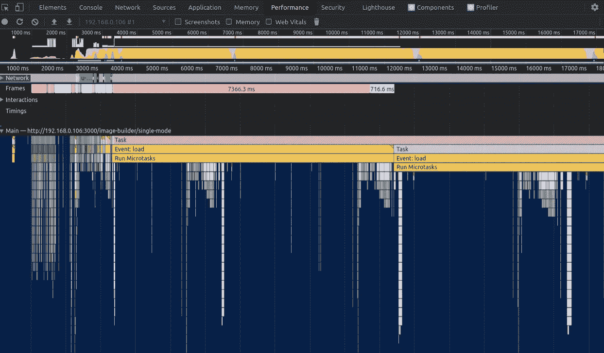
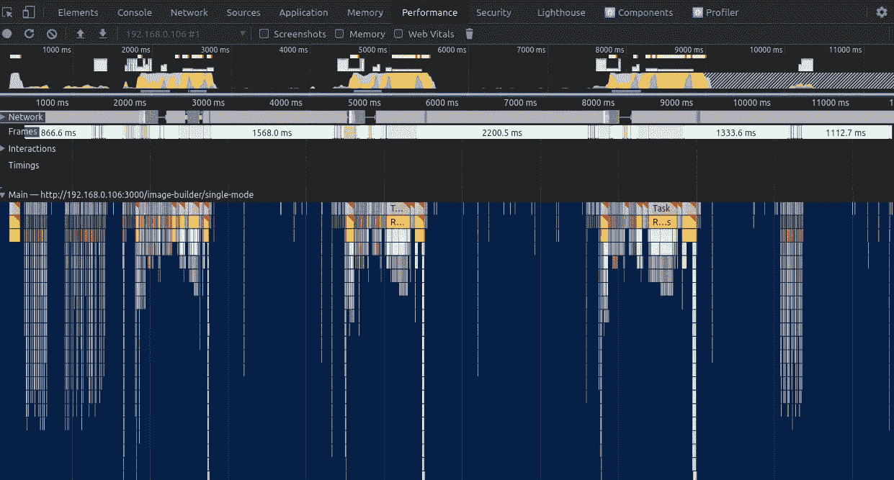
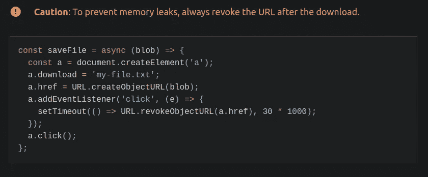

# 概述:Javascript 内存泄漏和主线程瓶颈

> 原文：<https://javascript.plainenglish.io/overview-javascript-memory-leaks-and-main-thread-bottleneck-560ba8289dd5?source=collection_archive---------11----------------------->

在您作为 JavaScript 开发人员的职业生涯中，至少会遇到一次内存泄漏问题(通常是在生产中)，并且您会惊讶地发现这种事情的存在(并且您必须处理它)。Lol。让你过渡到高级开发人员的时刻？

最近，在开发 [ezCreatives](https://www.ezcreatives.in/) 的时候，我碰到了一个这样的问题。

Before: Notice how the main thread is always blocked. Tasks are getting sub-listed. (App gonna crash soon)

After: Notice the main thread is freed as soon as the task gets completed (though still room for improvement)

实际上，我并不打算在这里解释任何特定的问题，而是会为您指出理解、调试和解决此类问题所需的所有重要链接和资源。(*有一天我可能会写一篇缩小范围的文章*)

My problem somewhat looked like this. If you’re assigning a URL to any object like <a> or  tag using javascript, then make sure to revoke it after the use, else it causes a memory leak (URL gets attached to the scope of the whole document and won’t be garbage collected unless the document is destroyed)

**你需要知道的解决内存泄漏和 CPU 瓶颈问题的工具(所有这些都可以在浏览器的开发者工具中找到):**

1.  [性能](https://www.debugbear.com/blog/devtools-performance) [章节](https://developer.chrome.com/docs/devtools/evaluate-performance/)
2.  [内存](https://developer.chrome.com/docs/devtools/memory-problems/memory-101/) [部分](https://developer.chrome.com/docs/devtools/memory-problems/heap-snapshots/)
3.  [灯塔审计](https://developers.google.com/web/tools/lighthouse)

**最常见的内存泄漏类型:**

1.  意外的全局变量
2.  未经检查的计时器或回调
3.  分离的 DOM 元素
4.  关闭

你可以在这里阅读这些常见的内存泄漏问题，这里有全面的解释。

**主线程(CPU)瓶颈解决方案**

1.  拆分[长任务](https://web.dev/long-tasks-devtools/#what-are-long-tasks)(你的以及第三方脚本)
2.  在正确的时间和正确的地点运行代码块
3.  使用 [web workers](https://web.dev/off-main-thread/) 来释放你的主线程(终极)

**必备知识:**

1.  浏览器中[渲染器进程如何工作](https://developers.google.com/web/updates/2018/09/inside-browser-part3)
2.  Javascript [事件循环](https://www.youtube.com/watch?v=8aGhZQkoFbQ)和[承诺](https://javascript.info/promise-basics)
3.  Javascript [垃圾收集](https://javascript.info/garbage-collection)
4.  [开发者工具](https://developer.chrome.com/docs/devtools/)

## 结论

JavaScript 很牛逼。明智地使用它的力量。总有一天会写出更好的结论。

感谢阅读。

*更多内容请看*[***plain English . io***](http://plainenglish.io/)