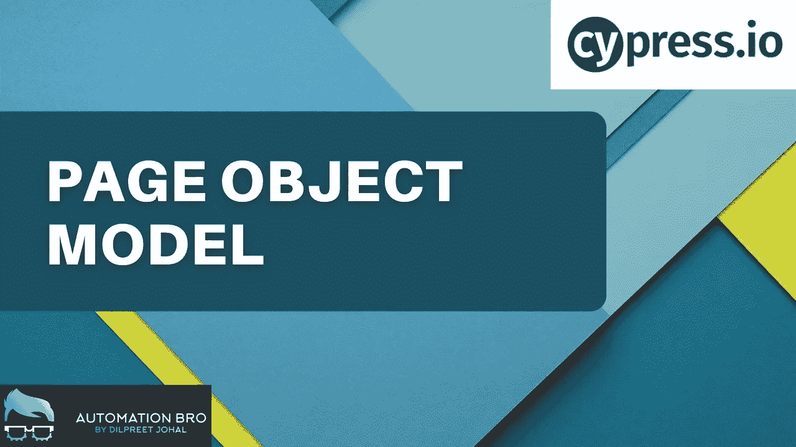
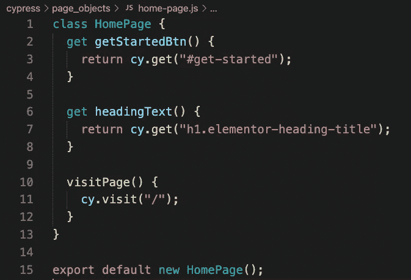

# Cypress 中的页面对象模型

> 原文：<https://javascript.plainenglish.io/page-object-model-in-cypress-90503e6f8708?source=collection_archive---------13----------------------->

Page Object Model in Cypress

在本教程中，我们将介绍如何在 Cypress 中建立一个页面对象模型。我们还将解释为什么 Cypress 团队建议不要使用页面对象模型。

# 什么是页面对象模型(POM)

POM 是一种流行的设计模式，有助于减少代码重复和改进测试维护。您可以通过将与页面相关的元素存储在一个单独的文件中来实现这一点，该文件由您的测试调用。

# 为什么不按柏树用聚甲醛？

在 Cypress 团队早在 2019 年发表的一篇[文章](https://www.cypress.io/blog/2019/01/03/stop-using-page-objects-and-start-using-app-actions/)中，他们指出，与其使用 POM，不如使用 App Actions。

**什么是 App 动作？**
App Actions 让你通过使用`window.Cypress`对象，直接通过应用程序的内部逻辑来调度动作，而不是通过 UI 进行交互。通过这种方式，你可以将你的应用程序设置在一个特定的状态，而不是通过用户界面进入那个状态，从而节省更多的时间。

**例如:**如果您需要一个用户在登录后需要做一些事情，使用应用程序操作将您的应用程序设置为登录状态。传统上，您将使用 UI 首先登录，然后执行您的测试。

# 我的看法

我个人觉得你可以两者都用，使用页面对象来存储页面相关的细节，还可以访问应用程序代码来加速你的测试(如果这是你的选择的话)。如果你可以访问你的代码库，并且在预生产模式(开发/质量保证/阶段)下测试应用程序，Cypress 的效果最好。例如，在我的[测试应用](https://practice.automationbro.com/)中，它是一个 WordPress 应用，我没有访问应用代码的权限，所以我不能使用应用动作，但我仍然可以继续使用 POM。

# 如何在 Cypress 设置 POM？

在 Cypress 中设置 POM 非常简单，您只需要设置一个包含 web 元素和页面方法的类。让我们来看一个例子

Page Class in Cypress

在上面的截图中，我创建了一个带有 getter 函数的`HomePage`类，这些函数使用`Cy.get()`调用 web 元素。此外，它还有一个指向网站基本 URL 的 page 方法。

**在测试中调用 Page 类**
现在，要访问与页面相关的元素和方法，您可以简单地将其导入到您的测试文件中并调用相关的方法。

`HomePage.visitPage()`
`HomePage.getStartedBtn.click()`

# 结论

设置 POM 是测试自动化行业中常见的设计模式，所以只要你正确地实现它，我个人看不出不使用 POM 有什么害处。同时，我同意 Cypress 团队关于应用程序操作的观点，因为这可以显著提高你的测试速度和稳定性。

## 查看下面的视频，了解更多关于如何在 Cypress 中设置 POM 的信息

[https://youtu.be/uPoyTy11lPE](https://youtu.be/uPoyTy11lPE)

感谢阅读！

*更多内容看*[***plain English . io***](http://plainenglish.io/)