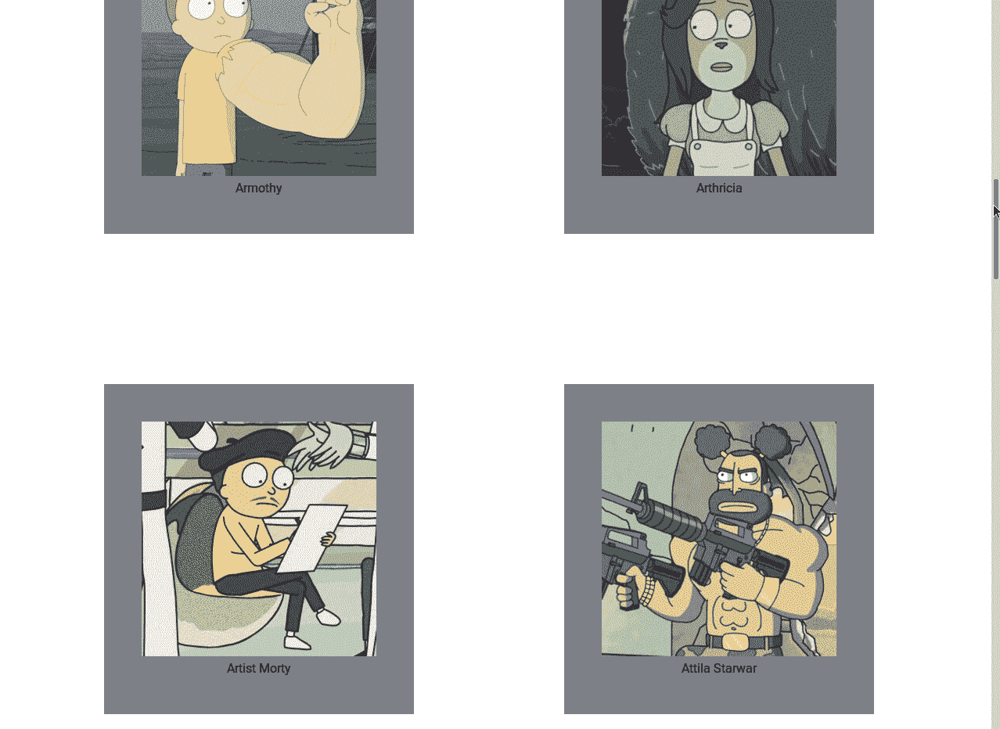

# 使用 Rick 和 Morty API 进行分页

> 原文：<https://javascript.plainenglish.io/pagination-with-the-rick-and-morty-api-1e136be0f225?source=collection_archive---------1----------------------->


Photo by [BENCE BOROS](https://unsplash.com/@benceboros?utm_source=medium&utm_medium=referral) on [Unsplash](https://unsplash.com?utm_source=medium&utm_medium=referral)

如今的大多数网站都无法一次展示用户需要看到的所有数据。最好不要显示所有数据，因为这有助于更好的用户体验，也使网站更容易导航。

为了显示更多的数据，可以实现一个称为分页的特性。我决定尝试分页，并使用 Rick 和 Morty API 实现它。我选择这个 API 是因为在我看来，它更容易实现分页。我将展示我自己的分页方法。

我打算用最少的钱开始我的项目。我将只保留应用程序和索引 CSS 文件和应用程序和索引组件。我将使用钩子，所以我将从 React 导入 useState 和 useEffect 钩子。首先，我将声明应用程序组件中需要的所有状态变量。

```
const [loading, setLoading] = useState(true)const [characters, setCharacters] = useState([])const [currentPageUrl, setCurrentPageUrl] = useState("https://rickandmortyapi.com/api/character")const [nextPageUrl, setNextPageUrl] = useState()const [prevPageUrl, setPrevPageUrl] = useState()const [pages, setPages] = useState()
```

现在，我将使用 Effect 钩子从 API 获取数据。首先，我将 loading 的值设置为 true，以确保首先显示加载屏幕。数据到达后，该值可以设置为 false。该效果将在每次当前页面 URL 更改时运行。这就是它的样子。

```
useEffect(() => { const url = currentPageUrl setLoading(true) const fetchData = async () => { const res = await fetch(url); const data = await res.json(); setCharacters(data.results) setLoading(false); setNextPageUrl(data.info.next); setPrevPageUrl(data.info.prev); setPages(data.info.pages) } fetchData();},[currentPageUrl])
```

现在，我将创建一些功能，这些功能将被分配给页面导航按钮。这些功能将改变当前页面。我将把我们获取的字符映射到一个名为 charList 的变量，该变量将保存一个组件列表。

```
function nextPage() {setCurrentPageUrl(nextPageUrl)}function prevPage() {setCurrentPageUrl(prevPageUrl)}function goToPage(num) {setCurrentPageUrl(`https://rickandmortyapi.com/api/character?page=${num}`)}if (loading) return "Loading..."const charList = characters.map(char => <Character key={Math.floor(Math.random() * 10000)} name={char.name} img={char.image} />)
```

这就是角色组件的样子。

```
import React from 'react'const Character = ({ name, img }) => { return ( <div className="character-card">  <div>{name}</div> </div>)}export default Character
```

我们把角色的名字和形象作为道具传递下去。现在我们需要为分页特性创建按钮。我将在它自己的部分做这件事。我们需要将 nextPage、prevPage 和 goToPage 函数作为道具传递给这个组件，同时传递页数。

```
import React from 'react'const Pagination = ({ nextPage, prevPage, goToPage, pages }) => { let pageButtons = [] for (let i = 1; i <= pages; i++) { pageButtons.push(<button key={i} onClick={() => goToPage(i)}>{i}</button>)} return ( <div> {prevPage && (<button onClick={prevPage}>Previous</button>)} {pageButtons} {nextPage && (<button onClick={nextPage}>Next</button>)} </div> )}export default Pagination
```

在这里，我创建了一个赋有空数组的变量。然后，我遍历所有的页面，并为每个页面创建一个按钮。

这将创建浏览所有页面所需的所有按钮。在 return 语句中,“上一步”和“下一步”按钮是根据它们的值是否为 null 有条件地呈现的。现在，我们只需要将这个组件添加到我们的 App 组件中。我将在页面的底部和顶部显示分页。它看起来会像这样。

```
return ( <div className="App"> <Pagination nextPage={nextPageUrl ? nextPage : null} prevPage={prevPageUrl ? prevPage : null} goToPage={goToPage} pages={pages} /> <div className="char-cards"> {charList} </div> <Pagination nextPage={nextPageUrl ? nextPage : null} prevPage={prevPageUrl ? prevPage : null} goToPage={goToPage} pages={pages} /></div>);
```

这就是我们使用这个 API 获得一些页面所需要的全部内容。如果您正在使用的 API 已经显示了可用的总页数，那么这是实现页面的一个非常简单的方法。这是最终的结果。



我在尝试这个过程中获得了很多乐趣。希望我的做法对一些人有帮助。编码快乐！

*更多内容尽在*[*plain English . io*](http://plainenglish.io/)