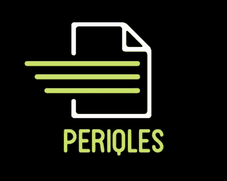
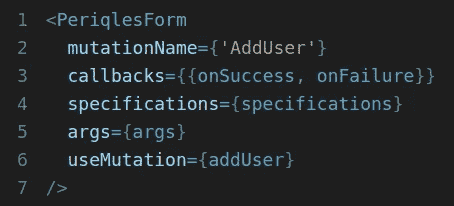
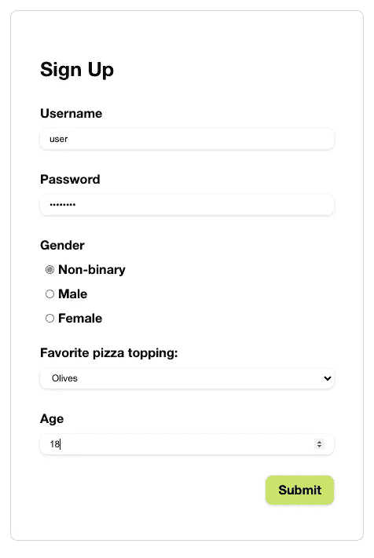

# GraphQL 的无痛表单

> 原文：<https://javascript.plainenglish.io/painless-forms-for-graphql-ffb1c3cc2fce?source=collection_archive---------8----------------------->

“If I have to write ONE MORE FORM…!!!” (Photo by [JESHOOTS.COM](https://unsplash.com/@jeshoots?utm_source=medium&utm_medium=referral) on [Unsplash](https://unsplash.com?utm_source=medium&utm_medium=referral))

## **问题**

为 web 应用程序编写表单是一项非常常见的任务，既重复又无聊。我们大多数人宁愿把宝贵的时间花在应用程序的业务逻辑上。虽然一些现有的工具有助于最小化编写表单所花费的时间和精力，但是如果表单可以自己编写，那不是很好吗？

## **解决方案**

periqles to the rescue!

periqles 是一个为 Apollo & Relay 设计的轻量级组件库。它会检查项目的 GraphQL 模式，根据给定的变异智能地直觉生成表单所需的输入标签种类，然后为表单上的每个字段生成 React 组件。

periqles 允许根据您的喜好进行或多或少的定制。它负责自己的状态管理和 UI——为希望对表单的外观或行为进行更多控制的开发人员内置了覆盖开关。(点击这里查看我们的[演示](https://periqles.herokuapp.com/))

## **工作原理**

假设您需要创建一个用户注册表单。一旦安装了 periqles，你所要做的就是将它导入到你的应用程序中，并在你的代码中添加<periqlesform>标签，传入一些道具来告诉 periqles 要寻找什么变异以及如何提交它。</periqlesform>

<PeriqlesForm/> tag in action. Only mutationName & useMutation are required for Apollo projects

在这种情况下，您可以告诉它，您的突变的名称是 AddUser。然后 periqles 检查您的模式，寻找变异的输入类型定义。接下来，它根据输入字段的类型和名称确定为每个输入字段生成的最佳表单元素。例如，AddUser 变异可能有一个类型为 string 的密码输入字段。periqles 不仅仅创建一个普通的文本输入标签，它还会创建一个密码输入标签，这样您就可以利用内置的验证了。

或者，如果您的 AddUser 变异有一个名为 favoritePizzaTopping 的“Enum”类型输入字段，periqles 将默认使用一个填充了 enumValues 的下拉列表作为选项。但也许您希望 favoritePizzaTopping 是一组单选按钮。通过在 periqles 的 props 中指定“radio”元素，可以很容易地做到这一点。此外，外形元素具有干净、现代的风格，当然可以轻松调整以适应您的品牌。

最后，当用户点击提交按钮时，periqles 的事件处理程序检查所有非空字段是否都已填写，如果没有，则提供一个警告，指明缺少的字段。否则，它会用用户输入的值触发变异。

Voila! A periqles-generated form

## **其他 GraphQL 表单库呢？**

GraphQL 已经有了一些非常有用的表单构建工具——其中一些给了我们灵感，比如 [Formik](https://formik.org/) 、 [Frontier Forms](https://frontier-forms.dev/) 和 [Relay Forms](https://github.com/morrys/relay-forms) 。但是 periqles 与众不同的地方在于:

*   它兼容中继和阿波罗客户端。
*   它通过在模式中查找特定的字段名和类型来实现基本的验证，不需要额外的输入。
*   它用很少的输入就完成了表单创建的所有繁重工作。例如，如果您的项目是用 Apollo 构建的，那么您可以用一个变异名和一个 useMutation 钩子创建一个完整的表单。
*   这是完全不需要干预的，但是您仍然可以控制。

*periqles 作为* [*npm 包*](https://www.npmjs.com/package/periqles) *提供。查看我们的* [*网站*](https://periqles.herokuapp.com/)*&*[*回购*](https://github.com/oslabs-beta/periqles) *了解更多信息。*

**#Teamperiqles:**

卡梅隆·鲍姆加特纳—[Github](https://github.com/cameronbaumgartner)/[LinkedIn](https://www.linkedin.com/in/cameronbaumgartner/)

伊恩·加勒特—[Github](https://github.com/eeeeean)/[LinkedIn](https://www.linkedin.com/in/ian-garrett-02680b23/)

约瑟夫·托莱达诺—[Github](https://github.com/JosephToledano)/[LinkedIn](https://www.linkedin.com/in/joetoledano/)

凯莉·波特—[Github](https://github.com/kporter101)/[LinkedIn](https://www.linkedin.com/in/kporter101)