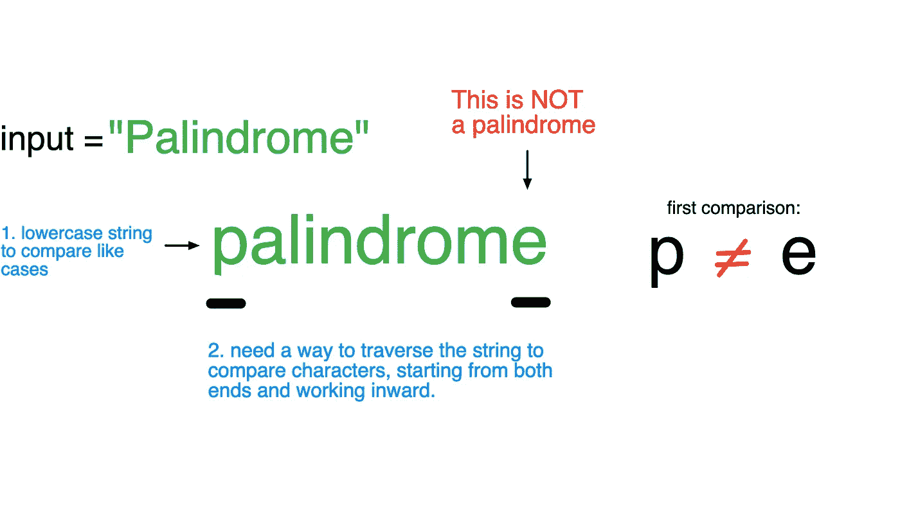
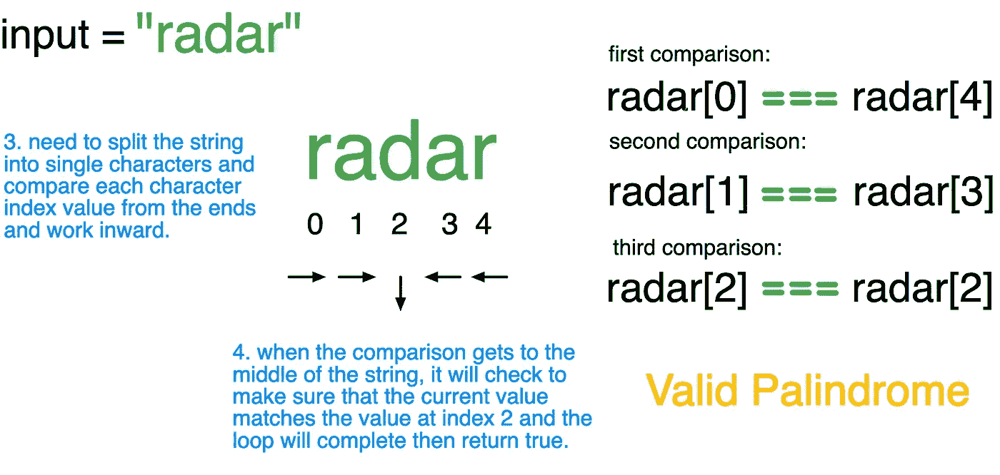
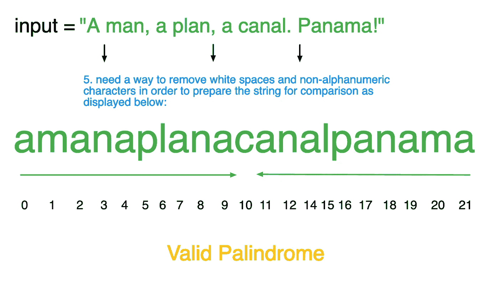
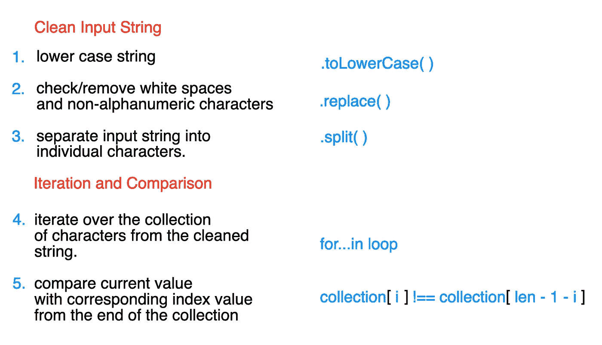
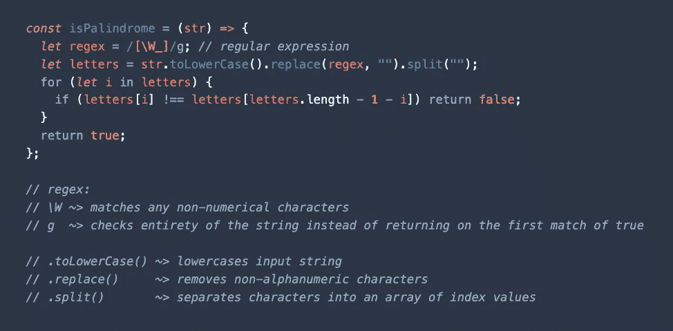
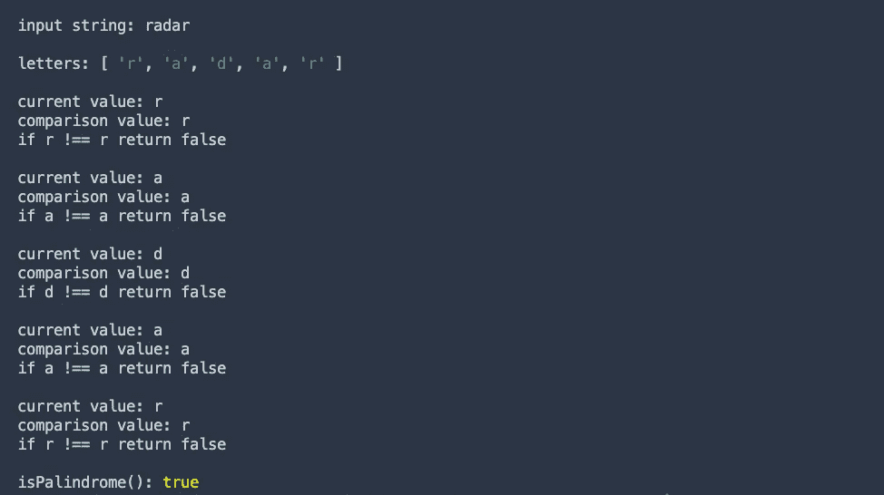
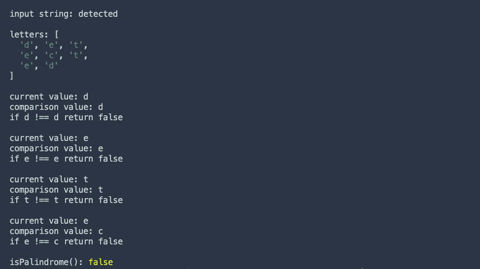
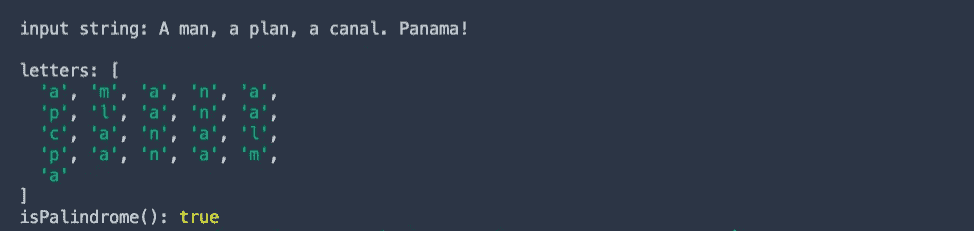

# JavaScript 算法:回文检查器

> 原文：<https://javascript.plainenglish.io/palindrome-checker-2fe9d7ab7e6c?source=collection_archive---------4----------------------->

回文是一个从左到右读起来和反过来一样的单词或句子。一个流行的例子是“一个人，一个计划，一条运河，巴拿马”。如果你把这个短语倒着写，拼写会和你写的一样。在这篇博客中，我将讲述用 JavaScript 代码检查一个字符串是否是回文的过程。

如何着手创建解决方案可以通过多种方式实现。出于两个主要原因，我将在我的方法中使用 for 循环。首先，解决方案不会改变输入值。其次，通过在第一次比较返回 false 时终止，它在性能上是高效的。

除了语法，我将在提供我的解决方案中通过伪代码解释这个过程。我将描述问题是什么，以及成功输出所需的工具。我提供我的观点是为了帮助其他人适应用代码解决问题，并且相信你会发现这样做很有价值。

# 问的是什么？

> 如果给定的输入是有效的回文，返回 true，否则返回 false。

这听起来直截了当，但这是一个模糊的说法。我们一会儿会谈到原因。让我们先看一个不是回文的输入字符串的例子，并做些笔记。

蓝色文本注释了构建解决方案所需的内容。为了进行清晰的比较，将输入字符串转换成一种大小写是很重要的。此外，我需要选择一种方法来遍历每个字符进行比较。上面的例子在第一次迭代— `**p !== e**` —时失败，并将返回 false。

现在让我们来看一个有效回文的例子。

我们现在检查一个有效的输入字符串`radar`。跟着蓝色文本，我将把字符串分割成孤立的字符，并在集合中循环，同时比较当前迭代的两个外部索引。从前面开始的指针将向上递增，而在末尾的指针将向下递减(向内移动)，直到中间的字符与其自身进行比较并返回 true。

在我们开始编写代码之前，我想在下面的例子中介绍一些边缘情况。

以上说明了问题所提问题的模糊性。它没有指定输入字符串是准备好进行比较还是解决方案需要处理它。出于学习的考虑，我选择在内部清理输入字符串进行比较。在这样做的时候，我必须考虑这样的情况，即传入的参数可以是一个短语，由空格和/或非字母数字字符分隔— `!@^_-$&*()[],...`。

# 我们需要什么来解决这个问题？

让我们将我们的笔记汇编成一个强大的指令列表，在编写解决方案时遵循。

## 清除输入字符串

第一步是清理传入函数的参数。为了处理这个操作，我将把三个内置的 JavaScript 方法链接到输入字符串上，并将结果设置为一个变量。我理解——对某些人来说——可能会同时发生很多事情。如果是这种情况，我恳请您将这三个过程隔离开来，并更好地理解每个过程对输入字符串的影响。

我将首先调用输入字符串上的`.toLowerCase()`,它将把它转换成大小写相似的字符。然后，它的输出将调用 JavaScript `.replace()`方法来切换出任何非字母数字字符。`.replace()`方法需要传递两个参数:1 .要从字符串中移除的内容和 2。用什么替换移除的值。删除非数字字符和空格后，调用`.split()`方法，将每个字符复制到自己的索引中，并返回一个数组。该数组是我们将在下一步中遍历的集合。

> 传递给`.replace()`方法的第一个参数将是一个[正则表达式](https://developer.mozilla.org/en-US/docs/Web/JavaScript/Guide/Regular_Expressions)，它是一种用于匹配字符串中字符组合的模式。我将用它来匹配输入字符串中的任何非数字内容，并用要删除的右引号替换它。

## 迭代和比较

在 JavaScript 中有很多方法可以迭代数组。我偏爱标准的`for`循环，但是为了更好的可读性，我重构了语法以使用`for...in`循环。这两种选择都将在不改变输入字符串的情况下迭代集合。我的解决方案是 ES6 版本的 JavaScript 语法。

循环内部有一个条件，该条件将当前值与其在集合末尾的对应索引进行比较。在任何给定点，如果当前值与其比较值不匹配，循环将终止并返回 false。否则，它将继续比较值，直到循环到达中间，此时，它将在最后一次比较后返回 true。

# 解决办法

## 输出:真

## 输出:假

## 输入:“一个人，一个计划，一条运河。巴拿马！”

# 结论

这是我第一次开始编程时得到的第一批算法之一。这是让你熟悉用代码编写解决方案的很好的入门。FizzBuzz 也不错。这个回文挑战在 [freeCodeCamp](https://www.freecodecamp.org/) 的算法和数据结构课程中特别指定，所以如果你是编码新手或有经验并想深入研究，我建议你去看看。

对于更有经验的程序员，一定要回来看看我关于解决 [Leetcode](https://leetcode.com/) 挑战的系列文章。我写了一些非常好的代码，我很乐意分享，并帮助分解组成更复杂解决方案的过程。

感谢您花时间阅读本文。我希望它对你的搜索有帮助。如果是这样，请告诉我！给它点个赞，写个评论或者随时在 Twitter 上联系我@ [**ch2isk4kos**](https://twitter.com/ch2isk4kos) **。我喜欢谈论代码和与社区互动。**

*更多内容请看*[***plain English . io***](http://plainenglish.io)