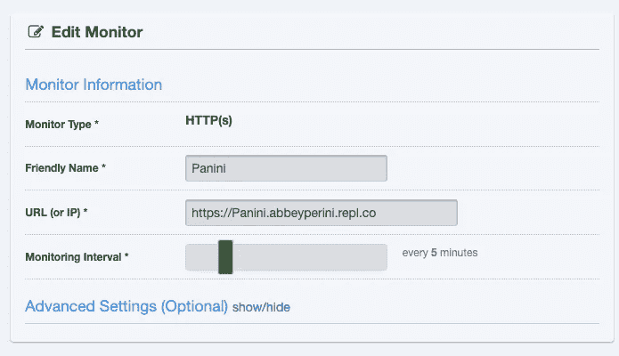

# 用 Node.js、Express、厄里斯、Replit 和 UptimeRobot 创建一个 Discord Bot

> 原文：<https://javascript.plainenglish.io/panini-bot-f7025d014aab?source=collection_archive---------5----------------------->

## 今天就把帕尼尼机器人加入你的不和谐服务器吧！


当我看到[Emi](https://twitter.com/TheCodePixi/status/1387755394722844672?s=20)关于开源 [Pandera 包](https://www.npmjs.com/package/pandera)的推文时，我就知道这一定是一个不和谐机器人。所以，下面是我如何建立一个机器人，它将插入一个新词，以“p”开头，用于不和谐消息中“疫情”的每个实例。

我已经用 [replit](https://replit.com/) 和 [UptimeRobot](https://uptimerobot.com/) 制作了一个 Python Discord bot，它可以给我的朋友发送狗的照片，所以我启动了一个 [Node.js](https://nodejs.org/en/) repl，并将其命名为 Panini。你可以在这里查看[现场代码](https://replit.com/@abbeyperini/Panini)。

# 用 Replit、UptimeRobot、Node.js、Express 和厄里斯制造不和机器人

为了让我的机器人存活，我在 Node.js repl 中首先需要一个 [Express](https://expressjs.com/) 服务器。在控制台中运行`npm install express`之后，我向 index.js 添加了以下代码:

```
// server imports
const express = require('express');
const app = express();
const port = 3000;// create main route
app.get('/', (req, res) => res.send('Hello World!'));// instantiate server
app.listen(port, () => console.log(`App is listening at [http://localhost:${port}`](http://localhost:${port}`)));
```

当我点击 run 时，我应该看到控制台上方弹出一个浏览器窗口，上面写着“Hello World！”以及控制台中的“App 正在监听 [http://localhost:3000](http://localhost:3000) ”。我需要窗口顶部的 URL 来连接 UptimeRobot 并让 Panini Bot 保持活动状态。

在登录到我的 UptimeRobot 帐户并在我的仪表板中单击“Add New Monitor”后，我将其设置为 HTTP(s) Monitor 类型，给它一个友好的名称，从我的 repl 浏览器窗口输入 URL，并将监视间隔设置为每 5 分钟。然后它会定期 ping 我的帕尼尼机器人服务器。你甚至可以让你的机器人在每次 pings 你的服务器并且服务器停机时给你发邮件！



接下来，我创建了一个不和谐的机器人，安装了[厄里斯包](https://www.npmjs.com/package/eris)并让我的帕尼尼机器人上线。

为了创建一个机器人，我登录了 Discord 并导航到 https://discord.com/developers/applications。我点击“新建应用程序”并给我的机器人应用程序起了个名字。


我保存了应用程序 ID 供以后使用——这是 bot 令牌。事后，我还是不得不点击左边导航栏中的‘Bot’。添加一个机器人后，当我看到一个机器人屏幕显示“一个野生机器人出现了！”时，我知道我完成了


我的机器人是活的，随时可以使用。如果你想确保没有其他人将你的机器人添加到服务器，请关闭“公共机器人”

repl 有一个 secrets 选项卡，它的工作方式就像一个`dotenv`文件或 secrets manager。你所要做的就是点击左边导航栏中的锁，你应该会看到这个屏幕:


我将我的 Discord 应用程序 id 添加到值字段中。关键是您想要使用的变量名。我使用了`bot_id`，所以我用`process.env['bot_id']`访问我的机器人令牌。Repl 甚至会为您将访问您的秘密所需的代码插入到您的文件中。

接下来，我运行`npm install eris`并添加初始 bot 代码:

```
const eris = require('eris');const bot = new eris.CommandClient(process.env['bot_id'], {}, {
    description: "Returns your message with the word 'pandemic' replaced by a random word starting with the letter 'p.'",
    owner: "Abbey Perini",
    prefix: '!'
});// what the bot does when it's ready
bot.on('ready', () => {
    console.log('Connected and ready');
});// error 'handling'
bot.on("error", (err) => {
    console.error(err);
});// instantiate bot
bot.connect();
```

现在，当我点击“运行”时，我会在控制台中看到“连接并就绪”。这也将我的代码连接到我的新的不和谐机器人，前缀所有的命令与感叹号，和！帮助命令将返回一条消息，包括上面定义的`description`和`owner`属性。

充分披露:我最初写这个机器人与`eris.Client()`和连锁异步功能！帕尼尼司令部。在我的第一轮用户测试——也就是让我的朋友打破它——之后，我倾向于使用厄里斯提供的工具，使用`eris.CommandClient()`比使用新的`eris.Client()`有一些很酷的好处:

`description`和`fullDescription`定义了！发送给用户的帮助命令。你只需要`return`任何你想发送的信息来响应正在使用的命令。内置的参数也非常简洁。您不仅获得了一个具有有用属性的`msg`对象，如`username`和`id`，还获得了`args`参数，即命令后按空格分割的整个消息的数组。

接下来，我注册了我的第一个命令，并测试了机器人是否在线:

```
const paniniSummon = bot.registerCommand("Panini", (msg, args) => {
    return "Reporting for duty!";
}, {
        description: "Summon Panini Bot",
        fullDescription: "If you want Panini Bot to replace the word 'pandemic' for you, start your message with this command."
    })
```

我[创建了一个邀请链接](https://discordjs.guide/preparations/adding-your-bot-to-servers.html#bot-invite-links)并邀请 Panini Bot 加入我的 Bot 测试服务器。我建议做一个用于 bot 测试的服务器或者通道，尤其是刚开始的时候。添加我的机器人后，我发送了一条消息，内容为！帕尼尼，它回复了一条信息说“报到！”

# 制作帕尼尼机器人

我想让帕尼尼机器人看到一条消息！Panini 命令，删除该消息，然后发送新消息。新消息应该提到用户，然后是他们的原始消息，但一个以“p”开头的全新单词将取代“疫情”或“疫情”的所有实例当我最初编写我的`createMessage`函数时，它用相同的随机 p-word 替换了所有“疫情”的实例。出于这个博客的目的，我们将跳到帕尼尼机器人 2.1。

在用户测试后，我意识到我需要别名命令，这样用户也可以使用！帕尼尼。此外，我很快发现，如果命令后面没有消息体，或者它没有包括“疫情”的至少一个实例，我需要 Panini Bot 发送一条错误消息经过一番努力让这个机器人在我自己建立的服务器上运行，我想添加一个权限错误消息。最重要的是，我的朋友们立刻把它变成了一个疯狂的 Libs 机器人，所以我知道我必须重写`createMessage`,这样,“疫情”的每一个实例都会被不同的 p-word 替换。

首先是新命令别名:

```
// Alias !halp to !help
bot.registerCommandAlias("halp", "help");
// Alias !panini to !Panini
bot.registerCommandAlias("panini", "Panini")
```

然后，我安装了 Pandera ( `npm install pandera`)并添加了我的导入声明:

```
const pandera = require('pandera');
```

当我调用`pandera()`时，它会随机返回 1 个 p 字。

接下来，我写了一个数组，这样机器人就可以检查“疫情”是否在消息体中:

```
const pandemicsArray = ['pandemic', 'Pandemic', 'pandemic!', 'Pandemic!', 'pandemic?', 'Pandemic?', 'pandemic.', 'Pandemic.', 'pandemic,', 'Pandemic,', 'pandemic:', 'Pandemic:', 'pandemic;', 'Pandemic;', '"pandemic"', '"Pandemic"', "'pandemic'", "'Pandemic'"];
```

现在让我们重写`paniniSummon`命令:

```
const paniniSummon = bot.registerCommand("Panini", (msg, args) => {
    console.log(msg.id, msg.content, msg.author.username, msg.channel.id); let includesPan = false;
  for (i = 0; i < args.length; i++) {
      if (pandemicsArray.includes(args[i])) {
            includesPan = true;
      }
  } if (args.length === 0) {
      return "No message to edit. Use the command '!help' for more information.";
  } else if (!includesPan) {
      return "No instance of 'pandemic' to replace. Use the command '!help' for more information.";
  } deleteOldMessage(msg) return formatNewMessage(msg, args);
}, {
      description: "Summon Panini Bot",
      fullDescription: "If you want Panini Bot to replace the word 'pandemic' for you, start your message with this command."
    })
```

在几轮用户测试之后，我开始`console.log`-在任何东西被替换之前收集关于消息的信息，并在消息体被格式化之后收集信息。是我对“疫情”这个词的检查因为`args`是一个单词数组，所以很容易迭代并对照我的`pandemicsArray`检查每个单词。

`if`模块首先检查命令后是否有任何消息，然后检查`includesPan`是否为真。如果两者都不成立，将向用户返回一条包含更多信息的错误消息。接下来，我调用`deleteOldMessage`并传递整个`msg`对象。然后我调用`formatNewMessage`并传递`msg`对象和`args`数组。无论我从`formatNewMessage`得到什么，都将作为新的不和谐信息返回。

`deleteOldMessage`从帕尼尼机器人 1.0 到帕尼尼机器人 2.0 几乎没有什么变化:

```
async function deleteOldMessage(msg) {
    const channel = msg.channel.id;
    await bot.deleteMessage(channel, msg.id, "replace the word 'Pandemic'")
        .catch((error) => { // error message
            if (error.message === "Missing Permissions") {
                sendPermissionsError(channel);
            }
        });
}
```

当在命令中调用`deleteOldMessage`时，我需要来自`msg`对象的通道 id，并添加了如下所示的`sendPermissionsError`函数:

```
async function sendPermissionsError(channel) {
    await bot.createMessage(channel, "Panini Bot needs the Manage Messages permission to delete replaced messages. [https://support.discord.com/hc/en-us/articles/206029707-How-do-I-set-up-Permissions](https://support.discord.com/hc/en-us/articles/206029707-How-do-I-set-up-Permissions)");
}
```

帕尼尼机器人将需要“管理消息”权限，以便它可以在替换旧消息之前删除旧消息。帕尼尼机器人所在的任何服务器要么必须让用户在频道级别管理其他用户的消息，要么让帕尼尼成为管理员。我还使用[这个计算器](https://discordapi.com/permissions.html)将权限添加到我的 discord bot 邀请链接中。

最后，是时候格式化帕尼尼机器人发送回来的新消息了——又名疫情疯狂 Libs。

```
function formatNewMessage(msg, args) {
  const author = msg.author.id; let numOfP = 0;
  for (i = 0; i < args.length; i++) {
     if (pandemicsArray.includes(args[i])) {
         numOfP++;
     }
  } let pArray = [];
  for (i = 0; i < numOfP; i++) {
      let newP = pandera();
    pArray.push(newP);
  } let pIndex = 0;
  for (i = 0; i < args.length; i++) {
  if (pandemicsArray.includes(args[i])) {
    let index = args.indexOf(args[i]);
    let oldArg = args[i];
    let newArg = oldArg.replace(/pandemic/gi, pArray[pIndex]);
    args[index] = newArg;
    pIndex++;
    }
  } let messageBody = args.join(" ");
  let fullMessage = `<@${author}> says "${messageBody}"`;
  console.log(fullMessage);
  return fullMessage;
}
```

首先，我想提到用户，所以我从`msg`对象中提取用户的 id。Discord 提语法是`<@userID>`，所以函数末尾的模板文字我会`return`以`<@${author}>`开头。

然后，我使用`.includes()`和我们的老伙伴`pandemicsArray`做了一个`for`循环来获得消息体中“疫情”的实例数。

接下来，我编写了一个`for`循环来填充相同数量的新 p 字数组。

最后，我编写了一个`for`循环，用一个唯一的 p-word 替换“疫情”的每个实例。正则表达式`/pandemic/gi`将基于`pIndex`计数器用来自`pArray`的一个字替换疫情的每个实例，并且不区分大小写。这意味着它会留下用户的标点符号，即使`args[i]`有点像“疫情！”或者“疫情”

在这一点上，它起作用了，但是我看着三个`for`循环，知道一定有其他方法。我联系了两位开发人员，他们总是愿意带我了解编码概念， [Kirk](https://twitter.com/KirkCodes) 和 [Alex](https://github.com/alyons) 。

杰出的函数式程序员 Kirk 提醒我,`map`的存在是有原因的，并把它框定为数组的变换。以下是他的解决方案:

```
function formatNewMessage(msg, args) {
  const author = msg.author.id; const pandemicReplacer = (word) => {
    if (pandemicsArray.includes(word)) {
      return word.replace(/pandemic/gi, pandera())
    }
      return word
    } const messageBody = args.map(pandemicReplacer).join(" ");
  let fullMessage = `<@${author}> says "${messageBody}"`;

  return fullMessage;
}
```

高级 DevOps 工程师兼云基础架构向导 Alex 选择将整个消息作为一个字符串来处理，而不是一组单词:

```
function formatMessageExAid(msg, args) {
  const author = msg.author.id;
  let messageBody = args.join(" ");
  let newMsg = `<@${author}> says "${messageBody}"`; while (newMsg.includes('pandemic')) {
    newMsg = newMsg.replace(/pandemic/i, pandera());
  } return newMsg;
}
```

# 结论

我喜欢在 repl 中工作，不仅因为我可以从我的手机上检查机器人，还因为我可以邀请其他开发人员进行合作。有几个功能我犹豫要不要加入帕尼尼机器人。我选择不考虑大小写，但是我可以添加关闭权限错误消息和/或`deleteOldMessage`的选项。如果你对这个或帕尼尼机器人的任何其他部分有想法，请在评论中分享！

帕尼尼机器人建造起来非常有趣！超级特别感谢 [Emi](https://twitter.com/TheCodePixi) 和 [Yechiel](https://twitter.com/yechielk) 首先建造了 Pandera。一如既往，感谢柯克和亚历克斯的鼓励和教育在同一时间。

[立即将帕尼尼机器人添加到您的 Discord 服务器！](https://discord.com/oauth2/authorize?client_id=845293659712389120&scope=bot&permissions=8192)

*更多内容请看*[*plain English . io*](http://plainenglish.io/)