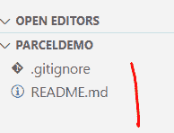
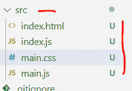
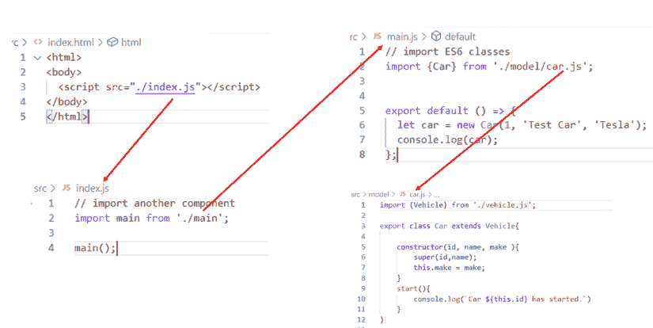
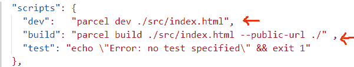
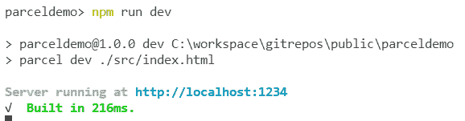
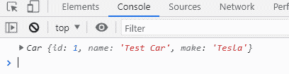
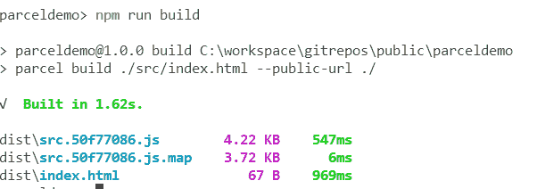
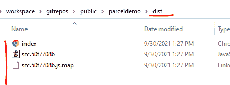

# Parcel.js:速度极快的零配置 Web 应用程序捆绑器

> 原文：<https://javascript.plainenglish.io/parcel-js-a-blazing-fast-zero-configuration-web-application-bundler-8c363ed3773d?source=collection_archive---------9----------------------->


# 介绍

JavaScript 世界有许多很棒的工具来帮助我们轻松构建应用程序。任何 JavaScript 开发人员工具箱中的一个常用工具是 **bundler** 。您可能已经在现有的开发活动中使用了一个。

在本帖中，我们将了解**包裹**。官方网站提到它是一个速度极快的零配置 web 应用程序 bundler，我们将看到 Parcel 是否真的符合这一声明。

# 什么是捆扎机？

一个捆绑器把我们的代码和**捆绑**成一个包。如果您使用过 Angular、React 或 Vue.js 框架，那么您已经将 WebPack 用作捆绑器。

一个捆绑器获取我们的应用程序代码，并生成一些优化的、更小的、性能更好的代码。代码被压缩，文件大小减小。它不仅使用 JavaScript 代码，还使用 HTML 和 CSS。

# 什么包裹

Parcel.js 做了捆绑器应该做的事情。它将您的 web 应用程序打包到一个包中。各个文件被合并成一个文件。

Parcel 提供了一种自认为简单的模块捆绑方法，不需要额外的配置。

Parcel 使用工作进程来支持多核编译，并具有文件系统缓存，即使在重启后也能快速重建。

包裹和 ES6 相处没有任何问题。它将 ES6 模块转换为 ES5，以便与尚未实现 ES6 支持的浏览器一起工作。它也适用于 TypeScript。

Parcel 的**代码分割**特性分割您的输出包，因此您只需在初始加载时加载所需的内容。**热模块更换**是自动完成的，它还提供非常友好的错误记录，帮助您查明问题。

Parcel.js 还有一个内置的开发服务器，这对于开发来说非常方便。

更多信息可以在官网[这个](https://parceljs.org/)链接找到。

# 设置场景

我们将使用一个简单的 JavaScript 代码库来查看 Parcel 的运行情况。您的机器上应该已经安装了 **Node.js** 和**NPM**(NPM 将作为节点安装的一部分进行安装)。可以从官方节点[网站](https://nodejs.org/en/)下载节点安装程序。

我已经为应用程序创建了一个文件夹，下面是它当前的样子:



接下来，我使用 **npm init** 命令创建一个 package.json 文件，如下所示:

接下来，使用 npm 将包作为开发依赖项进行安装:

```
npm install parcel-bundler --save-dev
```

让我们创建一个 **src** 文件夹，并在那里创建一些文件:



下面是这些文件的设置方式:



我们在 JS 代码中使用了一些 ES6 特性。

接下来，我们将通过添加如下所示的**开发**和**构建**脚本来更新 npm 配置的 **package.json** 文件:



# 测试应用程序

设置好上面显示的 npm 配置后，我们只需在终端中键入以下命令:



它将启动 Parcel 的内置开发服务器，我们现在可以通过浏览以下 URL 来访问该应用程序:



现在，如果我们对代码进行一些更改并保存这些更改，Parcel 将自动获取这些更改，并且我们的浏览器窗口将会刷新。

# 构建应用程序

开发完成后，我们可以运行下面的命令来创建一个生产构建，然后我们可以将它部署到我们的 web 服务器上:

```
npm run build
```



这个命令将创建一个 **dist** 文件夹，我们可以将它部署到我们的 web 服务器上:



# 摘要

Parcel.js 非常容易设置和使用。它几乎不需要任何配置。它是轻量级的，非常快，学习曲线非常小。

您可以从[这个](https://github.com/jawadhasan/parceldemo.git) git 资源库下载用于演示的源代码。如果你有任何问题或意见，请告诉我。

*原载于 2021 年 9 月 30 日 https://hexquote.com*[](https://hexquote.com/parcel-js-a-blazing-fast-zero-configuration-web-application-bundler/)**。**

**更多内容请看*[***plain English . io***](http://plainenglish.io/)*