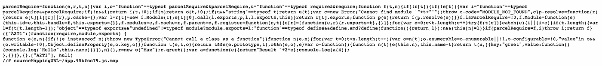

# 为什么您应该立即试用产品包

> 原文：<https://javascript.plainenglish.io/parceljs-48a35df8b41a?source=collection_archive---------10----------------------->

## 仅在 4 分钟内完成 4 次酷炫设置


Photo by [Kira auf der Heide](https://unsplash.com/@kadh?utm_source=medium&utm_medium=referral) on [Unsplash](https://unsplash.com?utm_source=medium&utm_medium=referral)

当我们谈到 web 的模块捆绑器时，webpack 立即浮现在脑海中。当然，它做得很好，但有一个很大的缺点。

Webpack 很难设置。即使对于官方文档中第一个简单的代码示例，我们也需要一个配置文件——臭名昭著的 webpack.config.js。

这就是 package 的用武之地 bundler 是一个零配置工具。
正确，我们不需要先创建一个配置文件——Parcel 完全知道我们需要什么。

这里有几个例子，肯定会让你对包裹感到兴奋。

# 带包裹的 Hello World

您所需要的只是 CLI —它会为您完成所有工作。
您可以按如下方式安装:

`yarn global add parcel-bundler` `npm install -g parcel-bundler`

然后运行`npm init -y`或`yarn init -y`并创建一个*index.html*。

现在你可以写一些代码了。您可以轻松地将 JavaScript 文件与脚本标记和执行代码包含在一起。包裹明白这一点。JavaScript 代码被自动最小化，变量名被交换，代码被向下编译。

这意味着现代 JavaScript 特性&语法糖变成了浏览器安全的代码。这里有一个例子。

在代码中，您可以看到一个箭头函数和一个类。两者都是“高级”的 JS 特性。使用脚本标签引用 index.htm 内部的脚本。然后跑`parcel build index.html`。完成—站点的生产版本保存在“dist”目录中。

这就是成品 JavaScript 的样子:



是的，没有 class-keyword &没有 arrow 函数。包裹优化了我们的代码，没有我们提供任何设置或配置。

# 该打字了！

TypeScript 非常方便。但是它有一个小缺点——TS 也需要先设置。但即使在这里，包裹也帮了我们大忙。只要回到你的 index.html，导入 app.ts 而不是 app . js——是的，这是正确的，即使它看起来不熟悉。

使用`parcel index.html`作为开发服务器，或者使用`parcel build index.html`作为产品构建，您可以运行代码。
下面是一个简单的类型脚本代码示例:

```
function doubleNumber(a: number):number {
  *return* a * 2;
}console.log(doubleNumber(20))
```

代码按包自动转换成 JavaScript 代码。

# 但是，但是，框架呢？

我们来看看 React.js(没错，是个库，不过你懂的)。
首先，我们需要安装 React 需要运行的一切:
`npm install react react-dom`。和以前一样，我们只有导入 app.js 的 index.html。在 app.js 中，我们可以编写以下代码:

这一切看起来很熟悉，不是吗？在 React & CRA 的当前版本中，不再需要 import-statement。在包裹里，你有——这是唯一真正的区别。

# WebAssembly！

好消息:同样，你不需要安装任何东西。为了将 C 代码转换成 WebAssembly，我们使用在线 IDE [webassembly.studio](https://webassembly.studio/) 。

打开它，选择“空 C 工程”然后进入 *main.c* 添加如下功能:

```
int add(int a, int b) {
  return a + b;
}
```

然后选择工具栏顶部的“构建”。现在你可以在左边的文件标签中右击来下载 *main.wasm* 。

就在 app.js 和 index.html 旁边，它进入了我们的项目。wasm 文件包含编译后的 WebAssembly 代码，它不再是人类可读的了。

我们现在可以在 app.js 中调用我们刚刚用 C 编写的函数:

```
*import* { add } *from* "./main.wasm"console.log(add(2, 4))
```

在浏览器控制台中，您现在应该看到输出“6”——祝贺您，您刚刚在 web 上使用了一个 C 函数！

# 很高兴拥有:直接的 JSON 支持

在 JavaScript 中使用 JSON 实际上并不困难。例外情况是，当我们将 JSON 作为一个文件并想要导入它时。再说一次，包裹在我们不知不觉中发挥了它的魔力。

除了 app.js 和 index.html，我还创建了一个 cars.json，内容如下:

我们可以在 app.js 中非常方便地导入和使用这个 JSON 文件:

```
*import* cars *from* "./cars.json"console.log(cars.Lambo.color)*// "green"*
```

# 总结

我不是一个讨厌网络包的人。然而，即使对于较小的项目，Webpack 中也有很多需要配置的内容。这就是为什么我喜欢包裹，尤其是对于较小的应用程序。您还应该看一下官方文档。它一次又一次地展示了 Parcel 如何也能与相当不寻常的技术一起使用。相对较新的是对 Rust & Elm 的支持。

感谢您的阅读！

## [加入我的时事通讯，了解最新消息](http://eepurl.com/hacY0v)