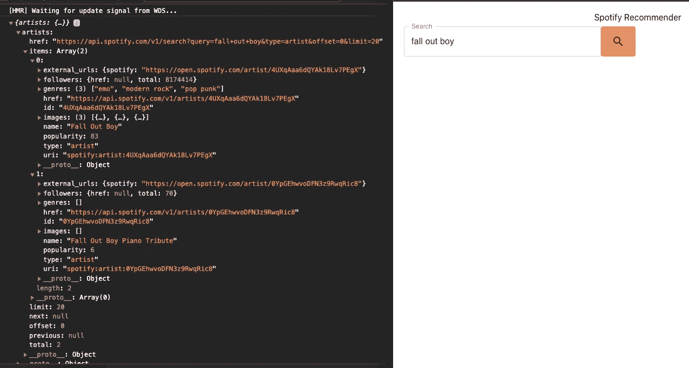
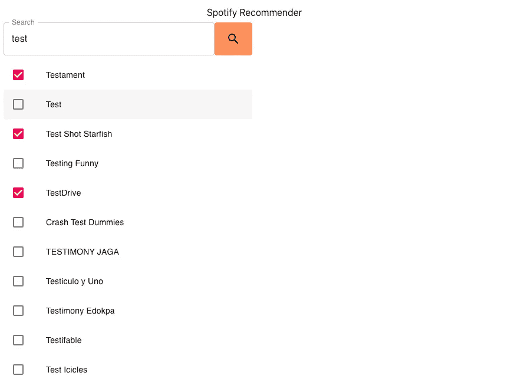
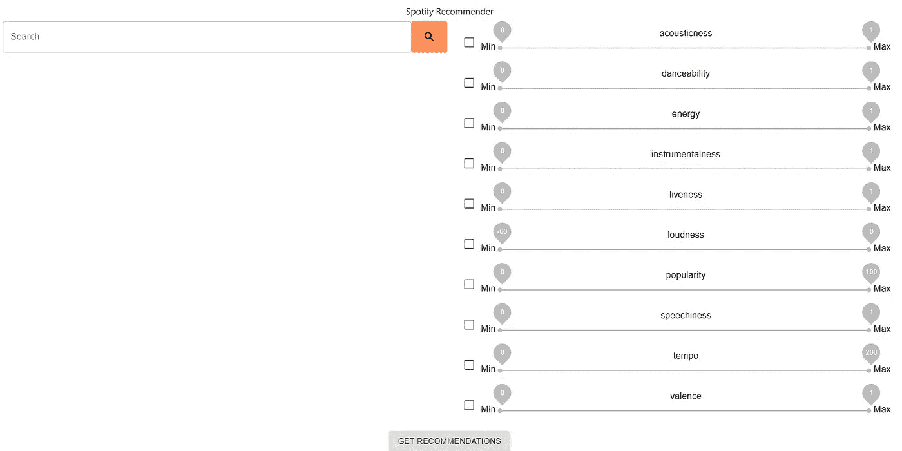
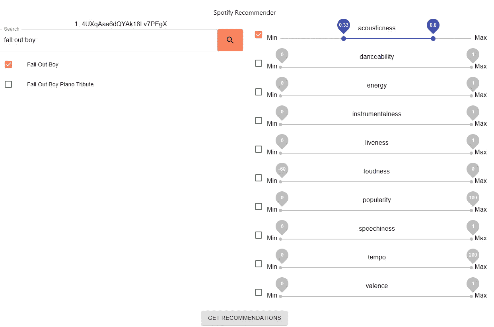
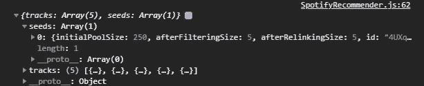
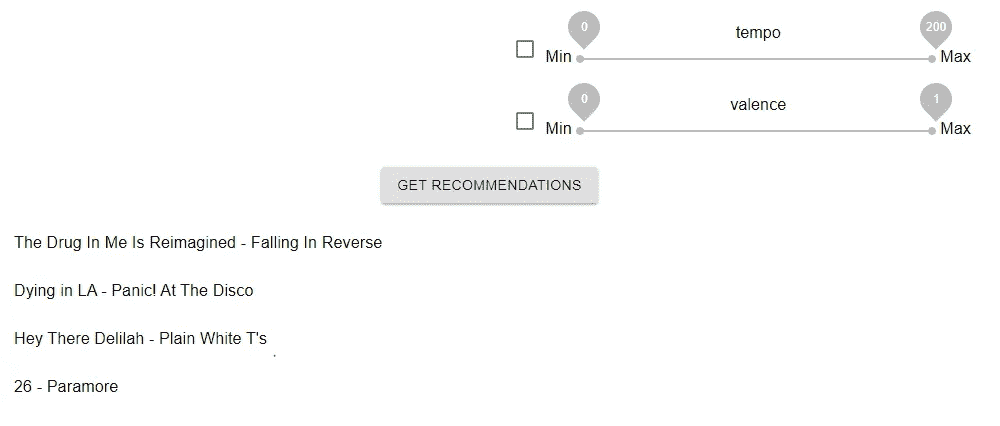

# 让我们用 Spotify 算法+ API 构建一个全栈应用

> 原文：<https://javascript.plainenglish.io/part-2-lets-build-a-full-stack-app-with-the-spotify-algorithm-and-api-frontend-development-463c6c232219?source=collection_archive---------4----------------------->

## 第 2 部分:前端开发


Photo by [Puria Berenji](https://unsplash.com/@ipuriagram?utm_source=unsplash&utm_medium=referral&utm_content=creditCopyText) on [Unsplash](https://unsplash.com/s/photos/spotify?utm_source=unsplash&utm_medium=referral&utm_content=creditCopyText)

欢迎来到使用 Spotify 的推荐 API 端点构建全栈应用程序的第 2 部分。在上一个教程中，我们回顾了如何创建后端，并使用 Spotify 开发仪表板设置我们的项目。

在本教程中，我们将通过创建我们的前端！

如果您是这个系列的新手，请点击这里查看第 1 部分！

# 规划我们的组件

我们不想在没有对我们想要创建的组件有一个可靠的计划的情况下就开始开发我们的 react 前端。我要找的是:

1.  一个搜索栏，我们可以在那里查找艺术家，选择他们作为推荐 API 的“种子”。(最多 3 个)
2.  一组滑块，代表我们可以为每个查询更改的所有值。
3.  发送我们的查询的按钮
4.  作为服务器播放列表响应的歌曲列表

# 制造前端

如果你已经阅读了我的“安全服务器”文章，你将已经创建了一个用于演示登录/注销状态的前端。这与我们现在要创建的起始前端非常相似。

首先，我们使用 npx 来初始化我们的项目:

```
$ npx create-react-app client
```

让我们安装一些前端依赖项。

1.  Material-UI 是一个优秀的前端 react 组件库，我们可以将其用于我们前端中的不同组件。如果你以前从未使用过 material-ui，如果你有任何问题，请访问他们的网站并浏览文档。
2.  `axios`是一个库，我们可以用它向我们的后端和 Spotify API 发送 web 请求。
3.  `http-proxy-middleware`是一个包，它将允许我们在开发过程中从前端代理请求到后端服务器。

```
$ cd client
$ yarn add @material-ui/core [@material](http://twitter.com/material)-ui/icons axios http-proxy-middleware
```

我们现在将添加我们的代理，以便我们可以轻松地请求我们的后端，看看我们是否登录。这被添加到我们的`src`文件夹的根目录下，在我们的`client`文件夹(client/src)内:

setupProxy.js

```
const proxy = require('http-proxy-middleware').createProxyMiddleware;module.exports = function (app) {
    app.use(proxy(`/auth/**`, { target: 'http://localhost:8080' }));
};
```

同样在`src`文件夹中，让我们创建几个其他文件:

Home.js:

```
import ***React*** from 'react';
import './App.css';

function Home() {
    return (
        <div className="App">
            <header className="App-header">
                <p>
                    You are not logged in to Spotify
                </p>
                <a
                    className="App-link"
                    href={"/auth/login"}
                >
                    Login Here
                </a>
            </header>
        </div>
    );
}

export default Home;
```

Loading.js:

```
import ***React*** from 'react';
import './App.css';

function Loading() {
    return (
        <div className="App">
            <header className="App-header">
                <p>
                    Loading...
                </p>
            </header>
        </div>
    );
}

export default Loading;
```

SpotifyRecommender.js:

```
import React from 'react'const SpotifyRecommender = () => {
 return ( <div>Hello Yes I'm logged in</div> )
}export default SpotifyRecommender;
```

最后，让我们对 App.js 进行更改，以便它能够反映我们希望在应用程序中使用的导航:

App.js:

```
import ***React***, {useState, useEffect} from 'react';
import ***axios*** from 'axios';
import './App.css';
import Home from "./Home";
import Loading from "./Loading";
import SpotifyRecommender from "./SpotifyRecommender";

function App() {
  const [auth, setAuth] = useState(null);

  useEffect(() => {
    ***axios***.get('/auth/current-session').then(({data}) => {
      setAuth(data);
    })
  }, []);

  if (auth === null) {
    return <Loading/>
  }
  if (auth) {
    return <SpotifyRecommender auth={auth}/>
  }
  return <Home/>
}

export default App;
```

这和[我的安全服务器教程](https://medium.com/javascript-in-plain-english/secure-react-express-apps-jsonwebtoken-cookie-session-auth0-and-passport-tutorial-e58d6dce6c91)几乎完全一样，但是要刷新一下:

1.  当应用程序加载时，它将向我们的后端“当前会话”端点发送一个请求，在那里它将获取数据并设置身份验证状态。
2.  这意味着当我们的 auth 状态为 null(这是它的初始状态)时，将返回加载屏幕，上面只写着“正在加载…”
3.  如果 auth 存在并且不是 false，那么我们返回我们的 Spotify 推荐者屏幕。我们还传入了 auth 状态，以便以后使用它！
4.  如果 auth 为 false，这是我们没有登录时会发生的情况，那么我们的应用程序会显示主屏幕，为我们的用户提供登录。幸运的是，我们的登录端点已经连接到我们的 Spotify 认证工作流！

# 搜索栏

搜索栏是我们需要在`SpotifyRecommender`屏幕中创建的组件列表中的第一个，所以让我们直接进入它。我们真正需要的是一个带有搜索按钮的文本字段。我们可以用下面的大纲创建我们需要的东西:

```
import React, {useState} from 'react';
import './App.css';import {Grid, TextField, Button} from '@material-ui/core';
import {Search} from '@material-ui/icons';const SpotifyRecommender = ({auth}) => {
  const {token} = auth;
  const [searchResults, setSearchResults] = useState([]);
  const [searchString, setSearchString] = useState(''); return (
    <div className={"App"}>
        <Grid container style={{padding: 20}} spacing={1}>
          <Grid item xs={12}>
            Spotify Recommender
          </Grid>
          <Grid item xs={6}>
            <Grid item xs={12} style={{display: 'flex', flexDirection: 'row'}}>
              <TextField
                variant={'outlined'}
                label={"Search"}
                style={{backgroundColor: 'white'}}
                fullWidth
                onChange={event => setSearchString(event.target.value)}
                value={searchString}
              />
              <Button style={{backgroundColor: '#ff905b'}}>
                <Search/>
              </Button>
            </Grid>
          </Grid>
          <Grid item xs={12}>
          </Grid>
        </Grid>
    </div> );
};export default SpotifyRecommender
```

对这里所做工作的简要说明:

1.  仍然使用我们的 starter 项目给我们的 css，主要组件使用类“App”包装在一个 div 中。
2.  我使用来自 [Material-UI](https://medium.com/u/9d99f1b2974b?source=post_page-----463c6c232219--------------------------------) 的网格组件来给我们的页面一些格式。它非常简单，可以与 flex-box 风格相提并论。
3.  你可以看到“Spotify 推荐者”作为页面标题
4.  material-ui 中的 TextField 组件与一个状态变量`searchString`一起使用，这样我们就可以获取输入到文本字段中的值，并在用户单击搜索按钮时保存它
5.  最后，当用户想要提交他们的搜索时，添加一个按钮。

目前不追求任何漂亮的东西，只追求功能性:


如果您查看上面的代码，您还会看到我们正在使用从 App.js 文件传递到组件中的 auth 属性。如果您还记得本系列教程第 1 部分中 auth 对象的样子，您会记得保存了一个访问令牌。我们实际上需要这个令牌，以便向 Spotify API 发送重要的请求，这就是为什么我们从组件顶部的 auth 对象中解构它:

```
const {token} = auth;
```

为了进行搜索，我们可以看一下 [Spotify Web API](https://developer.spotify.com/documentation/web-api/reference/search/search/) 上提供的文档，但这里有一个简短的概述:

获取请求:[https://api.spotify.com/v1/search](https://api.spotify.com/v1/search)
所需标题:授权
查询参数:
1。q —搜索关键词，
2。类型—专辑、艺术家、播放列表、曲目、节目、剧集

我们可以获取这些信息，并在组件中创建一个函数。我们所做的就是使用输入到文本字段中的搜索字符串来查找我们想要播种的艺术家:

```
const searchSpotify = async () => {
  const url = 'https://api.spotify.com/v1/search';
  const searchQuery = encodeURIComponent(searchString);
  const typeQuery = `type=artist`;
  const {data} = await axios.get(`${url}?q=${searchQuery}&${typeQuery}`, {
    headers: {
      Authorization: `Bearer ${token}`,
    }
  });
  console.log(data); if (data && data.artists) {
    setSearchResults(data.artists.items);
  }
}
```

我们可以将它添加到我们的按钮点击:

```
<Button style={{backgroundColor: '#ff905b'}} onClick={searchSpotify}>
  <Search/>
</Button>
```

如果我们做了这些更改并打开我们的 web 控制台，我们应该能够键入一个查询，并在我们点击搜索按钮时看到来自 Spotify API 的响应。



太美了。我们现在唯一需要做的就是在文本字段下面呈现搜索结果列表。

## 搜索结果

因为如果我们将每个组件都放在 SpotifyRecommender.js 文件中，事情可能会变得有点混乱，所以如果我们创建一个可以从中导入的组件库，将会对我们有所帮助。只需在`src`目录中创建一个文件夹`components`。然后我们可以添加我们的第一个组件，`SearchResults.js`。

该组件的目标是为我们的搜索结果提供一个可选列表，用户可以在其中选择最多 3 位艺术家:

```
// components/SearchResults.jsimport React from 'react';
import {ListItem, List, ListItemIcon, ListItemText, Checkbox} from '@material-ui/core';const SearchResults = ({results, onChange}) => {
  const [checked, setChecked] = React.useState([]); const handleToggle = (value) => () => {
    const currentIndex = checked.indexOf(value);
    const newChecked = [...checked]; if (currentIndex === -1) {
      if (checked.length < 3) {
        newChecked.push(value);
      }
    } else {
      newChecked.splice(currentIndex, 1);
    } setChecked(newChecked);
    onChange(newChecked)
  }; return (
    <List>
    {results.map((item, index) => (
      <ListItem key={item.id} dense button onClick={handleToggle(item.id)}>
        <ListItemIcon>
          <Checkbox
            edge={"start"}
            checked={checked.indexOf(item.id) !== -1}
            tabIndex={-1}
            disableRipple
            />
        </ListItemIcon>
        <ListItemText>
          {item.name}
        </ListItemText>
      </ListItem>
      ))}
    </List>
  );
}export default SearchResults
```

让我们来分解一下:

1.  我们正在创建一个名为 SearchResults 的功能组件，它有两个传入的属性:Results，这是我们从搜索中返回的结果列表 onChange，这是我们选择一个结果时运行的函数。
2.  我们创建了`checked`和`setChecked`作为一个反应状态获取器/设置器，这样我们就可以记录我们选择了哪些艺术家。
3.  `handleToggle`功能是检查以确保我们还没有检查 3 个项目。在函数结束时，我们用选中的项目设置本地状态，并将选中的项目传递到`onChange`函数属性中。
4.  剩下的只是一个使用 material-ui 组件的可选列表，在这里我们获取从查询中返回的结果，并显示每个项目的名称。当我们选择一个项目时，我们将歌曲的 Spotify ID 传递给我们的`handleToggle` 方法。

回到我们的 SpotifyRecommender.js:

```
import SearchResults from './components/SearchResults';
....
const [selectedArtists, setSelectedArtists] = useState([]);
....
<Grid item xs={12}>
  <SearchResults onChange={setSelectedArtists} results={searchResults}/>
</Grid>
```

我们已经将组件传递到我们的主屏幕。为了将选中的项目返回到父组件，我们将`setSelectedArtists`作为`onChange`函数传递到 SearchResults 中，以便稍后可以在 SpotifyRecommender 文件中使用该状态。让我们来测试一下:



但是，如果你想通过不同的搜索来搜索和选择三个不同的艺术家，当你搜索下一个人时，复选标记不会消失吗？如果需要，您可以在搜索框上方添加一些视觉反馈，列出您当前选择的内容:

```
//SpotifyRecommender:<Grid item xs={12}>
  {selectedArtists.map((artist, index) => (
    <Typography>
      {index+1}. {artist}
    </Typography>
  ))}
</Grid>
```

# 创建滑块

因此，在我们的组件列表的下一步，我们将需要一个部分，它有一堆滑块来表示我们可以为推荐端点调整的每个自定义值，如能量、声音、流行度等。让我们创建一个新的组件，它可以代表所有这些 nobs 的板(我已经意识到开发后，这应该被命名为`SliderBoard.js`，但我很累，并把这些与 Nobs lol 关联起来):

`components/NobBoard.js`

如果我们想一想这应该如何工作，并且如果您看一看 API 文档中不同的可用值，您将会看到与每个指标相关联的不同的最小值和最大值，有些只接受 0 和 1、1 和 100 之间的数字，等等。因此，从逻辑上讲，我们应该创建一个对象数组来保存 nob 的最小值和最大值:

```
//NobBoard.js//imports that will be used in the actual component later:
import ***React***, {useState, useEffect} from 'react';
import {***Grid***, ***Typography***, ***Slider***, Checkbox} from '@material-ui/core';// initial state for our nobs:const nobs = {
  'acousticness': {
    value: [0, 1],
    enabled: false,
    min: 0,
    max: 1,
    step: 0.01
  },
  'danceability': {
    value: [0, 1],
    enabled: false,
    min: 0,
    max: 1,
    step: 0.01
  },
  'energy': {
    value: [0, 1],
    enabled: false,
    min: 0,
    max: 1,
    step: 0.01
  },
  'instrumentalness': {
    value: [0, 1],
    enabled: false,
    min: 0,
    max: 1,
    step: 0.01
  },
  'liveness': {
    value: [0, 1],
    enabled: false,
    min: 0,
    max: 1,
    step: 0.01
  },
  'loudness': {
    value: [-60, 0],
    enabled: false,
    min: -60,
    max: 0
  },
  'popularity': {
    value: [0, 100],
    enabled: false,
    min: 0,
    max: 100,
    step: 1,
  },
  'speechiness': {
    value: [0, 1],
    enabled: false,
    min: 0,
    max: 1,
    step: 0.01
  },
  'tempo': {
    value: [0, 200],
    enabled: false,
    min: 0,
    max: 200,
    step: 1,
  },
  'valence': {
    value: [0, 1],
    enabled: false,
    min: 0,
    max: 1,
    step: 0.01
  },
};
```

这些值的简要说明:

1.  对象的关键字是我们的度量的名称
2.  value:指定 nob 的当前设定值
3.  启用:是否启用此 nob(用户是否希望在其搜索中包含此指标)
4.  min:这个 nob 的最小值是多少
5.  max:这个 nob 的最大值是多少
6.  步骤:滑块改变值的增量是多少

我们想做的只是简单地用一个函数来遍历这个 nob 数组并呈现它们。此外，我们希望有一个复选框，允许用户启用/禁用他们想要激活的 nob。最后，我们需要一个`onChange` 函数，将我们的 nob 设置返回给我们的父组件:

```
const NobBoard = ({onChange}) => {
  const [boardValues, setBoardValues] = useState(nobs);

  const handleChange = (nob, value) => {
    const newBoardValues = {...boardValues};
    newBoardValues[nob].value = value;
    setBoardValues(newBoardValues);
  };

  const toggleNob = (nob, value) => {
    const newBoardValues = {...boardValues};
    newBoardValues[nob].enabled = value;
    setBoardValues(newBoardValues);
  };

  useEffect(() => {
    onChange(boardValues);
  }, [onChange, boardValues]);

  return (
   <Grid container spacing={2} style={{padding: 10}}>
     {***Object***.keys(nobs).map(nob => (
       <Grid item xs={12}>
         <div style={{display: 'flex', flexDirection: 'row'}}>
           <Checkbox
             checked={boardValues[nob].enabled}
             onChange={(event, newValue) => toggleNob(nob, newValue)}
           />
           <div style={{flex: 1}}>
             <Typography>
               {nob}
             </Typography>
             <Grid container spacing={1}>
               <Grid item>
                 <Typography>
                   Min
                 </Typography>
               </Grid>
               <Grid item xs>
                 <Slider
                   disabled={!boardValues[nob].enabled}
                   value={boardValues[nob].value}
                   onChange={(event, newValue) => handleChange(nob, newValue)}
                   valueLabelDisplay={"on"}
                   aria-labelledby={"range-slider"}
                   min={nobs[nob].min}
                   max={nobs[nob].max}
                   step={nobs[nob].step}
                 />
               </Grid>
               <Grid item>
                 <Typography>
                   Max
                 </Typography>
               </Grid>
             </Grid>
           </div>
         </div>
       </Grid>
     ))}
   </Grid>
  );
};

export default NobBoard
```

如果我们将旋钮板和一个状态变量添加到父组件 SpotifyRecommender:

```
...
const [nobValues, setNobValues] = useState({});
...<Grid item xs={6}>
  <NobBoard onChange={setNobValues}/>
</Grid>
...
```

这是我们将在整个页面上看到的内容:



假设我们启用并更改其中一个旋钮的值，同时搜索并选择一些艺术家:


不错！现在我们需要的是发送请求和呈现结果的逻辑！

# 创建并发送我们的请求

在这一点上，我们有我们的搜索和滑块控制我们的领域的完整页面。当我们对选择进行更改时，它会以不同的状态保存在 SpotifyRecommender 组件中。我们现在需要编写逻辑，在请求中将该信息整齐地发送到 Spotify 推荐 API 端点。我们的目标是获取我们的信息，并将其转换成如下形式:

`GET [https://api.spotify.com/v1/recommendations](https://api.spotify.com/v1/recommendations)?seed_artists=someArtistID,anotherArtistID&min_popularity=50&min_popularity=100`

请记住，我们还需要我们的授权头！

我们可以放在 SpotifyRecommender 中的漂亮函数如下所示:

```
const getRecommendations = async () => {
  const url = 'https://api.spotify.com/v1/recommendations';

  // get artists
  let selectedArtistsString;
  if (selectedArtists.length < 0) {
    return;
  } else {
    selectedArtistsString = `seed_artists=${selectedArtists.join(',')}`;
  }

  // getnobs
  let min = [];
  let max = [];
  ***Object***.keys(nobValues).forEach(nob => {
    if (nobValues[nob].enabled) {
      // then we add our min and max values
      min.push(`min_${nob}=${nobValues[nob].value[0]}`);
      max.push(`max_${nob}=${nobValues[nob].value[1]}`);
    }
  });
  const minString = min.join('&');
  const maxString = max.join('&');

  const {data} = await ***axios***.get(`${url}?${selectedArtistsString}&${minString}&${maxString}`, {
    headers: {
      Authorization: `Bearer ${token}`,
    }
  });
  ***console***.log(data);
};
....
.....
// meanwhile in our return:
<Button variant={'contained'} onClick={getRecommendations}>
  Get Recommendations
</Button>
```

让我们来分解一下:

1.  我们首先将我们的推荐端点 url 设置为一个`const` ,以便以后使用
2.  然后，我们将选定的艺术家连接在一起，中间用逗号隔开。
3.  我们遍历 nob 并创建两个数组，一个包含最小值，一个包含最大值。然后我们把这些旋钮连接成串，中间有&。
4.  最后，我们将这些值一起插入到一个漂亮的 url 中，我们可以在 axios GET 请求中发送该 URL，同时还可以传入我们的授权头。
5.  然后我们打印出结果！

所以我们的要求有以下几点:



看起来像这样:

```
[https://api.spotify.com/v1/recommendations?seed_artists=4UXqAaa6dQYAk18Lv7PEgX&min_acousticness=0.33&max_acousticness=0.8](https://api.spotify.com/v1/recommendations?seed_artists=4UXqAaa6dQYAk18Lv7PEgX&min_acousticness=0.33&max_acousticness=0.8)
```

点击“获取推荐”按钮后，我们的结果如下所示:



看来我们找回了 5 首曲目！

所以，现在我们需要做的是获取这些信息，并很好地展示给我们的用户！

# 显示结果

这是我们前端旅程的简单结束，我们只需要显示原始查询的结果。就像这样简单:

1.  向我们的主页添加一个州来存储结果:

```
// SpotifyRecommender.js
....
const [results, setResults] = useState(null)
....
// and then at the end of our getRecommendations function we set the // state for the results:setResults(data)
...
```

2.我们为搜索结果创建了一个新组件:

```
// components: ResultsList.js
import ***React*** from 'react';
import {***Typography***, ***List***, ***ListItem***, ListItemText} from "@material-ui/core";

const ResultsList = ({results}) => {
    ***console***.log(results)
    if (!results.tracks || results.tracks.length === 0) {
        return (
            <Typography>
                No Results!
            </Typography>
        )
    }
    return (
        <List>
            {results.tracks.map(track => (
                <ListItem item xs={12} key={track.id}>
                    <ListItemText>
                        {track.name} - {track.artists ? track.artists[0].name : ''}
                    </ListItemText>
                </ListItem>
            ))}
        </List>
    )
}

export default ResultsList;
```

我们只是简单地检查是否有结果，如果有，我们就打印出名字和艺术家！否则我们就说我们没有结果。

3.我们在 SpotifyRecommender 组件的底部导入并使用它:

```
<Grid item xs={12}>
  {results && <ResultsList results={results}/> }
</Grid>
```

条件就是说，如果结果为 null，我们不显示任何内容。●看看当我们搜索让我们想起 fall out boy 的原声歌曲时会发生什么:



# 结论+额外学分

是的，我们的代码有点乱，可能有点低效，可能还有一两个 bug，但这是一个很好的开始，可以制作一个真正可靠的小型实用 web 应用程序，可以用来发现一些新的音乐！在本系列的下一部分中，我们将看看如何将这个代码库转换成模块化的和组织良好的。我们将添加一些开发依赖，以帮助维护我们的项目，我们可以通过部署这样的东西到网络的步骤！

请记住，当搜索推荐时，如果您能够输入最大种子，您将获得更多结果。测试各种艺术家和滑块值，看看你能得到什么样的模糊结果！

**一些额外积分！！你可以自己做很多事情来加强这个小项目，这里有一些想法:**

1.  在结束时显示的歌曲旁边添加图像
2.  让这个项目更时尚一点
3.  创建一个按钮，将结果添加到用户 Spotify 帐户的播放列表中。

**或者如果你想变得更高级:**

1.  当我们登录时，Spotify API 提供的用户令牌在一个小时后过期，如果用户仍在使用该网站，编写一些逻辑来刷新该令牌。
2.  允许用户搜索在播种过程中使用的专辑和曲目
3.  添加 Spotify Web Player SDK，允许用户直接从该页面播放歌曲

非常感谢您的阅读，敬请期待第三集！

以下是这篇文章的所有更新代码:

[https://github.com/jdstregz/spotify-recommendations](https://github.com/jdstregz/spotify-recommendations)