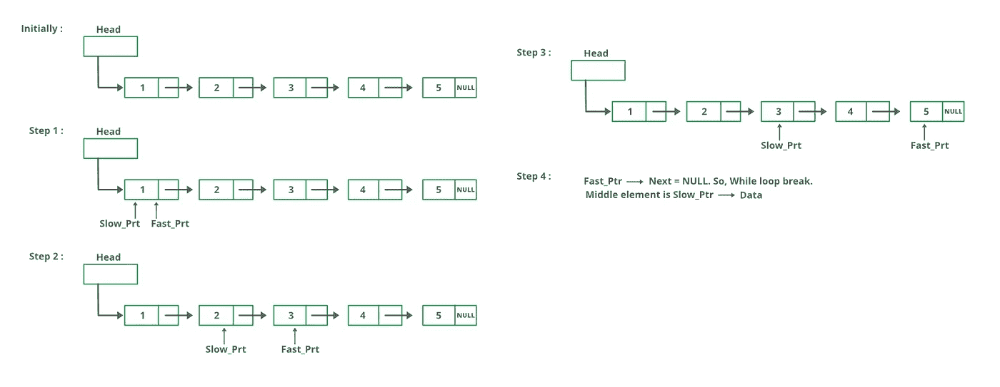

# JavaScript 中的链表介绍第 3 部分:如何找到列表的中间元素

> 原文：<https://javascript.plainenglish.io/part-3-introduction-to-linkedlist-in-javascript-how-to-find-middle-element-of-the-list-using-1cf2ba7baff0?source=collection_archive---------20----------------------->


Photo by [Arif Riyanto](https://unsplash.com/@arifriyanto?utm_source=medium&utm_medium=referral) on [Unsplash](https://unsplash.com?utm_source=medium&utm_medium=referral)

如果您直接阅读了这篇文章，那么在进一步阅读之前，请阅读我之前的一篇关于如何在 JavaScript 中实现链表的文章。

我假设您已经阅读了我以前关于链表的文章，并且知道 JavaScript 中的链表是如何工作的。你还知道如何用 JavaScript 实现链表的基本操作，比如添加节点、打印列表等。

现在让我们从一些高级问题开始。我决定在每个帖子中讨论 1-2 个问题，这样用户就不会不知所措。

**问题 1:**

**找到给定链表中的中间元素**

如果你以前从未解决过任何链表问题，你的方法将很可能包括找到链表的长度并将其除以二，然后找到中间的元素。

现在让我问你几个问题:

1.  你如何知道链表的长度(与数组不同，链表的大小不是预先定义的)？
2.  找到长度后，如果将长度除以 2，那么将如何直接访问中间的元素？
3.  让我们假设你正在维护一个临时数组，用来存储链表项。找到长度后，你将把它除以 2，然后访问数组的索引。但是如果链表包含大约 1000 万个元素呢？如果你将所有的值存储在一个数组中，那么你将受到空间的限制。

**解决方案 1 —线性方法**

遍历链表，找到它的长度，然后除以 2。再次，遍历链表，从开始到中间的元素。当列表包含有限的元素集时，这很好。时间复杂度是(n + n/2)你可以说 **n** ，空间复杂度也是 **n.**

我不是为这个解决方案写代码。如果你读过我的第一篇文章，它包含了一个基本的链表操作。通过一些基本的调整，您可以实现上述解决方案。

**解决方案 2 —双指针方法**

这是一个有趣的方法，面试官可能会期待你这样做。你将有两个指针，它们将被初始化到列表的开头。将第一个指针递增 2 个位置，第二个指针递增 1 个位置。当第一个指针到达列表末尾时，第二个指针将指向中间的元素。

为了更好地理解它，请看下图。



Source- [Geeks for geeks](https://www.geeksforgeeks.org/)

代码片段:在 JavaScript 中

```
class Node {
// constructor
constructor(element)
{
this.element = element;
this.next = null
}
}class LinkedList {
constructor()
{
this.head = null; 
this.size = 0; 
}add(element)
{
    var node = new Node(element); // Create a node before adding
    var current;
    if (this.head == null) //For first element
        this.head = node; 
    else { // Iterate till the last item and add value
     current = this.head;
     while (current.next) {
         current = current.next;
     }
     current.next = node;
   }
  this.size++;
}printList()
{
   var curr = this.head;
   var str = "";
   while (curr) {
     str += curr.element + " ";
     curr = curr.next;
   }
   console.log(str);
}findMiddleElement(){
  let slow_ptr  = this.head, fast_ptr  = this.head; 
     if(this.head === null ) return -1;
       if (this.head != null)
        {
         while(fast_ptr !== null && fast_ptr.next != null) {
          fast_ptr = fast_ptr.next.next;
          slow_ptr = slow_ptr.next;
       }   
      }
     return slow_ptr.element)
  }
}var ll = new LinkedList();
// adding more elements to the list
ll.add(10);
ll.add(20);
ll.add(30);
ll.add(40);
ll.add(50);
// returns 10 20 30 40 50
ll.printList();
let middlElement = ll.findMiddleElement();
if(middlElement == -1){
   console.log("List is empty");
}else{
   console.log("Middle element is", middlElement); // Output will be // middle element is 30
}
```

在 findMiddleElement 函数中，我们创建了两个指针，并运行 while 循环，直到 fast_ptr 到达列表的末尾。当它到达末尾时，慢速指针将指向列表中的中间元素。因此，从该节点返回元素。

**解决方案 2 的优势**

1.  链表的单次迭代
2.  当链表缺少元素时的有效方法。

不要忘记阅读我的下一篇文章，在那里我解释了如何反转给定的链表

[JavaScript 中的链表介绍第三部分:如何反转给定的链表](https://mevasanth.medium.com/introduction-to-linked-list-in-javascript-part-3-how-to-reverse-the-given-linked-list-ca393251ddfb)

**同一作者的其他文章:**

1.  [JavaScript 中的一切都是对象吗？](https://mevasanth.medium.com/how-everything-is-object-in-javascript-a4164d7e6a2d)
2.  [JavaScript 中的吊装:采访热点](https://mevasanth.medium.com/hoisting-in-javascript-hot-topic-for-interview-43b463a6a77?source=follow_footer---------0----------------------------)
3.  [JavaScript 中的记忆化——采访热门话题](https://mevasanth.medium.com/memoization-in-javascript-hot-topic-for-interview-815475544ab0)

点击[此处](https://mevasanth.medium.com/)查看作者所有文章。

*更多内容请看*[*plain English . io*](http://plainenglish.io/)