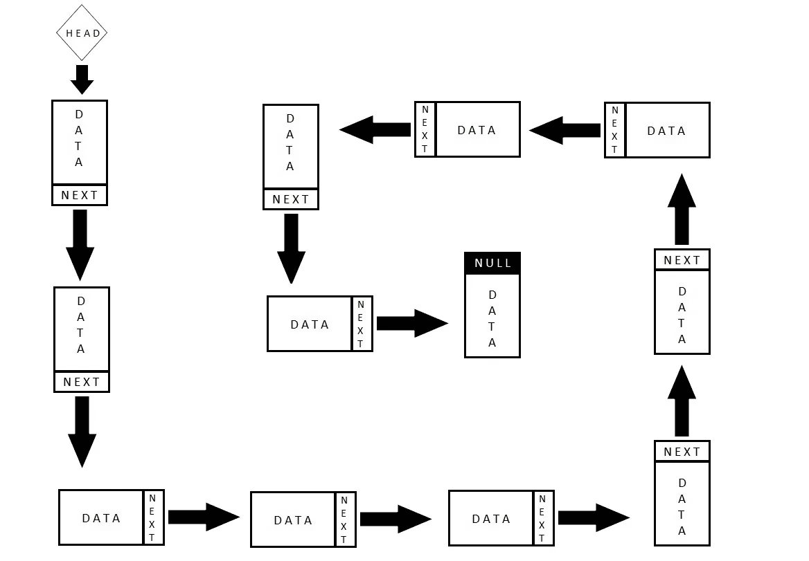

# 如何在单链表中找到第 n 个最后的元素

> 原文：<https://javascript.plainenglish.io/part-5-find-nth-last-element-in-singly-linked-list-7a7043bfaf44?source=collection_archive---------8----------------------->

如果您直接阅读了这篇文章，那么在进一步阅读之前，请阅读我之前的一篇关于如何在 JavaScript 中实现链表的文章。



我假设您已经阅读了我以前关于链表的文章，并且知道如何在 JavaScript 中对链表执行基本操作。

**问题:**

在给定的单链表中找到第 n 个最后的元素。

例如:[1，2，3，4，5，6]是一个链表，那么倒数第二个元素是 5，倒数第四个元素是 3。

**解决方案 1 —不推荐**

迭代链表并将元素复制到一个数组中，然后显示数组长度减去指定的最后 n 个元素索引，并找到所需的元素。非常简单的方法，我不打算为此编写代码，因为如果你已经阅读了我在 Medium 上的关于链表实现[的文章，你将能够稍微调整它并得到所需的解决方案。](/all-operations-of-linked-list-in-javascript-9958a4d3cb07)

但是你可能已经猜到了这个算法的空间复杂度是 n，如果我们有一百万个元素，我们需要找到百万减 1 个元素，然后我们最后把整个链表复制到一个数组中。

**解决方案 2 —最佳方法**

有两个指针，将第一个指针设置为数组的开头，将第二个指针设置为索引，该索引等于倒数第 n 个位置。例如:如果需要查找倒数第三个元素，则将第二个指针设置为从开始算起的第三个位置。现在增加两个指针，直到第二个指针到达终点。当它到达终点时，第一个指针将指向所需的答案。


Source = [geeks fro geeks](https://www.geeksforgeeks.org/nth-node-from-the-end-of-a-linked-list/)

现在让我们看看代码:

```
class Node {
// constructor
constructor(element)
{
this.element = element;
this.next = null
}
} class LinkedList {
constructor()
{
this.head = null; 
this.size = 0; 
} add(element)
{
    var node = new Node(element); // Create a node before adding
    var current;
    if (this.head == null) //For first element
        this.head = node; 
    else { // Iterate till the last item and add value
     current = this.head;
     while (current.next) {
         current = current.next;
     }
     current.next = node;
   }
  this.size++;
}printList()
{
   var curr = this.head;
   var str = "";
   while (curr) {
     str += curr.element + " ";
     curr = curr.next;
   }
   console.log(str);
}printNthFromLast(n)
    {
        var first_pointer = this.head;
        var second_pointer = this.head;
        let count = 0;
        if (this.head != null)
        {
          // this is the loop where second pointer is set to 
          // a position n from the beginning
            while (count < n)
            {
              // then given value is greater than length of array
                if (second_pointer == null)
                {
                    console.log(n + " is greater than the no "
                       + " of nodes in the list");
                    return;
                }
                second_pointer = second_pointer.next;
                count++;
            }
            // When user is looking for first element from the last
            if(second_pointer == null)
            {
              if(this.head != null)
                console.log("Node no. " + n +
                                   " from last is " +
                                      this.head.element);
            }
            else 
            {    
              while (second_pointer != null)
              {
                  first_pointer = first_pointer.next;
                  second_pointer = second_pointer.next;
              }
              console.log("Node no. " + n +
                                " from last is " +
                                  first_pointer.element);
            }
        }
    }
}var ll = new LinkedList();
// adding more elements to the list
ll.add(10);
ll.add(20);
ll.add(30);
ll.add(40);
ll.add(50);
// returns 10 20 30 40 50
ll.printList();
let output = ll.printNthFromLast(2);
console.log(output); // Output will be 40
output = ll.printNthFromLast(4);
console.log(output); // Output will be 20
```

每个模块的解释作为注释添加，请参考。

让我们在下一篇文章中讨论更多关于数据结构的有趣问题。快乐阅读！

如果你想从基础开始理解 JavaScript 中的链表实现，那么下面这篇文章就是为你准备的。

[](/all-operations-of-linked-list-in-javascript-9958a4d3cb07) [## JavaScript 中 LinkedList 操作的介绍

### 当在面试中谈到数据结构和算法时，JavaScript 开发人员会面临问题。

javascript.plainenglish.io](/all-operations-of-linked-list-in-javascript-9958a4d3cb07) 

**同一作者的其他文章:**

1.  [JavaScript 中的一切如何都是对象？](https://mevasanth.medium.com/how-everything-is-object-in-javascript-a4164d7e6a2d)
2.  [JavaScript 中的吊装:采访热点](https://mevasanth.medium.com/hoisting-in-javascript-hot-topic-for-interview-43b463a6a77?source=follow_footer---------0----------------------------)
3.  [JavaScript 中的记忆化——采访热门话题](https://mevasanth.medium.com/memoization-in-javascript-hot-topic-for-interview-815475544ab0)

点击[此处](https://mevasanth.medium.com/)查看作者所有文章。

*更多内容尽在*[***plain English . io***](http://plainenglish.io/)