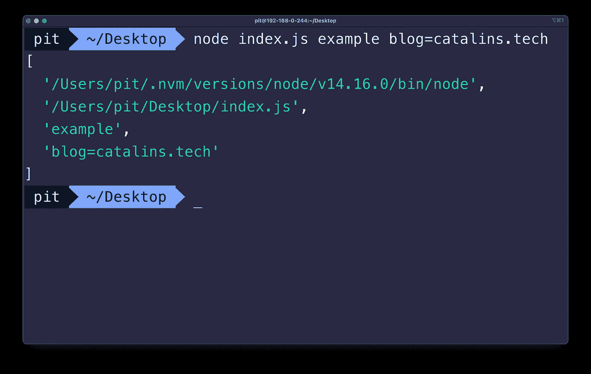

# 将命令行参数传递给 Node.js 应用程序

> 原文：<https://javascript.plainenglish.io/pass-command-line-arguments-to-your-node-js-app-ea4c7ed28569?source=collection_archive---------17----------------------->


Photo by [Pankaj Patel](https://unsplash.com/@pankajpatel?utm_source=medium&utm_medium=referral) on [Unsplash](https://unsplash.com?utm_source=medium&utm_medium=referral)

## 了解如何在 Node.js 应用程序中使用命令行参数

在本文中，您将看到如何向 Node.js 应用程序传递命令行参数。您还将学习如何访问它们。

然而，在继续之前，让我们从一些基本的东西开始。**要运行 Node.js 应用程序**，您可以在终端中运行以下命令:

```
node index.js
```

因此，当您运行上面的命令时，您可以传递任意数量的参数。谈到命令行参数，有两种类型:

*   单个参数，如`node index.js myArg`
*   键值参数，如`node index.js myArg=myVal`

现在，下一步是学习如何在 Node.js 应用程序中访问这些参数。

# `process`的对象

在 Node.js 中，`process`对象是一个全局对象，包含关于当前节点进程的信息。因为它是一个全局对象，所以即使您没有将它导入到您的应用程序中，您也可以直接访问它。

此外，`process`对象有一个名为`argv`的属性，它是一个包含命令行参数的数组。



> 图 1

图 1 展示了参数数组。但是，您可以看到数组中还有其他项目。让我们看看它们是什么:

*   第一个元素表示“node”命令的路径。
*   第二个元素是正在执行的文件的路径——在本例中，它是`index.js`。
*   第三和第四个元素是命令行参数。

**注意**:数组可以有更多的元素。这取决于传递给应用程序的参数数量。

# Node.js 中的访问参数

arguments 数组中的前两个元素总是“node”命令的路径和正在执行的文件的路径。因此，您可以通过使用 JavaScript `splice`方法来消除它们。

```
const arguments = process.argv.splice(2);
```

上面的行删除了前两个条目，保留了其余的条目。然后，它将剩余的数组存储在常量`arguments`中。

现在，您可以循环访问这些参数，或者分别访问它们，如下所示:

```
const myArgs = arguments.map(argument => {
    console.log(argument);
});

console.log(arguments[0]);
console.log(arguments[1]);
```

如果运行上面的代码，Node.js 应用程序会将参数输出到终端。因此，这就是在 Node.js 应用程序中使用命令行参数的方式。

> 关于`process`对象的更多信息，我推荐阅读 [Node.js 官方文档](https://nodejs.org/api/process.html)。

*更多内容看*[***plain English . io***](http://plainenglish.io)

*你想学习如何编码吗？查看这 20 个* [*学习如何编写*](https://catalins.tech/20-best-places-to-learn-programming-for-free) *代码的最佳地点。*

*如果你想学习 JavaScript，看看这 5 个* [*最好的 JavaScript 资源*](https://catalins.tech/5-best-resources-to-learn-javascript-as-a-beginner) *。*

*下面列举一个带有* [*编程项目思路*](https://catalins.tech/10-programming-project-ideas-for-beginners) *的清单，供初学者参考。*

*检查这些*[*JavaScript es 2020*](https://catalins.tech/javascript-es2020-the-features-you-should-know)*特性。*