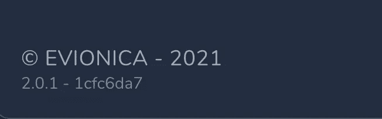

# 如何在 Vue 3 中使用 Webpack 插件将提交散列传递给环境变量

> 原文：<https://javascript.plainenglish.io/passing-commit-hash-to-an-environmental-variable-using-webpack-plugin-in-vue-3-a1d5fcae22e?source=collection_archive---------5----------------------->


Photo by [Nubelson Fernandes](https://unsplash.com/@nublson?utm_source=medium&utm_medium=referral) on [Unsplash](https://unsplash.com?utm_source=medium&utm_medium=referral)

# 如何确定应用程序是从哪个提交构建的？

将应用程序部署到多个实例(例如，许多客户端)可能会导致问题。当有人报告一个错误时，您可能想知道如何确定特定客户端使用的应用程序的版本。在 evonica 中，我们有这样的需求，因为我们的应用程序正在被许多航空公司使用。

当然，有许多不同的方法可以做到这一点。您可以只检查最新的部署，但这需要一些时间。为什么客户端不在错误报告中提供应用版本呢？如果你还没有任何自动化的错误报告工具，找出它的确切版本可能会有点棘手。

当然，你可以在里面的某个地方打印应用程序版本。但是您需要记住在两次发布之间更新它。让我们直截了当地说吧——当你可以自动化的时候，你没有成为一个程序员去执行手工的可重复的任务。


# 我们大多数人使用 git

可能你的应用程序存储在某个版本控制系统中的某个地方(如果你不使用这样的解决方案——你是一个非常勇敢的人😉).让我们假设您在项目中使用 git。有没有比 commit hash 更好的版本标识符？您可以使用以下方式在“终端”中打印它:

```
git rev-parse HEAD
```

这将打印当前提交的 SHA 散列—例如`1dfc6da771f3642c5c75g933bc05ca0d5fff6736`。如果您给这个命令添加标志`--short`，您将得到这个散列的简短版本—例如`1dfc6da7`:

```
git rev-parse --short HEAD
```

# 但是如何在构建过程中将变量传递给应用程序呢？

您可以使用环境变量来实现它。让我们为此创建一个简单的组件。`process.env`不能在模板中直接访问，所以我们可以将它包装在组件数据中。

```
<template>
    <div class="version-info">
        {{ version }}
    </div>
</template><script lang="ts">
import { defineComponent } from 'vue';export default defineComponent({
    data: () => ({
        version: process.env.VUE_APP_VERSION,
    }),
});
</script>
```

好了，我们已经得到了带有打印环境变量的提交散列和模板，但是如何将提交散列传递给环境变量呢？我们可以扩展我们的`vue.config.js`。您需要创建一个 Webpack 插件，并将其添加到`configureWebpack`部分的插件列表中:

```
module.exports = {
    ...
    configureWebpack: {
        plugins: [
            /*** HERE :) ***/
        ],
    },
};
```

要创建一个 Webpack 插件，您需要创建一个`webpack.DefinePlugin`类的实例，并在构造函数中定义您希望在运行时访问的值

```
new webpack.DefinePlugin(runtimeValue)
```

您可以使用这样的`runtimeValue`来定义`process.env`变量

```
{
  'process.env': {
    /*** ENVIRONMENT VARIABLES ***/
  },
}
```

因此，要定义我们的`VUE_APP_VERSION`,我们只需使用:

```
{
  'process.env': {
    VUE_APP_COMMIT_HASH: gitLastCommitHash,
  },
}
```

总的来说，我们有这样的结构:

```
module.exports = {
    ...
    configureWebpack: {
        plugins: [
           new webpack.DefinePlugin({
                'process.env': {
                    VUE_APP_COMMIT_HASH: lastCommitHash,
                },
            }),
        ],
    },
};
```

# 前端 app 中的 Git 命令？

但是现在—如何将终端命令结果传递给`vue.config.js`？文件是在编译过程中加载的，我们可以在这里执行一些节点命令。有一个允许在 js 文件中执行终端命令:

```
const childProcess = require('child_process');childProcess.execSync('/*** COMMAND ***/')
```

作为命令，我们将使用我们的`git rev-parse --short HEAD`。`execSync()`可能会抛出一个错误，所以把它封装在`try-catch`块中并把一个可能的错误输出到控制台是一个很好的做法。

```
const childProcess = require('child_process');try {
  childProcess.execSync('git rev-parse --short HEAD')
} catch (e) {
  console.error(e);
}
```

现在让我们将结果存储到一个变量中。因为我们得到了`try-catch`，我们可能永远得不到结果，所以首先—让我们用空字符串值用`let`初始化变量。然后我们需要将`execSync()`的结果转换成带有`.toString()`的字符串。为了避免多余的空白，我们可以额外使用`.trim()`。

```
const childProcess = require('child_process');let lastCommitHash = '';try {
  lastCommitHash = childProcess
    .execSync('git rev-parse --short HEAD')
    .toString()
    .trim();
} catch (e) {
  console.error(e);
}
```

这样，我们就可以将值传递给之前创建的 Webpack 插件了。为了避免与字符串转义相关的错误，您可以使用`JSON.stringify()`。

就绪文件将如下所示:

```
const childProcess = require('child_process');let lastCommitHash = '';try {
  lastCommitHash = childProcess
    .execSync('git rev-parse --short HEAD')
    .toString()
    .trim();
} catch (e) {
  console.error(e);
}module.exports = {
    configureWebpack: {
        plugins: [
           new webpack.DefinePlugin({
                'process.env': {
                    VUE_APP_COMMIT_HASH: JSON.stringify(lastCommitHash),
                },
            }),
        ],
    },
};
```

# 不难吧，嗯？

通过这种方式，您可以使用编译期间传递的任何外部数据来扩展应用程序。在我们的应用程序中，我们打印了提交散列和来自`package.json`的当前应用程序版本。我们将版本信息组件放在了侧边栏中，让用户可以轻松访问。



Version info next to copyright in the sidebar.

现在，当客户报告一个错误时，我们可以轻松地验证他正在使用的应用程序的版本，以及用于执行构建的提交。

~ Dawid Witulski @ evonica—2021

*更多内容请看*[***plain English . io***](http://plainenglish.io/)