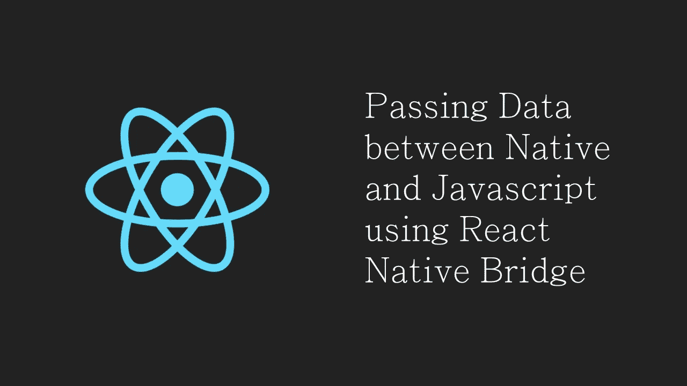

# 如何使用 React Native Bridge 在 Native 和 JavaScript 之间传递数据

> 原文：<https://javascript.plainenglish.io/passing-data-between-native-and-js-using-react-native-bridge-34e783c0b2f8?source=collection_archive---------3----------------------->



我要说的是，在 JavaScript 和我们的本地代码之间架起一座桥梁是 React 本地框架给我们的最好的灵活性之一。大多数开发人员或团队可能会遇到这样的情况:找不到合适的 npm 模块，或者没有足够的时间为用例创建 npm 模块。这里，桥的实现就派上了用场。

如果我们希望在 React Native 项目中使用任何本机 API 或任何其他用本机语言编写的 SDK，我们可以利用 React 本机桥并在本机端实现它，并使用本机和 JavaScript 之间的桥进行双向数据流。

正如官方文件中提到的，有许多方法可以在两个世界之间传递数据。我们将看到以下 3 种相同的方法。

1.承诺
2。回调
3。事件发射器

这里我选择了 **ConnectSDK** 作为原生 SDK 在原生端(Android 和 iOS)实现。Connect SDK 是一个开源框架，将您的移动应用程序与多个媒体设备平台连接起来。我们将在本机端实现一些 API，并将其发送到 JavaScript 端，同时，我们将从 JavaScript 端向本机端传递一些数据。

# 第一步

在下面链接的帮助下创建一个 React 本地项目。

[](https://reactnative.dev/docs/environment-setup) [## 设置开发环境

### 该页面将帮助您安装和构建您的第一个 React 本机应用程序。如果您是移动开发的新手，那么…

反应性发展](https://reactnative.dev/docs/environment-setup) 

从 App.js 中移除默认代码并添加您自己的组件，或者您可以添加以下代码。我添加了一个简单的堆栈导航屏幕。为此，您必须安装节点模块“@react-navigation/native”和“@react-navigation/stack”。有关 react-navigation 的更多详情，请点击以下链接。

【https://reactnavigation.org/docs/getting-started/ 

现在，尝试在 android 中使用*npx react-native run-Android*，在 ios 中使用 *npx react-native run-ios* 运行应用。

# **第二步**

集成 ConnectSDK(如果您正在使用其他 SDK，可以跳过这一步)

**安卓**

将这一行添加到您的应用程序 build.gradle 并同步 gradle

添加必要的权限。

我们必须在 Android 项目中创建两个 java 文件。一个是本地模块类，我们将在其中编写可以与 JavaScript 端通信的方法，另一个文件是 React 包，我们将在其中注册这个本地模块。然后，这个包将被添加到 MainApplication.java 文件中的 ReactNativeHost。

在你的 android 根目录下创建 ConnectSDKNative.java 和 ConnectSDKNativePackage.java。您可以根据您选择的 SDK 来命名您的模块。在各自的文件中添加以下代码行。

Android 中所有的 Java 原生模块都需要实现`getName()`方法。此方法返回一个字符串，该字符串表示本机模块的名称。然后，可以在 JavaScript 中使用本机模块的名称来访问它。例如，上面的代码片段`getName()`返回`"ConnectSDKNative"`。您可以用您的模块名替换它。

将包添加到 MainApplication.java get packages()列表。

在 MainApplication.java 添加下面一行，用于启动设备发现。

```
DiscoveryManager.*init*(getApplicationContext());
```

现在 ConnectSDK 的初始设置已经完成。

# 第三步

设置 JavaScript 端

既然我们已经完成了 java 和 iOS 原生端的集成，让我们在 JavaScript 端做一些 UI 添加。我将创建一个简单的 UI，带有一个启动设备发现的按钮和一个显示发现项目的列表。

在上面的补丁中，const { ConnectSDKNative } = native modules 让 JavaScript 可以访问本机模块。使用它，我们可以调用将要在本地模块中编写的方法。

# **第四步**

实现本机方法并将其公开给 JavaScript。

如前所述，我们可以根据 Java 和 JavaScript 之间的通信需求使用承诺、回调或事件发射器。

1.  首先我们来看**回调**的案例。对于异步方法，回调用于将数据从 Java 传递到 JavaScript。它们还可以用于从本机异步执行 JavaScript。在你的函数参数中我们只能有两个回调——一个 successCallback 和一个 failureCallback。此外，本机模块方法调用的最后一个参数(如果是函数)被视为 successCallback，而本机模块方法调用的倒数第二个参数(如果是函数)被视为 failure callback。如果 JS 要发送任何参数，我们可以在回调之前添加它们。

需要注意的一个重要细节是，本机模块方法一次只能调用一个回调。这意味着您可以调用成功回调或失败回调，但不能同时调用两者，并且每个回调最多只能调用一次。

在 JavaScript 方面，我们将编写代码来调用该方法并接收其回调。

2.现在我们将使用**承诺**。承诺可以根据成功和失败来解决和拒绝方法调用。Reject 方法可以有不同的参数，如错误代码、消息、WriteableMap 对象。

这个控制台日志将打印使用 Promise 从 Java 端传递的消息。

3.**事件发射器**是我们在 Java 和 JavaScript 之间传输数据的第三个选择。在这种情况下，我们不必创建 ReactMethod 并调用它。从本机端，我们将发出事件/信号，这些事件/信号将被我们在 JS 端编写的 Javascript 代码监听。由 React Native 给出的 *NativeEventEmitter* 将帮助我们监听这些事件。它有一个 *addlistener* 方法，我们将在其中指定事件名称，并捕获函数调用中的传入数据。而在 Java 端， *RCTNativeAppEventEmitter* 类帮助发出这些事件和数据。在 Android 中需要注意的另一点是，我们不能将 Java 数据类型直接转移到 JavaScript 端。我们需要用 Javascript 能够理解的方式包装它。react 桥为我们提供了助手类，如 *WriteableMap* 、 *WriteableArray、*等。

在将自定义对象添加到事件发出方法之前，我们必须将其转换为 WriteableMap。您可以在本文末尾的 GitHub 链接中找到 helper 方法。此外，如果你想参考整个项目的源代码，你可以去相同的 GitHub 链接。

那都是乡亲们！！这是相当多的编码，对不对？但是相信我，一旦你得到它，它真的很有趣。目前，这是只有 Android 集成。我正在做 iOS 原生代码添加。很快，我将在本文中添加这一点。

如果你觉得这篇文章有用，请留下一些掌声。这将是我做出更多贡献的巨大动力。祝编码愉快！

[](https://github.com/mohitau/RNBridgeAWSSample) [## mohitau/RNBridgeAWSSample

### 在 GitHub 上创建一个帐户，为 mohitau/RNBridgeAWSSample 开发做贡献。

github.com](https://github.com/mohitau/RNBridgeAWSSample) 

*更多内容请看*[*plain English . io*](http://plainenglish.io/)