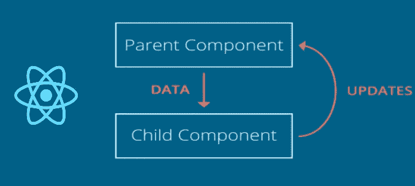
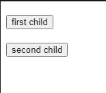
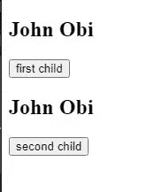
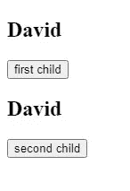

# 在 TypeScript React 中将数据从子组件传递到父组件

> 原文：<https://javascript.plainenglish.io/passing-data-from-child-to-parent-component-in-typescript-react-92ab6d03ceb1?source=collection_archive---------0----------------------->


在现代前端开发中，由于其复杂性和规模，需要健壮的库、工具和框架。使用 ReactJS，我们能够有效地管理复杂的状态、动画、频繁的更新和 DOM 操作。另一方面，Typescript 已经成为克服 JavaScript 的大部分缺点(如松散类型)的一座巨大桥梁。

在本文中，我将向您介绍如何在 react 中使用 typescript 将数据从子组件传递到父组件，所以请喝杯咖啡继续阅读。

# React 中的数据流



data flow | react

基本上 react 被设计成有一个**单向**数据流，这个概念意味着**数据**有一个且只有一个方式被传输到应用程序的其他部分，即状态被传递到视图和子组件。

下面是显示数据流的简单代码片段

```
// parent.tsxconst Parent:React.FC = () => {const [parentName, setParentName] = useState<string>('John Obi')return (
     <div> <FirstChild name={parentName} />
       <SecondChild name={parentName} /> </div> )
}
```

这是状态通常被移动到组件树顶部的原因之一，这样它们可以在需要访问它的组件之间共享。

此外，值得注意的是，在 react 应用程序的这种通用单向数据流中，子组件的状态变化不会影响父组件，而只会影响子组件以及子组件的子组件(如果有)。

我将介绍克服这一缺点的基本方法，还有其他方法，其中之一是使用一个全局存储，如 redux 和上下文 API。

# 克服这个缺点

首先，让我们定义上面看到的父组件的子组件

```
// firstChild.tsxinterface IfirstChildProps {
  name: string}const FirstChild: React.FC<IfirstChildProps> = ({name}) => {const [firstChildName, setFirstChildName] = useState<string>('')return (<section>
  <h1> {firstChildName} </h1>
 <button> first child </button>
</section>)}export default FirstChild;
```

在 typescript 中，你必须为所有东西定义类型，因此，对于我们的*第一个孩子*组件，我们将她的道具声明为类型*ifirschildprops*并将*名称*道具声明为字符串。我们也给了它一个本地状态 *firstChildName* ，在未来，我们将致力于使本地状态值成为其父组件的状态。

*记住默认情况下，在 react 中，你只能单向传递数据或状态，即从父组件到子组件*

现在让我们以同样的方式声明 *secondChild* 组件

```
// secondChild.tsxinterface IsecondChildProps {
  name: string}const SecondChild: React.FC<IsecondChildProps> = ({name}) => {const [secondChildName, setSecondChildName] = useState<string>('')return (
<section>
 <h1> {secondChildName} </h1>
  <button>second child</button></section>)}export default SecondChild;
```



这只是呈现子组件中的按钮和一个 empy h2 html 标记。

所以此时，我们将为每个子组件添加[*use effect*](https://reactjs.org/docs/hooks-effect.html)*钩子，它将 *parentName* prop(来自父组件)设置为其子组件的本地状态名称(F *irstChildName* ，S*second child name*)的值。*

```
*// firstChild.tsxinterface IfirstChildProps {
  name: string}const FirstChild: React.FC<IfirstChildProps> = ({name}) => {const [firstChildName, setFirstChildName] = useState<string>('')useEffect(() => { setFirstChildName(name)},[name]) ...export default FirstChild;*
```

*请注意，名称属性被添加到 *useEffect* 钩子的依赖关系中，这样，一旦组件挂载，并且名称属性发生变化，它将重新渲染组件*

*让我们对 *SecondChild* 组件做同样的事情*

```
*// secondChild.tsxinterface IsecondChildProps {
  name: string}const SecondChild: React.FC<IsecondChildProps> = ({name}) => {const [secondChildName, setSecondChildName] = useState<string>('')useEffect(() => {setSecondChildName(name)},[name]) ...export default SecondChild;*
```

**

*现在，我们可以看到父组件中的名称“John Obi ”,同时呈现在两个组件上*

## *履行*

*此时，我们将实现我们的目的— *将数据从子组件传递到父组件**

*让我们从向父组件添加一个助手函数开始。让我们将这个函数命名为 *updateName* ，这个函数将接受一个字符串类型的参数，并在被调用时更新父组件的状态。*

```
*// parent.tsxconst Parent:React.FC = () => {const [parentName, setParentName] = useState<string>('Mr John Obi');const updateName = (name: string):void => {
     setParentName(name)
}return (
     <div> <FirstChild name={parentName} />
      <SecondChild name={parentName} /> </div>)
}*
```

*好吧，我认为这很简单*

*接下来，我们将这个函数作为道具传递给子组件*

```
*// parent.tsxconst Parent:React.FC = () => {const [parentName, setParentName] = useState<string>('Mr John Obi');const updateName = (name: string):void => {
     setParentName(name)
}return (
     <div> <FirstChild name={parentName} updateName={updateName} />
       <SecondChild name={parentName} updateName={updateName} /> </div>)
}*
```

*呜！typescript 应该在这里对你大吼大叫，因为你为组件传递了一个属性，而不是属性类型(接口)的一部分，不要担心，我们将在接下来的几段中修复它*

*我们将简单地添加这个 *updateName* 道具，作为每个孩子的道具的类型定义(接口)的一部分*

```
*// firstChild.tsx...interface IfirstChildProps {
  name: string,
updateName: (arg: string) => void}const firstChild: React.FC<IfirstChildProps> = ({name, updateName}) => { ...export default firstChild;*
```

*同样，对 S*second child*组件进行同样的操作*

```
*// secondChild.tsx...interface IsecondChildProps {
  name: string,
  updateName: (arg: string) => void
}const SecondChild: React.FC<IsecondChildProps> = ({name, updateName}) => {...export default SecondChild;*
```

*我认为我们已经走了很长一段路，在这一点上，我们将添加一个 onclick 事件到每个孩子的按钮上，这样当点击时， *updateName* 函数将用一个给定的字符串调用*

*让我们把我们的 Fi *rstChild* 组件 **Micheal** ，和我们的 *secondChild* 组件 **David** ，所以当每个子组件中的按钮被点击时，它显示名字，Micheal 或 David。*

*我们走吧？*

```
*...return ( <h1> {firstChildName} </h1>
  <button onClick={() => updateName('Micheal')}>first child</button> )}export default firstChild;*
```

*对 S *第二胎*组件进行同样的操作*

```
*...return ( <h2> {secondChildName} </h2>
  <button onClick={() => updateName('David')}>second child</button>)}export default secondChild;*
```

**恭喜！，您刚刚将数据从子节点传递到父节点**

*哇！很简单，对吧？尝试单击按钮，看到姓名更新为 David 或 Micheal*

**

*result when on the first-child button is clicked*

**

*result when the second-child button is clicked*

# *结论*

*一般来说，react 有一个单向的数据流，也就是说，数据是单向流动的——从父节点到子节点。但是反过来传递数据的基本策略是*从父组件到子组件传递和调用带有所需数据的函数。**

*希望你今天学会了酷，感谢阅读这篇文章，你可以在这里获得完整的代码，也可以在 [Twitter](https://twitter.com/AI_Lift) 、 [Github](https://github.com/armstrong99) 和 [Linkedin](https://www.linkedin.com/in/ndukwearmstrong/) 上关注我，祝你有美好的一天。*

**更多内容请看*[***plain English . io***](http://plainenglish.io)*