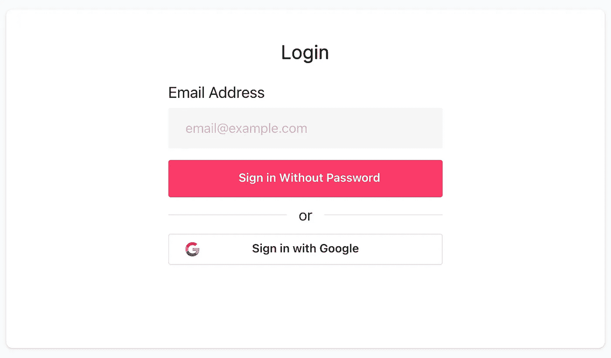

# 使用 Next.js 和 Cotter 进行无密码登录

> 原文：<https://javascript.plainenglish.io/passwordless-login-with-next-js-and-cotter-b07c434a9b51?source=collection_archive---------21----------------------->



An authentication form built using Next.js and Cotter

# 介绍

构建用户身份验证(以及随之而来的所有开销)非常耗时，当您希望并需要首先专注于构建您的产品时，您需要寻找能够帮助您在不打折扣的情况下做正确事情的解决方案。

因此，使用身份验证提供者确实可以在早期阶段**帮助加快开发**的速度，为您节省构建时间，并为您的用户登录提供简单、经过测试的体验。

找到一个同时支持这两者的提供商是理想的选择，拥有无密码登录是实现这一目标的重要一步，这也是我选择的原因:

*   [密码](https://www.cotter.app/) -一种无代码和低代码的无密码登录提供商，为您的网站/应用添加登录体验提供了可定制的解决方案
*   [Next.js](https://nextjs.org/) -一个 React 框架，为用户和开发人员的工作效率提供了许多聪明的特性，因此您可以专注于构建——我这里使用的是 11.1 版(我使用的是 TypeScript，但是同等的 JavaScript 应该足够接近了！)

# 设置

为了缩短本教程，我假设:

1.  您的开口销帐户和登录表单是按照您的要求设置的
2.  您至少有了一个基本的 Next.js 应用程序设置，可以开始了！

## 开口销集成方法

现在，科特提到了**两种**方法来集成和反应:

1.  `CotterProvider`通过`cotter-react` — [链接](https://github.com/cotterapp/cotter-react)
2.  或者通过他们的通用 JavaScript 库`cotter` — [链接](https://github.com/cotterapp/cotter-js)

我在这个阶段也没有使用过，所以在这个教程中，我将使用第一个，即`CotterProvider` / `cotter-react`。

# 开始

**所需时间:约 10 分钟。**

**参考文献:**

*   [https://github.com/cotterapp/cotter-react](https://github.com/cotterapp/cotter-react)
*   OR-cutter Dashboard >*Project*>*Form&field-*在*设置说明*部分，然后在 *With Code* 部分，然后在选择的下拉列表中*reaction*

***注意:*** *使用一个 React* `*Provider*` *在 Next.js 中需要* [*一个自定义 App 组件*](https://nextjs.org/docs/advanced-features/custom-app) *。*

## 步伐

**1。**运行
`npm install cotter-react —-save`安装开口销提供器(包含在`cotter-react`中)

**2。**如果您没有自定义的 Next.js 应用程序，请创建一个([详细信息在此处](https://nextjs.org/docs/advanced-features/custom-app))并用`CotterProvider`包装您的应用程序，如下所示:

```
function MyApp({ Component, pageProps }) {
  return (
**<CotterProvider apiKeyID={process.env.cotterApiKeyId}>**
      <Component {...pageProps} />
    **</CotterProvider>**
  )
}
```

***提示:****`*process.env.cotterApiKeyId*`*是由*[*next . js 环境变量*](https://nextjs.org/docs/api-reference/next.config.js/environment-variables) *提供的，你把它添加到你的****next . config . js****(或者直接把你的粘贴进去就行了！)**

***3。使用登录页面认证您的用户***

***a)将登录页面添加到您的`pages`文件夹— [docs](https://nextjs.org/docs/basic-features/pages)***

***b)将`LoginForm`组件导入到您的登录页面:
`import { LoginForm } from 'cotter-react'`***

***c)添加具有以下**占位符**属性的`LoginForm`组件(您稍后将根据需要更新这些属性)***

***因此，您的登录页面代码现在应该如下所示:***

```
***import React from 'react';**import { LoginForm } from 'cotter-react'**function Login() {
  return (
    <div>
      <h1>Login</h1>
      **<LoginForm
        type="undefined"        // EMAIL or PHONE
        authMethod="undefined"  // OTP or MAGIC_LINK
        width={'auto'}          // Width of form
        height={300}            // Cotter recommend 300x300 minimum
        formID={"form_default"} // From your Cotter config (default)** **// Placeholder/sample authentication handlers:
        onSuccess={(response) => console.log(response)}
        onError={(err) => console.log(err)}
      />**
    </div>
  )
}export default Login***
```

***根据您的 Cotter 配置(和应用程序风格)，它应该呈现如下内容:***

******

***A Cotter LoginForm component configured to offer an email address or use Google authentication***

## ***完成的***

***您现在可以开始使用`CotterProvider`获取信息，如**认证状态**或**当前用户信息！*****

***例如***

```
***import React, { ***useContext***} from 'react';
import { LoginForm } from 'cotter-react'function Login() {
  **const {   
    isLoggedIn,
    isLoading,** user,
    getAccessToken,
    logout,
    getCotter,
    apiKeyID,
    checkLoggedIn **} = *useContext*(*CotterContext*);**return (
    <div>
      <h1>Login</h1>
      **{isLoading ? (
        'Loading...'
      ) : isLoggedIn ? (
        'Hello user!'
      ) : (**
        <LoginForm
          type="EMAIL"
          authMethod="MAGIC_LINK"
          width={'auto'}
          height={300}
          formID={'form_default'}
          onSuccess={(response) => *console*.log(response)}
          onError={(err) => *console*.log(err)}
        />
      )}
    </div>
  )
}export default Login***
```

***更多信息请点击这里:
[https://github . com/cotter app/cotter-react # using-the-cotter provider](https://github.com/cotterapp/cotter-react#using-the-cotterprovider)***

# ***接下来呢？***

***这只是与 Cotter 的初始、基本集成。在适当的时候，我将探索和分享如何将它用于用 Next.js 构建的面向公众的应用程序，以及其他主题，包括:***

*   ***无头 CMS 集成实践***
*   ***静态和动态服务器端生成***

***如果你想看更多关于这个系列的内容，[在 Twitter](https://twitter.com/dfjsc) (或 Medium)上关注我，我会在那里分享更新和更多内容。***

****更多内容请看*[***plain English . io***](http://plainenglish.io)***