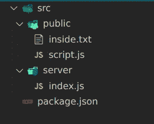

# Node.js 中的路径模块

> 原文：<https://javascript.plainenglish.io/path-module-in-node-js-46a244a9e47b?source=collection_archive---------3----------------------->


Photo by [Lagos Techie](https://unsplash.com/@heylagostechie?utm_source=medium&utm_medium=referral) on [Unsplash](https://unsplash.com?utm_source=medium&utm_medium=referral)

在 Node.js 中，path 模块是一个处理路径和目录的内置模块。每个操作系统都有自己管理路径和相关操作的方式。例如，在 Windows 中，文件路径在目录之间用“\”表示，但在 Linux 中，文件路径在目录之间用“/”表示。

```
WINDOWS:
C:\\user\sankalp\projects\file.txtLINUX:
home/sankalp/projects/file.txt
```

为了使路径平台独立，Node.js 有一个模块叫做 *path。使用这个路径模块，我们可以避免任何不一致。我们可能需要使用内置的路径模块:*

```
const path = require('path')
```

path 模块中有许多函数，在处理项目时，这些函数对处理文件或目录的路径非常有帮助。那么让我们来理解一下 path 模块中一些最重要的函数。

**path.normalize()** :当我们使用任何文件、目录甚至 URL 路由的路径时，我们希望路径具有任何操作系统都能理解的正确结构。这就是 path.normalize()方法的作用。它接受一个字符串作为参数，并通过修正斜杠('/')来修正路径结构，解析".", ".."并且还可以删除作为字符串传递的路径中的重复斜杠

```
const filePath = ".//src//server"
const fixedFilePath  = path.normalize(filePath)
console.log(fixedFilePath);//OUTPUT
**src/server**const filePath = "src/server/.."; *// .. means one directory up*
const resolvedPath = path.normalize(filePath);
console.log(resolvedPath);//OUTPUT
**src**const myUrl = "www.google.com//images";
const fixedUrl = path.normalize(myUrl);
console.log(fixedUrl);//OUTPUT
**www.google.com/images**
```

**path.basename():**

顾名思义，basename 方法返回路径的最后一个名称。它既可以返回文件名(如果它存在)，也可以返回目录名。

```
const filePath = path.basename("./src/server/index.js");console.log(filePath);//OUTPUT
**index.js**
```

如果我们将文件扩展名作为另一个参数传递给 basename()，它将从文件名中排除它

```
const filePath = path.basename("./src/server/index.js", ".js");console.log(filePath);//OUTPUT
**index**
```

**path.dirname():**

这个方法返回一个路径的目录名。如果路径末尾有一个目录，那么它将返回路径的最后一个目录所在的名称目录。对于文件，同样的条件也适用。

```
const filePath = path.dirname("./src/server/index.js");
console.log(filePath);//OUTPUT
**./src/server**const dirPath = path.dirname("./src/server");
console.log(dirPath);//OUTPUT
**/src**
```

**path.extname():**

此方法返回文件的扩展名。

```
const filePath = path.extname("./src/server/index.js");
console.log(filePath);//OUTPUT:
**.js**
```

**path.resolve()**

这个方法用于获取任何文件的绝对路径。这是最有用的方法之一，可以帮助你获得一个文件的绝对路径。假设您正在一个项目中工作，并且有一个绝对文件路径。如果另一个人在他的系统中克隆了你的项目，那么这个路径就不是他系统中的绝对路径。此问题通过 path.resolve 方法解决。

```
const absPath = path.resolve("./src/server/index.js");
console.log(absPath);//OUTPUT
**/home/sankalp/pathLearn/src/server/index.js**
```

当我们向它传递两个参数时，它将通过追加返回完整的绝对路径。

```
const absPath = path.resolve("./src/server", "app.js");
console.log(absPath);//OUTPUT
**/home/sankalp/pathLearn/src/server/app.js**
```

如果您在 path.resolve()的参数中传递多个路径，它将解析最后一个路径，如果您传递除 path 之外的任何内容，它将只追加它。

```
console.log(path.resolve("/one", "two", "three"));//OUTPUT
**/one/two/three**console.log(path.resolve("/one", "/two", "/three"));//OUTPUT
**/three**
```

**path.join()**

该方法执行两项任务。一个是它连接了所有的参数，另一个是它也规范了路径。

```
const filePath = path.join("src", "server", "//index.js");
console.log(filePath);//OUTPUT
**src/server/index.js**
```

***__dirname* :** 这不是 path 模块的一部分，但是告诉你在其中执行这个的文件的绝对路径。它是一个模块化的[环境变量](https://www.section.io/engineering-education/nodejs-environment-variables/)。当你在项目中处理路径名时，这是非常有用的。

```
console.log(__dirname);//OUTPUT
**/home/sankalp/pathLearn/src/server**
```

我的 *index.js* 文件在服务器内部，所以当我执行 *index.js* 时，输出是 *index.js* 的绝对路径

**注:**

__dirname 可用于获取项目中任何文件的绝对路径，方法是使用 path.join()将其组合起来



```
console.log(path.join(__dirname, "../public/inside.txt"));//OUTPUT
**/home/sankalp/pathLearn/src/public/inside.txt**
```

*更多内容看* [***说白了. io***](http://plainenglish.io/)