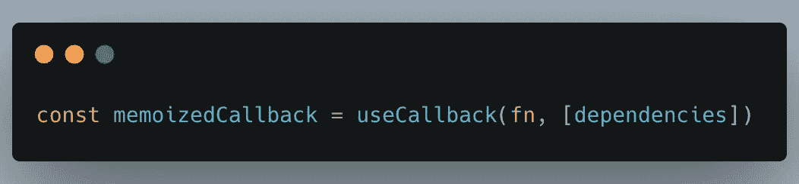
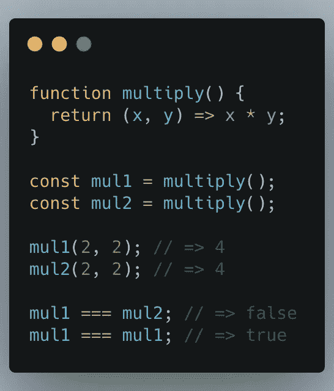
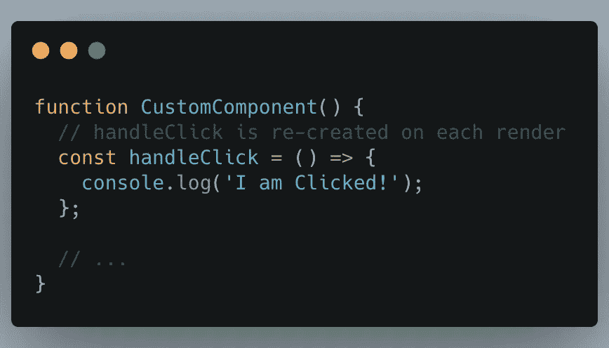
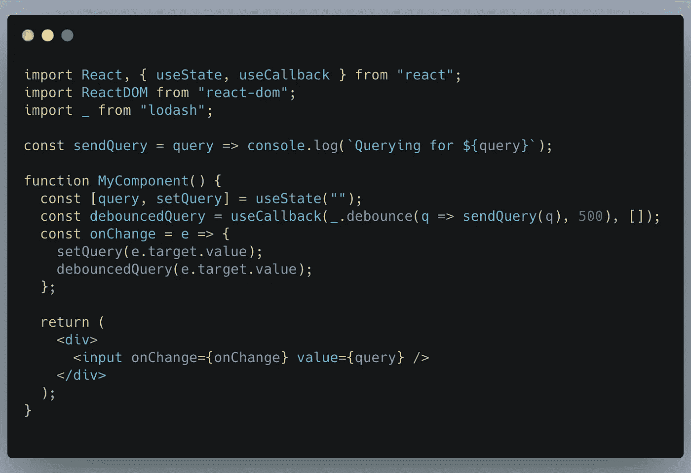
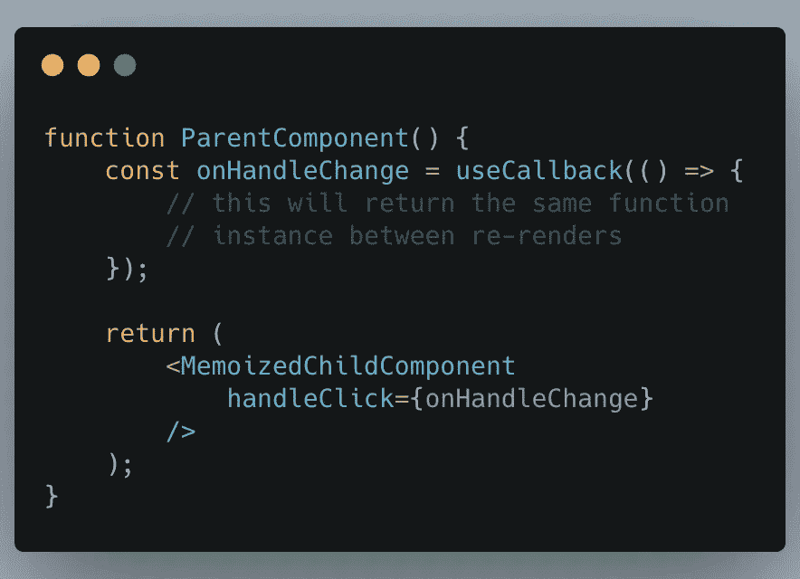
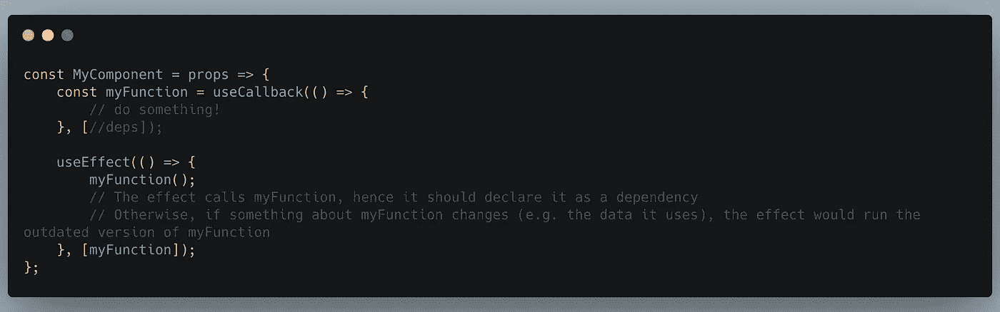

# 如何使用 React.useCallback()

> 原文：<https://javascript.plainenglish.io/path-to-react-usecallback-c7f20e4a27a0?source=collection_archive---------9----------------------->

你一定经常听到这样的话:我们应该使用 **useCallback()** 到来记忆回调函数，以防止无用的组件重渲染。

但是 **useCallback()到底是什么呢🤔**。你想过吗？

让我来帮助你理解它是什么以及在哪里正确使用它。

# **让我们先了解函数相等检查**

在看到我们如何使用它之前，让我们看看它解决了什么问题。让我们编写一个返回函数的简单函数:

`*mul1*`和`*mul2*`是两个数相乘的函数。它们是由*乘*函数创建的。

JavaScript 中的函数是常规对象。函数`*mul1*`和`*mul2*`共享相同的代码，但它们是不同的函数对象。比较它们评估为*假*。

这就是 JavaScript 对象的工作方式。一个对象(包括一个函数对象)只等于它自己。

# 现在说明 useCallback()的目的和正确用法

**React.useCallback()** 基本上解决了我们上面看到的函数相等性检查。共享相同代码的不同函数对象通常在 React 组件内部创建:

*handleClick* (内嵌函数)在 *CustomComponent* 的每次渲染上都是不同的函数对象。

> 让函数与 React 组件内联声明也没有坏处。它不会对性能产生有害影响。

但是在某些情况下，您需要在渲染之间维护单个函数实例:

1.  比如当函数具有某种内部状态时，例如当函数被去抖/节流时

在上面的例子中，如你所见，去抖函数被包装在 **useCallback()** 下，如果我们不这样做，那么每次组件被重新评估时，局部变量被再次初始化，并且每次按键 500 毫秒后*去抖查询*被调用。

2.包装在`*React.memo()*`内部的一个功能组件接受一个功能对象 prop。

如果接受回调的子组件依赖于引用等式检查(例如: *React.memo()* 或*shouldComponentUpdate()*)来防止当其属性改变时不必要的重新呈现，那么任何回调属性在呈现之间不改变是很重要的。

因此，在父组件中，我们可以将回调属性包装在 *useCallback()* 中，并保证它将相同的函数对象向下传递到优化的子组件中。

3.当函数对象依赖于其他钩子时，例如`*useEffect(..., [callback])*`

在上面的例子中，如果 *myFunction* 做了一些导致 *MyComponent* 重新构建的事情(例如，如果它做了一些改变道具或状态的事情),就会导致你进入一个无限循环状态。

为了防止这种情况，我们将 **useCallback()** 包装在一个函数周围，并定义它的依赖关系，以确保该函数只有在其依赖关系改变时才会被重新创建。因此，该函数不再在每个渲染周期重新声明

所以上面的用例是当， **useCallback** hook 是有帮助的:给定相同的依赖值，钩子在渲染之间返回相同的函数实例并提高性能。

希望它能帮助你理解在哪里实际使用 **useCallback()** 。

**参考:**https://dmitripavlutin.com/dont-overuse-react-usecallback/

感谢您阅读这篇文章。如果你喜欢它，请在评论中告诉我们。

*更多内容看* [***说白了. io***](http://plainenglish.io)