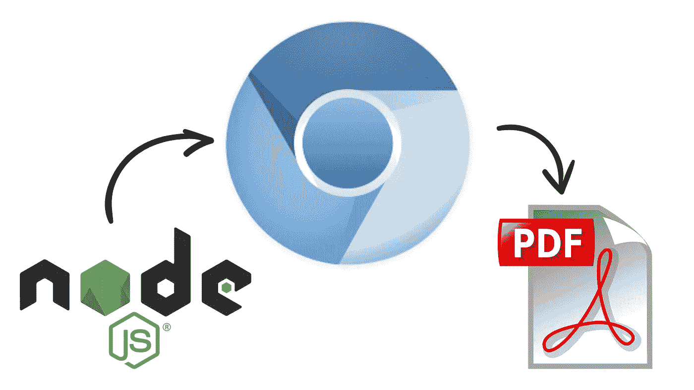
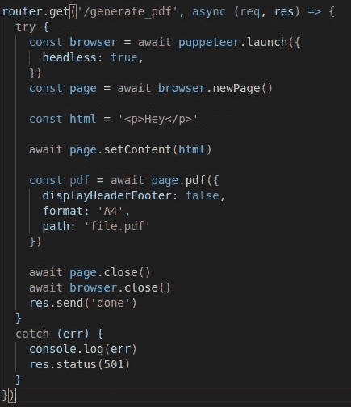
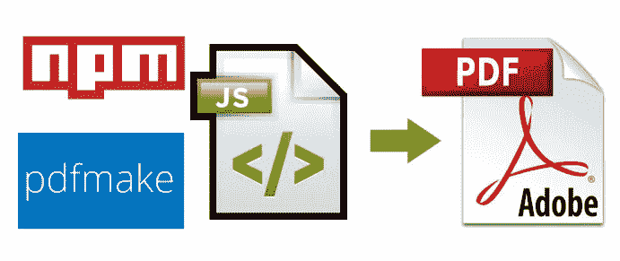
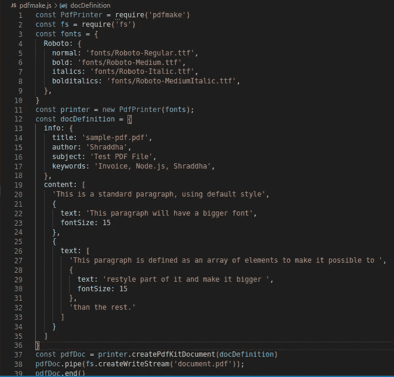

# Node.js 中的 PDF 生成

> 原文：<https://javascript.plainenglish.io/pdf-generation-in-node-js-5015f7bbd522?source=collection_archive---------3----------------------->


Pdf generation in Nodejs

pdf 是我们日常生活中常用的文档之一。 **PDF** 表示可移植文档格式，用于以电子形式显示文档，与查看文档的软件、硬件或操作系统无关。一个 **PDF** 的主要目的是在不同的操作系统和设备之间共享文档。

pdf 通常用在任何地方，包括发票、电子书、申请表等。

在今天的帖子中，我们将看到在 Node.js.
中创建 pdf 的两种方法。使用木偶师。
2。PDF 制作包

## 木偶师:

Puppeteer 是一个节点库，它提供了一个高级 API 来通过 DevTools 协议控制 Chrome 或 Chrome。默认情况下，Puppeteer 是无头运行的，但是可以配置为运行完整的(非无头)Chrome 或 Chrome。使用木偶师，你可以渲染文档，然后从中生成 PDF 文件。



步骤 1:使用 npm 或 yarn 安装木偶师

```
npm i puppeteer
or 
yarn add puppeteer
```

木偶师有很多依赖。因此，请确保它与您的节点版本兼容。

步骤 2:导入木偶师

```
const puppeteer = require('puppeteer');
```

步骤 3:启动浏览器

```
const browser = await puppeteer.launch({
 headless: true
})
```

headless 选项指定了一个布尔值，该值指示木偶师是否在 headless 模式下启动 Chromium。在启动木偶师时，你有很多选择，你可以在这里阅读它们[。您可以在开发时关闭 headless 模式，这让您可以看到幕后发生了什么。](https://github.com/puppeteer/puppeteer/blob/v9.1.1/docs/api.md#puppeteerlaunchoptions)

步骤 4:创建新的浏览器页面

```
const page = await browser.newPage();
```

这类似于在浏览器中打开一个新的选项卡，您可以在其中呈现您的 HTML。

第五步:将内容设置为页面。

```
const html = '<p>Hello world!</p>'
await page.setContent(html)
```

set content 方法用于设置呈现的 HTML 内容。

步骤 6:生成 pdf 并关闭页面

```
await page.pdf({ 
 path: 'sample-pdf.pdf', 
 format: 'A4',
 displayHeaderFooter: false,
});
await page.close()
```

Page.pdf 方法采用多个选项，如
i. path，指定 pdf 文件的输出路径。
二。格式指定了纸张格式。
三。displayHeaderFooter 指定一个布尔值，该值指示是否包含页眉&页脚。
点击可以了解更多选项[。](https://github.com/puppeteer/puppeteer/blob/v9.1.1/docs/api.md#pagepdfoptions)

步骤 7:关闭浏览器

```
await browser.close()
```

由于 chrome 相当笨重，因此一旦生成 pdf，就必须关闭浏览器，以避免内存泄漏。



PDF generation API using puppeteer

## PDFMake:

PDF make 是一个轻量级的纯 javascript 库，用于生成 PDF。



步骤 1:通过 npm 安装软件包

```
npm i pdfmake
```

步骤 2:导入包

```
const PdfPrinter = require('pdfmake')
```

步骤 3:使用字体创建 pdf make 的新实例

```
const printer = new PdfPrinter(fonts)
```

步骤 4:在 docDefinition 对象中设置文档的内容

```
const docDefinition = {
content: [
 'This is a standard paragraph, using default style',
 {
  text: 'This paragraph will have a bigger font',
  fontSize: 15
 },
 {
 text: [
  'This paragraph is defined as an array of elements to make it possible to ',
  {
   text: 'restyle part of it and make it bigger ',
   fontSize: 15
  },
  'than the rest.'
  ]
 }]
};
```

“docDefinition”包含一个数组对象，该对象指定要在 pdf 文件上显示的内容。你可以在[官方文档](https://pdfmake.github.io/docs/0.1/document-definition-object/styling/)中了解更多信息。

步骤 5:通过调用方法创建 pdf

```
const pdfDoc = printer.createPdfKitDocument(docDefinition)
```

CreatePdfKitDocument 方法将文档定义和缓冲区选项作为参数，并以缓冲区页面的形式从中生成一个文档。

步骤 6:传输 pdf 内容

```
pdfDoc.pipe(fs.createWriteStream('document.pdf'));
```

**pipe** ()方法用于将 pdf 内容的可写流附加到打印机流，以便它随后切换到流动模式，然后将所有数据推送到附加的可写流。

第七步:关闭流

```
pdfDoc.end()
```



## **在木偶戏演员中选择哪一个& pdfmake:**

1.木偶师通过使用 HTML 模板生成 pdf，这使得开发者可以编写 HTML 模板并动态生成 pdf。而 pdfmake 使用自己的对象数组结构，这使得创建具有大量自定义样式的多页 pdf 变得困难。

2.要创建 PDF，每次都需要启动 Puppeteer，这会产生一些开销。它是缓慢的。而 pdfmake 速度更快，因为它不打开任何浏览器。

3.使用木偶师时，您可以使用任何字体。当您在使用 Webpack 时尝试嵌入自定义字体时，Pdfmake 可能会遇到问题。

4.如果您使用 Docker 来部署您的节点应用程序，安装 puppeteer 需要额外的步骤，而 pdfmake 可以通过您的 package.json 来安装。

因此，根据你的标准，你可以选择任何一个包。就我个人而言，我使用木偶戏，因为与 pdfmake 相比，它在渲染方面提供了更多的灵活性。

***感谢您的阅读。*** *如果您有任何问题或想了解更多关于任何技术或方法的信息，请随时发表评论！*

*更多内容请看*[*plain English . io*](http://plainenglish.io/)