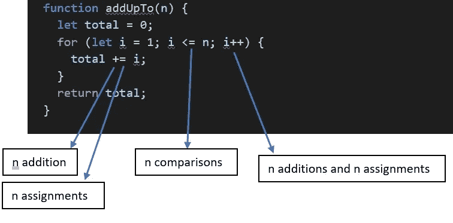
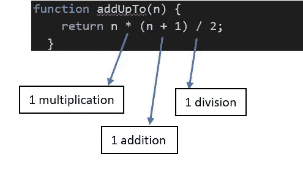

# JavaScript 中数组和对象的高性能

> 原文：<https://javascript.plainenglish.io/performance-of-arrays-and-objects-in-javascript-through-the-lens-of-big-o-5a7c5891a43f?source=collection_archive---------3----------------------->


Performance

当我们处理大量数据来执行搜索、排序、访问、插入和删除元素等操作时，程序的效率将直接依赖于**时间复杂度**。

我们可以根据增强性能的需要有选择地使用对象和数组。我们借助 Big-O 符号来比较和对比数组和对象的运行时，以便清楚地理解它们。

让我们从时间复杂性的角度快速理解 Big-O 符号的概念。

Big-0 符号有助于正式计算算法的效率。

为了比较算法，我们不应该考虑:

*   **执行时间**——因为它们是特定于特定计算机的。
*   **执行的语句数量** —因编程语言而异。

*比较算法的理想方式是根据输入的大小计算计算机必须执行的运算次数。*

让我们看一个简单的例子。计算从 1 到某个数字 *n* 的所有数字的和。

**低效解决方案:**



这里，操作的数量随着输入(n)大小的增加而增加。

**高效解决方案:**



这里，无论输入大小如何，操作的数量保持不变。

因此，我们可以这样定义 Big-0 符号:随着 **n** 的增加，如果计算机必须做的简单运算的数量最终小于一个常数乘以 **f(n)** ，则算法为**O(f(n)】**。

f(n)可以是线性的(f(n) = n)。

```
function addUpTo(n) {
let total = 0;
for (let i = 1; i <= n; i++) {  // O(n)
 total += i;
}
return total;
}
```

f(n)可以是常数(f(n) = 1)。

```
function addUpTo(n) {
return n * (n + 1) / 2; // O(1)
}
```

f(n)可以是二次的(f(n) = n)。参见下面的例子。这里，当输入大小增加时，操作的数量将二次增加，就像循环 **O(n)** 中的循环 **0(n)** 一样。O(f(n)) * O(f(n)) = O(f(n))

```
function printAllPairs(n) {
 for (var i = 0; i < n; i++) {  // O(n)
  for (var j = 0; j < n; j++) { // O(n)*O(n)
  console.log(i, j);
  }
 }
}
```

现在让我们通过 Big-O 的镜头来理解对象和数组是如何工作的。

当我们需要快速访问、插入和移除元素时，将使用对象，因为在插入和移除元素时，对象比数组快得多。

物体的大 O:

*   插入— **O(1)**
*   移除— **O(1)**
*   访问— **O(1)**
*   正在搜索— **O(n)**

对象方法的大 O:

*   Object.keys — **O(n)**
*   Object.values — **O(n)**
*   Object.entries — **O(n)**
*   hasOwnProperty — **O(1)**

当我们需要订单时，就会用到数组。但是使用数组的代价很高，因为在开始插入元素和移除元素并不容易，因为索引必须为整个数组重置。假设一个数组的大小是 1000，那么在开始插入后需要做 1000 次操作来重置索引。有更有效的数据结构和算法。

大规模阵列:

*   插入——视情况而定。最后插入的是 **O(1)** 。但是开头插入的是 **o(n)**
*   移除——视情况而定。结尾的移除是 **O(1)** 。但在中间或开始时是 **o(n)**
*   访问— **O(1)**
*   搜索— **O(n)**

数组方法的大 O:

*   push，pop — **O(1)**
*   移位、取消移位、拼接、切片、拼接— **O(n)**
*   forEach/map/filter/reduce/etc。— **O(n)**

让我们用一个简单的例子来理解它。编写一个接受两个数组的函数，如果数组中的每个值在第二个数组中都有对应的平方值，则返回 true。值的频率必须相同。
*frequency_function([1，2，3]，[4，1，9])**//返回真*
*frequency _ function([1，2，3]，[1，9])//返回假*

下面是基于阵列的方法。

```
function frequency_function(arr1, arr2){  

 if(arr1.length !== arr2.length) return false; for(let i = 0; i < arr1.length; i++){         
  let correctIndex = arr2.indexOf(arr1[i] ** 2)    
  if(correctIndex === -1) {             
   return false;         
  }         
  arr2.splice(correctIndex,1)      
 }     
 return true;
}
```

这里 **O(f(n))是 n** 因为在循环 **(O(n))** 中方法的索引是 **O(n)** ，因为它将从头开始搜索，拼接方法也是 **O(n)** ，因为它必须重置索引。也就是说，对于 arr1 **中的每个元素，必须对 arr2 进行 n** 次操作。如果数组大小为 100，那么将执行 100*100*100 次操作，等于 1000000 次操作。所以这里当 **n** 增加时，操作次数**二次增加**。

**下面是基于对象的方法:**

```
function same(arr1, arr2){     
 if(arr1.length !== arr2.length){         
  return false;     
 }     
 let frequencyCounter1 = {}     
 let frequencyCounter2 = {}     
 for(let val of arr1){         
  frequencyCounter1[val] = (frequencyCounter1[val] || 0) + 1     
 }     
 for(let val of arr2){         
  frequencyCounter2[val] = (frequencyCounter2[val] || 0) + 1   
 }
 for(let key in frequencyCounter1){         
 if(!(key ** 2 in frequencyCounter2)){             
   return false         
 }          
 if(frequencyCounter2[key ** 2] !== frequencyCounter1[key]){  
   return false
  }     
 }      
 return true;
}
```

这里我们将两个数组转换成两个对象，然后检查相应的平方值。我们有三个独立的操作。也就是说，如果输入数组的大小是 100，那么 100+100+100 等于 300 次操作将被执行。所以这里当 **n** 增加时，操作数**线性增加**。

## 结论

所以你可以看到，当我们不需要命令时，工作对象比数组要快得多。

我希望你已经发现这是有用的。如果有，请务必在评论中让我知道。编码快乐！

*更多内容看*[***plain English . io***](https://plainenglish.io/)