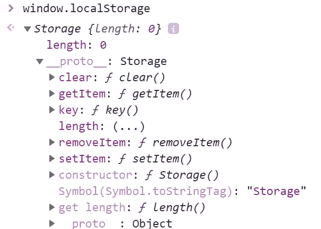
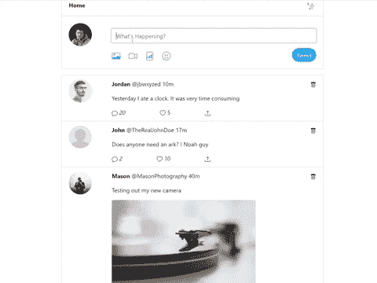

# 使用本地存储保存应用程序数据

> 原文：<https://javascript.plainenglish.io/persisting-data-using-local-storage-5820d2361990?source=collection_archive---------8----------------------->

这篇文章是为那些开始学习用 HTML、CSS 和 JavaScript 构建 web 应用程序的人准备的。如果您想在不进入服务器端代码和数据库的情况下将一些数据存储到 web 应用程序中，我将向您展示如何使用本地存储持久化您的数据。

在我解释什么是本地存储之前，我们必须先看一下`window`对象。

# 窗口对象

对象代表一个包含 DOM 文档的浏览器窗口。该对象由浏览器自动创建。它包含了一些属性和方法，我们可以使用这些属性和方法通过 JavaScript 代码来控制或操作浏览器。

# 什么是本地存储？

本地存储是`window`对象的属性。它返回对 web 页面上的`Storage`对象的引用。

如果你查看浏览器控制台中的窗口对象，你会发现本地存储 API 有类似`getItem`和`setItem`的方法。这些是我们将在接下来的例子中使用的函数。

本地存储提供基本的 CRUD 操作，并允许您在计算机的浏览器中保存信息。这可以防止用户特定的信息丢失，而无需服务器将其存储在中央数据库中。假设我们使用 HTML 创建了一个简单的 web 应用程序，它接受用户的输入并将其显示在页面主体中。如果我们刷新页面，显示在页面正文中的数据将会消失。因为标准的 HTML 页面是静态的，所以刷新会导致页面恢复到原来的结构。

当我们使用本地存储时，保存的数据将一直保存在浏览器中，直到您在浏览器设置中手动清除它，或者通过编程方式清除它。这意味着，即使在刷新后或者关闭并重新打开浏览器，数据也将持续存在。

数据存储在键-值对中，值必须是一个`String`。您仍然可以像保存数组或任何其他对象一样保存值，但是您可以使用`JSON.stringify`将其转换为字符串，然后在需要使用时使用`JSON.parse`将其改回。让我们看看我们的例子。

# 使用本地存储的示例 Web 应用程序

我创建了一个页面来演示如何使用本地存储来保存一些数据。该页面允许用户发布和删除推文。

使用本地存储，我们能够将推文保存到内存中，因此即使我们刷新或离开浏览器，推文仍将存在，除非我们删除它们。让我们来看看将它变为现实的功能。

## 我们将在示例中涵盖的内容:

*   向页面添加推文
*   从页面中删除推文
*   将推文保存到本地存储
*   从本地存储中检索推文
*   从本地存储中删除推文

# 添加推文

这里我们有一个事件监听器，当用户发布 tweet 时可以监听它。首先，我们将 tweet 添加到页面上的 tweet 列表，然后我们将使用本地存储保存数据。

add tweet 函数从输入字段中获取 tweet 的文本值。首先，我们创建一个列表项。每个列表项将包含以下内容:

*   个人资料图像
*   名称和句柄
*   发布推文的时间
*   推特内容
*   删除推文的垃圾桶图标
*   其他交互式图标

一旦我们创建了包含上述内容的列表项，我们就会将该列表项添加到 tweets 列表的顶部。

# 删除推文

要删除一条推文，用户必须点击垃圾箱图标。单击该图标将触发一个事件监听器来删除该推文。`deleteTweet`函数接收相应的列表项，并将其从 tweets 列表中删除。

# 局部存储器

我创建了一个`Storage`类，它将负责从本地存储中添加、检索和删除 tweets。

## 保存到本地存储

一旦我们将推文添加到列表中，我们会将内容保存到本地存储。为此，我们将检索并保存之前添加到数组中的任何 tweet，将新的 tweet 推入数组，然后用新更新的 tweet 数组更新我们存储的 tweet。

就像我之前提到的，数据以键-值对的形式存储在本地存储中，值必须是一个字符串。在本例中，我们将 tweets 数组转换成一个字符串，然后将值更新到存储中。

## 从本地存储中检索

为了获取 tweets，我们使用键检查本地存储，并解析返回给数组的值。如果该项不存在，那么我们将得到一个空数组。

## 从本地存储中移除

要从本地存储中删除该 tweet，首先我们从存储中获取所有 tweet，遍历 tweet 数组并删除与 tweet 值匹配的条目。一旦我们从数组中删除了这个项目，我们就在存储中更新我们的 tweets。

# 结论

如您所见，我们能够在没有任何服务器端代码或不必处理数据库的情况下持久存储数据。最终，对于真实世界的应用程序来说，这是必要的，但是使用本地存储对于那些刚开始使用一些基本前端概念的人来说是有帮助的。

完全回购:[本地存储持久化推文](https://github.com/martinacarter1/tweet-local-storage/tree/master)

***阅读更多*** [***说白了. io***](https://plainenglish.io)