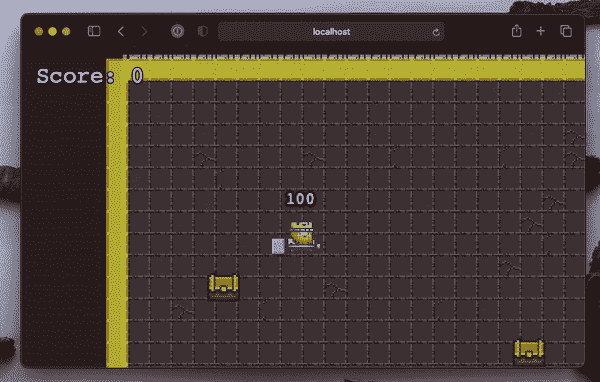

# js:制作 Phaser 3 游戏的分步教程

> 原文：<https://javascript.plainenglish.io/phaser-js-a-step-by-step-tutorial-on-making-a-phaser-3-game-dbee8ef9eadb?source=collection_archive---------9----------------------->

[*作者丹尼斯奎，开发商*三郎】](https://shakuro.com/)

Image credit: [phaser.io](https://phaser.io/)

你好，欢迎来到 Phaser 3 系列文章！这是一个初学者友好和相当详细的教程，所以我们决定把它分成几篇文章，首先分别发表。现在，最后一部分已经准备好了，我们很高兴也很自豪地展示它的全部美丽。😎

我们将向你展示如何从零开始开发一个用 [Phaser.js](https://phaser.io/) 制作的游戏。您将了解如何在 webpack 上设置构建、加载资源、创建角色和动画、添加键盘控制、处理用于创建平铺地图的强大工具，甚至如何实现简单的 bot 行为。

在本教程结束时，您将会看到如下内容:

这个系列是这样的:

**第一部分:** [安装包并配置 webpack](https://medium.com/shakuro/phaser-js-tutorial-installing-packages-and-configuring-webpack-639bbc0f3d88)
**第二部分:** [第一个场景，加载资源并在屏幕上显示角色](https://medium.com/shakuro/phaser-js-the-first-scene-loading-assets-and-showing-a-character-on-screen-f19bc6f218d5)
**第三部分:** [制作角色动画，添加移动能力，键绑定](https://medium.com/shakuro/phaser-js-animating-a-character-adding-the-ability-to-move-keybinding-7c92228983ab)
**第四部分:** [精灵表和移动动画](https://medium.com/shakuro/phaser-js-tutorial-sprite-sheets-and-movement-animation-53ad452ab57)
**第五部分:** [сamera](https://medium.com/@eshokurova/phaser-js-tutorial-creating-and-loading-a-map-enabling-collisions-3ca33917a902)
**第七部分:** [文字、事件系统、计数器](https://medium.com/@eshokurova/phaser-js-tutorial-text-event-system-counter-61acbc6dd5b7)
**第八部分:** [僵尸程序、游戏结束画面](https://medium.com/@eshokurova/phaser-js-tutorial-bots-game-end-screen-52408c257e4b)

因此，请点击第 1 部分，开始行动吧！

我们希望你喜欢这个系列，并学习更多关于 Phaser 3 的知识。这是一个很棒的框架:它是开源的，容易上手，对于那些想尝试用 JS 进行游戏开发的人来说是一个很好的选择。

如果您对本教程的任何部分和快乐编码有任何问题，请随时联系我们！❤

*更多内容看*[***plain English . io***](http://plainenglish.io/)