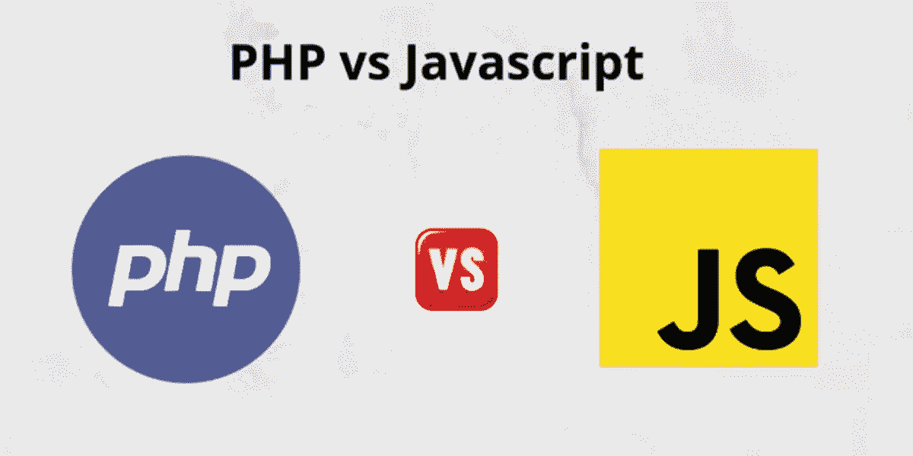
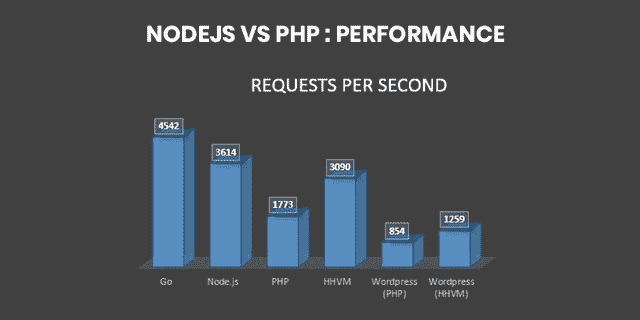
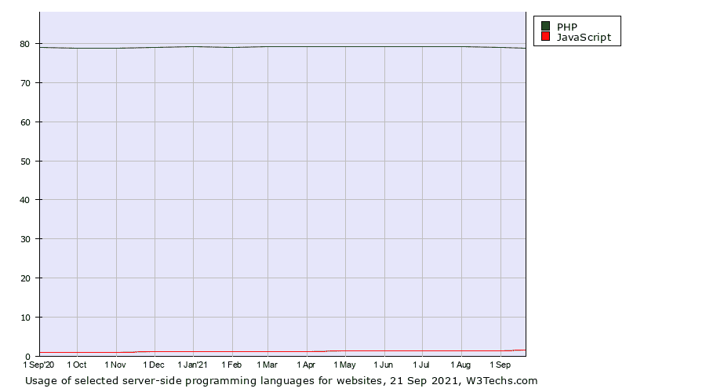
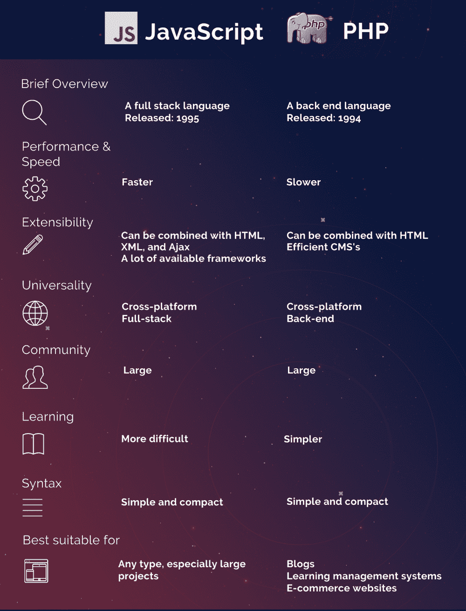

# PHP 与 JavaScript:你梦想中的 Web 项目的更好选择？

> 原文：<https://javascript.plainenglish.io/php-vs-javascript-the-better-option-for-your-dream-web-project-54203c1bd571?source=collection_archive---------2----------------------->

你还没有决定下一个 web 开发项目使用哪种编程语言吗？不确定应该是 PHP 还是 JavaScript？读完这篇博客后，你会确切地知道哪种语言最适合你的需要，为什么！继续阅读，发现每个选项与其他选项的不同之处。

JavaScript 和 PHP 都是用于 web 开发的通用脚本语言。JavaScript 是客户端的，而 PHP 是服务器端的脚本语言。这两种语言可以协同工作，也可以独立工作，它们可以完成很多工作。

现在，让我们来看看哪种编程语言最适合您的下一个 web 开发项目。

# **简要概述**

## **JavaScript**

JavaScript 是一种轻量级、高级、解释型或即时编译的动态编程语言。JavaScript 由 Brendan Eich 于 1995 年创建，因其花括号语法、一流的函数和基于原型的面向对象而广受欢迎。

根据 Statista 的统计，在过去的 12 个月中，全球有 69%的开发者使用了 JavaScript，还有 5%的开发者计划这样做。根据研究，截至 2019 年底，它是世界上使用最多的编程语言。

## **PHP**

PHP 是一种开源的后端编程语言。这种语言是拉斯马斯·勒德尔夫在 1994 年发明的，随后在世界范围内流行起来。

**在过去的 12 个月中，30%的开发人员使用 PHP**。脸书、维基百科，当然还有 WordPress 都是使用 PHP 的最流行的网站。

# **JavaScript 与 PHP:了解区别**

PHP 和 JavaScript 可以说是当今使用的最流行的两种 web 开发语言。但是它们都有不同的优点和缺点，所以这里对这两种技术进行了一对一的比较，帮助您在决定哪种语言最适合您的项目之前快速了解这两种技术。

让我们来看看每种语言带来了什么。

# **#1 JavaScript vs. PHP:性能**

[Source](https://hackernoon.com/nodejs-vs-php-which-is-better-for-your-web-development-he7oa24wp)

事件驱动、单线程、非阻塞的 I/O 模型定义了 JavaScript。事件循环和节点聚类用于创建该模型。

另一方面，PHP 有一个带阻塞 I/O 的多线程执行架构。与 JavaScript 不同，PHP 是一种同步语言。PHP 比 JavaScript 慢得多，因为第一行代码完成后才能执行第二行代码。

虽然 PHP 无疑比 JavaScript 慢，但有人说它更稳定。然而，这种好处是有争议的，并没有最终证明。PHP 和 Javascript 的稳定性和可靠性都有待解释。然而，后者由于其优越的速度而获胜。

> **获胜者:JavaScript**

# **#2 PHP vs. JavaScript:用于 Web 开发**

W3tech.comT4 发布了一份报告，展示了使用所选技术的网站百分比的历史趋势。

根据图表， **PHP 被 79%的网站用作服务器端编程语言**，而 JavaScript 仅被 0.7%的网站使用。同样，在排名前 100 万的所有网站中， **77.4%** 使用 PHP。

然而，当谈到用于网站的客户端脚本语言时，JavaScript 胜过其他语言。根据 W3techs.com 的技术概述， **JavaScript 是最受欢迎的客户端语言，95.2%的网站都在使用它。**

> **获胜者:PHP**

# **#3 JavaScript 与 PHP:易于编码**

PHP 是一种更加用户友好的编程语言。这是由于 PHP 的**超过 1000 个内置函数**，可以创建特定的任务。在互联网上可以很容易地访问操作列表。

你甚至可以让你的命令功能。如果你需要任何帮助，你可以随时 [**雇佣精通该技术的 PHP 开发人员**](https://www.pixelcrayons.com/hire-php-developers) 。

JavaScript 可能有点复杂，因为它提供了额外的功能，比如事件队列、HTTP 请求、语法、操作符等等。JavaScript 也是异步的，不像其他语言。

> **获胜者:PHP**

# **#4 PHP 与 Javascript:扩展性**

HTML、XML 和 Ajax 都可以与 JavaScript 结合。有许多奇妙的 JavaScript 框架，不可能跟踪所有的框架，因为新的框架经常出现。 **Vue、Angular、React 是最流行的前端 JS 技术**。

PHP 只能和 HTML 结合。WordPress 或 Drupal 等 CMS 的可用性可能是 PHP 最大的优势。这两种技术都有可能大大简化和降低 web 开发的成本。

PHP 可以使用任何 LAMP 栈技术以及 MySQL 或 PostgreSQL 之类的服务器解决方案进行扩展。

PEAR 和 Composer 都是 PHP 包管理器。Composer 是一个 PHP 依赖管理工具，PEAR 是一个开源的 PHP 代码库，采用分层设计。

总的来说，JavaScript 对于 [**Javascript 开发公司**](https://www.pixelcrayons.com/javascript-development/) 有更多的扩展性选择；因此，它赢得了要点。

> **获胜者:JavaScript**

# **#5 PHP 与 JavaScript:简单性**

PHP 和 JavaScript 易于学习和使用是一个显著的区别。因为它的复杂性、高级功能、事件队列的使用以及违反了其他编程语言支持的某些规范。

**PHP 因为有更广泛的库**，所以功能更强大，但也更容易使用。PHP 对你能想到的每一个操作都有一个函数。PHP 被许多主要网站使用，如脸书，因为它的易用性。

> **获胜者:PHP**

# **#6 PHP 与 JavaScript:通用性**

JavaScript 和 PHP 一样，是跨平台的。PHP 和 JavaScript 通常都是为 web 应用程序开发而设计的，但它们也可能用于创建移动应用程序。

JavaScript 是一种全栈开发语言，这使它比 PHP 更有优势。大多数 JS 和 PHP 的比较强调 JavaScript 仅仅是一个接口，然而，这是不正确的。除了 JavaScript 之外，无需使用任何其他技术，您就可以创建一个完整的 web 或移动应用程序。

PHP 只是一种内部开发语言。一个 PHP 开发人员必须知道四种不同的语法系统，更不用说 HTML 和 CSS 了，才能使用这种技术堆栈构建一个 web 应用程序。

在各种语言之间切换既不方便又浪费，而且会使学习过程变得复杂。

**JavaScript 在前端和后端都可以使用，但是 PHP 只针对服务器端代码**。JavaScript 编程的显著优势在于它是全栈开发。

> 获胜者:JavaScript

# **#7 PHP 与 JavaScript:社区**

公司喜欢使用 JavaScript 的主要原因是它的普遍性、流行性和可扩展性。优步、美国国家航空航天局、网飞、LinkedIn、Instagram、易贝、网飞等等都在使用 JavaScript。

大多数 JS 框架都是开源的；然而，JavaScript 不是。JavaScript 是最流行的语言，在 GitHub 上占有将近 20%的 pull 请求份额。

PHP 最受欢迎的优势是其庞大的社区、开源特性和易于部署。脸书、Lyft、维基百科、Slack、Tumblr 和 9 GAG 只是使用 PHP 的几家公司。

因为 PHP 代码是开源的，所以更加灵活和可定制。PHP 在 GitHub 上仅排在第八位，只有 **5%的 pull 请求。**

PHP 和 JavaScript 都得了一分，因为它们有大量的支持社区，大型 IT 公司都在使用它们。

> **赢家:平手**

**这里有一个 Javascript 与 PHP 的快速总结:**

# **底线**

PHP 和 Javascript 都是众所周知的编程语言，各有利弊。使用 PHP 或 JavaScript 都有很多优点，而且两种语言在开发项目中都有一席之地，没有哪一种比另一种更好。

也就是说，如果你正在创建一个有大量流量和不断更新的 web 项目，那么考虑使用 JavaScript 作为你的编程语言选择。然而，如果你的网站每天不会有数百万的访问者，那么最好使用 PHP。

尽管如此，如果你在这两种技术之间感到困惑，那么最好联系一家 [**顶级软件咨询公司**](https://www.pixelcrayons.com/technology-consulting-services) **(你可以落下一个查询或者联系我了解更多)**。他们将为您提供合适的技术组合，并能满足您的所有需求。

祝你好运！

# **常见问题:**

> **Q1。什么时候选择 PHP 和 Javascript？**

***选择 PHP 作为你的编程语言:***

*   如果你计划建立一个博客或电子商务网站
*   如果你已经在使用 LAMP 技术。
*   PostgreSQL、MariaDB、Oracle、Sybase 和其他数据库服务器。

***当你的项目包含:*** 时选择 JavaScript

*   Angular.js，React.js，Backbone.js，Ember.js 等更多前端技术
*   动态单页应用程序
*   MongoDB、Express.js、Node.js 和其他服务器技术
*   MEAN (Express js，Angular js，MongoDB 等解决方案栈。)

> Q2。PHP 比 JavaScript 更安全吗？

由于 PHP 代码在浏览器中是不可见的，所以它比 Javascript 更安全。Javascript 代码是不安全的，容易受到安全威胁。使用安全分析器工具并遵循 SSL/HTTPS 等最佳开发实践，您可以保护您的 Javascript 代码。

> **Q3。PHP 可以使用 JavaScript 吗？**

答案是肯定的。Web 表单是一个很好的例子，说明在将用户输入保存到数据库之前检查用户输入是非常有用的。

JavaScript 可用于客户端验证，例如确保电子邮件格式正确。之后，您可以使用 PHP 执行服务器端验证，比如验证电子邮件是否存在于您的数据库中。

*更多内容看*[***plain English . io***](http://plainenglish.io/)