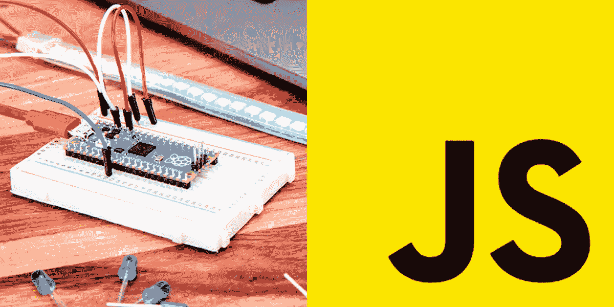
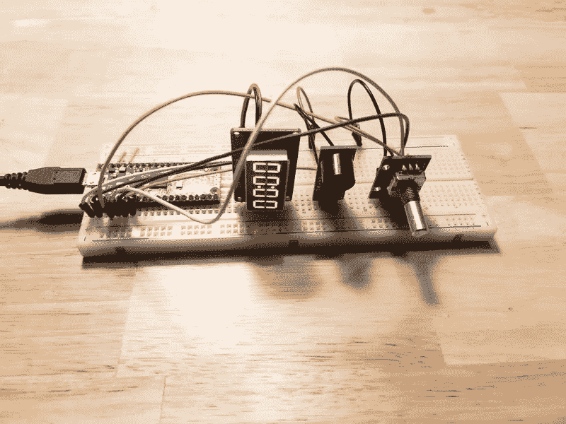
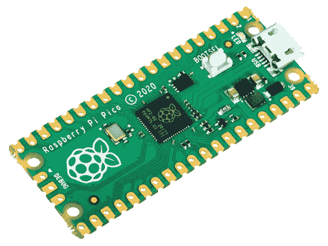
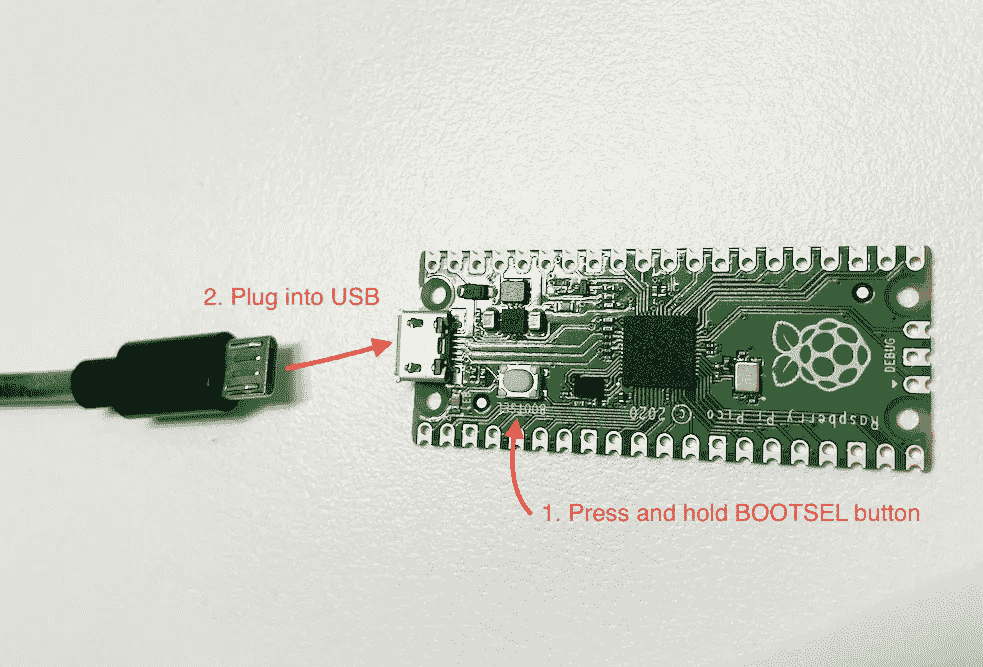
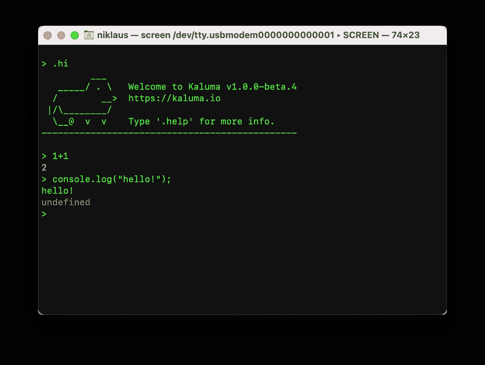
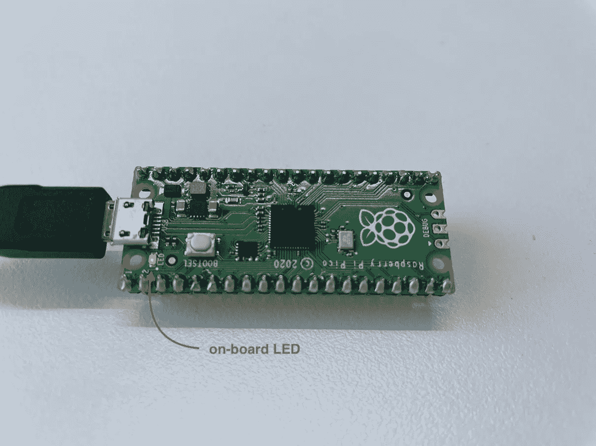

# 使用 JavaScript 的物理计算(1/8) —让我们开始吧

> 原文：<https://javascript.plainenglish.io/physical-computing-with-javascript-1-8-lets-get-started-642a9954adb2?source=collection_archive---------5----------------------->



本教程向没有初步硬件知识的 JavaScript 开发人员解释了什么是物理计算以及如何实现物理计算。通过本教程，任何人都可以轻松处理各种传感器和硬件。

> [目录](https://niklauslee.medium.com/physical-computing-with-javascript-table-of-contents-69c38fd74e61)

# 让我们摆脱传统的电脑

当你想到编程时，你通常会想到用键盘或鼠标接收输入，用计算机处理一些东西，然后在屏幕上显示出来。物理计算是指与计算机外部的物理对象进行交互。例如，读取温度传感器值，执行一些处理，然后操作伺服电机或打开 LED 灯泡。

在过去，只有在电子和嵌入式计算方面的专业知识才能做到这一点，但现在非专业人士可以毫无困难地创造这些东西。代表性地，Arduino、Raspberry Pi 和 Micro:bit 广为人知。当你进入物理计算时，你可以创建自己的座钟、温度计、烹饪计时器，甚至物联网(IoT)和可穿戴设备。



A simple cooking timer made with Raspberry Pi Pico

与此同时，主要基于 C/C++语言的 Arduino 已经成为物理计算的主流。Arduino 是一个很棒的系统，非常容易上手，但最终你需要很好地了解 C++语言，这使得专业人员很难从事增加复杂性的项目。

最近出现了可以使用简单易用的脚本语言的平台(MicroPython，CircuitPython，NodeMCU Lua)。其他语言也不错，但是如果你已经熟悉 JavaScript，或者你是编程语言新手，我建议从 JavaScript 开始物理计算。

原因是:第一，JavaScript 是最流行的语言之一。作为参考，在 RedMonk 发布的编程语言排行榜上已经连续几年排名第一。第二，适合事件驱动编程。大部分工作是响应于事件的发生(例如，传感器值的变化)和一些处理(例如，操作马达)而完成的。大多数 JavaScript 执行环境都直接支持这种编程模型。第三，物理计算经常需要与其他技术互通。例如，如果您需要从 web 服务器收集传感器数据，或者如果您希望通过创建移动应用程序或网页来远程查看信息，您不必学习新的语言。

即使是在 Windows 或 Mac 上运行的桌面应用程序、人工智能应用程序等，它也是一种真正通用的语言。这是 Kaluma，一个可以用于物理计算的开源平台。

[](https://kalumajs.org/) [## 卡鲁玛

### 编辑描述

kalumajs.org](https://kalumajs.org/) 

# 树莓派皮可

要开始物理计算，您需要一个微控制器板。在本教程中，我们将使用覆盆子 Pi Pico (Pico —在下文中)，这是覆盆子 Pi 基金会最近宣布的。它不仅表现良好，但它也越来越受欢迎，因为它只需要 4 美元。



Raspberry Pi Pico

# 安装 Kaluma

现在让我们在 Pico 上安装 Kaluma。Kaluma 是一个面向微控制器的开源 JavaScript 运行时。如果大家对 [Node.js](https://nodejs.org/) 比较熟悉，可以了解到卡鲁马是一个很小的 Node.js，进入下面的卡鲁马网站后，进入**下载**页面，点击**下载. UF2** 按钮下载 **.UF2** 文件。上传下载的太容易了。将 UF2 文件发送到 Pico。首先通过如下图所示的 Pico**按**按钮 **BOOLSEL** 将我的 PC 与 USB 连接。然后，在 PC 中将其识别为 USB 存储设备。然后，复制并粘贴(或拖放)下载的。UF2 文件来完成安装。



Install Kaluma on Raspberry Pi Pico

# 安装 CLI(命令列介面)

要使用 Kaluma 运行时对 Pico 进行编程，必须首先安装 [Kaluma CLI](https://github.com/kaluma-project/kaluma-cli) 。当然，假设 Node.js 安装在这里。

```
$ npm install -g @kaluma/cli
```

安装完成后，请检查以下所示的 CLI 帮助。

```
$ kaluma help
```

如果 Pico 通常通过 USB 连接到我的计算机，请检查串行端口，如下所示。您可以检查我的 Pico 所连接的串行端口名称。

```
$ kaluma ports
```

# 与终端连接

现在，您可以将 Pico 与一个串行终端程序连接，并在 REPL(读取-评估-打印循环)模式下使用它。这里，我们将尝试使用 macOS 和 Linux 中默认提供的`screen`命令连接到 Pico(在 Windows 的情况下，您必须使用诸如 [PuTTY](https://www.putty.org/) 之类的串行终端程序)。通过将连接到 Pico 的串行端口的名称和波特率作为参数传递给`screen`命令来建立连接。

```
# for MacOS
$ screen /dev/tty.usbmodem.. 115200# or for Linux
$ sudo screen /dev/ttyACM.. 115200 
```

如果最初没有出现，只需点击**进入**几下，就会出现提示(`>`)。如果在这里输入`.hi`命令，会出现如下欢迎信息。此外，可以在提示下执行 JavaScript 表达式，并且可以执行 REPL 命令。要检查可用的 REPL 命令，请键入`.help`。

如果要退出屏幕终端，依次按`ctrl+a`、`k`、`y`。



Terminal connection using screen command (REPL mode)

# 打开板载 LED！

让我们检查一下 JavaScript 程序是否工作正常。Pico 上有一个板载 LED。让我们用一个简单的代码打开它。首先，将光标移动到终端，然后按顺序输入以下两行。第一行表示将管脚 25 ( **GPIO25** )切换到输出模式。请注意，板载 LED 直接连接到引脚 25。第二行表示输出`HIGH`值到管脚 25。换句话说，就是给 25 号引脚供电，所以 LED 亮了。如果要关闭 LED，可以输入`digitalWrite(25, LOW)`。

```
> pinMode(25, OUTPUT);
> digitalWrite(25, HIGH);
```



On-board LED on Raspberry Pi Pico

# 良好的开端是成功的一半

如果到目前为止您已经很好地理解了，那么您现在已经进入了物理计算的世界。好的开始是成功的一半。现在，如果你一个一个地学习，一个新的世界将会打开，你会充满自信地认为你可以做任何事情。让我们进入下一步。

[](https://niklauslee.medium.com/physical-computing-with-javascript-2-8-blinking-led-37544b14e964) [## 使用 JavaScript 的物理计算— (2/8)闪烁 LED

### 在本教程中，我们将连接一个外部 LED，并使用数字输出使其闪烁。

niklauslee.medium.com](https://niklauslee.medium.com/physical-computing-with-javascript-2-8-blinking-led-37544b14e964) 

*更多内容尽在*[*plain English . io*](http://plainenglish.io/)