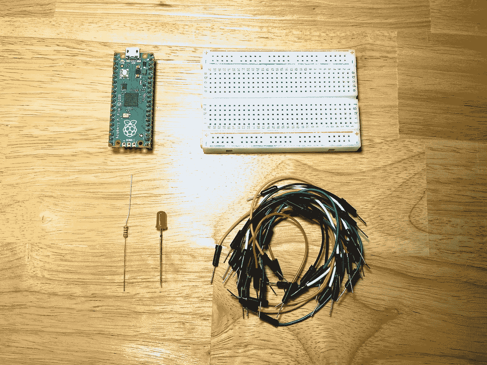
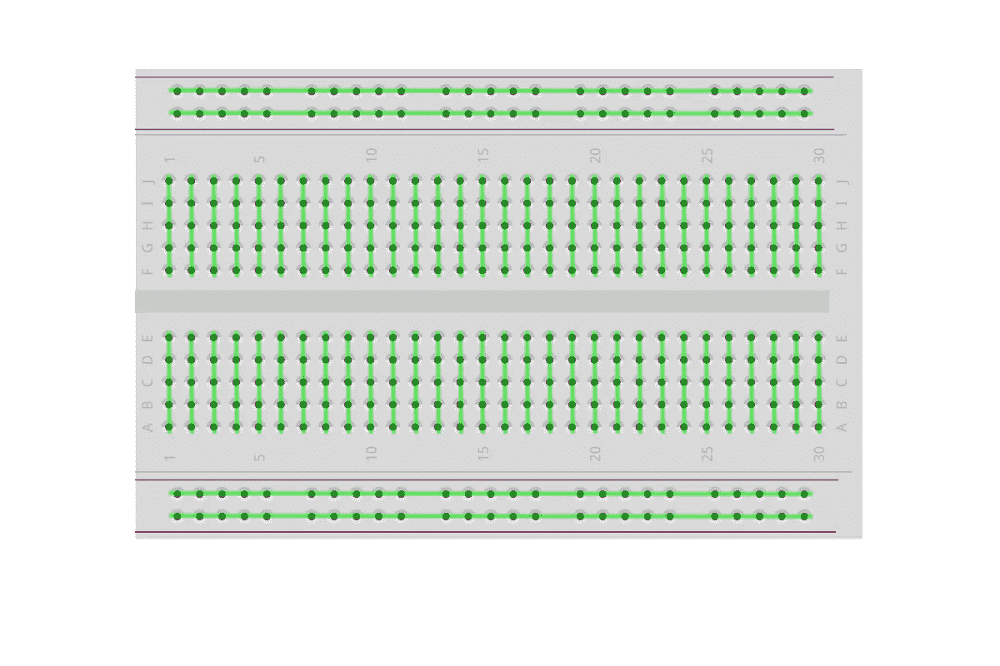
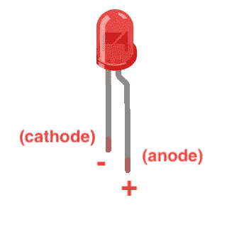
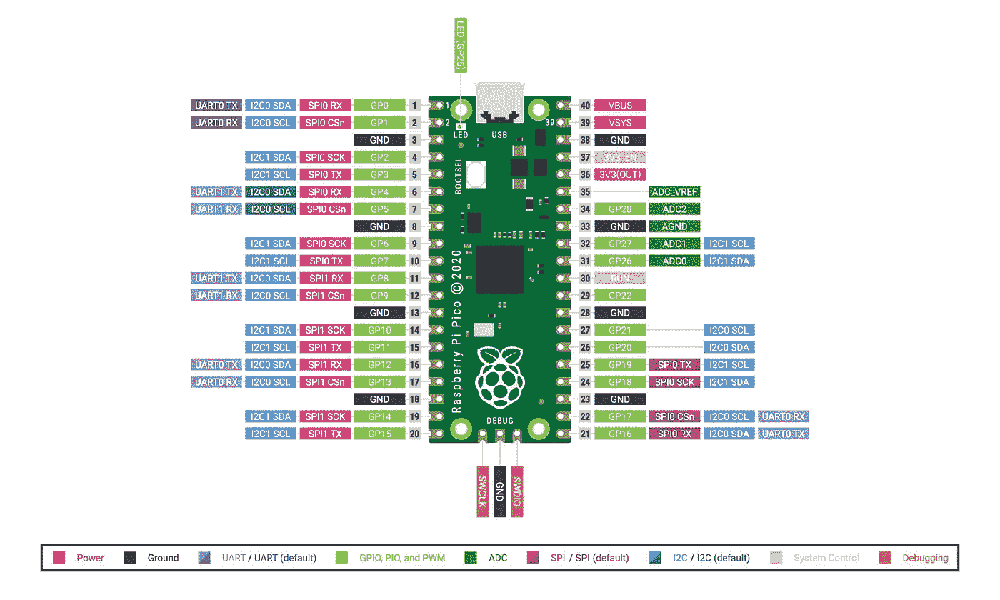
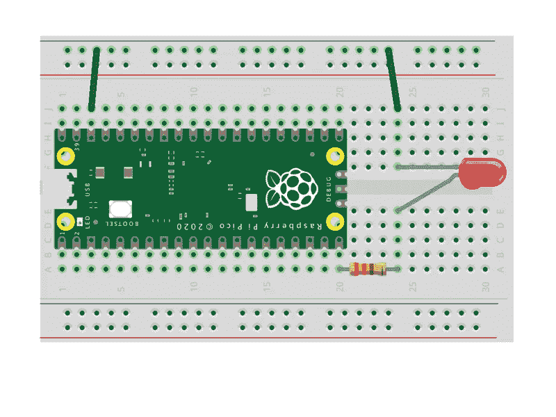
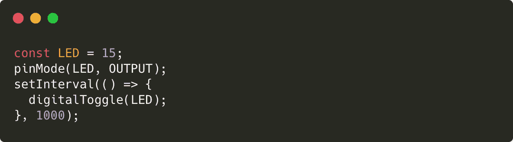
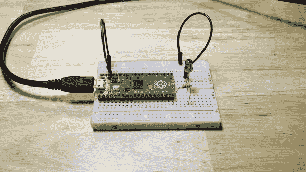

# 使用 JavaScript 的物理计算(2/8) —闪烁的 LED

> 原文：<https://javascript.plainenglish.io/physical-computing-with-javascript-2-8-blinking-led-37544b14e964?source=collection_archive---------12----------------------->


在本教程中，我们将连接一个外部 LED，并使用数字输出使其闪烁。

> [目录](https://niklauslee.medium.com/physical-computing-with-javascript-table-of-contents-69c38fd74e61)

# 成分

*   树莓派 Pico — 1 件。(需要接头引脚焊接，或购买焊接)
*   试验板— 1 个。
*   发光二极管(5 毫米)— 1 个。
*   电阻器(330ω)—1 个。
*   跳线(M-M 型)



Components for LED blinking

如果您使用试验板，您可以通过手动插入跳线来快速构建电路，而无需焊接。在试验板上有许多孔，可以插入零件或跳线，只要记住这些孔的连接方式如下图所示。



Breadboard (The holes are connected as the green line internally)

LED(发光二极管)是一种发光的元件。有许多不同的类型，如不同的颜色和大小。如下图所示，当你把正极(+)接到正极引脚，负极(-)接到负极引脚时，它就亮了。必须给 LED 提供适当的电流，但是如果提供的电流太大，就会产生太多的热量或者用不了多久就会损坏，如果提供的电流太小，光线就会太暗。



LED pins

电阻器是一个阻止电流流动并允许适量电流流过的元件。要调整合适的电流，需要计算合适的电阻值。你可以在电阻体上看到一条不同颜色的带。这些是电阻值。这里我们用 330ω，颜色是“橙-橙-棕-金”。(即使不一定是 330ω，使用类似的值也是安全的。)不需要太担心计算电阻值的问题。在这个课程中，我会告诉你需要的电阻值，你只要在网上搜索一下，就可以很容易地找到我要用的传感器或零件需要多大的电阻值。那并不代表计算方法很难，只是这门课不会涉及，而且如果你马上好奇，请参考其他资源。

跳线用于将部件连接在一起。有三种主要类型的电线:M-M、M-F 和 F-F，这取决于电线的两端是引脚形式(M-公)还是可以被引脚插入的孔形式(F-母)。为此，您可以使用 M-M 形式。

# 数字输入输出

数字 I/O 是用于物理计算的计算机最基本的功能，比如树莓 Pi Pico。有几个引脚可以连接到外部设备，通过每个引脚，您可以输出`LOW`或`HIGH`或读取进入每个引脚的值(`LOW`或`HIGH`)。`HIGH`值实际上意味着向引脚提供 3.3V 的电压。不同的电路板可能有不同的电压值(某些 Arduinos 为 5V)。相反，`LOW`值意味着向引脚提供 0V (=GND)。从下面的引脚排列图可以看出，Pico 共有 40 个引脚，每个引脚都有一组可以使用的功能。在我们继续之前，有几件事我们必须了解。

*   **3V3**(OUT)——可以给部件供电的管脚。它以 3.3V 的电压提供电流
*   **GND** —接地引脚是电流必须最后流出的负极引脚。电路的结构必须使电流总是离开正极，流向大地。
*   **GPIO 0**~**GPIO 28**—GPIO(通用输入/输出)是可以通过程序控制数字输入/输出的引脚。



Pinout of Raspberry Pi Pico

# 电路

现在，让我们配置电路。即使 LED 分别用阳极(+)和阴极(-)连接到 **3V3** 和 **GND** 上，灯也会被打开，但是我们想用 LED 程序控制灯的关闭和打开，所以我们将把阳极(+)连接到一个 GPIO 管脚(这里我们用的是 **GPIO15** )和阴极(-)连接到 **GND** 管脚。我们将在 GPIO 和 LED 的阳极(+)之间使用一个电阻，以允许适当的电流。电阻器没有极性，所以你可以在任何方向连接它们。



Circuit for Pico and LED

# 编写代码

现在让我们检查 LED 的开关是否与程序一起工作。正如您在上一教程中所学的，将 Pico 连接到您的 PC 并打开 Kaluma IDE。然后，在终端输入以下代码，将 **GPIO15** 引脚更改为输出模式。

```
> pinMode(15, OUTPUT);
```

然后，输出一个`HIGH`值，使电流可以流过 LED。

```
> digitalWrite(15, HIGH);
```

检查 LED 是否打开，现在再次关闭 LED。

```
> digitalWrite(15, LOW);
```

如果使用`digitalToggle()`功能，在`LOW`时可以输出`HIGH`，在`HIGH`时可以输出`LOW`，这样就可以很方便的关机再开机了。让我们输入几次，看看它是否再次打开和关闭。(提示:如果使用终端上的向上箭头键，先前输入的代码会再次出现)

```
> digitalToggle(15);
```

现在让我们写一个每秒自动开关的程序。熟悉 JavaScript 的人都知道`setInterval()`函数。这个函数每隔一段时间调用一个特定的函数。调用`digitalToggle()`使 LED 闪烁的函数作为第一个参数传递，调用间隔`1000` (1000ms=1 秒)作为第二个参数传递。以下代码有多行，因此不能在终端中输入，所以您必须在编辑区输入代码。

# 上传代码

现在关闭终端，用任何文本编辑器编写如下的`index.js`代码。



Blinking LED for every second

使用 CLI 将文件上传到 Pico。

```
$ kaluma flash index.js --port <port>
```

上传完成后，您会看到 LED 每秒闪烁一次，如下图所示。



LED blinking every second

在本教程中，我们编写了一个使用数字输出使 LED 闪烁的程序。数字输出控制是提供 3.3V 电源还是接地。简单的任务，如控制多个发光二极管或运行一个小 DC 电机很容易与数字输出。现在让我们进入下一个教程，使用数字输入来读取开关的状态。

[](https://niklauslee.medium.com/physical-computing-with-javascript-3-8-reading-state-of-switch-106137a2f9d6) [## JavaScript 物理计算— (3/8)读取开关状态

### 在本教程中，我们将使用数字输入读取开关是否被按下的状态。

niklauslee.medium.com](https://niklauslee.medium.com/physical-computing-with-javascript-3-8-reading-state-of-switch-106137a2f9d6) 

*更多内容请看*[*plain English . io*](http://plainenglish.io/)