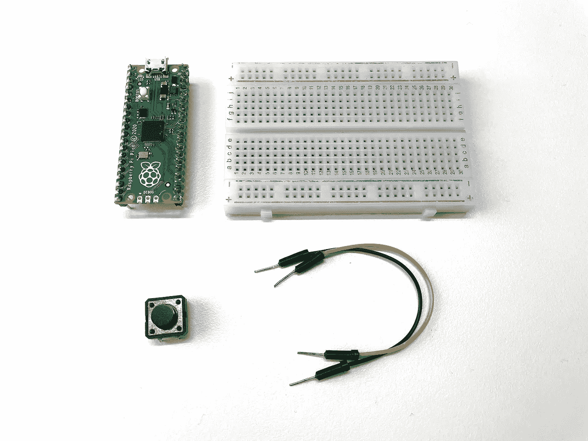
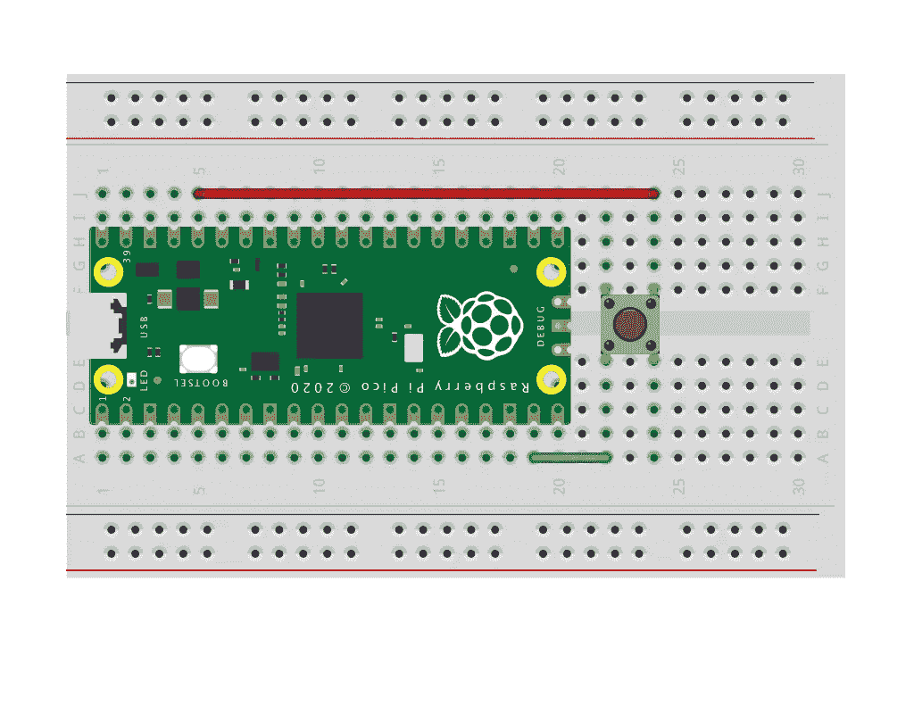
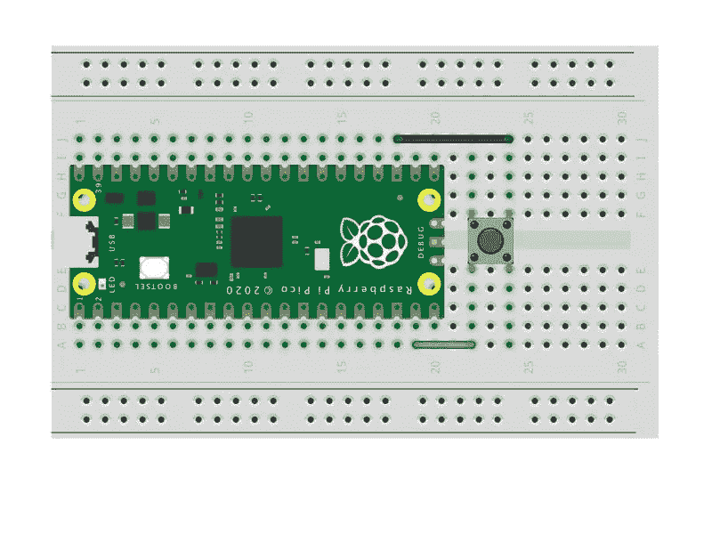
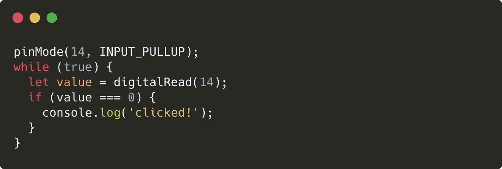
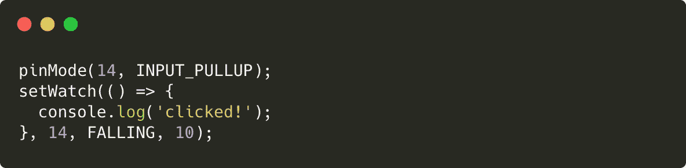
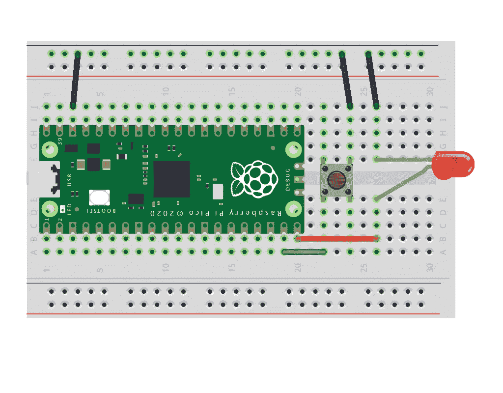
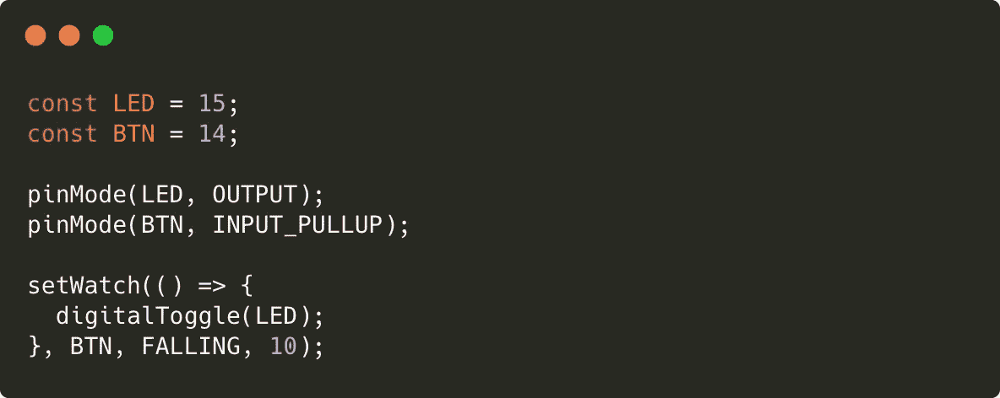

# JavaScript 物理计算(3/8) —读取开关状态

> 原文：<https://javascript.plainenglish.io/physical-computing-with-javascript-3-8-reading-state-of-switch-106137a2f9d6?source=collection_archive---------9----------------------->


在本教程中，我们将使用数字输入来读取开关是否被按下的状态。

> [目录](https://niklauslee.medium.com/physical-computing-with-javascript-table-of-contents-69c38fd74e61)

# 成分

*   树莓派 Pico — 1 件。
*   试验板— 1 个。
*   触觉开关— 1 个。
*   跳线(M-M 型)



Components for reading states of switch

触觉开关是一种非常简单的开关，当按下按钮时，它连接两个引脚。你可以很容易地在我们周围的许多电子产品中找到这些开关。一个触觉开关通常有 4 个引脚，左边的上下引脚互相连接，右边的上下引脚互相连接。所以，当连接到电路时，你必须使用一个左(任何上或下)和一个右(任何上或下)。

# 数字输入

所有支持 GPIO 的引脚都可以用于数字输出，但也可以用于数字输入。为了验证这一点，让我们做一个简单的实验。首先，让我们用跳线将 **GPIO14** 直接连接到 **3V3** 。然后，将 **GPIO14** 切换到输入模式并读取数值。

```
> pinMode(14, INPUT);
> digitalRead(14);
```

这将在终端中打印`1`。`1`意为`HIGH`。相反，将 **GPIO14** 连接到 **GND** 上，并读取相同的读数。然后`0`会被打印出来。`0`意为`LOW`。

# 下拉模式

现在，在 **GPIO14** 和 **3V3** 之间连接一个触觉开关，如下图所示。当按下开关时，由于 **GPIO14** 和 **3V3** 连接，将读取`HIGH`值。然后，当开关没有按下时，它实际上是在空中，因为它没有连接到任何地方。在这种情况下，什么价值会进来？



Using a switch in pull-down mode

重要的是要记住，如果没有按下开关，GPIO 处于“未知”状态，既不是`HIGH`也不是`LOW`。事实上，有时`HIGH`值可能因为某些原因被读取，例如噪声。因此，不要让要使用的 GPIO 输入引脚处于这种状态。所以，当开关未按下时，必须强制到`LOW`。那就是下拉模式(从下拉到`LOW`的意义上很好理解)。所以，在这种情况下，你应该将其设置为`INPUT_PULLDOWN`，而不是`INPUT`模式。

```
> pinMode(14, INPUT_PULLDOWN);
```

这样做，不按下开关时总是`LOW`，按下开关时总是`HIGH`。

# 上拉模式

如果是的话，是不是开关未按下时总是处于`HIGH`状态，开关按下时总是处于`LOW`状态？是的，这是可能的！如下图所示，连接 **GPIO14** 和 **GND** 之间的开关。



Using switch in pull-up mode

现在我们把 **GPIO14** 设置为上拉模式(从上拉至高的意义上来说方便理解)，用`digitalRead()`检查开关按下和未按下时的状态。通常情况下，将读取`HIGH`值，但仅当按下开关时，才会读取`LOW`值。

```
> pinMode(14, INPUT_PULLUP);
```

> 最初，上拉和下拉都使用外部电阻来形成电路，但现在微控制器在内部提供这些功能，因此它们只能在没有额外电阻的程序中使用。

# 倾听一个事件

所以现在让我们在按下开关时在终端中打印`clicked!`消息。首先想到的是使用如下所示的无限循环。将上面的代码输入 IDE 并上传到 Pico。



Reading switch state in a finite loop

当按下开关时，信息`clicked!`将打印在终端上。然而，问题是大量的消息将被打印出来。因为循环运行速度太快，无论我按下开关多短，都会打印出无数条消息。第二个问题是终端卡顿。Pico 处理无限循环，所以它根本不能响应来自终端的输入。如果要停止执行，可以在终端中按 **Ctrl+C** 来停止。

按下开关时，信息不能只打印一次吗？只需将开关以前的状态存储在一个特定的变量中。也就是说，如果之前的状态是`HIGH`，但是当前的状态是`LOW`，那么就可以确定开关被按下的确切时刻。但是由于无限循环，终端还是卡死了。为了轻松解决这个问题，Kaluma 提供了`setWatch()`函数。如下图所示，使用这种方法可以非常简洁地解决问题，而且终端也可以工作。



Listening switch events using setWatch()

`setWatch()`函数在观察一个特定的 GPIO 管脚时，当一个特定的事件发生时，调用一个特定的回调函数。第一个参数是要调用的回调函数，第二个参数是要观察的 GPIO 号。第三个参数表示要响应的事件类型，因为我们想要对从`HIGH`到`LOW`的变化做出响应，所以我们使用了`FALLING`事件。相反，如果你使用下拉模式，你可以使用`RISING`事件，如果你想对两者都做出反应，你可以使用`CHANGE`事件。最后四分之一是给出去抖时间(10ms)。这仅在此涉及，更多信息请参考[官方文档](https://kalumajs.org/docs/)。

现在，回想一下之前的教程，然后制作可以在每次按下开关时打开和关闭 LED 的电路和代码，如下图所示。



Circuit for toggling LED with a switch



Toggling LED with a switch

在本教程中，我们学习了数字输入、上拉和下拉模式。现在让我们进入下一课，学习模拟输入和输出。

[](https://niklauslee.medium.com/physical-computing-with-javascript-4-8-led-dimming-403696103d2f) [## 使用 JavaScript 的物理计算— (4/8) LED 调光

### 在本教程中，我将尝试通过使用模拟输入和输出来调整 LED 的亮度，而不是数字…

niklauslee.medium.com](https://niklauslee.medium.com/physical-computing-with-javascript-4-8-led-dimming-403696103d2f) 

*更多内容请看*[*plain English . io*](http://plainenglish.io/)