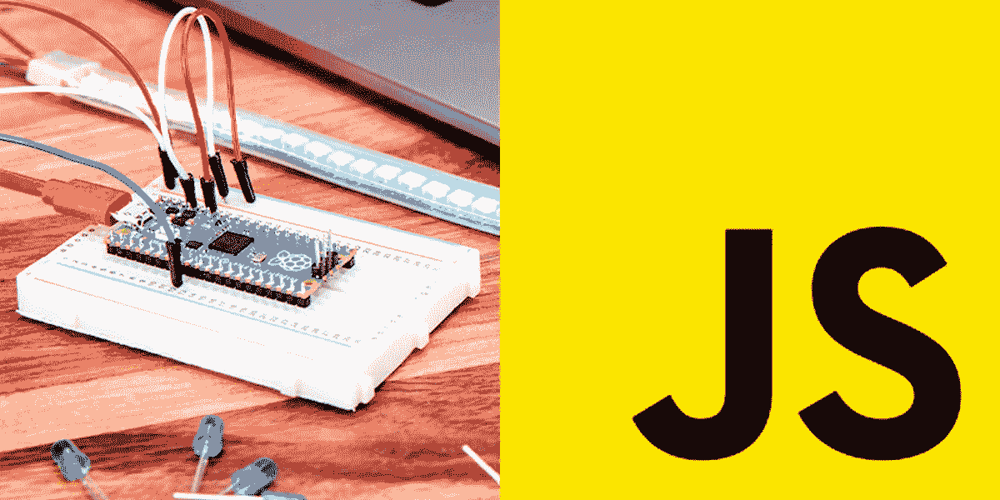

# 使用 JavaScript 的物理计算(4/8) — LED 调光

> 原文：<https://javascript.plainenglish.io/physical-computing-with-javascript-4-8-led-dimming-403696103d2f?source=collection_archive---------12----------------------->



在本教程中，我将尝试通过使用模拟输入和输出而不是数字 I/O 来调整 LED 的亮度。

> [目录](https://niklauslee.medium.com/physical-computing-with-javascript-table-of-contents-69c38fd74e61)

# 成分

*   树莓派 Pico — 1 件。
*   试验板— 1 个。
*   发光二极管(5 毫米)— 1 个。
*   电阻器(330ω或 220ω)—1 个。
*   电位计(10kω)—1 个。
*   跳线(M-M 型)


Components for LED dimming

# 模拟输出

当数字 I/O 读取或写入`LOW`和`HIGH`值时，模拟 I/O 可以具有 0 到 1 之间的多个值(0.0、0.23、0.756、0.99、1.0……)。首先，让我们按如下方式构成电路。


Circuit for LED dimming

上次，我们使用数字输出，所以我们使用了`digitalWrite()`功能。但是现在这个时候我们会用`analogWrite()`。在终端中逐行输入以下代码，并检查 LED 的亮度。

```
> analogWrite(15, 1);
> analogWrite(15, 0.7);
> analogWrite(15, 0.5);
> analogWrite(15, 0.1);
> analogWrite(15, 0);
```

当您输入`1`时，LED 的亮度非常亮，然后当您输入较小的值时变暗。如果输入`0`，则完全关闭。这意味着当模拟输出为`1`时，3.3V 的电压全部输出到管脚，当小于`1`时，电压逐渐低于 3.3V，当`0`输入时，则完全变为 0V。

# 脉宽调制

之前说调整电压输出一个 0~1 之间的值，但严格来说这是不正确的。以 Pico 这样的数字计算机为例，为了创建一个介于 0 和 1 之间的值，它通过从每秒数百次到数万次非常快速地切换`HIGH`和`LOW`来创建一个值。例如，0.1 这样的低值会缩短设置为`HIGH`的时间，并延长设置为`LOW`的时间。相反，高值如 0.9 会延长设置为`HIGH`的时间，并缩短设置为`LOW`的时间。这样，设定为`HIGH`的时间与`LOW`相比有多长就称为**占空比**。并且**频率**在一秒钟内被调用多少次在`HIGH`和`LOW`之间切换。


PWM‘s Duty Cycle (from [Wikipedia](https://ko.wikipedia.org/wiki/%ED%8E%84%EC%8A%A4_%ED%8F%AD_%EB%B3%80%EC%A1%B0))

这种通过频率和占空比控制数字脉冲的方法被称为 **PWM(脉宽调制)**。Kaluma 提供了一个可以直接处理 PWM 的模块。下面的代码与使用上面的`analogWrite()`函数具有相同的效果。让我们通过逐行输入终端来看看变化。PWM 类不仅可以调节占空比，还可以调节频率，详情请参考[参考](https://kalumajs.org/docs/api/pwm/)。

```
> const PWM = require('pwm').PWM;
> const led = new PWM(15, 450, 1); // frequency=450Hz, duty=100%
> led.start(); // start to pulse> led.setDuty(0.7); // duty=70%
> led.setDuty(0.5); // duty=50%
> led.setDuty(0.1); // duty=10%
> led.setDuty(0); // duty=0%> led.stop(); // stop the pulse
```

# 模拟输入

现在我们来读取模拟输入值。为了读取模拟值，我们将使用电位计。电位计是一个电阻值随手柄转动程度而变化的元件。你可能经常看到它用于控制普通音频设备的音量。

我们将电位计的中心引脚连接到 **GPIO26** ，左引脚连接到 **3V3** ，右引脚连接到 **GND** 。首先将电位器顺时针(右)转到底读取模拟值，然后逆时针(左)转到底，再读取模拟值。由于 **GND** 与右销相连，如果顺时针(右)旋转到底，会出现接近 0 的值，如果反向旋转，会出现接近 1 的值。

```
> analogRead(26);
0.0029296875> analogRead(26);
0.999755859375
```

# 模数转换器

就像模拟输出实际上是用 PWM 产生脉冲一样，Pico 是数字计算机，所以它需要一个把模拟值转换成数字的器件，这个器件就是 **ADC(模数转换器)**。Pico 内部有一个内置的 ADC，所以你可以马上使用它，记住你只能在 3 个引脚上使用 ADC 功能( **GPIO26=ADC0** 、 **GPIO27=ADC1** 、 **GPIO28=ADC2** )。这年头很多数字传感器都不错，也很普及，所以我们不需要用模拟部分，但是模拟部分还是很多的(温度，距离，磁场等。)连接到 ADC 引脚即可使用。

在 Kaluma 中，ADC 还提供了一个单独的 API。您可以创建一个`ADC`类的实例并读取值，如下面的代码所示。有关 ADC 的更多信息，请参考[参考文件](https://kalumajs.org/docs/api/adc/)。

```
> var ADC = require('adc').ADC;
> var a = new ADC(26);
> console.log(a.read());
```

# 把所有的放在一起

现在让我们连接所有的东西，编写一个程序，像转动电位器一样调节 LED 的亮度。下面的代码每 0.1 秒读取一次电位计的值，并将 LED 的亮度设置为该值。当然，您可以通过将电位器直接连接到 LED 来控制亮度，但这里我们使用这种方法来说明如何用程序处理它。


LED dimming with a potentiometer


在本教程之前，我们已经讨论了数字 I/O 和模拟 I/O，在下一个教程中，我们将讨论一种更实用的传感器，它可以测量温度和湿度。

[](https://niklauslee.medium.com/physical-computing-with-javascript-5-8-sensing-temperature-and-humidity-2040eb1d20e9) [## 使用 JavaScript 的物理计算— (5/8)感测温度和湿度

### 在本教程中，我将解释数字脉冲，并使用 DHT11 传感器测量温度和湿度。

niklauslee.medium.com](https://niklauslee.medium.com/physical-computing-with-javascript-5-8-sensing-temperature-and-humidity-2040eb1d20e9) 

*更多内容尽在*[*plain English . io*](http://plainenglish.io/)