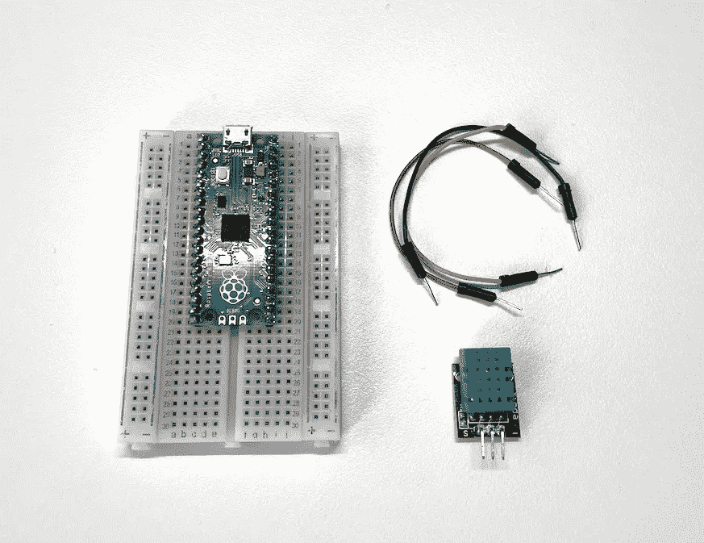
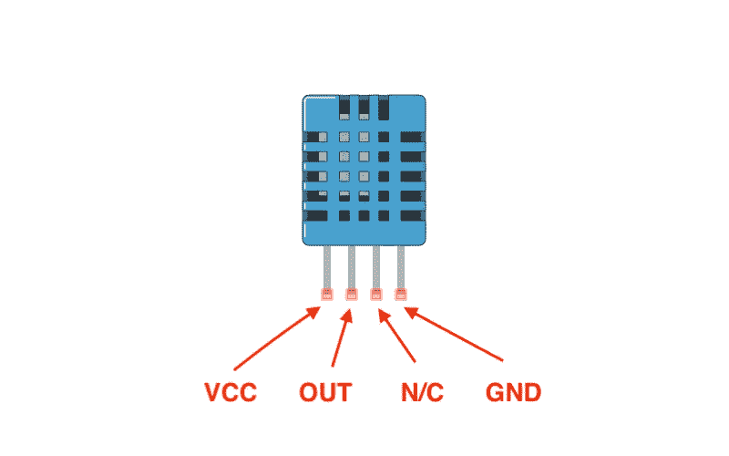
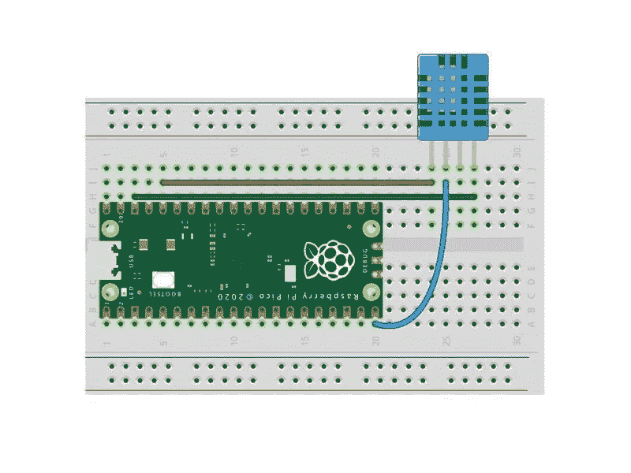
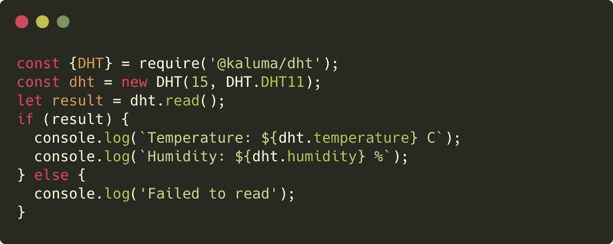
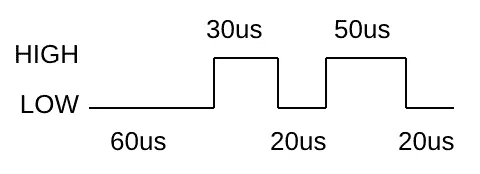

# 使用 JavaScript 的物理计算(5/8) —感测温度和湿度

> 原文：<https://javascript.plainenglish.io/physical-computing-with-javascript-5-8-sensing-temperature-and-humidity-2040eb1d20e9?source=collection_archive---------7----------------------->


在本教程中，我将解释数字脉冲，并使用 DHT11 数字温度和湿度传感器测量温度和湿度。

> [目录](https://niklauslee.medium.com/physical-computing-with-javascript-table-of-contents-69c38fd74e61)

# 成分

*   树莓派 Pico— 1 件。
*   试验板— 1 个。
*   数字温度和湿度传感器(DHT11) — 1 个。
*   跳线(M-M 型)



Components for sensing temperature and humidity

DHT11 是一款非常流行的数字温度和湿度传感器。DHT 传感器有多种类型，但 DHT11 和 DHT22 是最常用的。注意每个操作方法和准确度略有不同。



Pinout of DHT11 sensor

# 电路

将 DHT11 传感器的 **VCC** 和 **GND** 引脚分别连接到 **3V3** 和 **GND** 。几乎所有的传感器和组件都需要电源，所以它们在默认情况下应该总是连接到 **3V3** 、 **GND** 。最后，将 **OUT** 引脚连接到 **GPIO15** 以接收温度和湿度数据。



Circuit for DHT11 and Pico

# 创建项目

在上一个教程之前，为了简单起见，我只使用了终端和文本编辑器。在本教程中，我们将创建一个项目并使用一个外部库。首先，让我们创建一个项目文件夹。让我们简单地用`npm init`命令初始化这个项目。然后会像在普通 Node.js 项目中一样创建一个`package.json`。

```
$ mkdir dht11-test
$ cd dht11-test
$ npm init -y
```

# 使用第三方包

每个部分都有自己的使用方法。这样，器件制造商总是会提供一份数据手册。数据手册中详细描述了这些器件的特性和用途。如果你知道零件的唯一编号，你可以在 alldatasheet.com 的[搜索。](https://www.alldatasheet.com/)

 [## 所有数据表。电子元件和半导体及其他产品的数据表搜索网站

### 如果你在这里找不到，世界上其他地方也找不到。你不太可能找到它。ALLDATASHEET.COM 是最大的…

www.alldatasheet.com](https://www.alldatasheet.com/) 

没有专业知识的人很难阅读数据手册和使用器件。但是不用担心。在大多数情况下，开源库已经发布，以使这些部分更容易使用。在 Kaluma 的官方网站上，可以在**包**页面找到公开的模块。当然，您也可以找到我们将使用的 DHT 温度和湿度传感器的库。您可以找到该模块的 Github URL，然后将该模块安装到您的项目中。

```
$ npm install [https://github.com/niklauslee/dht](https://github.com/niklauslee/dht) --save
```

如果安装成功，该模块也会被添加到`package.json`文件中。

# 从传感器读取数据

在`index.js`中写下下面的代码，保存文件并使用 CLI 上传。



Read data from DHT11 sensor and print it in terminal

```
$ kaluma flash index.js --port <port> --bundle
```

请注意 CLI 命令中的`--bundle`选项。由于`index.js`程序使用外部模块`dht`，因此在上传之前必须将其捆绑成一个文件。CLI 使用`--bundle`选项自动完成这项工作。如果想单独捆绑，可以直接使用`bundle`命令，或者用 Webpack 等外部工具捆绑。

一旦上传，程序被存储在 Pico 内部的闪存中并立即执行。因此我们无法检查控制台上打印的温度和湿度信息。如果想再次运行从头上传的程序，只需在终端中发送`.load`命令即可。我们可以很容易地制造出一种装置，可以测量我家或办公室的温度和湿度！

```
> .load
Humidity: 58 %
Temperature: 25.4 C
```

# 数字脉冲

只有一个 **OUT** 引脚可以与 DHT11 传感器交换数据。我如何仅通过一个 pin 码请求和接收温度和湿度数据？DHT11 传感器如何工作的简要说明如下。

1.  Pico 向 **OUT** 引脚发送`HIGH`信号一段时间，以请求温度和湿度数据。
2.  当收到请求时，DHT11 传感器调制温度和湿度数据，并将其传输到 **OUT** 引脚。简单来说，温度和湿度数据被转换成二进制数，然后按顺序发送 0 和 1。在这种情况下，如果`HIGH`信号短，则按 0 处理，如果`HIGH`信号长，则按 1 处理。这样，总共传输 40 位。
3.  Pico 记录`HIGH`信号和`LOW`信号，同时观察 **OUT** 引脚的信号变化，然后解调记录结果。

基本上原理不难，但是自己写这个程序读取温湿度数据就不容易了。因此，您只需要使用外部库轻松调用`read()`函数。

记住 Kaluma 提供的`pulseRead()`函数可以很容易地读取这些数字脉冲是很有用的。这个函数记录`HIGH`和`LOW`信号在一个特定的管脚上保持多长时间(以微秒计),并将它们作为一个数组返回。例如，假设下图所示的信号来自 **GPIO15** 引脚。



当执行以下代码时，它会观察到 **GPIO15** 引脚上 3 个信号的变化，并返回每个信号保持的时间，单位为 us(微秒— 1/1，000，000 秒)。注意，当`HIGH`值被读取时，记录开始。结果将是`[30, 20, 50]`。有关`pulseRead()`功能的更多信息，请同时参考[参考](https://docs.kaluma.io/api-reference/digital_io#pulseread)。

```
> pinMode(15, INPUT);
> pulseRead(15, 3, {stateState: HIGH});
[30, 20, 50]
```

在本教程中，我们学习了数字脉冲，并从 DHT11 传感器读取温度和湿度值，并将其显示在终端上。在下一个教程中，我们将在一个单独的显示器上显示它，以便它可以在实践中使用。

[](https://niklauslee.medium.com/physical-computing-with-javascript-6-8-showing-temperature-on-7-segment-display-b670f11fa36e) [## 使用 JavaScript 的物理计算— (6/8)在 7 段显示器上显示温度

### 在本教程中，让我们在 7 段显示器上显示从 DHT11 传感器读取的温度值。

niklauslee.medium.com](https://niklauslee.medium.com/physical-computing-with-javascript-6-8-showing-temperature-on-7-segment-display-b670f11fa36e) 

*更多内容请看*[*plain English . io*](http://plainenglish.io/)