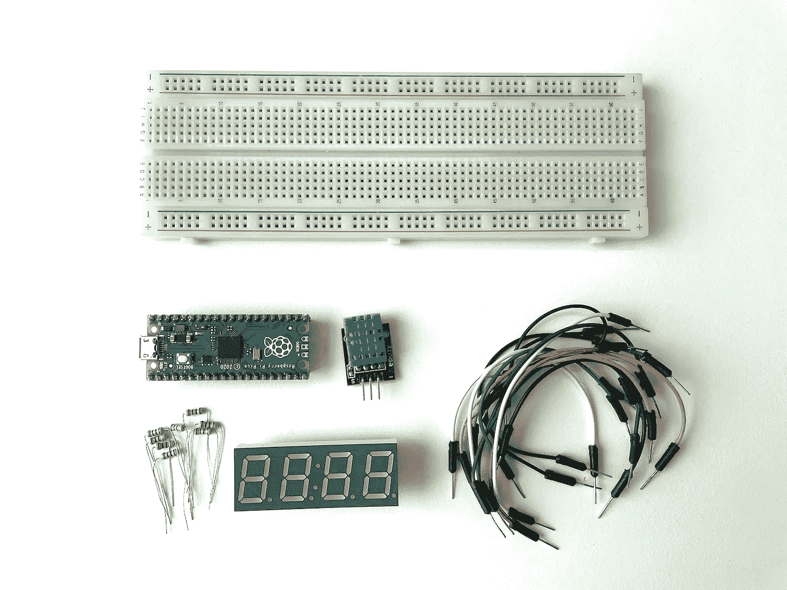
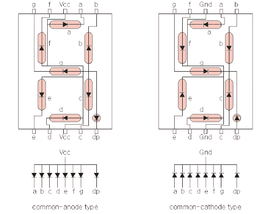
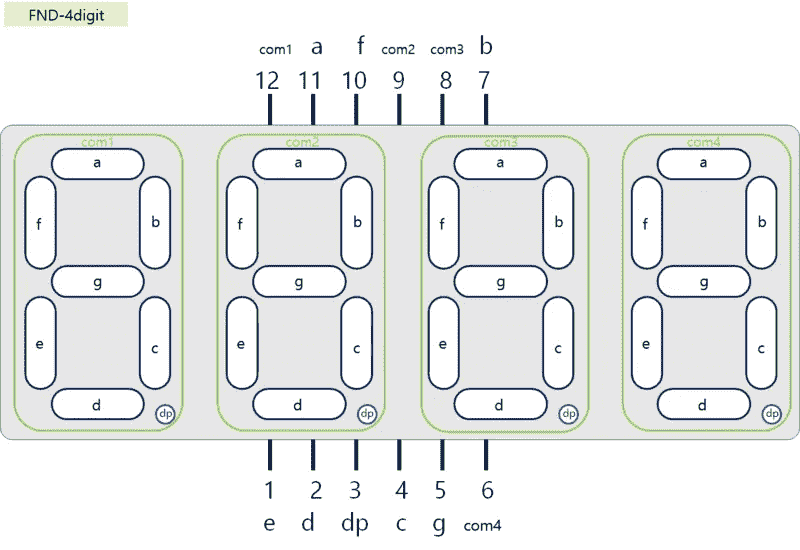
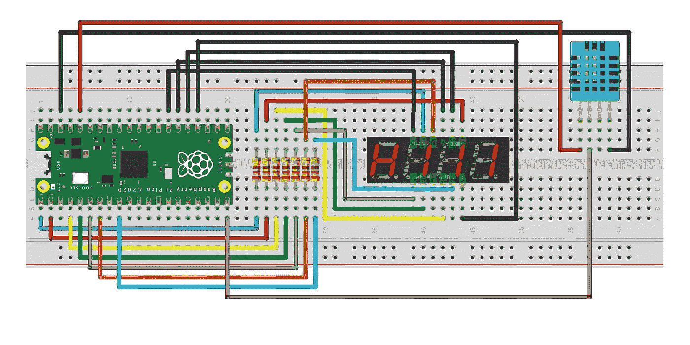
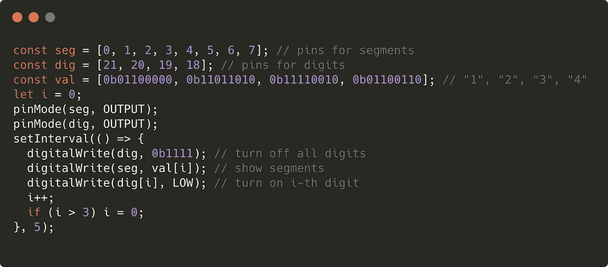
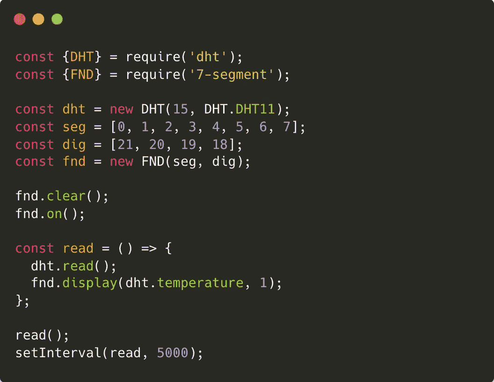
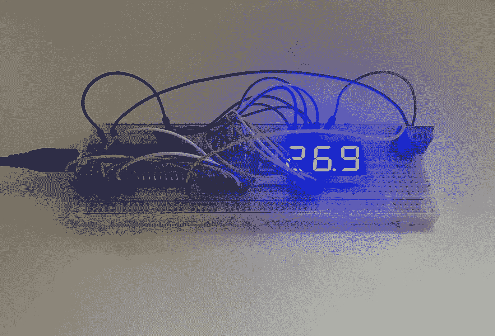

# 使用 JavaScript 进行物理计算(6/8) —在 7 段显示屏上显示温度

> 原文：<https://javascript.plainenglish.io/physical-computing-with-javascript-6-8-showing-temperature-on-7-segment-display-b670f11fa36e?source=collection_archive---------16----------------------->


在本教程中，让我们在 7 段显示器上显示从 DHT11 传感器读取的温度值。

> [目录](https://niklauslee.medium.com/physical-computing-with-javascript-table-of-contents-69c38fd74e61)

# 成分

*   树莓派 Pico — 1 件。
*   试验板— 1 个。
*   数字温度和湿度传感器(DHT11) — 1 个。
*   4 位 7 段显示器(共阴极型)— 1 个。
*   电阻器(330ω)—8 个。
*   跳线(M-M 型)



Components for showing temperature on 7-segment

# 7 段显示器

7 段显示器(以下简称 FND-灵活数字显示器)是一种装置，其中排列了 7 个发光二极管(包括小数点时为 8 个)来表示数字。这种设备在我们周围很容易找到，比如电梯和座钟。

首先，让我们看看 FND，它代表一个 1 位数。每个 LED 有 2 个引脚(阳极、阴极)，因此如果有 8 个 LED，则需要 16 个(=8x2)引脚。但是，如果你想一想，所有的阴极引脚将连接到 **GND** ，所以你可以把它们集成到一个引脚。因此，代表一个数字的 FND 只需要总共 9 (8+1)个引脚。在下图中，1 位 FND 在顶部和底部有 5 个引脚，总共有 10 个引脚。上下匹配销的数量，为了方便起见，提供两个 **GND** 销，上下各一个。以这种方式，阴极引脚被捆绑成一个的形式被称为共阴极型。相反的情况也是可能的。阳极引脚组合在一起的形式称为共阳极型。这将向 **VCC** 引脚和其他引脚上的输入`LOW`提供电流，LED 将打开。购买 FND 时，请务必在购买前检查这两种类型中的哪一种可用。



Common-anode type and common-cathode type

有各种类型的 FND 可以表示多个数字，如 1 位、2 位和 4 位，但在本课程中，我将使用 4 位 FND。4 位 FND 总共提供 12 个引脚，每个引脚如下图所示。在共阴极型的情况下，每个数位共有 4 个共阴极引脚，共有 8 个引脚共同连接每个段。



4-digit 7-segment display

# 电路

让我们组成如下图所示的电路。因为台词多，看起来有点复杂，但其实很简单。首先，以与上一教程相同的方式连接 DHT11 传感器。然后，用一个电阻(330ω)将 7 段显示器的每个段**‘a’**到**‘DP’**引脚依次连接到 Pico 的 **GPIO0** 到 **GPIO7** 引脚。依次连接 **COM1** ~ **COM4** 到**gpio 21**~**gpio 18**引脚。



Circuit for DHT11 and 7-segment

# 手动试试 FND

电路配置好后，首先让我们测试一下 FND 是否工作正常。首先，在终端中逐行输入下面的代码，打开第一个数字中的段**‘a’**的 LED。

```
> pinMode(0, OUTPUT);
> pinMode(21, OUTPUT);
> digitalWrite(0, HIGH);
> digitalWrite(21, LOW);
```

第一个数字顶部的段**‘a’**工作正常吗？那么现在让我们把数字“3”放在第一位。

```
> const seg = [0, 1, 2, 3, 4, 5, 6, 7];
> pinMode(seg, OUTPUT);
> digitalWrite(seg, 0b11110010);
```

通过将管脚编号作为数组传递给`pinMode()`函数，您可以一次为多个管脚设置模式。在`digitalWrite()`函数的情况下，传递引脚数组和数值会将数字的每个位设置到相应的引脚。在上面的代码中，以二进制传递`0b11110010` (十进制 242)将引脚 0、1、2、3、6 设置为`HIGH`，其余引脚设置为`LOW`。当一次处理多个引脚时，像这样传递数组中的引脚非常方便。

接下来，让我们显示所有 4 个数字中的数字“3”。

```
> const dig = [21, 20, 19, 18];
> pinMode(dig, OUTPUT);
> digitalWrite(dig, 0b0000);
```

每个数字中的数字“3”将被显示。现在让我们在这种状态下只显示第四位数字“0”。

```
> digitalWrite(seg, 0b11111100);
```

像这样输入代码将显示所有 4 位数字“0”。原因是所有数字的段都是相互连接的，并且作为单个 pin 出现。但是，如果引脚以这种方式连接，不同的数字就不能用四位数表示。例如，如果你把**‘b’**和**‘c’**段`HIGH`放在一起代表数字 1，那么每一个数字中只代表数字 1。因此，一次只能显示 1 位数字，但 4 位数字应该以极快的速度旋转显示。然后，由于眼睛的后像，似乎所有的 4 个数字都显示出来了。下面就上传代码吧。那么数字 1234 将显示在 4 个数字的每一个中。



Display 1234 on 4-digit 7-segment

您可以像这样自己处理 FND，但是有一个可以轻松使用的库。

[](https://github.com/niklauslee/7-segment) [## GitHub - niklauslee/7-segment:用于多位数 7 段显示的 Kaluma 库(又名。FND …

### Kaluma 库用于多位数 7 段显示(又名。FND -灵活的数字显示器)。这支持灵活的数量…

github.com](https://github.com/niklauslee/7-segment) 

# 显示温度

现在，让我们显示从 FND 的 DHT11 传感器读取的温度值。打开在前一教程中创建的`dht11-test`项目，并添加`7-segment`库。

```
$ npm install [https://github.com/niklauslee/7-segment](https://github.com/niklauslee/7-segment) --save
```

并上传下面的代码。



Showing temperature on 7-segment display

它每 5 秒钟从 DHT11 读取一次温度，并显示到 FND 的小数点后 1 位。使用 DHT11 和 FND 库使得代码非常简单。



FND showing temperature

在本教程中，从 DHT11 传感器读取的温度值显示在 7 段显示屏上。现在，如果你把它从电脑上断开，用 Pico(比如 USB 线或者电池)供电，你的数字温度计就完成了。只要把外壳做得合适，放在家里用也不会差。在下一个教程中，让我们对它进行一点改进，使用有机发光二极管图形显示器更漂亮地显示温度和湿度。

[](https://niklauslee.medium.com/physical-computing-with-javascript-7-8-using-graphic-display-fc57580fc37) [## 使用 JavaScript 的物理计算— (7/8)使用图形显示

### 在本教程中，我们将通过高速通信方法控制图形显示 I2C(内部集成…

niklauslee.medium.com](https://niklauslee.medium.com/physical-computing-with-javascript-7-8-using-graphic-display-fc57580fc37) 

*更多内容尽在*[*plain English . io*](http://plainenglish.io/)