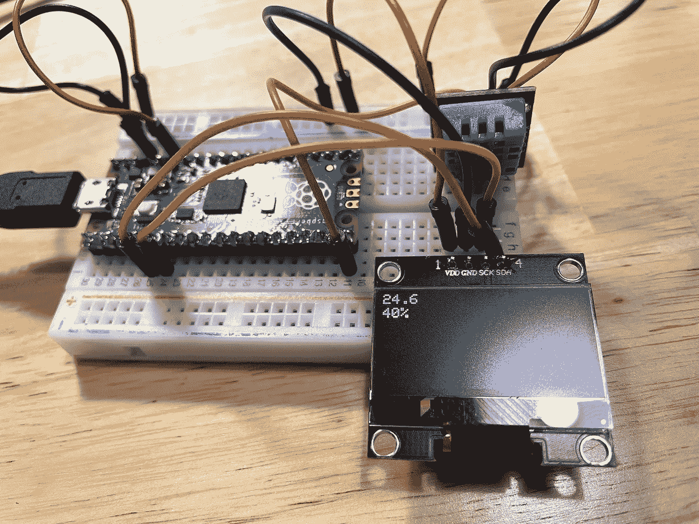

# 使用 JavaScript 的物理计算(7/8) —使用图形显示

> 原文：<https://javascript.plainenglish.io/physical-computing-with-javascript-7-8-using-graphic-display-fc57580fc37?source=collection_archive---------5----------------------->


在本教程中，我们将通过高速通信方法 I2C(内部集成电路)和 SPI(串行外设接口)来控制图形显示。

> [目录](https://niklauslee.medium.com/physical-computing-with-javascript-table-of-contents-69c38fd74e61)

# 成分

*   树莓派 Pico — 1 件。
*   试验板— 1 个。
*   数字温度和湿度传感器(DHT11) — 1 个。
*   图形显示模块(SSD1306) — 1 个。(I2C，1.3 英寸，128x64 英寸)
*   跳线(M-M 型)


Components for showing temperature and humidity on a graphic display

在本教程中，我们将通过 SSD1306 驱动程序使用单色有机发光二极管显示器。有各种不同尺寸、分辨率(1.3”-128 x64、0.96”-128 x64、1”-128 x32)和通信方法(I2C、SPI)的模块。购买时一定要检查尺寸、分辨率和通讯方式。在上一个教程中，我们已经尝试使用 7 段显示器(FND)仅显示温度，但这次我将尝试使用 Kaluma 的图形功能以更好的方式表达温度和湿度。

# 如何与外部设备通信？

Pico 提供几十个引脚来连接其他设备。在这里，我们连接并使用各种传感器、电机、led、图形显示器和网络模块。每个引脚只能输出或接收`HIGH`或`LOW`输入，那么 Pico 如何与这些不同的设备通信呢？我们可能有如下问题:

*   应该连接多少个引脚？
*   数据的 0 和 1 是如何表示的？
*   按顺序将数据发送到单个引脚？还是同时发送到多个引脚？
*   数据传输和接收都使用一个引脚？还是分别使用单独的引脚进行发送和接收？

这些问题没有一个统一的答案。有必要根据传感器或组件的特性选择适当的通信方法。哪种方法适用于温度传感器？我们已经简单了解了如何仅通过一个连接与 DHT11 数字温度和湿度传感器通信(VCC 和 GND 除外)。本传感器选择了上述问题的以下答案。

*   连接单个引脚(电源 3V3 和 GND 除外)。温度和湿度是两个数字(40 位)，由于数据不多，所以只用一个管脚连接就够了。
*   如果`HIGH`信号长(50us 以上)，则为`1`，如果短(50us 以下)，则为`0`。不设置`HIGH` = `1`和`LOW` = `0`的原因是为了区分不发送/接收数据的状态(`LOW`)和数据的状态`0`。
*   按顺序将数据发送到单个引脚。温度和湿度由 40 位组成，因此即使它们被顺序发送，传输和接收也可以在大约几毫秒内完成。
*   使用一个引脚进行发送和接收。发送请求信号后，接收数据。


An example to send a number 97(In binary: 01100001, In ASCII: ‘a’) with a single connection

那么，我们将在本教程中使用的图形显示呢？与 DHT11 传感器这样的单线通信是否足够？即使在 128x64 分辨率下以单色观看，也需要总共 8，192 位，并且如果以相同的方式进行通信，则在屏幕上发送像素信息几乎需要 1 秒钟。似乎需要快速发送和接收更多数据。Pico(以及大多数其他微控制器)支持多种协议以实现更快的串行通信。

*   **I2C(内部集成电路)** —使用 2 个引脚进行通信。它由一个时钟引脚(SCL——串行时钟)和另一个数据传输引脚(SDA——串行数据)组成，前者用于发送和接收的时序控制。
*   **SPI(串行外设接口)** —它使用 3 个引脚进行通信。一个用于传输的引脚(MOSI —主机输出从机输入)和一个用于接收的引脚(MISO —主机输入从机输出)与时钟线(SCK —串行时钟)一起使用。
*   **UART(通用异步接收器/发送器)** —使用 2 个引脚进行通信。没有时钟线，一个引脚用于发射(TX —发射器)，一个引脚用于接收(RX —接收器)。UART 的细节将在下一个教程中解释。


Serial communication protocols

# I2C(内部集成电路)

I2C 是一种通过使用两个引脚来提高通信效率的协议。使用一个引脚发送和接收数据与 DHT11 相同，但不同之处在于使用了一个单独的时钟(SCL)引脚来实现同步。如下图所示，当时钟信号从`LOW`变为`HIGH`时，0 和 1 分别表示为数据信号是`LOW`还是`HIGH`。因此，没有必要匹配两个设备的通信速度，如果您想快速发送/接收，您可以提高 SCL 引脚上的时钟速度(当然，每个 I2C 设备都有其速度限制)。


An example to send a number 97 (In binary: 01100001, In ASCII: ‘a’ ) via two-wire communication (I2C)

I2C 有一个主人和一个奴隶。通常，微控制器(Pico)成为主机，传感器成为从机。主机通过产生时钟信号来驱动通信。基本上，I2C 就像一辆巴士。这意味着多个器件可以共用这两个引脚。如果是，如何区分设备？每个 I2C 设备都有一个唯一的地址(例如，SSD1306 的地址是`0x3C`)。因此，在通信时，您必须首先指定一个地址，然后发送/接收数据。

要在 Kaluma 中使用 I2C，请使用如下所示的`i2c`模块。创建了一个`I2C`类后，用`write()`或`read()`函数发送/接收数据。由于 Pico 总共提供了 2 条总线， **I2C0** 和 **I2C1** ，将创建`I2C`类时使用的总线号作为参数传递。

```
const {I2C} = require('i2c');
let i2c = new I2C(0);
let data1 = new Uint8Array([0x6b, 0x00]);
i2c.write(data, 0x68);
// ...
let data2 = i2c.read(14, 0x68);
// ...
i2c.close();
```

使用 I2C 设备就足够了。如果您想更多地了解它是如何工作的，我建议您查看文档。

*   [Sparkfun I2C 教程](https://learn.sparkfun.com/tutorials/i2c/all)
*   [卡鲁马·I2C 文档](https://kalumajs.org/docs/api/i2c/)

# SPI(串行外设接口)

像 I2C 一样，SPI 使用单独的时钟进行同步。然而，发送和接收使用单独的引脚。当数据传输到从机时，使用 MOSI(主机输出从机输入)引脚，当反向接收数据时，使用 MISO(主机输入从机输出)引脚。通常，当不需要接收数据时，没有必要连接 MISO 引脚。

由于 SPI 也充当总线，多个器件可以共享同时使用的三个引脚。然而，与 I2C 不同的是，地址不用于区分设备，而是连接和使用每个设备的单独 CS(片选)引脚。例如，如果用 SCK、MISO 和 MOSI 引脚将 3 个不同的器件连接到 SPI 总线，则每个器件需要 3 个单独的 CS 引脚。要使用的设备的 CS 应设置为`HIGH`，其他设备的 CSs 应设置为`LOW`。

要在 Kaluma 中使用 SPI，请使用如下所示的`spi`模块。创建`SPI`类后，用`send()`或`recv()`函数发送/接收数据。因为 Pico 总共提供了 2 条总线 **SPI0** 和 **SPI1** ，所以将创建 SPI 类时使用的总线号作为参数传递。

```
const {SPI} = require('spi');
let spi0 = new SPI(0);
let data1 = new Uint8Array([0x6b, 0x00]);
spi0.send(data1);
// ...
let data2 = spi0.recv(10);
// ...
spi0.close();
```

要了解更多细节，建议阅读文档。

*   [Sparkfun SPI 教程](https://learn.sparkfun.com/tutorials/serial-peripheral-interface-spi)
*   [卡鲁玛 SPI 文档](https://kalumajs.org/docs/api/spi/)

# SSD1306(单色有机发光二极管)

现在让我们使用图形显示更好地显示温度和湿度。将 SSD1306 连接到 **I2C0** 总线，将 DHT11 连接到 **GPIO15** ，如下图电路图所示。连接比 7 段简单得多！


Circuit for DHT11 sensor and SSD1306 graphic display

要控制显示，需要向 **I2C0** 总线发送命令。SSD1306 数据手册描述了该命令。但是，完全没有必要经历如此艰难困苦的过程。你所需要做的就是使用一个编写良好的库来调用 API。首先，在 IDE 中创建一个项目(或者重用之前的`dht11-test`项目)并添加以下两个库。

[](https://github.com/niklauslee/ssd1306) [## GitHub - niklauslee/ssd1306:用于 ssd1306 的 Kaluma 库(单色有机发光二极管显示器)

### Kaluma 库为 SSD1306(单色有机发光二极管显示器)你可以从下面得到单色有机发光二极管显示器:这里是一个布线…

github.com](https://github.com/niklauslee/ssd1306) [](https://github.com/niklauslee/dht) [## GitHub - niklauslee/dht:用于 dht 湿度和温度传感器的 Kaluma 库

### 用于 DHT 湿度和温度传感器的 Kaluma 库这里是 DHT11 的接线示例。npm 安装…

github.com](https://github.com/niklauslee/dht) 

```
$ npm i [https://github.com/niklauslee/ssd1306](https://github.com/niklauslee/ssd1306)
$ npm i [https://github.com/niklauslee/dht](https://github.com/niklauslee/dht)
```

所以我们上传下面的代码，让温度和湿度显示在图形显示器上。


Show temperature and humidity on SSD1306 display

查看代码，在创建了一个`SSD1306`类的实例后，`setup()`被调用来初始化显示。初始化完成后，首先调用`getContext()`得到一个图形上下文对象。这个图形上下文提供了绘制形状、字符和位图的功能。你必须记住的是，当你调用一个绘制图形的函数时，它被记录在内部缓冲区中，不会出现在屏幕上。不要忘记你必须调用`display()`来使绘制的图像缓冲区出现在屏幕上。关于图形上下文的详细功能，请参考参考。

[](https://kalumajs.org/docs/api/graphics/) [## 卡鲁玛

### 图形模块支持图形 API。使用 require('graphics ')访问该模块。…的一个实例

kalumajs.org](https://kalumajs.org/docs/api/graphics/) 

Temperature and humidity on graphic display

# 字体和位图

如果你只是像那样显示数字，就没有必要使用图形显示。让我们改变字体，画一个图像，使它看起来更好。首先让我们安装一个包括几种字体的模块。

[](https://github.com/niklauslee/simple-fonts) [## GitHub-niklauslee/Simple-fonts:Kaluma 的简单位图字体

### 卡卢马简单的位图字体。在 GitHub 上创建一个帐户，为 niklauslee/simple-fonts 开发做出贡献。

github.com](https://github.com/niklauslee/simple-fonts) 

```
$ npm i [https://github.com/niklauslee/simple-fonts](https://github.com/niklauslee/simple-fonts)
```

让我们创建一个温度计形状的位图文件`thermo.bmp.json`，如下所示。看数据，16x16 像素的大小是每像素 1 位，数据编码是 base64。本教程没有详细介绍如何创建位图。

```
{
  "width": 16,
  "height": 16,
  "bpp": 1,
  "data": "AcACLAIgAiACrAKgAqACrAKgAqAF0AXQBdACIAHAAAA="
}
```

现在让我们把新的字体和位图放到屏幕上。字体放大了三倍，以便更好地看到温度，湿度放大了两倍。由于位图的尺寸(16x16)比屏幕的尺寸(128x64)要小一点，我们把它横向和纵向放大 3 倍。


Displaying temperature and humidity with font and bitmap


Showing the new font and bitmap

在本教程中，我们简要了解了 I2C 和 SPI 通信。我们用它连接 SSD1306 图形显示器来显示温度和湿度。最后，在下一个教程中，让我们通过互联网发送温度和湿度信息，以便您可以在智能手机或网络浏览器上查看这些信息。

[](https://niklauslee.medium.com/physical-computing-with-javascript-8-8-connecting-to-internet-151ba3dfce59) [## 使用 JavaScript 的物理计算— (8/8)连接到互联网

### 在本教程中，让我们通过 UART(通用异步…

niklauslee.medium.com](https://niklauslee.medium.com/physical-computing-with-javascript-8-8-connecting-to-internet-151ba3dfce59) 

*更多内容看*[*plain English . io*](http://plainenglish.io/)